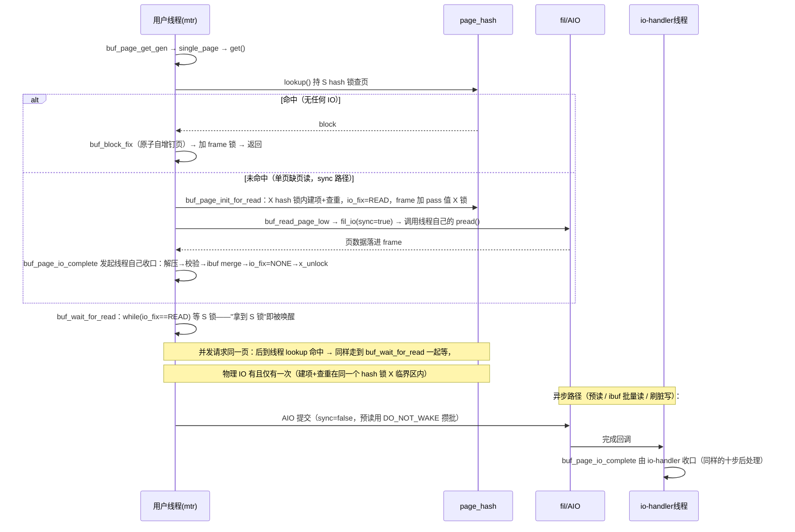
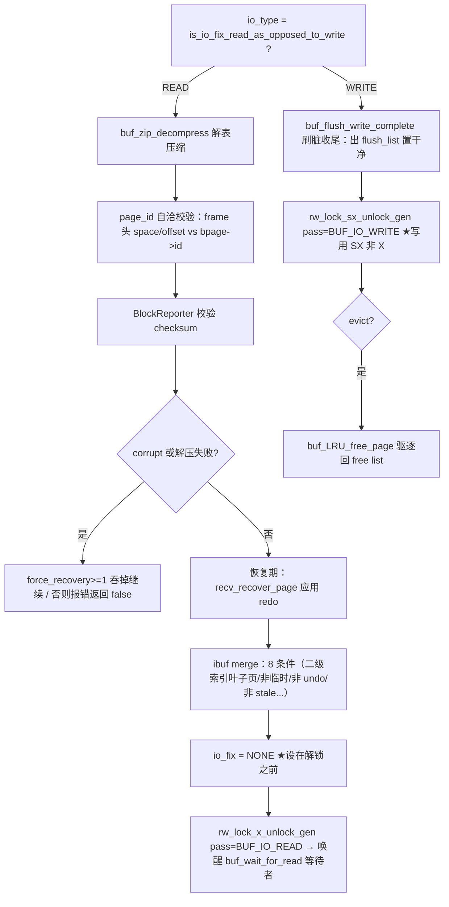
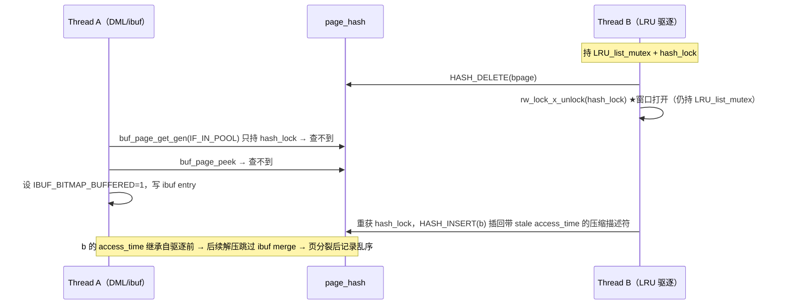
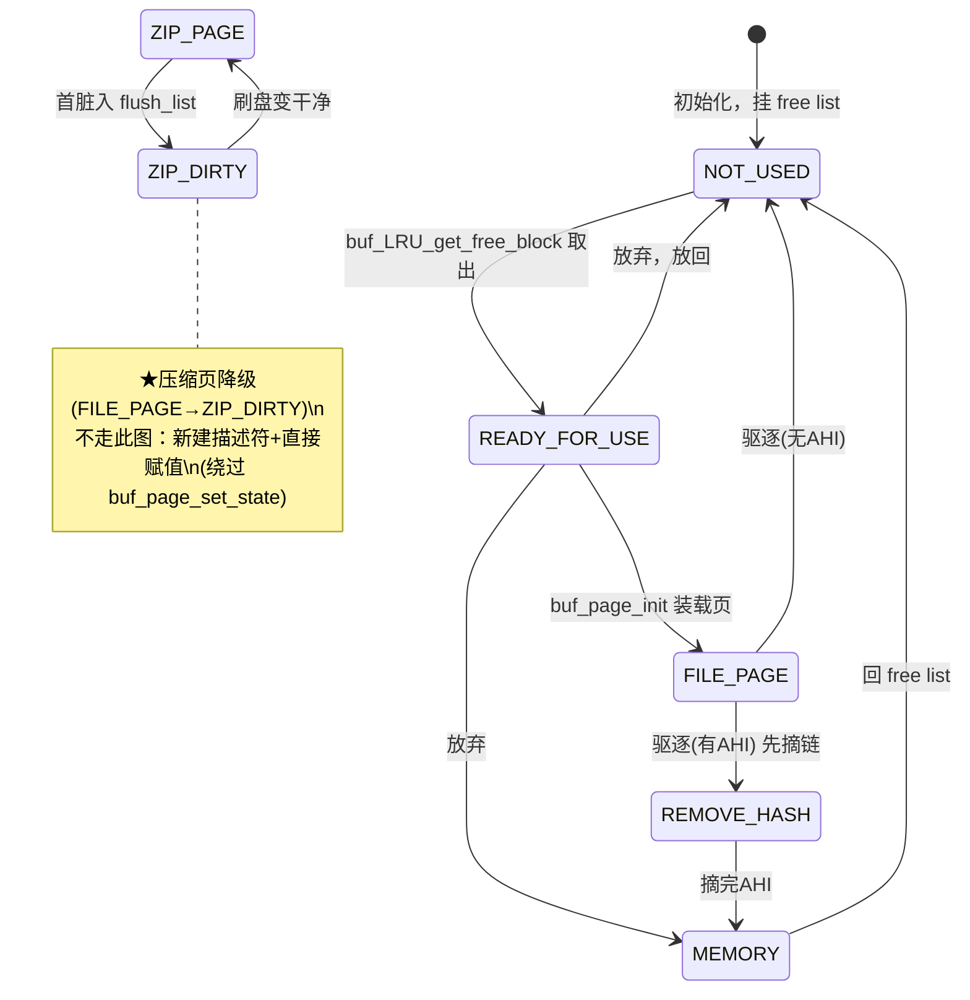
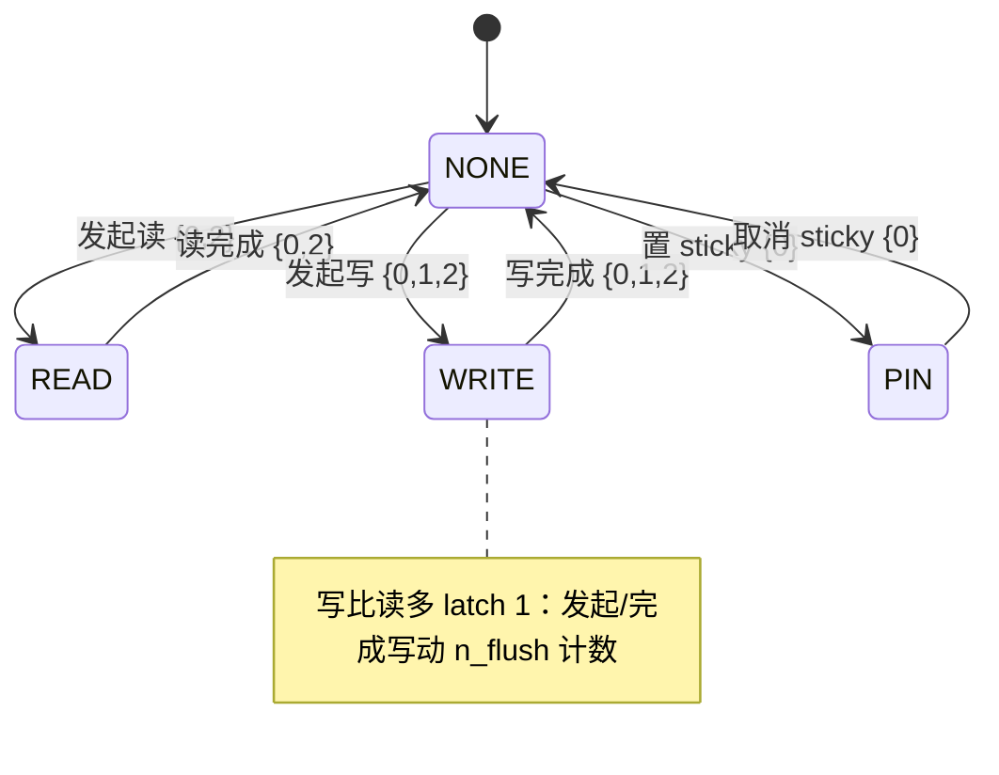
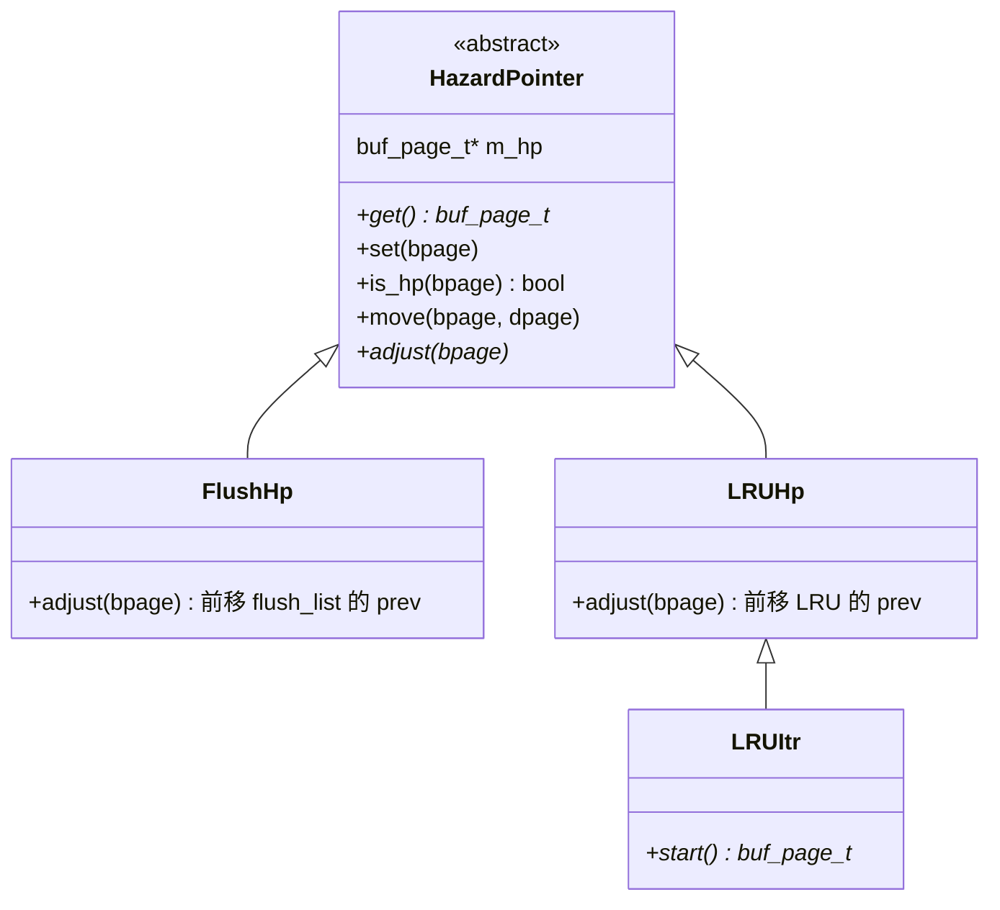

# Buffer Pool 深度解析

> 基于 MySQL 8.0.39 源码，涵盖 控制块状态机、LRU 中点替换、预读、脏页刷盘（page cleaner）、doublewrite、自适应刷脏。
>
> **边界**：本篇讲 buffer pool 内部机制，**含完整的脏页刷盘**（page cleaner 批次组织、锁契约、邻接刷盘、全量刷脏、用户线程单页刷）；redo 刷盘与 LSN 体系见 [`redo_log.md`](redo_log.md)，**doublewrite 的完整实现见 [`dblwr.md`](dblwr.md)**，dblwr 之下的 I/O 原语与 AIO 见 [`io.md`](io.md)、文件层见 [`fil.md`](fil.md)，B-tree 页内操作见 [`btr.md`](btr.md)，AHI 见 [`ahi.md`](ahi.md)，崩溃恢复见 [`recovery.md`](recovery.md)。

## 目录

- [概述](#概述)
- [理论基础](#理论基础)
- [核心实现](#核心实现)
  - [主链路](#主链路)
  - [读路径：页怎么进入 Buffer Pool](#读路径页怎么进入-buffer-pool)
    - [页面读取：`buf_page_get_gen`（含 single_page/get/lookup 逐行解析）](#页面读取buf_page_get_gen)
    - [读路径：一次缺页的完整流程](#读路径一次缺页的完整流程)
    - [★ 逐行解析：`buf_page_init_for_read`](#-逐行解析buf_page_init_for_read把一页装载进-buffer-pool)
    - [★ 逐行解析：`buf_page_io_complete`](#-逐行解析buf_page_io_completeio-完成回调)
    - [change buffer：用延迟写换随机读 I/O](#change-buffer用延迟写换随机读-io)
    - [AHI：纯内存，零 I/O](#ahi纯内存零-io)
    - [预读（read-ahead）](#预读read-ahead)
  - [LRU 替换与淘汰](#lru-替换与淘汰)
    - [LRU 中点替换](#lru-中点替换)
    - [★ `lru_scan_itr`：跨调用保留扫描位置](#-lru_scan_itr--single_scan_itr跨调用保留扫描位置)
    - [压缩页驱逐与 change buffer 竞态（Bug#120698）](#压缩页驱逐与-change-buffer-竞态bug120698s1-真实缺陷)
  - [脏页刷盘（写路径）](#脏页刷盘写路径)
    - [脏页生成与 flush_list](#脏页生成与-flush_list)
    - [脏页刷新（Flush）](#脏页刷新flush)
    - [★ 刷脏批次的组织](#-刷脏批次的组织single-flight--best-effort)
    - [★ hazard pointer：无锁并发遍历的基石](#-hazard-pointer无锁并发遍历的基石)
    - [★ `flush_rbt`：只在崩溃恢复期存在的红黑树](#-flush_rbt只在崩溃恢复期存在的红黑树)
    - [刷脏前的 WAL：redo 先落盘](#刷脏前的-walredo-先落盘)
    - [自适应刷脏（Adaptive Flushing）](#自适应刷脏adaptive-flushing)
    - [doublewrite](#doublewrite)
    - [邻接刷盘 `buf_flush_try_neighbors`](#邻接刷盘buf_flush_try_neighbors)
    - [全量刷脏 `buf_flush_sync_all_buf_pools`](#全量刷脏buf_flush_sync_all_buf_pools)
    - [用户线程自己刷一页：为什么慢](#用户线程自己刷一页为什么慢)
    - [AIO 槽位耗尽会直接阻塞刷脏](#aio-槽位耗尽会直接阻塞刷脏)
  - [压缩页与内存管理](#压缩页与内存管理)
    - [压缩页（ROW_FORMAT=COMPRESSED）三态与刷盘](#压缩页row_formatcompressed三态与刷盘)
    - [★ buddy allocator：压缩页的内存从哪来](#-buddy-allocator压缩页的内存从哪来)
    - [zip_hash：被 buddy 征用的 block 的 frame 地址反查索引](#zip_hash被-buddy-征用的-block-的-frame-地址反查索引)
  - [控制块状态机与并发协议](#控制块状态机与并发协议)
    - [buf_page_t 状态机与 buf_page_in_file](#buf_page_t-状态机与-buf_page_in_file)
    - [★ fix 体系：`buf_fix_count`（bufferfix）](#-fix-体系buf_fix_countbufferfix)
    - [io_fix 状态机与 latch 协议校验](#io_fix-状态机与-latch-协议校验)
  - [观测与调试](#观测与调试)
    - [DBUG 观测与调试](#dbug-观测与调试)
- [★ 本机制里的工程实现技法](#-本机制里的工程实现技法)
  - [一、高级语法技巧 / C++ 特性](#一高级语法技巧--c-特性)
  - [二、经典算法的实现落地（不限于并发）](#二经典算法的实现落地不限于并发)
  - [三、复杂体系与设计模式的代码结构](#三复杂体系与设计模式的代码结构)
- [可观测性](#可观测性)
- [Misc](#misc)
- [参考](#参考)

---

## 概述

### 是什么

InnoDB 的缓冲池（buffer pool）：一块预分配的内存区域，把表空间数据页（默认 16KB）缓存其中，作为"磁盘页在内存中的代理"。每个页槽位配一个控制块（`buf_page_t` / `buf_block_t`）记录"这个槽现在装哪一页、脏否、被谁 pin、I/O 进行否"。

### 用途

在 DRAM 与磁盘之间削峰：读命中则免一次磁盘 I/O；写则合并（页在内存改脏，延迟批量刷盘），配合 redo 的 WAL 保证崩溃一致。buffer pool 是 InnoDB 吞吐的命门——几乎所有页访问都要先过它。

### 版本演进

| 版本 | 变化 |
|------|------|
| 5.6 | 多 buffer pool instance（`innodb_buffer_pool_instances`），每实例独立 LRU/page_hash/flush_list，降低单 mutex 争用 |
| 5.7 | 在线 resize（chunk 增删，`innodb_buffer_pool_size` 动态生效，无需重启）；dump/load 预热（`innodb_buffer_pool_dump_now`） |
| 8.0 | flush 无锁化（8.0.19 起 `flush_list_mutex` 替代 `buf_pool mutex` 扫 flush_list，配 hazard pointer）；page cleaner 协调者/worker 模型（一个 coordinator 派发 slot + N 个 worker）；io_fix 用 `Stateful_latching_rules` 做声明式 latch 协议校验；doublewrite 8.0.20 重构为独立文件双池 |

---

## 理论基础

### 设计思想与权衡

**问题本质**：磁盘页远多于内存槽位，必须做"装谁、淘汰谁、何时刷脏"三件事的调度。这三件事的耦合点就是控制块的状态字段。

**权衡一：slot-based 而非对象式**。InnoDB 选了固定页大小的槽位（`buf_block_t::frame`），靠 `page_hash` 把 `(space_id, page_no)` 解耦到任意槽——对比"每页一个 malloc 对象"的对象式（CMU BusTub 教学版即如此）。代价是固定 16KB 槽对压缩页浪费（COMPRESSED 页只有 1-8KB，仍占一个 16KB 槽或走 buddy），收益是分配/回收/对齐极快、可预分配大块、内存碎片可控。**失效场景**：压缩表密集时 buddy 切分频繁，`zip_free` 链压力上升——这是 COMPRESSED 行格式代价的另一半。

**权衡二：LRU 中点插入而非纯 LRU**。纯 LRU 有"全表扫描一次性灌满缓冲池把热页冲走"的经典病（table scan pollution）。InnoDB 把 LRU 分 old/new 两段，**新读入页插 old 区头部而非 new 区头部**，必须"活过 `innodb_old_blocks_time`（默认 1 秒）且被再次访问"才升 young。**被否决的方案**：纯 LRU（全表扫描污染）、CLOCK/二次机会（InnoDB 的"再次访问 + 时间窗"本质是二次机会的变体，但保留了时间维度做更精确的过滤）。**退化阈值**：`innodb_old_blocks_pct` 调到 100 则退化为纯 LRU（无 old 区隔离），全表扫描会冲热页。

**权衡三：异步刷脏 + WAL 解耦**。刷脏不卡用户线程——page cleaner 后台批量异步刷，用户线程只在"free page 供给不上"时才被迫单页同步刷（性能悬崖）。**代价**：必须用 redo 的 WAL 兜底——脏页写盘前，该页所有 redo 必须先 fsync 落盘（`buf_flush_write_block_low` 先 `log_write_up_to`），否则崩溃恢复时数据文件有新版本而 redo 缺失，无法重放。这条 WAL 约束是"延迟刷脏"这条决策的**不可分割的另一半**。

**权衡四：声明式 latch 协议而非人工记锁**。io_fix 状态转换的正确性依赖"改之前拿对了锁"，8.0 把这层隐性知识用 `Stateful_latching_rules` 模板显式化（FSM + latch 集合表），debug 版自动校验。**代价**：仅 debug 有效（release 编译掉），但它把"哪条转换要哪些锁"集中一处，避免散落各处的人肉记忆出错——这是 8.0 把 io_fix 从 buf_pool mutex 粗粒度保护细化成精确 latch 协议的配套工程。

**汇聚点模式**：三条刷脏路径（flush list 批刷 / LRU 批刷 / 用户线程单页同步刷）全部汇聚到 `buf_flush_write_block_low`——WAL 约束、checksum、doublewrite 写入只需在一处实现，观测/埋点（DBUG `ib_buf`）也只此一处。

**生产者-消费者**：page cleaner coordinator 算"要刷多少页"并派发 slot，worker 线程消费 slot 执行刷盘。coordinator 兼任 worker 0。

### 理论溯源

- **slot-based buffer manager**：术语与骨架直接源自 Gray & Reuter《Transaction Processing: Concepts and Techniques》（1992），源码 `buf0buf.cc` 注释明确引用。三要素（frame 槽位 / 控制块 / 页表 page_hash）即该书描述的"经典缓冲管理器"。
- **WAL（Write-Ahead Logging）**：`buf_flush_write_block_low` 写数据页前先 `log_write_up_to(flush_to_lsn, wait=true)`，是 ARIES（Mohan et al., 1992）的 no-force 规则落地：缓冲池不强制事务提交即刷脏（no-force），但刷脏前必须保证对应 redo 已 force。
- **二次机会 LRU**：old/new 分段 + `old_blocks_time` 时间窗，是"第二次机会"算法（O'Neil et al., 1993, LRU-K 的思想前身）的简化版——InnoDB 只看"首次访问后是否在时间窗内被再次访问"，而非完整的 K 次访问历史。代价是抗扫描污染能力弱于 LRU-K/ARC，但实现极简且状态机清晰。
- **buddy allocator**：压缩页 `zip.data` 内存由 `buf_pool->zip_free` 按 2 的幂大小分桶管理，源自 Buddy 系统算法，便于按页大小（1K/2K/4K/8K）快速分配回收与合并。
- **Stateful_latching_rules**：`ut0stateful_latching_rules.h` 是 InnoDB 自研的声明式 FSM+latch 协议校验框架，设计上对标形式化锁协议验证思想（把"转换需持锁"建模为状态图的边）。

### 算法与数据结构

slot-based buffer manager 的通用概念到 InnoDB 实现的对应（骨架源自 Gray & Reuter《Transaction Processing》）：

| 通用概念 | InnoDB 实现 |
|---------|------------|
| 槽位 frame | `buf_block_t::frame`（`byte*`，16KB 页帧） |
| 控制块 | `buf_block_t`（内含 `buf_page_t page` + `BPageLock lock` + `frame`） |
| 页表 page table | `buf_pool_t::page_hash`（按 `(space_id, page_no)` 索引，侵入式链地址法） |
| 空闲链表 | `buf_pool->free`（`NOT_USED` 态块） |
| 替换策略 | LRU list（old/new 两段、midpoint insertion） |

对照"固定映射式"（页号直接映射内存位置，无页表，无法动态装载）与"对象/变长式"（malloc 级粒度，内存碎片难控）——InnoDB 选 slot-based 是在分配效率、对齐、碎片可控与页大小灵活性间的折中。CMU 15-445 BusTub 是最简教学实现（`pages[]` + `page_table_` + `replacer_` + `free_list_`）。

核心数据结构：

- **page_hash**：按 `(space_id, page_no)` 的侵入式链地址法哈希表，节点是 `buf_page_t*`（`buf_page_t::hash` 是 next ptr）。`buf_block_t::page` 必须是首成员，让 hash 能统一指向 `buf_page_t`（裸压缩页）或 `buf_block_t`（有 frame 的页）。
- **flush_list**：脏页链表，按 `oldest_modification` 升序插入（首脏时定序），page cleaner 按序扫描刷盘。8.0.19+ 用 hazard pointer（`flush_hp`）+ relaxed order 降低 `flush_list_mutex` 持锁粒度。
- **LRU list**：双向链表，`LRU_old` 指针把表分成 new（头段，热）与 old（尾段，冷）两段。`buf_LRU_old_adjust_len` 在每次插入/移除后维护指针位置，使 old 段长度恒为 `LRU_old_ratio/BUF_LRU_OLD_RATIO_DIV`。
- **unzip_LRU**：压缩页解压帧的独立 LRU（只有 `FILE_PAGE` 且 `zip.data!=null` 的块进），与主 LRU 协同淘汰解压帧（内存紧张时先丢解压帧保留压缩副本，变 `ZIP_DIRTY`）。

### 他库对比与演进动机

| 维度 | InnoDB | PostgreSQL | Oracle |
|---|---|---|---|
| 替换算法 | LRU 中点（old/new + 时间窗） | CLOCK 近似（`clock_sweep`） | LRU + 多 pool（按对象大小分池） |
| 刷脏 | page cleaner 异步 + 自适应（LSN age 因子） | bgwriter + checkpointer | DBWn 进程组 |
| 预读 | 线性（连续 extent）+ 随机（extent 内驻留比例） | effective_io_concurrency 顾问 | 自动/手动 |

**演进动机**：5.6 多 instance 是为打破单 `buf_pool mutex` 争用（多核扩展性）；5.7 在线 resize 因 DBA 抱怨"改 buffer pool 要停机"；8.0 flush 无锁化因大内存下扫 flush_list 持 `buf_pool mutex` 过久拖慢前台——每次演进都对应一个被实测的瓶颈。8.0.20 doublewrite 重构因旧版 shared tablespace 双写区在 truncate 表空间时竞争，改独立文件双池可并发。

---

## 核心实现

### 主链路

读者视角（页怎么进 buffer pool）与写者视角（脏页怎么出去）两条主线：

```
读：buf_page_get_gen → page_hash 查 → 命中(buf_fix++) / 未命中(buf_LRU_get_free_block 取槽 → buf_read_page_low 异步读 → buf_page_io_complete)
写：mtr commit → buf_flush_note_modification(首脏入 flush_list) → ... → page cleaner: pc_flush_slot → buf_flush_batch → buf_flush_page → buf_flush_write_block_low(WAL+checksum+dblwr::write)
```

下面逐环节展开。

### 读路径：页怎么进入 Buffer Pool

#### 页面读取：`buf_page_get_gen`

入口 `buf_page_get_gen`（buf0buf.cc）。`Page_fetch mode` 枚举决定行为（`NORMAL`/`SCAN`/`IF_IN_POOL`/`IF_IN_POOL_OR_WATCH`…），核心两分支：

**命中**：在 `page_hash` 找到 bpage → `buf_fix_count++`（bufferfix，钉页防淘汰，**不阻塞 I/O 状态查询**，与 io_fix 区分）→ 按 `rw_latch` 加 S/SX/X 锁 frame → 返回 block。

**未命中**：`buf_page_init_for_read` 建 hash 项、置 `io_fix=BUF_IO_READ` → `buf_read_page_low`（buf0rea.cc）**同步 `pread()`**（单页缺页读不走 AIO！详见下节「读路径：一次缺页的完整流程」）→ 读完由**发起线程自己**调 `buf_page_io_complete` 收口。

> ★ 完整链路（入口 → 磁盘 → 收口，含同步/异步两分支与并发同页去重）见下节「读路径：一次缺页的完整流程」。本节聚焦入口两个函数本身的逐行解析。

##### 逐行解析①：`buf_page_get_gen` 本体——一个 65 行的 CRTP 派发器

```c
buf_block_t *buf_page_get_gen(const page_id_t &page_id,
                              const page_size_t &page_size, ulint rw_latch,
                              buf_block_t *guess, Page_fetch mode,
                              ut::Location location, mtr_t *mtr,
                              bool dirty_with_no_latch) {
  // ...整段是 debug 断言：校验 rw_latch 合法、mode 与 rw_latch 的组合合法...

  if (mode == Page_fetch::NORMAL && !fsp_is_system_temporary(page_id.space())) {
    Buf_fetch_normal fetch(page_id, page_size);      // ★ CRTP 子类一
    fetch.m_rw_latch = rw_latch;
    fetch.m_guess = guess;
    fetch.m_mode = mode;
    fetch.m_file = location.filename;
    fetch.m_line = location.line;
    fetch.m_mtr = mtr;
    fetch.m_dirty_with_no_latch = dirty_with_no_latch;
    return (fetch.single_page());
  } else {
    Buf_fetch_other fetch(page_id, page_size);       // ★ CRTP 子类二
    // ...同样的 8 个字段拷贝...
    return (fetch.single_page());
  }
}
```

逐点解读：

1. **两个参数维度勿混**（最容易读错的地方）：`rw_latch` 是**页锁类型**（S/SX/X/NO_LATCH，加到 `block->lock` 上），`mode` 是 **Page_fetch 获取策略**（NORMAL/SCAN/IF_IN_POOL/PEEK_IF_IN_POOL/IF_IN_POOL_OR_WATCH/POSSIBLY_FREED）。一个是"怎么锁这页"，一个是"不在池里时怎么办"。

2. **CRTP（Curiously Recurring Template Pattern）静态多态**：`Buf_fetch_normal` 和 `Buf_fetch_other` 继承 `Buf_fetch<T>`，`single_page()` 在基类实现，内部 `static_cast<T*>(this)->get(block)` 在**编译期**绑定派生类的 `get`。这是 BP 最热路径（每次页访问都过这里），**连虚函数的间接跳转开销都要省掉**——用模板在编译期把多态"静态化"。

3. **为什么分 normal / other 两个子类**：`NORMAL`（且非临时表空间）是 99% 的常态，它的 `get` 走"hash 命中 → fix → 返回"的最短路径；`other` 要额外处理 SCAN/IF_IN_POOL/WATCH/POSSIBLY_FREED 等特殊语义，还有**临时表空间**（页 latch 规则不同：无 redo、单线程访问假设）。把常态路径抽成独立子类，`get` 里一个 `if` 都不用判断。

4. **`guess` 参数**：上次访问过的 block 指针提示（AHI 传入），`get` 先检查 guess 是否仍对应当前页，命中就跳过 `page_hash` 查找。

##### 逐行解析②：`Buf_fetch::single_page` 主循环——for(;;) 重试 + 状态机

```c
buf_block_t *Buf_fetch<T>::single_page() {
  buf_block_t *block;
  Counter::inc(m_buf_pool->stat.m_n_page_gets, m_page_id.page_no());  // 逻辑读计数

  for (;;) {
    if (static_cast<T *>(this)->get(block) == DB_NOT_FOUND) {
      return (nullptr);                    // ① 页不存在（且模式不要求读盘）→ 返回
    }
    ut_a(!block->page.was_stale());        // get 保证不是 stale 页（空间被 truncate 过）

    if (is_optimistic()) {                 // ② 乐观模式：只在 buf_page_optimistic_get 入口置位
      const auto state = buf_page_get_io_fix(&block->page);
      if (state == BUF_IO_READ) {
        buf_block_unfix(block);            // 页正在读入 → 不等待，让调用方走慢路径
        return (nullptr);
      }
    }

    switch (check_state(block)) {          // ③ 状态复查：stale/被释放 → 重试
      case DB_NOT_FOUND: return (nullptr);
      case DB_FAIL: continue;              // ★ continue = 回到 for(;;) 重新 get
      case DB_SUCCESS: break;
    }
    // ...debug_check(block)：debug only 的第三道检查，同样 DB_FAIL → continue...

    break;                                 // 全部通过，跳出
  }

  // ...debug 版注册 debug_latch（临时表空间跳过）...

  /* 首访标记：只记第一次 */
  const auto access_time = buf_page_is_accessed(&block->page);
  if (access_time == std::chrono::steady_clock::time_point{}) {
    buf_page_set_accessed(&block->page);   // 一旦非零永不更新（见「fix 体系」节的语义）
  }

  /* 非 PEEK/SCAN 才升 young——peek/scan 不该动 LRU 位置 */
  if (m_mode != Page_fetch::PEEK_IF_IN_POOL && m_mode != Page_fetch::SCAN) {
    buf_page_make_young_if_needed(&block->page);
  }

  /* 必须在这里显式等读完成——IO_READ 状态是在 hash_lock 保护下设置的
     （buf_page_init_for_read 里），不能假设"拿到锁"已隐含同步 */
  buf_wait_for_read(block);

  /* 调用方请求"无锁置脏"：只置标志，不立即置脏 */
  if (m_dirty_with_no_latch) {
    block->made_dirty_with_no_latch = m_dirty_with_no_latch;
  }

  mtr_add_page(block);                     // 挂进 mtr memo，mtr commit 时统一 unfix+解锁

  if (m_mode != Page_fetch::PEEK_IF_IN_POOL &&
      access_time == std::chrono::steady_clock::time_point{}) {
    buf_read_ahead_linear(m_page_id, m_page_size, ibuf_inside(m_mtr));  // 首访 → 线性预读
  }

  return (block);
}
```

四个必须讲透的点：

1. **`for(;;)` 是重试循环，不是自旋锁**。`get` 可能在拿 hash 锁期间发现页被换掉（stale），`check_state` 复查发现后返回 `DB_FAIL` → `continue` 重新 `get`。这是"乐观读-校验-重试"模式：先乐观地拿，拿错了回头再来。

2. **`buf_wait_for_read` 为什么必须在这里显式调用**（调用点注释原文）："We have to wait here because the IO_READ state was set under the protection of the hash_lock and not the block->mutex and block->lock."——意思是 IO_READ 状态是在 hash_lock 保护下设置的，所以**不能假设"拿到 block 锁"已隐含读完成**，必须显式检查并等待。**它的等待机制本身很妙**（没有任何 `os_event`/broadcast，用"等 S 锁"当唤醒信号，靠 X 锁覆盖读窗口）——详见下节「读路径：一次缺页的完整流程」。

3. **`access_time` 的第三重用途**：这里它既驱动"设首访时间"，又驱动"**只有首次访问才尝试线性预读**"（`buf_read_ahead_linear` 的触发条件）——同一字段承载"首访标记 + 预读闸门"，与 `zip_page_handler` 里"ibuf merge 闸门"的借用同源，**正是 Bug#120698 里语义重载的另一个实例**（这里没出 bug 只是因为预读启发式错了也无所谓）。

4. **`m_dirty_with_no_latch` 只置标志不置脏**（注释解释为什么）：同一 block 可能被 2 个 mtr 共享 pin。若第一个 mtr 置 dirty=true、第二个置 false，后写的会覆盖前者 → **漏刷一个已改块**。所以设计成"请求置脏标志"，由 mtr commit 时统一裁决。

##### 逐行解析③：`get()` 与 `lookup()`——查 hash 与触发读

```c
dberr_t Buf_fetch_normal::get(buf_block_t *&block) noexcept {
  /* Keep this path as simple as possible. */
  for (;;) {
    block = lookup();                         // ① 查 page_hash（持 S hash 锁）
    if (block != nullptr) {
      if (block->page.was_stale()) {          // ② stale（空间被 truncate 过）→ 释放并重查
        if (!buf_page_free_stale(m_buf_pool, &block->page, m_hash_lock)) {
          std::this_thread::sleep_for(std::chrono::microseconds(100));  // 页在 IO 中释放不掉，稍等
        }
        continue;                             // ← 重新 lookup，直到 stale 页消失
      }
      buf_block_fix(block);                   // ③ 命中：fix（原子自增）
      rw_lock_s_unlock(m_hash_lock);          //    先 fix 后放 hash 锁
      break;
    }
    read_page();                              // ④ 未命中：发起读（sync pread + 自己收口）
  }
  return DB_SUCCESS;
}
```

```c
buf_block_t *Buf_fetch<T>::lookup() {
  m_hash_lock = buf_page_hash_lock_get(m_buf_pool, m_page_id);
  auto block = m_guess;                       // ★ guess 提示（AHI 传入）
  rw_lock_s_lock(m_hash_lock, UT_LOCATION_HERE);
  m_hash_lock = buf_page_hash_lock_s_confirm(m_hash_lock, ...);  // 确认 hash 锁仍有效（可能被 resize 换掉）

  if (block != nullptr) {
    if (!buf_is_block_in_instance(m_buf_pool, block) ||   // ① guess 指针可能已失效：
        m_page_id != block->page.id ||                    //    - buffer pool resize 释放了 chunk
        buf_block_get_state(block) != BUF_BLOCK_FILE_PAGE) {  // - relocate 换了描述符
      block = m_guess = nullptr;                          //    - 页已被驱逐
    }
  }
  if (block == nullptr) {
    block = buf_page_hash_get_low(m_buf_pool, m_page_id);  // ② guess 无效才真查 hash
  }
  if (block == nullptr) {
    rw_lock_s_unlock(m_hash_lock);
    return (nullptr);
  }
  // ...哨兵检查：buf_pool_watch_is_sentinel → 也当"未命中"返回 nullptr...
}
```

四个必须讲透的点：

1. **`get` 先 fix 后放 hash 锁**：`buf_block_fix`（`buf_fix_count` 原子自增）把页"钉住"，然后才能放 hash 锁——否则放锁瞬间页可能被驱逐，返回的 block 指针就悬空了。fix 是"从 hash 过渡到独立持有"的桥。

2. **stale 页的释放重试**：`was_stale()` 意味着页的 space 被 truncate/重建过，页内容已作废。`get` 负责把它从池里清掉并**重查**——`sleep 100µs` 是因为页可能正在 IO 中暂时释放不掉（注释：This is not something that will be hit frequently）。

3. **`guess` 的失效防护**：AHI 传入的 guess 指针可能因 **buffer pool resize**（chunk 被 free）、**relocate**（描述符被搬）、**驱逐**（页被换掉）而失效。`lookup` 用三重校验（指针在 chunk 内 + page_id 匹配 + state 是 FILE_PAGE）确认后才敢用——这正是「fix 体系」节讲的 `Guarded_block` 同一问题的另一处防御。

4. **`Buf_fetch_other::get` 的差异**：比 normal 多两段——临时表空间走 `temp_space_page_handler`（不 fix，走专属路径）；`IF_IN_POOL_OR_WATCH` 模式调 `is_on_watch()`（哨兵也算"找到"）；乐观/IF_IN_POOL 模式**不发起读**直接返回未命中（3726-3727：optimistic 请求只在页已在池中时才返回）。

##### ★ stale 页机制：space 版本号（链路上一处隐藏的守卫）

`get` 里的 `was_stale()` 检查、`buf_page_free_stale` 释放，背后是一套**space 版本号协议**——这是 `buf_page_get_gen` 链路上最容易忽略的一环，也是 **TRUNCATE/DROP 表空间能瞬间完成的秘密**。

**判据**（buf0buf.h）：

```c
inline bool was_stale() const {
  ut_a(m_space != nullptr);
  ut_a(id.space() == m_space->id);
  /* If the version is OK, then the space must not be deleted.
  However, version is modified before the deletion flag is set, so reading
  these values need to be executed in reversed order. The atomic reads
  cannot be relaxed for it to work. */
  bool was_not_deleted = m_space->was_not_deleted();
  if (m_version == m_space->get_recent_version()) {   // 页记录的版本 vs space 当前版本
    ut_a(was_not_deleted);
    return false;
  } else {
    return true;
  }
}
```

`buf_page_t::m_version` 是页装载时记下的 space 版本；`m_space->m_version` 是当前版本。**不等 ⇒ 页是旧 space 的"幽灵页"**。

**版本号在哪递增**（fil0fil.cc）：

```c
/* Bump the version. This will make all pages in buffer pool that reference
the current space version to be stale and freed on first encounter. */
++m_version;
```

TRUNCATE/DROP 时（`BUF_REMOVE_NONE` 模式，fil0fil.cc 注释原文）：**不逐个清 BP 里的页，只 bump 版本号**——旧页在"下次被遇到"时才惰性失效。

**设计思想：惰性失效（lazy invalidation）**。TRUNCATE 的代价从 O(BP 内该表页数)（逐个摘除）降到 O(1)（一个版本号自增），旧页的清理摊薄到后续访问路径上。代价是：旧页在失效前仍占内存、仍可能被刷脏（`buf_flush_ready_for_replace` 对 stale 页直接返回 true 避免无谓刷盘）。

**BP 侧的 5 个处理点**（检查时机全链）：

| 位置 | 行为 |
|---|---|
| `get`/`lookup` | stale → `buf_page_free_stale`（页在 IO 中释放不掉则 `sleep 100µs` 后重查） |
| LRU 扫描 | `buf_LRU_scan_and_free_block` 优先释放 stale 页 |
| 刷脏就绪检查 | `buf_flush_ready_for_replace`：stale 直接返回 true（不用刷，直接释放） |
| `buf_page_io_complete` | `!was_stale()` 才做 ibuf merge（⑧条件之一——**正是 Bug#120698 修复清单里也常被引用的守卫**） |
| dblwr 写完成 | stale → `buf_page_free_stale_during_write`（禁用批量完成，单独释放） |

**读序细节**（注释强调）：先读 `was_not_deleted` 再读版本号——因为 **version 在 deletion 标志之前修改**，反序读 + 原子读不得 relaxed 才能保证"版本一致 ⇒ space 未删除"的推理成立。这是 lock-free 编程里典型的"按逆修改序读"技巧。

#### 完整链路与各环节解析索引

入口到磁盘到收口的全景调用链、同步/异步两分支、并发同页去重、读失败重试语义，统一在**下节「读路径：一次缺页的完整流程」**（含 `buf_read_page_low`、`buf_wait_for_read` 机制、`buf_page_io_complete` 十步收口表）。各环节解析分布：

| 环节 | 解析位置 |
|---|---|
| `buf_page_get_gen`（入口派发） | 本节 ①② |
| `get`/`lookup`（查 hash） | 本节 ③ |
| `read_page`/`buf_read_page_low`（发起读） | 下节（sync/async 两分支表） |
| `fil_io`/`pread`/AIO | [`fil.md`](fil.md) / [`io.md`](io.md)（边界） |
| `buf_page_init_for_read`（占位建项） | 专节逐行解析 |
| `buf_wait_for_read`（等待机制） | 下节（等 S 锁技巧） |
| `buf_page_io_complete`（收口） | 专节逐行解析（十步表在下节） |

`buf_fix_count` vs `io_fix` 的关键区别——这是最容易混的两个"钉页"机制：

| 机制 | 谁置 | 防什么 | 是否阻塞 I/O 状态查询 |
|---|---|---|---|
| `buf_fix_count` | 读页线程（buf_page_get） | 防 LRU 淘汰/重定位 | 否（`buf_page_can_relocate` 只看 io_fix 与 fix_count，但查询 io_fix 可不持 block mutex） |
| `io_fix` | 发起 I/O 的线程 | 防"读盘/刷盘进行中被别人动这页" | 是（改 io_fix 要持规定 latch） |

#### 读路径：一次缺页的完整流程

```
buf_page_get_gen（buf0buf.cc）
  └─ CRTP 派发到 Buf_fetch_normal::get/ Buf_fetch_other::get
       ├─ BP 命中 → 直接返回（必要时做 ibuf merge）
       └─ 未命中 → buf_read_page（buf0rea.cc）→ buf_read_page_low
              └─ fil_io(sync=true) → **调用线程自己的 pread()**
              buf_page_io_complete（buf0buf.cc） ← 本线程自己调
                  ① 解密（os 层的 os_file_io_complete）
                  ② 解压（表压缩 zip）
                  ③ checksum 校验
                  ④ ibuf merge（把 change buffer 里攒的修改合并进刚读入的页）
```

##### 全景时序图（同步/异步/并发同页三条线）



##### ★ 必须纠正一个常见误解：单页缺页读**没有走异步 AIO**

常见说法是"缺页读底层用异步 AIO 以便合并"，**这是错的**：单页缺页读 = 调用线程自己的 `pread()`，不占 AIO 槽位、不需要 io-handler 线程。

（完整判定链 `sync=true` → `AIO_mode::SYNC` → `os_file_read_func` → `pread` 见 [`fil.md`](fil.md)「AIO 模式的三选一」。）

即：**单页缺页读 = 调用线程自己的 `pread()`，不占 AIO 槽位，不需要 io-handler 线程。**

`sync` 只是 `buf_read_page_low` 的参数。真正走 `sync=false`（真 AIO）的是这三条：

| 调用者 | sync | 说明 |
|---|---|---|
| `buf_read_ahead_random` / `_linear` | **false** | 预读；用 `DO_NOT_WAKE` 攒批，最后统一唤醒（`buf0rea.cc`） |
| `buf_read_ibuf_merge_pages` | 仅最后一页 true | `AIO_mode::IBUF` |
| `buf_read_recv_pages` | 仅最后一页 true | 崩溃恢复 |

而且**有些页会被强制降级为同步**（`buf_read_page_low`）：

```cpp
  if (ibuf_bitmap_page(page_id, page_size) || trx_sys_hdr_page(page_id)) {
    /* Trx sys header is so low in the latching order that we play
    safe and do not leave the i/o-completion to an asynchronous
    i/o-thread. Ibuf bitmap pages must always be read with
    synchronous i/o, to make sure they do not get involved in
    thread deadlocks. */
    sync = true;
  }
```

> **⭐ 并发的真正来源**：N 个用户线程各缺一个**不同**的页 → N 个并发 `pread()`（内核层面天然并行）。**InnoDB 缺页读从不做页合并**——一次 `buf_read_page_low` 永远只发一个页。合并只发生在预读层，那也是**逐页循环发出**，只是攒批提交。

##### ★ 并发请求同一个页：只发一次 I/O

靠 `buf_page_init_for_read`（`buf0buf.cc`）的**占位与查重的原子性**：

```cpp
  mutex_enter(&buf_pool->LRU_list_mutex);
  hash_lock = buf_page_hash_lock_get(buf_pool, page_id);
  rw_lock_x_lock(hash_lock, UT_LOCATION_HERE);

  watch_page = buf_page_hash_get_low(buf_pool, page_id);

  if (watch_page != nullptr && !buf_pool_watch_is_sentinel(buf_pool, watch_page)) {
    /* The page is already in the buffer pool. */
    ... 释放刚分配的 descriptor / buddy / block ...
    bpage = nullptr;
    goto func_exit;                      // ← 不发 IO
  }
```

**"插入 page_hash" 与 "检查是否已存在" 在同一个 hash_lock X 锁临界区内**，所以对同一个 `page_id`，物理 IO 有且仅有一次。后到的线程要么 `lookup()` 命中后等待，要么进入 `buf_page_init_for_read` 发现已存在、返回 nullptr、`Buf_fetch` 的 `for(;;)` 再转一圈后命中。

**`buf_wait_for_read` 的等待机制很妙**（`buf0buf.cc`）——**没有任何 `os_event` / broadcast**：

```cpp
static void buf_wait_for_read(buf_block_t *block) {
  while (block->page.was_io_fix_read()) {
    /* Page is X-latched on block->lock until the read is completed.
    Let's just wait for S-lock on block->lock, it will be granted as soon as the
    read completes. */
    rw_lock_s_lock(&block->lock, UT_LOCATION_HERE);
    rw_lock_s_unlock(&block->lock);
  }
}
```

**"能拿到 S 锁"本身就是唤醒**。这成立靠三件事：

1. `buf_page_init_for_read` 上的是 **pass 值 = `BUF_IO_READ` 的 X 锁**（`rw_lock_x_lock_gen(&block->lock, BUF_IO_READ)`）——**不可递归**，发起读的线程自己也不能在读完成前拿到它；
2. 该 X 锁覆盖整个"读 + 后处理"窗口，由 `buf_page_io_complete` 在**做完解压/校验/ibuf merge 之后**才释放；
3. `io_fix = NONE` 的设置在 `x_unlock` **之前**，所以等待者拿到 S 锁时 `was_io_fix_read()` 已是 false，不多转一圈。

##### ★ `buf_page_io_complete`：后处理收口（`buf0buf.cc`）

sync 与 async 共用同一个后处理函数——sync 由发起线程自己调（`buf0rea.cc`），async 由 io-handler 线程调（`fil0fil.cc`）。固定顺序：

| # | 动作 | 说明 |
|---|---|---|
| ① | 解压（表压缩 zip） | `buf_zip_decompress(block, /*check=*/false)`——`check=false` 因为校验稍后统一做 |
| ② | **page_id 自洽性检查** | 从 frame 读 `FIL_PAGE_OFFSET`/`SPACE_ID` 与 `bpage->id` 比对；全 0（未初始化页）合法 |
| ③ | 透明页压缩检测 | `Compression::is_compressed_page()` 仍为真 ⇒ 本实例不支持该算法 ⇒ 等同 corrupt |
| ④ | **checksum 校验** | `BlockReporter::is_corrupted()`（★ 8.0.39 已无 `buf_page_is_corrupted()`） |
| ⑤ | Linux recovery 特例 | 扩展崩溃留下的 brand new 页 → `memset(0)` 并清除 corrupt 标记 |
| ⑥ | 错误处理 | corrupt 且 `srv_force_recovery < SRV_FORCE_IGNORE_CORRUPT(1)` → `buf_read_page_handle_error` + 返回 false |
| ⑦ | 应用 redo | `recv_recover_page`（仅 recovery 期间） |
| ⑧ | **ibuf merge** | 见下面的 8 条条件 |
| ⑨ | `io_fix = NONE` | **在放 X 锁之前** |
| ⑩ | `rw_lock_x_unlock_gen(..., BUF_IO_READ)` | 这就是"唤醒等待者" |

**为什么后处理必须在完成回调里**：发起时 `dst` 里还是垃圾；且异步路径下**发起线程已不在调用栈上**。更关键的是锁协议——`buf_page_init_for_read` 的注释明说"如果 X 锁可递归，同一线程会在读完成前非法拿到锁"，所以后处理必须在**解锁之前**完成，才能让"拿到任意 latch ⇒ 页已就绪"成为不变式。

**两层解压不重复**（易混淆点）：

| | `os_file_io_complete`（os 层，先执行） | `buf_page_io_complete`（buf 层，后执行） |
|---|---|---|
| 解密 | ✅ `Encryption::decrypt` | ❌ |
| 解压 | ✅ 只解**透明页压缩**（`FIL_PAGE_COMPRESSED`） | ✅ 只解**表压缩**（`ROW_FORMAT=COMPRESSED`） |
| checksum | ❌ | ✅ |
| ibuf merge | ❌ | ✅ |

两者靠**页类型标识**区分，不会重复处理。

> **已纠正**：8.0.39 里 `buf_page_io_complete` 的第二个参数是 **`evict`**（只在 WRITE 路径有意义），**不是** `skip_ibuf`。读路径的 ibuf merge 是内联的 8 条条件判断。

**⑧ 的 8 条条件**（`buf0buf.cc`）——任一条为假就跳过 merge：

```cpp
if (uncompressed &&                                 // ① 必须已有解压 frame
    !Compression::is_compressed_page(frame) &&      // ② 不是透明压缩页
    !recv_no_ibuf_operations &&                     // ③ recovery 允许 ibuf 操作
    fil_page_get_type(frame) == FIL_PAGE_INDEX &&   // ④ 必须是索引页
    page_is_leaf(frame) &&                          // ⑤ 必须是叶子页
    !fsp_is_system_temporary(bpage->id.space()) &&  // ⑥ 不是临时表空间
    !fsp_is_undo_tablespace(bpage->id.space()) &&   // ⑦ 不是 undo 表空间
    !bpage->was_stale()) {                          // ⑧ 不是 stale 页
  ibuf_merge_or_delete_for_page((buf_block_t *)bpage, bpage->id, &bpage->size, true);
}
```

即：**只对二级索引的叶子页、非临时/非 undo 表空间、非 stale 页**做 merge。另一处 merge 在 `Buf_fetch` 的 `zip_page_handler`（`buf0buf.cc`）——压缩页解压后补做（因为 zip-only 时没有 frame 可 merge）。

##### 读失败：不崩，但重试 100 次才 fatal

| 层 | 行为 |
|---|---|
| `buf_page_io_complete` | corrupt → `buf_page_print(..., BUF_PAGE_PRINT_NO_CRASH)`（只打印）+ 返回 false。`srv_force_recovery >= 1` 时**吞掉错误**，坏页照样进 BP |
| `Buf_fetch::read_page()` | 返回 false 只算一次 retry（`m_retries++`），**重试 100 次**（`BUF_PAGE_READ_MAX_RETRIES = 100`）仍失败 → `ib::fatal` **整个 mysqld 崩溃** |
| `Fil_shard::do_io()` | `ut_a(req_type.is_dblwr() \|\| err == DB_SUCCESS)`——非 dblwr 的 IO 不允许出错返回（**`DB_CORRUPTION` 在 fil 层就 crash**，不会传到 buf 层） |

#### ★ 逐行解析：`buf_page_init_for_read`（把一页装载进 buffer pool）

> buf0buf.cc。这是"页从磁盘进入 buffer pool"的唯一入口（预读/单页读都走它）。逐段拆解。

**签名与两种模式**（4798-4823）：

```c
buf_page_t *buf_page_init_for_read(ulint mode, const page_id_t &page_id,
                                   const page_size_t &page_size, bool unzip)
```
`mode` 只有两种：`BUF_READ_IBUF_PAGES_ONLY`（ibuf 内部的预读，会先用 `ibuf_page()` 过滤，非 ibuf 页直接返回 nullptr）、`BUF_READ_ANY_PAGE`（普通）。

**第 1 段：决定要"完整 block"还是"只要裸描述符"**（4825-4837）

```c
if (page_size.is_compressed() && !unzip && !recv_recovery_is_on()) {
  block = nullptr;                              // 压缩页且不需要解压 → 只要裸描述符
} else {
  block = buf_LRU_get_free_block(buf_pool);     // 其余情况：要一个带 frame 的 block
}
```
- 压缩页**且**调用方不要解压帧（`unzip==false`）**且**不在崩溃恢复中 → 不分配 16KB frame，只分配一个 `buf_page_t` 描述符（省内存）。这就是 `ZIP_PAGE` 形态的由来。
- 崩溃恢复期**必须** `uncompressed`（`buf_page_io_complete` 里 `ut_a(uncompressed)` 强制），因为 redo 应用需要完整页。

**第 2 段：buddy 分配压缩页内存**（4839-4841）

```c
if ((block != nullptr && page_size.is_compressed()) || block == nullptr) {
  data = buf_buddy_alloc(buf_pool, page_size.physical());
}
```
两种情况需要 buddy 内存：①有 block 但页是压缩的（要存 `zip.data` 压缩副本）；②只有裸描述符（页本身就是压缩的）。

**第 3 段：加锁 + 双检查**（4843-4877）

```c
mutex_enter(&buf_pool->LRU_list_mutex);
hash_lock = buf_page_hash_lock_get(buf_pool, page_id);
rw_lock_x_lock(hash_lock, UT_LOCATION_HERE);

watch_page = buf_page_hash_get_low(buf_pool, page_id);
if (watch_page != nullptr &&
    !buf_pool_watch_is_sentinel(buf_pool, watch_page)) {
  /* 页已经在 buffer pool 里了 → 全部回滚 */
  ...
  buf_page_free_descriptor(bpage);
  buf_buddy_free(buf_pool, data, page_size.physical());
  buf_LRU_block_free_non_file_page(block);
  bpage = nullptr;
  goto func_exit;
}
```
**为什么需要双检查**：上一步 `buf_LRU_get_free_block` 内部可能放锁甚至触发刷脏，期间**别的线程可能已经把这页读进来了**。所以拿到锁后必须再查一次，否则会往 `page_hash` 插重复项。

注意 `buf_pool_watch_is_sentinel` 的判断——**哨兵不算"页已在"**：哨兵只是占位（见 Misc「Buffer Pool Watch」），真页来了要替换它。

**第 4 段 A：有 block 的分支**（4879-4925）

```c
bpage = &block->page;
buf_page_mutex_enter(block);
buf_page_init(buf_pool, page_id, page_size, block);   // 设 state=FILE_PAGE + 初始化字段
buf_page_set_io_fix(bpage, BUF_IO_READ);              // io_fix = READ
buf_LRU_add_block(bpage, true /* to old blocks */);   // ★ 插入 old 区（中点策略！）
if (page_size.is_compressed()) {
  block->page.zip.data = (page_zip_t *)data;
  buf_unzip_LRU_add_block(block, true);               // 压缩页的解压帧进 unzip_LRU
}
mutex_exit(&buf_pool->LRU_list_mutex);

rw_lock_x_lock_gen(&block->lock, BUF_IO_READ, UT_LOCATION_HERE);   // ★★ pass-type x-lock
rw_lock_x_unlock(hash_lock);
buf_page_mutex_exit(block);
```

两个关键点：

1. **`buf_LRU_add_block(bpage, true)`** —— 新读入的页插 **old 区**（`true` = to old blocks），这正是 LRU 中点策略的落点，抗全表扫描污染。

2. **`rw_lock_x_lock_gen(&block->lock, BUF_IO_READ, ...)`** —— 第二个参数 `BUF_IO_READ` 是 **pass 值**。注释（4912-4919）解释：

   > We set a pass-type x-lock on the frame because then the same thread which called for the read operation … can wait for the read to complete by waiting for the x-lock on the frame; **if the x-lock were recursive, the same thread would illegally get the x-lock before the page read is completed**. The x-lock is cleared by the io-handler thread.

   两重作用：
   - **同步**：发起读的线程随后会尝试获取 frame 的 latch，从而**阻塞到 I/O 完成**（io-handler 完成后解锁唤醒它）。
   - **所有权转移**：锁由发起线程加、由 **io-handler 线程**解。pass 值 ≠ 0 让 unlock 时**不检查 thread id**（`rw_lock_x_unlock_gen(&lock, BUF_IO_READ)`），否则 debug 锁跟踪会报"非持有者解锁"。这是 rw_lock 支持"锁传递"的专门机制。

   为什么必须是 **X 锁**而不是 S：页内容此刻是垃圾（I/O 未完成），任何人都不许读。

**第 4 段 B：只有裸描述符的分支**（4926-4987）

```c
bpage->buf_pool_index = buf_pool_index(buf_pool);
page_zip_des_init(&bpage->zip);
page_zip_set_size(&bpage->zip, page_size.physical());
bpage->zip.data = (page_zip_t *)data;
bpage->size.copy_from(page_size);

mutex_enter(&buf_pool->zip_mutex);
bpage->reset_page_id(page_id);
bpage->state = BUF_BLOCK_ZIP_PAGE;      // ★ 直接赋值（绕过 set_state）
bpage->init_io_fix();
buf_page_init_low(bpage);
...
if (watch_page != nullptr) {            // 哨兵在位 → 继承它的 buf_fix_count
  uint32_t buf_fix_count = watch_page->buf_fix_count;
  ut_a(buf_fix_count > 0);
  bpage->buf_fix_count.fetch_add(buf_fix_count);
  buf_pool_watch_remove(buf_pool, watch_page);
}
HASH_INSERT(buf_page_t, hash, buf_pool->page_hash, bpage->id.hash(), bpage);
rw_lock_x_unlock(hash_lock);
buf_LRU_add_block(bpage, true);
buf_page_set_io_fix(bpage, BUF_IO_READ);
```

**哨兵的 fix 计数交接**（4959-4971）是最精妙的一处：purge 线程之前给这页设了 watch 哨兵并 `buf_fix_count++`（防止页被驱逐）。现在真页来了，必须**把 fix 计数转移给新描述符**再移除哨兵——否则 purge 线程持有的"这页被我钉着"的语义会丢失。

**第 5 段：收尾**（4989-5001）

```c
buf_pool->n_pend_reads.fetch_add(1);
func_exit:
  if (mode == BUF_READ_IBUF_PAGES_ONLY) ibuf_mtr_commit(&mtr);
  ut_ad(!rw_lock_own(hash_lock, RW_LOCK_X));
  ut_ad(!bpage || buf_page_in_file(bpage));
  return (bpage);
```
返回 `bpage`（可能是 `buf_block_t::page` 也可能是裸描述符），调用方（`buf_read_page_low`）据此提交 AIO；返回 nullptr 表示"页已在池中，无需读"。

---

#### ★ 逐行解析：`buf_page_io_complete`（I/O 完成回调）

> buf0buf.cc。读写两条路径的**共同收口**。**调用者有两种**：①**异步路径**（预读、ibuf 批量读、刷脏写）——io-handler 线程在 AIO 完成后回调；②**同步路径**（单页缺页读）——**发起线程自己**在 `pread()` 返回后同步调用（`buf_read_page_low` 末尾 `if (sync) { buf_page_io_complete(...) }`）。无论哪条路径，调用者都是"持有该页 io 责任"的线程（latch #2 的意义即在此）。

**收口流程图（READ/WRITE 双分支的固定次序）**：



**前置与不变量**（5614-5630）

```c
bool buf_page_io_complete(buf_page_t *bpage, bool evict) {
  const bool uncompressed = (buf_page_get_state(bpage) == BUF_BLOCK_FILE_PAGE);
  ut_a(buf_page_in_file(bpage));
  /* We do not need protect io_fix here by mutex to read it because this is the
  only function where we can change the value from BUF_IO_READ or BUF_IO_WRITE
  to some other value, and our code ensures that this is the only thread that
  handles the i/o for this block. */
  ut_ad(bpage->current_thread_has_io_responsibility());
  const auto io_type = bpage->is_io_fix_read_as_opposed_to_write() ? BUF_IO_READ : BUF_IO_WRITE;
  const auto flush_type = buf_page_get_flush_type(bpage);
```

**读 io_fix 不需要加锁**——因为本函数是唯一能把 READ/WRITE 改成别值的地方，且本线程持有 io 责任。这正是 `io_responsibility`（latch #2）存在的意义：它让 io-handler 能**免锁**读改 io_fix。

##### READ 分支（5632-5779）

**① 解压**（5639-5652）

```c
if (bpage->size.is_compressed()) {
  frame = bpage->zip.data;
  buf_pool->n_pend_unzip.fetch_add(1);
  if (uncompressed && !buf_zip_decompress((buf_block_t *)bpage, false)) {
    buf_pool->n_pend_unzip.fetch_sub(1);
    compressed_page = false;
    goto corrupt;                    // 解压失败 → 按损坏处理
  }
  buf_pool->n_pend_unzip.fetch_sub(1);
} else {
  frame = reinterpret_cast<buf_block_t *>(bpage)->frame;
  ut_a(uncompressed);
}
```
只有 `uncompressed`（有解压帧）才需要解压；只要压缩副本的（`ZIP_PAGE`）不解压。

**② 校验页身份**（5657-5679）

```c
read_page_no  = mach_read_from_4(frame + FIL_PAGE_OFFSET);
read_space_id = mach_read_from_4(frame + FIL_PAGE_ARCH_LOG_NO_OR_SPACE_ID);

if (bpage->id.space() == TRX_SYS_SPACE && dblwr::v1::is_inside(bpage->id.page_no())) {
  ib::error(...) << "Reading page ..., which is in the doublewrite buffer!";
} else if (read_space_id == 0 && read_page_no == 0) {
  /* 未初始化页，正常 */
} else if ((bpage->id.space() != 0 && bpage->id.space() != read_space_id) ||
           bpage->id.page_no() != read_page_no) {
  ib::error(...) << "Space id and page number stored in the page read in are ...";
  is_wrong_page_id = true;
}
```
**比较页头里存的 space/page_no 与期望的是否一致**——这是防"读到错误的页"（比如文件系统错乱、AIO 偏移错误）。注意 `bpage->id.space() != 0` 才比 space_id，注释说明是兼容 MySQL < 4.1.1（那时只有 space 0，字段可能是垃圾）。

**③ 压缩算法 + checksum**（5681-5705）

```c
compressed_page = Compression::is_compressed_page(frame);
if (compressed_page) { /* 本实例不支持该压缩算法 → 报错 */ }
...
BlockReporter reporter = BlockReporter(true, frame, bpage->size,
                                      fsp_is_checksum_disabled(bpage->id.space()));
is_corrupted = reporter.is_corrupted();
```

**④ Linux 特例**（5707-5717）：恢复中若损坏且 `recv_page_is_brand_new`（还没有任何 redo 的新页，可能是崩溃时文件扩展未完成）→ `memset(frame, 0, ...)` 当空页处理，不算损坏。

**⑤ 损坏处理**（5719-5760）

```c
corrupt:
  if (!compressed_page) { buf_page_print(...); }     // 压缩页内容是乱码，不打印
  if (srv_force_recovery < SRV_FORCE_IGNORE_CORRUPT) {
    buf_read_page_handle_error(bpage);
    return (false);                                  // ★ 返回 false
  }
```
`srv_force_recovery >= SRV_FORCE_IGNORE_CORRUPT`（默认 4）时**忽略损坏继续跑**；否则返回 false 让上层报错。

**⑥ 崩溃恢复**（5765-5769）

```c
if (recv_recovery_is_on()) {
  ut_a(uncompressed);                        // ★ 恢复期必须解压
  recv_recover_page(true, (buf_block_t *)bpage);
}
```

**⑦ ★ ibuf merge（读路径入口）**（5771-5778）

```c
if (uncompressed && !Compression::is_compressed_page(frame) &&
    !recv_no_ibuf_operations &&
    fil_page_get_type(frame) == FIL_PAGE_INDEX && page_is_leaf(frame) &&
    !fsp_is_system_temporary(bpage->id.space()) &&
    !fsp_is_undo_tablespace(bpage->id.space()) && !bpage->was_stale()) {
  ibuf_merge_or_delete_for_page((buf_block_t *)bpage, bpage->id, &bpage->size, true);
}
```

**这是 change buffer merge 的两个入口之一**（读完成时），另一个是 `Buf_fetch::zip_page_handler`（压缩页解压时）——**Bug#120698 出在后者**。本入口的条件是全的（uncompressed + 非压缩页 + 非恢复 + INDEX 叶子页 + 非临时/undo + 未 stale），而 `zip_page_handler` 那个入口被 `access_time` 短路了。

##### WRITE 分支准备：决定是否驱逐（5781-5813）

```c
if (io_type == BUF_IO_WRITE) {
  /* - BUF_FLUSH_LIST: don't evict
     - BUF_FLUSH_LRU: always evict
     - BUF_FLUSH_SINGLE_PAGE: eviction preference is passed by the caller */
  ut_ad(!(flush_type == BUF_FLUSH_LIST && evict));
  if (flush_type == BUF_FLUSH_LRU) evict = true;
  if (evict || ...(debug)... buf_page_get_state(bpage) == BUF_BLOCK_ZIP_DIRTY) {
    has_LRU_mutex = true;
    mutex_enter(&buf_pool->LRU_list_mutex);      // 提前拿锁
  }
}
```
语义清晰：LRU 刷脏是为了腾位置 → 刷完就驱逐；flush_list 刷脏是为了推进 checkpoint → 刷完保留（页可能还热）。

##### 收口：switch(io_type)（5832-5881）

```c
switch (io_type) {
  case BUF_IO_READ:
    ut_ad(!has_LRU_mutex);
    buf_page_set_io_fix(bpage, BUF_IO_NONE);
    if (uncompressed) {
      rw_lock_x_unlock_gen(&((buf_block_t *)bpage)->lock, BUF_IO_READ);   // ★ pass 值解锁
    }
    mutex_exit(block_mutex);
    buf_pool->n_pend_reads.fetch_sub(1);
    buf_pool->stat.n_pages_read.fetch_add(1);
    break;

  case BUF_IO_WRITE:
    buf_flush_write_complete(bpage);                                       // 刷脏收尾
    if (uncompressed) {
      rw_lock_sx_unlock_gen(&((buf_block_t *)bpage)->lock, BUF_IO_WRITE);  // ★ 注意是 SX 不是 X
    }
    buf_pool->stat.n_pages_written.fetch_add(1);
    if (evict && buf_LRU_free_page(bpage, true)) {
      has_LRU_mutex = false;                    // 已驱逐，锁由 free_page 释放
    } else {
      mutex_exit(block_mutex);
    }
    if (has_LRU_mutex) mutex_exit(&buf_pool->LRU_list_mutex);
    break;
}
```

##### ★★ 三个必须讲透的点

**1. pass 值解锁（跨线程锁释放）**
读分支 `rw_lock_x_unlock_gen(&lock, BUF_IO_READ)`、写分支 `rw_lock_sx_unlock_gen(&lock, BUF_IO_WRITE)`。锁是**发起线程**加的（`buf_page_init_for_read` 加 X / `buf_flush_page` 加 SX），却是 **io-handler 线程**解的。pass 值 ≠ 0 让 unlock 跳过 thread-id 校验——注释（5825-5828）原话："Because this thread which does the unlocking is not the same that did the locking, we use a pass value != 0 in unlock, which simply removes the newest lock debug record, without checking the thread id."

**2. 读用 X、写用 SX**
- 读：页内容无效 → **X**（任何人不能碰）
- 刷脏：页内容有效，只是要写盘 → **SX**（允许并发 S 读，禁止 X 写）。这就是为什么**刷脏期间页仍可被读**——SX 与 S 兼容。

**3. 返回值语义**
只有"读到损坏页且 `srv_force_recovery < 4`"时返回 **false**，其余（含正常、解压失败但强恢复、写完成）都返回 **true**（5887）。`evict` 参数只在写路径有意义。

---

#### change buffer：用延迟写换随机读 I/O

> **★ 完整剖析见专篇 [`ibuf.md`](ibuf.md)**——为什么只缓存**非唯一二级索引**的 INSERT（"必须读页做唯一性检查"与"页不在 BP 才缓存"逻辑互斥；而**唯一索引的 delete-mark / purge 反而可以缓存**）、ibuf 树与 bitmap 的物理布局、记录格式（counter 保证时序）、插入路径的 14 条否决条件、合并的 8 条触发条件、三级自我保护 contract、参数与监控。
>
> 本节只保留它与 **Buffer Pool 的接口**部分。

**是什么**：二级索引页不在 Buffer Pool 时，InnoDB **不把页读进来**，而是把修改缓存到 change buffer（ibuf，系统表空间里的一棵 B-tree），等该页以后被读到时再合并。

```
不用 change buffer：  改 1 行 → 读二级索引页（随机读，云盘 0.1~3 ms）→ 改 → 后续刷脏
用   change buffer：  改 1 行 → 写 ibuf（顺序）→ 立即返回
                      同一页的多次修改合并 → 页被读时一次 merge
```

**与 BP 的接口**：merge 的调用点在**读页完成回调** `buf_page_io_complete` 里（`ibuf_merge_or_delete_for_page`），且只对**二级索引的叶子页、非临时/非 undo 表空间、非 stale 页**做（8 条条件）。

| 代价 | 说明 |
|---|---|
| 读页时要 merge | 增加读路径 CPU 开销，且 merge **可能触发页分裂** |
| 占用 BP | 上限 `innodb_change_buffer_max_size`%（默认 25） |
| "写完立刻读"是负收益 | merge 被立刻触发，只增加开销 |

> **★ 云盘上的意义**：change buffer 省的是**随机读**，而随机读在云盘上比本地盘贵一个数量级（0.1~3 ms vs ~100 µs），所以**云盘上收益更大**——这是它至今默认开启的原因。
>
> **什么时候该关**：负载若是"写入后立刻读同一批数据"（如批量导入后立即全表扫描）→ `innodb_change_buffering=none`。

**相关源码**：

| 函数 | 位置 | 职责 |
|------|------|------|
| `ibuf_insert` | `ibuf0ibuf.cc` | 缓存一条修改 |
| `ibuf_merge_or_delete_for_page` | `` | 读页时合并（由 `buf_page_io_complete` 调用） |
| `ibuf_merge_in_background` | `` | **由 master 线程调用**（ibuf merge 无专用线程） |
| `buf_read_ibuf_merge_pages` | `buf0rea.cc` | 批量读页做 merge，用 `AIO_mode::IBUF` 防槽位耗尽死锁 |

#### AHI：纯内存，零 I/O

自适应哈希索引（`btr/btr0sea.cc`）在 B-tree 之上建内存哈希索引，**不产生任何文件 I/O**。它降低的是**逻辑读**（减少 B-tree 层数），从而**间接**减少物理读。8.0.30 起分片。完整机制（哈希键自适应算法、双门槛构建、探测验证、失效维护、锁协议）见 [`ahi.md`](ahi.md)。

### LRU 替换与淘汰

#### LRU 中点替换

LRU 被一个指针 `buf_pool->LRU_old` 分两段：**new 段**（头，热页，再次访问移到头）、**old 段**（尾，冷页，候选淘汰区）。常量（buf0lru.h）：

- `BUF_LRU_OLD_RATIO_DIV = 1024`（比例分母）
- `BUF_LRU_OLD_RATIO_MIN = 51`（最小 old 比例 ≈ 5%，对应 `innodb_old_blocks_pct` 最小 5）
- `BUF_LRU_OLD_MIN_LEN = 8*1024/16 = 512` 页（LRU 短于此 `LRU_old` 不初始化，退化为纯 LRU）

**新页插入**：`buf_LRU_add_block`（buf0lru.cc）把新读入页插入 `LRU_old` 位置（old 段头部），标记 `old=true`，再调 `buf_LRU_old_adjust_len` 微调 `LRU_old` 指针使 old 段长度回到 `LRU_old_ratio/BUF_LRU_OLD_RATIO_DIV`。

**升 young**：页被再次访问时，若其"首次访问时间"距今 ≥ `innodb_old_blocks_time`（默认 1000ms），`buf_LRU_make_block_young`把它摘除移到 new 段头部。否则留在 old 段——这是抗全表扫描污染的核心：扫描页活不过 1 秒就不会进 new 段挤热页。

```c
// buf_LRU_make_block_young：摘除后插到 LRU 头(new 段)
void buf_LRU_make_block_young(buf_page_t *bpage) {
  if (bpage->old) buf_pool->stat.n_pages_made_young++;
  buf_LRU_remove_block(bpage);
  buf_LRU_add_block_low(bpage, false);   // false=放 new 段头
}
```

**淘汰**：`buf_LRU_scan_and_free_block`从 old 段尾部扫，跳过 io_fixed/buf_fixed 的页，找到可淘汰的干净页 `buf_LRU_free_page` 释放回 free list。`BUF_LRU_SEARCH_SCAN_THRESHOLD=100` 控制 LRU 末尾扫描窗口。

**兜底**：`buf_LRU_get_free_block`取不到 free 且 LRU 扫不出干净页时，被迫单页同步刷脏（`buf_flush_single_page_from_LRU`）——用户线程阻塞等刷完，对应状态变量 `Innodb_buffer_pool_wait_free`，是性能悬崖信号。

#### 压缩页驱逐与 change buffer 竞态（Bug#120698，S1 真实缺陷）

> 腾讯提交、MySQL 官方确认仍存在于 8.0.44/9.7.1 的缺陷。它就发生在上文「压缩页三态」的 `FILE_PAGE → ZIP_DIRTY` 转换路径上，**该转换的副作用（保留 `access_time`）正是缺陷载体**。
>
> **边界**：本节讲 buffer pool 侧（驱逐竞态窗口、`access_time` 继承）；change buffer 侧的判据问题（`IBUF_BITMAP_BUFFERED` 位才是权威）见 [`ibuf.md`](ibuf.md)「4.5 Bug#120698」。

**现象**：`btr_check_sibling_boundary` 报 "last record on left page >= first record on right page"——B+tree 相邻页记录乱序，压缩表 + change buffer 场景下的静默数据损坏。

**缺陷代码**（`Buf_fetch::zip_page_handler`，buf0buf.cc）：

```c
if (!recv_no_ibuf_operations) {
  if (access_time != std::chrono::steady_clock::time_point{}) {
    // ★ access_time != 0 就跳过 ibuf merge
  } else {
    ibuf_merge_or_delete_for_page(block, m_page_id, &m_page_size, true);
  }
}
```

**根因——`access_time` 语义重载**：设计者假定"页被访问过 ⇒ 之前已 merge 过 ibuf"，但 `access_time` 并不是这个语义：
1. 它是**首次访问时间**而非访问状态——`buf_page_set_accessed`（buf0buf.ic）只在 `access_time==0` 时才写，一旦非 0 永不更新（仅 `buf_page_init` 重置为 `{}`，buf0buf.cc）
2. 它的本职是**预读启发式**（buf0buf.cc/4516"首次访问才尝试线性预读"），被 `zip_page_handler` 借用做 ibuf 门控是语义重载
3. **能跨 incarnation 继承**（致命）——见下

**竞态时序**（Thread B 驱逐压缩页解压帧 / Thread A DML 走 change buffer）：



步骤表：

| 步骤 | 线程 | 动作 | 源码 |
|---|---|---|---|
| 1-3 | B | 持 LRU_list_mutex+hash_lock → HASH_DELETE → `rw_lock_x_unlock(hash_lock)` **开窗** | buf0lru.cc |
| 4 | A | btr0cur → `buf_page_get_gen(IF_IN_POOL)` 只持 hash_lock，查不到 | btr0cur.cc/1109/1128 |
| 5 | A | `ibuf_insert` → `buf_page_get_also_watch` 只持 hash_lock，查不到 | ibuf0ibuf.cc |
| 6 | A | `ibuf_insert_low` → `buf_page_peek` 只持 hash_lock，查不到 | ibuf0ibuf.cc |
| 7 | A | 设 `IBUF_BITMAP_BUFFERED=1`，写 ibuf entry | — |
| 8 | B | 重获 hash_lock，`HASH_INSERT(b)` 插回**带 stale access_time** 的压缩描述符 | buf0lru.cc |

**最关键的漏洞**：buf0lru.cc 作者留下 "Question/Answer" 论证"释放 hash_lock 后别的线程会不会出问题"，答案②说"不可能，`buf_page_init_for_read()` 持 LRU list mutex 查 page_hash"——**但这只覆盖正常页读取路径，漏了 change buffer**。`buf_page_peek`（buf0buf.ic）只做 `buf_page_hash_get(...) != nullptr`，**根本不碰 `LRU_list_mutex`**，所以驱逐线程持有的 LRU_list_mutex 对 ibuf 完全无效。这是**锁协议论证时路径枚举不完整**，不是简单的锁加错。

**后果链**：ibuf entry 缓冲在 P 上（BUFFERED=1）→ 描述符带 stale access_time 插回 → 后续解压 P 时 `access_time != 0` **跳过 merge** → 页分裂后缓冲 entry 针对的 page_id 已不对应 → 延迟/错误 merge → 记录落错页 → 页间顺序违反。

**修复方案（官方认可）**：①释放压缩页时设 `access_time = 0`；②**无条件进入 `ibuf_merge_or_delete_for_page`**，由它内部按 BUFFERED 位决定。理由——真正的权威判据在函数内部（ibuf0ibuf.cc）：读 `IBUF_BITMAP_BUFFERED` 位，无缓冲变更即 `return`。所以无条件调用是安全的（仅多读一次 bitmap 页），而 `access_time` 这个外部快捷判断既多余又危险——**把判据放在离真正权威状态最远的地方**。

**版本范围**：8.0.44（守卫 `recv_no_ibuf_operations`，与本仓库 8.0.39 同名）、9.7.1（改名 `recv_recovery_is_on`）逻辑实质相同。复现极难（窗口极窄），报告者明言"better to analyze the code"。另注：Oracle 在 8.4.0 禁用 change buffer、9.5.0 重新启用（WL#16967），疑与此类安全性问题有关。

#### 预读（read-ahead）

两种预读都在 `buf0rea.cc`，由 `buf_page_get_gen` 未命中路径或 io handler 触发：

**线性预读 `buf_read_ahead_linear`**：检测顺序访问。当一个 extent（`read_ahead_area`，通常 64 页）的**边界页**（首或尾）被访问时，检查该 extent 内连续访问的页数是否 ≥ 阈值：

```c
threshold = std::min(static_cast<page_no_t>(64 - srv_read_ahead_threshold),
                     buf_pool->read_ahead_area);
```

`srv_read_ahead_threshold` 默认 56，即连续访问一个 extent 内 ≥(64-56)=8 页才触发预读下一个 extent。阈值越小越激进。同时检测访问方向（asc/desc），只往同方向预读。

**随机预读 `buf_read_ahead_random`**：检测局部密集驻留。当一个 extent 内已有 ≥ `BUF_READ_AHEAD_RANDOM_THRESHOLD`（，动态 `5 + read_ahead_area/8`）个页在 buffer pool 时，把整个 extent 剩余页预读。受 `srv_random_read_ahead` 开关控制（**8.0 默认关闭**，线性预读默认开）。

两者都过 `BUF_READ_AHEAD_PEND_LIMIT`（，值 2）限流：pending 读过多时不预读，防 IO-fixed 块灌满 buffer pool。

##### 补充：四种预读入口与 SSD 上的取舍


| 类型 | 函数 | 触发条件 | 参数 |
|------|------|---------|------|
| **随机预读** | `buf_read_ahead_random`（`buf0rea.cc`） | 一个 extent 内连续读到 ≥ 13 页 → 异步预读该 extent 剩余页 | `innodb_random_read_ahead`（默认 OFF） |
| **线性预读** | `buf_read_ahead_linear`（`buf0rea.cc`） | 顺序访问超过阈值页 → 预读下一个 extent（64 页） | `innodb_read_ahead_threshold`（默认 56，内部用 `64 - threshold`） |
| ibuf merge 批量读 | `buf_read_ibuf_merge_pages`（`buf0rea.cc`） | — | 用 `AIO_mode::IBUF` 防死锁 |
| 恢复期区域预读 | `recv_read_in_area`（`log0recv.cc`） | — | `RECV_READ_AHEAD_AREA = 32` |

> **为什么需要预读**：迭代器模型是"一次一行"，天然产生随机读。预读是数据库把"逻辑上连续"翻译成"物理上批量"的手段。**在 SSD/云盘上收益变小甚至变负**（预读进来的页可能用不上，白占 BP 与 I/O），所以 SSD 环境常见做法是关掉随机预读。

### 脏页刷盘（写路径）

#### 脏页生成与 flush_list

mtr commit 时若页被改，`buf_flush_note_modification`（buf0flu.cc）设 `oldest_modification`（首脏时，置为 mtr end_lsn）并插入 flush_list；后续修改只更新 `newest_modification`。flush_list 按 `oldest_modification` 升序——这是 page cleaner "刷老不刷新"与 checkpoint 推进的依据。

#### 脏页刷新（Flush）

三条路径全部汇聚到 `buf_flush_page`→ `buf_flush_write_block_low`（，统一汇聚点）：WAL 约束 + checksum + `dblwr::write`。

刷脏类型 `buf_flush_t`（buf0types.h）：

| 值 | 类型 | 发起者 | IO |
|---|---|---|---|
| 0 | `BUF_FLUSH_LRU` | page cleaner / `buf_LRU_get_free_block` | async |
| 1 | `BUF_FLUSH_LIST` | page cleaner（主路径） | async |
| 2 | `BUF_FLUSH_SINGLE_PAGE` | 用户线程（free page 不足兜底） | sync |

`sync=true` 只允许 SINGLE_PAGE。写页前先保证 newest_lsn 之前的 redo 已落盘（WAL）。

**路径1：flush list 批刷**（async, type=1，主路径）：
```
buf_flush_page_coordinator_thread (buf0flu.cc)   ← 算刷脏量、派发 slot、唤醒 worker
└─ buf_flush_page_cleaner_thread             ← worker（coordinator 兼任 worker 0）
   └─ pc_flush_slot
      └─ buf_flush_do_batch → buf_flush_batch
         └─ buf_do_flush_list_batch
            └─ buf_flush_page_and_try_neighbors  ← 邻居页合并(innodb_flush_neighbors)
               └─ buf_flush_try_neighbors
                  └─ buf_flush_page  ← 置 IO_FIX(BUF_IO_WRITE)、SX lock、flush_state_mutex 统计
                     └─ buf_flush_write_block_low  ← ★ 汇聚点(WAL+checksum+dblwr)
```

**路径2：LRU 批刷**（async, type=0）：coordinator 周期性 + `buf_LRU_get_free_block` 触发 → `buf_flush_LRU_list_batch`→ 后半段同路径1。

**路径3：用户线程单页同步刷**（sync, type=2）：`buf_flush_single_page_from_LRU`→ `buf_flush_page(..., BUF_FLUSH_SINGLE_PAGE, sync=true)`。频繁发生 = free page 供给不上，对应 `Innodb_buffer_pool_wait_free`。

#### ★ 刷脏批次的组织：single-flight + best effort

一个 flush batch 由 `buf_flush_do_batch` 驱动（`buf0flu.cc`）：

```cpp
bool buf_flush_do_batch(buf_pool_t *buf_pool, buf_flush_t type, ulint min_n,
                        lsn_t lsn_limit, ulint *n_processed) {
  if (!buf_flush_start(buf_pool, type)) {
    return (false);                       // ① 同类型批次已在跑
  }
  ulint page_count = buf_flush_batch(buf_pool, type, min_n, lsn_limit);
  buf_flush_end(buf_pool, type);          // ② 末尾 dblwr::force_flush
  if (n_processed != nullptr) *n_processed = page_count;
  return (true);
}
```

**① 返回 false 不是"失败"，是"没轮到我"**——`buf_flush_start` 用 `init_flush[type]` 做同类批次互斥：

```cpp
  if (buf_pool->n_flush[flush_type] > 0 || buf_pool->init_flush[flush_type] == true) {
    /* There is already a flush batch of the same type running */
    return false;
  }
```

**② `buf_flush_end` 末尾会 `dblwr::force_flush()`**——把本批次堆在 dblwr 缓冲里的页真正推到磁盘。`page_count` 是"**已投递写请求的页数**"，不是"已落盘页数"。

> **真正的并发度**来自"多 BP 实例 + page_cleaner 多线程按 slot 分摊实例"，**不是**同一实例上并发多个批次。

##### 批次内部：跳过一页不意味着终止扫描

`buf_do_flush_list_batch`（`buf0flu.cc`）：

```cpp
  for (bpage = UT_LIST_GET_LAST(buf_pool->flush_list);
       count < min_n && bpage != nullptr && len > 0 &&
       bpage->get_oldest_lsn() < lsn_limit;
       bpage = buf_pool->flush_hp.get(), ++scanned) {
    prev = UT_LIST_GET_PREV(list, bpage);
    buf_pool->flush_hp.set(prev);
    buf_flush_page_and_try_neighbors(bpage, BUF_FLUSH_LIST, min_n, &count);
    --len;
  }
```

- `count < min_n`：刷够了才停；**跳过某页时 `count` 不变**，循环用 `flush_hp.get()` 继续往 flush_list 头部走。
- **`flush_hp`（hazard pointer）**：`buf_flush_page_and_try_neighbors` 会**释放并重新获取** flush_list mutex，期间别的线程可能把 `bpage` 摘走，所以用 hazard pointer 保存 prev 并在返回后校验 `flush_hp.is_hp(prev)`。
- `len`：从 flush_list 长度递减的保险丝，防止退化成 O(n²)。

`buf_flush_LRU_list_batch`的关键差异是 **不阻塞**：

```cpp
      auto acquired = mutex_enter_nowait(block_mutex) == 0;   // ★ 非阻塞
      if (acquired && buf_flush_ready_for_replace(bpage)) {
        ...直接淘汰干净页到 free list...
      } else if (acquired && buf_flush_ready_for_flush(bpage, BUF_FLUSH_LRU)) {
        mutex_exit(block_mutex);
        buf_flush_page_and_try_neighbors(bpage, BUF_FLUSH_LRU, max, &count);
      } else if (!acquired) {
        ut_ad(buf_pool->lru_hp.is_hp(prev));                  // 拿不到锁：什么都不做，继续
      }
```

**为什么必须 `nowait`**：LRU flush 的调用链（`buf_LRU_get_free_block`）可能持有 page latch，一旦阻塞在 block mutex 上就可能死锁。

##### `buf_flush_page` 的锁契约（最容易踩坑）

进入时必须持有 `block_mutex`；**返回值决定 mutex 归谁释放**：

- **返回 true** → 本函数内部**已释放** `block_mutex`（以及 `BUF_FLUSH_SINGLE_PAGE` 时的 `LRU_list_mutex`）；
- **返回 false** → **仍由调用者持有**，调用者自己释放。

决定"刷不刷"的三分支：

| 情形 | 结果 |
|---|---|
| 压缩页（`BUF_BLOCK_ZIP_DIRTY`） | `flush = true`（不受 buf_fix 影响，压缩页无 rw_lock） |
| 未压缩 + `buf_fix_count > 0` 且不是 LIST 刷 | `flush = false`（"heuristic，避免昂贵的 SX 尝试"） |
| 其余 | LRU/SINGLE 用 `rw_lock_sx_lock_nowait` 抢 SX latch（抢不到就不刷）；**LIST 先跳过加锁**，稍后再加 |

**★ LIST 刷的"延迟 SX 加锁"是唯一可能阻塞的点**：

```cpp
    if (flush_type == BUF_FLUSH_LIST && is_uncompressed &&
        !rw_lock_sx_lock_nowait(rw_lock, BUF_IO_WRITE, UT_LOCATION_HERE)) {
      if (!fsp_is_system_temporary(bpage->id.space()) && dblwr::is_enabled()) {
        dblwr::force_flush(flush_type, buf_pool_index(buf_pool));   // 先解开潜在的 latch 等待环
      } else {
        buf_flush_sync_datafiles();
      }
      rw_lock_sx_lock_gen(rw_lock, BUF_IO_WRITE, UT_LOCATION_HERE);  // 阻塞式
    }
```

> 注意 `dblwr::force_flush` 出现在这里的深意：**把 dblwr 缓冲里挂着的页先刷出去**，避免本线程持有一部分资源去等 SX 锁、而锁的持有者又在等 dblwr，形成环。

另外：`ut_ad(!sync || flush_type == BUF_FLUSH_SINGLE_PAGE)` —— **只有用户线程单页刷是同步写**，批次刷全是异步。

##### 跳过会不会漏刷？——三层保证

1. **本轮不中断**：跳过只影响 `count`，扫描继续到 flush_list 头部 / LRU 满足条件。
2. **下一轮还会看到**：被跳过的页**仍然脏、仍在 flush_list 上**（`oldest_modification != 0`）。page cleaner 每轮重新从 flush_list 尾扫。
3. **被跳过的页本来就"有人负责"**：`buf_flush_ready_for_flush` 返回 false 只有两类——`io_fix != BUF_IO_NONE`（正被别人读/写/flush）或 `BUF_BLOCK_REMOVE_HASH`（正在被摘除，即将消失）。

> **LRU 刷 vs LIST 刷的分工**：LRU 路径会因 `buf_fix_count > 0` 或 SX latch 被占而跳过；**LIST 路径不看 `buf_fix_count`**（`no_fix_count || flush_type == BUF_FLUSH_LIST` 恒真），所以 age-based 刷脏最终一定会刷到它，**不会饥饿**。

#### ★ hazard pointer：无锁并发遍历的基石

> 8.0.19「flush 无锁化」的核心机制。它解决的是：**扫 flush_list/LRU 时必须中途释放锁去做 I/O，回来后链表已变、从哪继续**的问题。

##### 问题：朴素做法退化为 O(n²)

扫 flush_list 从尾（最老）往前找脏页，每找到一页就要**释放 `flush_list_mutex` 去提交异步写**（持锁做 I/O 会阻塞所有人）。释放期间别的线程可能把这个节点从 flush_list 摘走（刷完变干净、或页被驱逐）。若没有保护，回来时 `prev` 指针可能已是野指针，只能从头重扫——**每页都要重扫一遍链表 ⇒ O(n²)**。

源码注释直说了这一点（buf0flu.cc）：

```c
/* In order not to degenerate this scan to O(n*n) we attempt
to preserve pointer of previous block in the flush list. To do
so we declare it a hazard pointer. Any thread working on the
flush list must check the hazard pointer and if it is removing
the same block then it must reset it. */
```

##### 机制：把"下一个要看的节点"声明为 hazard pointer

`HazardPointer` 基类（buf0buf.h）就是一个受 mutex 保护的指针 `buf_page_t *m_hp`，接口 `get/set/is_hp/adjust(纯虚)/move`。三个实例 + 两个迭代器（buf0buf.cc）：

| 成员 | 类型 | 用途 |
|---|---|---|
| `flush_hp` | `FlushHp` | flush_list 批次扫描 |
| `oldest_hp` | `FlushHp` | 最老页扫描（checkpoint 取 `oldest_modification`） |
| `lru_hp` | `LRUHp` | LRU 批次扫描 |
| `lru_scan_itr` / `single_scan_itr` | `LRUItr : LRUHp` | **跨调用保留扫描位置**（`start()` 决定从哪继续） |

`buf_do_flush_list_batch` 的循环（buf0flu.cc）：

```c
for (bpage = UT_LIST_GET_LAST(buf_pool->flush_list);
     count < min_n && bpage != nullptr && len > 0 &&
     bpage->get_oldest_lsn() < lsn_limit;
     bpage = buf_pool->flush_hp.get(), ++scanned) {      // ← 从 hp 恢复位置
  prev = UT_LIST_GET_PREV(list, bpage);
  buf_pool->flush_hp.set(prev);                          // ← 声明：下一个要看 prev

  buf_flush_page_and_try_neighbors(bpage, BUF_FLUSH_LIST, min_n, &count);
                                                         // ← 内部会释放 flush_list_mutex 做 I/O
  ut_ad(flushed || buf_pool->flush_hp.is_hp(prev));      // ← prev 若被别人摘走，hp 应已被 adjust
  --len;
}
buf_pool->flush_hp.set(nullptr);                         // 扫描结束，清空
```

**契约**：任何线程要**摘除**某个节点前，必须先调 `adjust()`，如果发现摘的正是 hp 指向的节点，就把 hp 前移到它的 prev：

```c
// FlushHp::adjust（buf0buf.cc）
void FlushHp::adjust(const buf_page_t *bpage) {
  /** We only support reverse traversal for now. */
  if (is_hp(bpage)) {
    m_hp = UT_LIST_GET_PREV(list, m_hp);   // 被摘走了 → hp 退到前一个
  }
  ut_ad(!m_hp || m_hp->in_flush_list);
}
```

摘除点的调用（buf0flu.cc `buf_flush_remove`）：
```c
/* Important that we adjust the hazard pointer before removing
the bpage from flush list. */
buf_pool->flush_hp.adjust(bpage);
buf_pool->oldest_hp.adjust(bpage);
```
顺序很关键——**必须在摘除之前 adjust**，否则 hp 会短暂指向已脱离链表的节点。

`move()`用于**重定位**（relocate，把页内容搬到另一个描述符）：`if (is_hp(bpage)) m_hp = dpage;`——hp 跟着搬到新描述符。调用点 buf0flu.cc 的 `buf_flush_relocate_on_flush_list`。

##### 设计思想

这是 **hazard pointer** 思想（Maged Michael, *Hazard Pointers: Safe Memory Reclamation for Lock-Free Objects*, IEEE TPDS 2004）在"**允许中途放锁的链表遍历**"上的应用。与论文原型的差异值得点明：

| | 论文原型 | InnoDB |
|---|---|---|
| 目的 | 无锁对象的**安全内存回收**（防 ABA / use-after-free） | 放锁期间**安全恢复遍历位置** |
| 节点命运 | 会被 `free` | 不会 free，只是摘出链表或重用 |
| 谁负责 | 读线程声明 hp，写线程扫描 hp 列表决定能否回收 | 删除者主动 `adjust` 单个 hp |

InnoDB 只有**一个 hp**（不是每线程一个数组），因为同一时刻只允许一个线程扫该链表（由 `init_flush[]` single-flight 保证，见上文「刷脏批次的组织」）——这把问题从"N 线程无锁"简化成"1 扫描者 + N 删除者"，代价低得多。

##### 它算"设计模式"还是"语言技巧"？

**都不算，它是并发算法**——准确归类：

- **不是 GoF 设计模式**：23 种经典模式里没有它；它解决的不是"对象如何组织/解耦"，而是"并发下指针何时能安全回收/复用"。若硬要套"模式"，应归入独立于 GoF 的**并发模式**（如 POSA2 那套），但通常直接称**并发算法**。
- **不是语言技巧**：它不依赖任何语言的语法特性（不是 C++ RAII、不是 Rust 生命周期、不是 Java volatile），用 C 的 `pthread` 一样能实现。
- **正解**：属于**安全内存回收（Safe Memory Reclamation, SMR）**这一族算法，与 **RCU**、epoch-based reclamation、引用计数并列。有明确论文出处（Maged Michael, TPDS 2004）。

**先 30 秒讲清 RCU 本身**（否则下面的权衡表是悬空的）：

```
读侧：p = load(ptr);   无锁，可能读到旧版本
      ...用 *p...       读侧临界区内不许阻塞
写侧：new = copy(*p); modify
      ptr.store(new);   原子替换指针 —— 新读者从此只见新版本
      等宽限期(grace period)：替换前就已进入的读者全部离开
      free(old);        此刻回收旧副本才安全
```

两个要点：①读者**容忍读到旧版本** ⇒ 写侧必须"复制后改"，不能原地改；②"回收"的目的就是 **free 旧副本的内存**。RCU 的全部复杂性（宽限期检测、每 CPU 变量、回调队列）都在为"安全 free 旧内存"服务。

**BP 为什么连 RCU 都不需要**：RCU 解决的核心问题在 BP **不存在**——控制块预分配、**从不 free 只摘链复用**（摘下的块直接回 free list 给下一个页），没有"旧副本内存"要回收。hp 在这里要做的只是件小事：帮放锁后的扫描者**记住遍历到哪了**。问题不同，工具自然不同；"1 扫描者 + N 删除者"模型下，单 hp + 删除者 adjust 的契约比宽限期机制便宜一个数量级。

**与 RCU 的权衡**（量化对比，配合上面的机制看）：

| | hazard pointer | RCU |
|---|---|---|
| 读侧开销 | 大（每次访问要写 hp + 内存屏障） | 近乎零 |
| 回收及时性 | 及时（读侧一解除，写侧即可回收） | 延迟（要等宽限期） |
| 写侧开销 | 要扫描 hp 列表 | 极低 |
| 适合 | 读少写多 / 要求及时回收 | 读极多写极少 |

**实现依赖的是内存模型而非语法**：hp 的正确性依赖原子读写与内存序（防止读侧声明 hp 与写侧扫描 hp 的重排序）。InnoDB 这里甚至**退化了**——因为同一时刻只有一个扫描者、且节点不 `free` 只摘链，它不需要原子操作与内存序，靠 `flush_list_mutex` + 单 hp + 删除者主动 `adjust` 的**契约**就够了。所以 InnoDB 严格说只是**借用了"发布游标 + 删除者维护"的思想**，而非完整的 hazard pointer 实现。

##### 代价：flush_list 的 relaxed order

引入 hp 后 flush_list **不再严格按 `oldest_modification` 排序**（插入时允许"近似位置"以换并发度）。直接后果：`buf_pool_get_oldest_modification_approx` 不再保证返回真正的最小值，checkpoint 不能直接用它做安全边界——必须用 `buf_pool_get_oldest_modification_lwm()`，它取 approx 再减去 `srv_log_recent_closed_size`（最大可能滞后）得到**安全下界**（buf0buf.h 注释详述）。这是"用并发度换精确性"的典型权衡，也是 relaxed order 这个名字的由来。

---

#### ★ `flush_rbt`：只在崩溃恢复期存在的红黑树

`flush_rbt` 是 buffer pool 里一个**生命周期特殊**的结构——它**只在崩溃恢复期间存在**，恢复结束即销毁。

| 项 | 值 |
|---|---|
| 创建 | `buf_flush_init_flush_rbt()`（buf0flu.cc），恢复开始前 |
| 销毁 | `buf_flush_free_flush_rbt()`，恢复结束后 `rbt_free` + 置 nullptr |
| 类型 | 红黑树，元素 `buf_page_t*` |
| key | `<oldest_modification, space, offset>`（`buf_flush_block_cmp`，） |
| 保护 | `flush_list_mutex` |

##### 为什么恢复期需要它：避免 O(n²)

恢复时 redo 重放会把**大量页**读入并立即改脏，每个都要按 `oldest_modification` **有序**插入 flush_list。若每次线性查找插入位置：

```c
// 无 rbt 时（ 的 else 分支）
b = UT_LIST_GET_FIRST(buf_pool->flush_list);
while (b != nullptr && b->get_oldest_lsn() > block->page.get_oldest_lsn()) {
  prev_b = b;
  b = UT_LIST_GET_NEXT(list, b);
}
```
每次 O(n)，总计 **O(n²)** —— 恢复大库时不可接受。

有 rbt 后，`buf_flush_insert_in_flush_rbt`在 **O(log n)** 内插入并直接返回前驱：

```c
c_node = rbt_insert(buf_pool->flush_rbt, &bpage, &bpage);
p_node = rbt_prev(buf_pool->flush_rbt, c_node);
if (p_node != nullptr) { prev = *rbt_value(buf_page_t *, p_node); }
return (prev);
```
拿到 `prev` 后直接 `UT_LIST_INSERT_AFTER`，插入 flush_list 变成 O(1)。

##### 走哪条路径

`buf_flush_note_modification`分派：

```c
if (buf_pool->flush_rbt != nullptr) {
  ut_ad(lsn != 0);
  ut_ad(block->page.get_newest_lsn() != 0);
  buf_flush_list_mutex_exit(buf_pool);
  buf_flush_insert_sorted_into_flush_list(buf_pool, block, lsn);   // 用 rbt 定位
  return;
}
```

删除（`buf_flush_remove`，）与重定位（`buf_flush_relocate_on_flush_list`，）都要同步维护 rbt——注意 relocate 的顺序是**先删后插**，且必须在 `flush_hp.move()` **之前**（ 注释强调 hp 调整要在摘链表前）。

##### 一致性与边界

- **严格一致性校验**：`buf_flush_validate_low`在恢复期会**同时遍历 flush_list 和 rbt**，断言两者顺序完全一致（`ut_a(*prpage == bpage)`），且最后 rbt 也必须正好遍历完（`ut_a(rnode == nullptr)`）。
- **竞态边界**（ 注释）：恢复线程可能已 `rbt_free`，而 io-handler 线程还在挂最后一页 → 此时 `flush_rbt == nullptr`，自动退化成上面的线性搜索分支。
- **为什么正常运行不需要它**：正常运行时 flush_list 采用 **relaxed order**（近似有序，见上文 hazard pointer 的代价），插入不必精确定位，自然也不需要 rbt。

#### ★ `lru_scan_itr` / `single_scan_itr`：跨调用保留扫描位置

`LRUItr` 继承 `LRUHp`（故同属 hazard pointer 家族），多一个 `start()`（buf0buf.cc）：

```c
buf_page_t *LRUItr::start() {
  ut_ad(mutex_own(m_mutex));
  if (!m_hp || m_hp->old) {
    m_hp = UT_LIST_GET_LAST(m_buf_pool->LRU);
  }
  return (m_hp);
}
```

两个实例：`lru_scan_itr`（LRU 批刷时的扫描）、`single_scan_itr`（单页刷时的扫描），初始化于 buf0buf.cc/1364。

**用途**：LRU 扫描找可淘汰页时，本次扫到哪里就记在 `m_hp`，**下次调用从那里继续**，不必每次都从 LRU 尾部重新开始。注释（buf0buf.h）原话："when one thread finishes the scan it leaves the itr in that position and the other thread can start scan from there"。

**★ 为什么 `m_hp->old` 就重置到尾部**：

LRU 扫描是**从尾部（最冷）向头部（最热）**推进。`m_hp->old == true` 意味着上次已经扫到了 **old 区**——再往头部走就会进入 **young（new）区**，而 young 区是热页，**不应该被当作淘汰候选**。

所以一旦 hp 落进 old 区，下次就 `UT_LIST_GET_LAST(LRU)` 回到最尾部重开。这保证了：
1. 每次扫描都从**最冷的页**开始（淘汰质量最高）；
2. **永不越过 old/new 边界去动热页**——与 LRU 中点替换策略（保护 young 区）一脉相承。

---

#### 刷脏前的 WAL：redo 先落盘

`buf_flush_write_block_low`写数据页前先同步等 redo fsync：

```c
const lsn_t flush_to_lsn = bpage->get_newest_lsn();  // = newest_modification
if (log_sys->flushed_to_disk_lsn.load() < flush_to_lsn) {
    wait_stats = log_write_up_to(*log_sys, flush_to_lsn, true);  // true=同步等 fsync
}
```

- **WAL/ARIES**：数据页新版本写盘前，对应 redo 必须先落盘，否则崩溃恢复无法重放/回滚。
- **用 newest 而非 oldest**：要保证该页**所有**修改的 redo 落盘，水位必须推到 newest（最大 LSN）。`oldest_modification` 是首脏 LSN（进 flush_list 依据），`newest_modification` 是最近修改 LSN。
- 优化：先查 `flushed_to_disk_lsn < flush_to_lsn`，redo 已 flush 到更新位置就不调（源码注释明说：避免大量无谓进入 log 线程的原子计数自旋）。
- **随后** `buf_flush_init_for_writing` 把 `newest_lsn` 写进页头 `FIL_PAGE_LSN`（崩溃恢复判断"页是否比 checkpoint 新"的唯一依据）并重算 checksum。
- **★ `dblwr::write` 是唯一出口，没有 bypass**。

> **与存储介质的关系**：这个 fsync 是每次刷脏批次的固定成本。云盘上 fsync 比本地盘贵一个数量级，所以 **redo 与数据文件应放同一块卷**（跨卷快照不一致 + fsync 打两处）。

#### 自适应刷脏（Adaptive Flushing）

page cleaner coordinator 每秒（`innodb_flush_sync` 周期）调 `Adaptive_flush::page_recommendation`（buf0flu.cc 命名空间）算"本轮回刷多少页"。核心是按 **LSN age 因子**非线性的刷脏速率：

```c
// buf0flu.cc（简化）
lsn_age_factor = (age * 100.0) / limit_for_dirty_page_age;
return (static_cast<ulint>(((srv_max_io_capacity / srv_io_capacity) *
                            (lsn_age_factor * sqrt(lsn_age_factor))) /
                           7.5));
```

- `age` = current_lsn − last_checkpoint_lsn（redo 产生的速度）；`limit_for_dirty_page_age` 是脏页年龄上限。
- 用 `sqrt`（开方）做非线性：age 越接近上限刷得越凶，但前期平缓，避免抖动。
- `srv_adaptive_flushing_lwm`（低水位）：age 低于它不启用自适应刷脏；超过 `limit_for_dirty_page_age` 即使关了 adaptive flushing 也强制刷（防 checkpoint age 撞顶）。
- `srv_max_io_capacity` / `srv_io_capacity`：IO 容量上下限，自适应值在这区间。

**sync flush 模式**：当 checkpoint age 接近软上限，`log_request_sync_flush` 唤醒 page cleaner 走 sync flush（`is_sync_flush=true`），按 `lsn_avg_rate` + `buf_flush_lsn_scan_factor` 收紧 `lsn_limit`，优先刷最老脏页推 checkpoint。

#### doublewrite

刷脏经 `dblwr::write`（buf0dblwr.cc）走 doublewrite：先把页写到 doublewrite buffer（独立文件双池，8.0.20+），再写数据文件。

**为什么必须 doublewrite——防半页写（torn page）**：InnoDB 页 16KB，操作系统/磁盘扇区通常 4KB（甚至 512B）。一次 16KB 写若中途崩溃，只有部分扇区落盘，页撕裂。若有 doublewrite：数据文件里的撕裂页可从 doublewrite buffer 的完整副本恢复；若无，撕裂页无 redo 保护（redo 只记逻辑修改，假设页本身完整），崩溃恢复会因 checksum 校验失败而无法重放。

刷脏经 `dblwr::write` 进入时有两条分支：

| 分支 | 条件 | 行为 |
|---|---|---|
| **批量** | `!sync && flush_type != BUF_FLUSH_SINGLE_PAGE` | 页进 batch buffer，攒一批后一次写 dblwr +（可选）一次 fsync，再**异步 AIO** 写数据文件 |
| **同步单页** | `sync==true` 或 `BUF_FLUSH_SINGLE_PAGE` | 抢一个 SYNC 槽位 → 写 dblwr → fsync → **同步**写数据文件 → `fil_flush` |

> **注意：单页刷盘也走 dblwr**（用文件尾部的 `SYNC_PAGE_FLUSH_SLOTS = 512`），不是"单页就跳过"。只有三类完全跳过：`innodb_doublewrite=OFF`、临时表空间、只读模式。

8.0.20+ 重构：dblwr 从系统表空间的固定区域改为独立文件（`#ib_<page_size>_<id>.dblwr`），与系统表空间解耦、可经 `innodb_doublewrite_dir` 放到别的设备。

> **★ 矫正一处常见说法**：多个 dblwr 文件**不是"双池（active + ready）轮换"**，而是**奇偶 id 的功能切分**——奇数 id 文件承载 **LRU 批量段 + 全部单页 SYNC 槽位**，偶数 id 文件承载 **flush list 批量段**。

**★ doublewrite 的完整剖析见专篇 [`dblwr.md`](dblwr.md)**——文件布局（无文件头的扁平页数组）、批量/单页两条路径的完整源码、崩溃恢复时如何用 dblwr 修页、加密帧为什么单独存在、`O_DIRECT_NO_FSYNC` 下哪些 fsync 被跳过、参数与监控、源码里的已知 TODO。

#### 邻接刷盘：`buf_flush_try_neighbors`

`buf0flu.cc`：

```cpp
  if (UT_LIST_GET_LEN(buf_pool->LRU) < BUF_LRU_OLD_MIN_LEN ||
      srv_flush_neighbors == 0) {
    /* If there is little space or neighbor flushing is
    not enabled then just flush the victim. */
    low = page_id.page_no();
    high = page_id.page_no() + 1;
  } else {
    buf_flush_area = std::min(buf_pool->read_ahead_area,
                              static_cast<page_no_t>(buf_pool->curr_size / 16));
    low = (page_id.page_no() / buf_flush_area) * buf_flush_area;
    high = (page_id.page_no() / buf_flush_area + 1) * buf_flush_area;
    ...
  }
```

| 值 | 行为 |
|----|------|
| `0` | 只刷被选中的页 |
| `1`（默认） | `[low, high)` 是 area 对齐窗口，再向两侧**收缩到连续脏页区间** |
| `2` | 不收缩，刷整个对齐窗口 |

> **★ 这是为机械盘"把随机写顺序化"设计的**。SSD / 云盘上收益为零，却带来写放大与窗口扫描开销——**云上必须设 `innodb_flush_neighbors=0`**。

#### 全量刷脏：`buf_flush_sync_all_buf_pools`

```cpp
void buf_flush_sync_all_buf_pools() {
  bool success;
  ulint n_pages;
  do {
    n_pages = 0;
    success = buf_flush_lists(ULINT_MAX, LSN_MAX, &n_pages);
    buf_flush_wait_batch_end(nullptr, BUF_FLUSH_LIST);      // 等所有实例 n_flush==0
    if (!success) MONITOR_INC(MONITOR_FLUSH_SYNC_WAITS);
  } while (!success);

  ut_a(success);

  /* All pages have been written to disk, but we need to make fsync for files
  to which the writes have been made. */
  buf_flush_fsync();                                        // ★ 批量 fsync，只调一次
}
```

**五点解释**：

1. **`min_n = ULINT_MAX`** 的作用：`buf_flush_lists` 里只有 `min_n != ULINT_MAX` 才做 `min_n / srv_buf_pool_instances` 的均摊。传 `ULINT_MAX` = 每个实例都刷到 `lsn_limit`、不做均摊；配合 `lsn_limit = LSN_MAX`，循环退化为"扫到 flush_list 头部"。
2. **遍历"所有 BP 实例"**是 `for (i = 0; i < srv_buf_pool_instances; i++)` **串行**调用，不是并发。
3. **`do...while(!success)` 只处理"并发批次冲突"**，不处理"有页被跳过"（跳过不构成重试理由）。
4. **`buf_flush_wait_batch_end(nullptr, ...)`** 对每个实例 `os_event_wait(no_flush[BUF_FLUSH_LIST])`，等价于"等所有已投递的异步写完成"（含 dblwr 两次写）。
5. **★ `buf_flush_fsync()` 在循环外、只调一次** —— 先把所有页 write 完，再一次性 `fil_flush_file_spaces()` 批量 fsync。**这是 dblwr 之后第二次"批量摊薄 fsync"的机会。**

> 注意：本函数**不写 checkpoint**，调用者通常紧跟 `log_make_latest_checkpoint()`。

**调用者**：恢复完成后（`srv0start.cc`）、升级完成（`dict0upgrade.cc`）、`log_request_sync_flush`（checkpoint 前，`log0chkp.cc`）、开启 undo 加密后、`innodb_buf_flush_list_now`、shutdown 间接路径。

#### 用户线程自己刷一页：为什么慢

`buf_flush_single_page_from_LRU`（`buf0flu.cc`）是 free list 不足时的最后手段。**慢在四条叠加**：

1. **`mutex_enter`（阻塞）**——与 LRU 批次的 `mutex_enter_nowait` 相反；
2. **全程持有 `LRU_list_mutex`**——阻塞其它所有需要 LRU 的操作；
3. **`sync = true`** —— 同步写盘，不进 AIO 队列、不合并、不等批处理，写放大最差；
4. **一次只一页** —— 不走 `buf_flush_try_neighbors`，没有邻居合并。

而且**释放后并不保证这个线程拿到它**（注释：*"There is no guarantee that this page has actually been freed, only that it has been flushed to disk"*——IO 完成回调把它放 free list，所有用户线程抢）。

频繁发生 = free page 供给不上，对应 `Innodb_buffer_pool_wait_free` 上涨。

#### AIO 槽位耗尽会直接阻塞刷脏

完整调用链：

```
buf_flush_write_block_low → dblwr::write → fil_io(NORMAL) → os_aio_func → AIO::reserve_slot  ← 阻塞
```

`reserve_slot` 在槽位满时 `os_event_wait(m_not_full)`。于是 page cleaner 的批次卡住、`n_flush[]` 不归零、`no_flush[]` 事件不 set；用户线程走 `buf_flush_single_page_from_LRU` 同样可能卡在这。上层表现为 `buf_LRU_get_free_block` 迭代次数飙升，最终打 **"Difficult to find free blocks in the buffer pool"** 警告。

> **这解释了为什么 `innodb_io_capacity` 调得过高（超过磁盘真实能力）反而会让刷脏和前台查询一起抖动**：投递速度超过收割速度 → 槽位打满 → 阻塞。（槽位机制见 [`io.md`](io.md)）

### 压缩页与内存管理

#### 压缩页（ROW_FORMAT=COMPRESSED）三态与刷盘

同一 COMPRESSED 页在 buffer pool 三种形态：

| 状态 | zip.data | block->frame | 脏? | 在哪个 list |
|---|---|---|---|---|
| `BUF_BLOCK_ZIP_PAGE` | 压缩副本 | 无（解压帧已淘汰） | 干净 | zip_clean |
| `BUF_BLOCK_ZIP_DIRTY` | 压缩副本 | 无 | 脏 | flush_list |
| `BUF_BLOCK_FILE_PAGE` | 压缩副本 + 解压帧 | 有 | 脏/干净 | LRU (+flush_list 若脏) |

- `ZIP_PAGE`/`ZIP_DIRTY` 是裸 `buf_page_t`（非 `buf_block_t`，无 frame）。`ZIP_DIRTY` = 压缩表脏页的"省内存精简形态"：解压帧被 LRU 回收（`buf0lru.cc` `b->state = b->is_dirty() ? BUF_BLOCK_ZIP_DIRTY : BUF_BLOCK_ZIP_PAGE`），只留脏的压缩副本等刷盘。
- 能这么干因压缩页修改是 `page_zip_*` **双写增量维护**（改记录时同步更新 zip.data），释放 frame 后 zip.data 仍是最新。

刷盘分支（`buf_flush_write_block_low` ）：
- **ZIP_DIRTY**：直接对 `zip.data` 写 `FIL_PAGE_LSN` + `verify_zip_checksum`（只校验不重算）。不调 `buf_flush_init_for_writing`，压缩数据已增量维护好。
- **FILE_PAGE**：`frame = zip.data`（优先压缩版省 I/O），无才用 `block->frame`；调 `buf_flush_init_for_writing`按页类型更新 checksum——压缩页走 `buf_flush_update_zip_checksum`只更新 `zip.data` checksum，**不重新压缩**。

#### ★ buddy allocator：压缩页的内存从哪来

16KB 槽位装 1K/2K/4K/8K 的压缩页太浪费，所以压缩页的 `zip.data` 走**独立的 buddy 分配器**（`buf0buddy.cc`），按需切分，而不是占满一个 16KB frame。

##### 结构：按 2 的幂分桶

`buf_pool->zip_free[]` 是空闲块链表数组，第 `i` 桶的块大小 = `BUF_BUDDY_LOW << i`（即 1K/2K/4K/8K…），由 `zip_free_mutex` 保护。

##### 分配 `buf_buddy_alloc_low`（buf0buddy.cc）

三级 fallback：

```c
if (i < BUF_BUDDY_SIZES) {
  block = (buf_block_t *)buf_buddy_alloc_zip(buf_pool, i);   // ① 直接从对应桶取
  if (block) goto func_exit;
}
block = buf_LRU_get_free_only(buf_pool);     // ② 从 free list 取（不触发驱逐）
if (block) goto alloc_big;
block = buf_LRU_get_free_block(buf_pool);    // ③ 淘汰一个页换（可能触发刷脏）

alloc_big:
  buf_buddy_block_register(block);
  mutex_enter(&buf_pool->zip_free_mutex);
  block = (buf_block_t *)buf_buddy_alloc_from(buf_pool, block->frame, i, BUF_BUDDY_SIZES);
  mutex_exit(&buf_pool->zip_free_mutex);
```

拿到的是**一整个 16KB block**，然后 `buf_buddy_alloc_from`把它分裂到目标大小：

```c
while (j > i) {
  offs >>= 1;  j--;
  zip_buf = (buf_buddy_free_t *)((byte *)buf + offs);   // 后半块
  buf_buddy_add_to_free(buf_pool, zip_buf, j);          // 后半块归还对应桶
}
buf_buddy_stamp_nonfree((buf_buddy_free_t *)buf, i);
```
即：不断对半砍，每次把**后半块**挂回小一号的 free list，前半块继续砍，直到大小正好。

##### 伙伴地址计算

```c
static inline void *buf_buddy_get(byte *page, ulint size) {
  if (((ulint)page) & size) return (page - size);   // 地址该位为 1 → 伙伴在前
  else                      return (page + size);   // 否则伙伴在后
}
```
块按 `size` 对齐，所以地址的第 `log2(size)` 位直接决定伙伴在前还是在后——一条位运算搞定，这是 buddy 系统的经典技巧。

##### 释放与合并 `buf_buddy_free_low`

`recombine:` 标签处循环：找伙伴 → 若伙伴也空闲则合并成 2 倍块 → 继续尝试合并。

**★ 合并有门槛**：
```c
/* Do not recombine blocks if there are few free blocks.
We may waste up to 15360*max_len bytes to free blocks
(1024 + 2048 + 4096 + 8192 = 15360) */
if (UT_LIST_GET_LEN(buf_pool->zip_free[i]) < 16 &&
    buf_pool->curr_size >= buf_pool->old_size) {
  goto func_exit;
}
```
空闲块少于 **16** 个时**不合并**。原因：防止"刚合并成 8K，下一个请求又要 4K，立刻再分裂"的**抖动**（thrashing）。代价是最多浪费 15360 字节/链——这是典型的**用少量空间换避免反复分裂合并**的权衡。缩容时（`curr_size < old_size`）不设此限，走 `buf_buddy_condense_free`强制合并待撤回（withdraw）区域的块。

##### ★ stamp 机制：怎么知道一块内存是空闲的

`buf_buddy_free_t` 结构（buf0buf.h）复用页头的 `FIL_PAGE_ARCH_LOG_NO_OR_SPACE_ID` 偏移处（即 space_id 字段位置）写一个魔数：

```c
static inline bool buf_buddy_stamp_is_free(const buf_buddy_free_t *buf) {
  return (mach_read_from_4(buf->stamp.bytes + BUF_BUDDY_STAMP_OFFSET) == BUF_BUDDY_STAMP_FREE);
}
static inline void buf_buddy_stamp_free(buf_buddy_free_t *buf, ulint i) { ... }   // 写 STAMP_FREE
static inline void buf_buddy_stamp_nonfree(buf_buddy_free_t *buf, ulint i) {
  memset(buf->stamp.bytes + BUF_BUDDY_STAMP_OFFSET, 0xff, 4);                      // 写 0xff
}
```
**作用**：给定任意地址，能立刻判断这块 buddy 内存是空闲还是被某个压缩页占用（`buf_buddy_is_free`，）——这是合并时判断"伙伴是否可合并"的依据。

**代价/副作用**：它**占用了 FIL header 的 space_id 字段位置**。所以 `buf_buddy_relocate`从源帧读 space/offset 时，必须先排除 stamp：
```c
space  = mach_read_from_4((const byte*)src + FIL_PAGE_ARCH_LOG_NO_OR_SPACE_ID);
offset = mach_read_from_4((const byte*)src + FIL_PAGE_OFFSET);
...
ut_ad(space != BUF_BUDDY_STAMP_FREE);      // 若等于魔数说明这是空闲块，不是页
```

##### `buf_buddy_relocate`：内存整理

要合并两块，但伙伴正在被某个压缩页使用时，得先把那个页**搬走**：从源帧读出 space/offset → 定位 page_hash 里的 `bpage` → 分配新块 → 复制内容 → 更新 `bpage->zip.data` 指向新地址 → 更新 hash。这就是 buddy 系统为合并而做的**页迁移**。

#### zip_hash：被 buddy 征用的 block 的 frame 地址反查索引

除 `page_hash` 外，buffer pool 还有第二张哈希表 `zip_hash`（buf0buf.cc，`zip_hash_mutex` 保护）。**它与 `page_hash` 索引的对象完全不同**：

| 项 | `page_hash` | `zip_hash` |
|---|---|---|
| 元素 | 在池中的**页**（含 watch 哨兵） | 被 buddy **征用的 block**（`BUF_BLOCK_MEMORY` 状态） |
| key | `(space_id, page_no)` | **frame 内存地址**（`buf_pool_hash_zip_frame(frame)`） |
| 生命周期 | 页在池期间全程 | 仅"block 脱离 free list 被 buddy 切分"期间 |

**完整生命周期**（两个端点，都在 buf0buddy.cc）：

```c
// ① 征用：buf_buddy_block_register——block 转 BUF_BLOCK_MEMORY，插入 zip_hash
buf_block_set_state(block, BUF_BLOCK_MEMORY);
ut_d(block->page.in_zip_hash = true);
mutex_enter(&buf_pool->zip_hash_mutex);
HASH_INSERT(buf_page_t, hash, buf_pool->zip_hash, hash_value, &block->page);

// ② 归还：buf_buddy_block_free——按 frame 地址反查 block
const auto hash_value = buf_pool_hash_zip_frame(buf);
HASH_SEARCH(hash, buf_pool->zip_hash, hash_value, buf_page_t *, bpage,
            ut_ad(buf_page_get_state(bpage) == BUF_BLOCK_MEMORY &&
                  bpage->in_zip_hash && !bpage->in_page_hash),
            ((buf_block_t *)bpage)->frame == buf);
```

**为什么需要它**：buddy 拿走的 16KB frame 被切碎成 1K/2K/4K/8K 给压缩页用，这个 block **不在 `page_hash`**（它不再装整页），状态是 `BUF_BLOCK_MEMORY`。当释放一个 frame 时，调用方手上只有**裸内存地址**——必须靠 `zip_hash` 按地址反查出"这块 frame 属于哪个 block"，才能把它还回 free list。`in_zip_hash` 是 debug 标志（`ut_d` 包裹设置），但 hash 操作是真实的。

**其他事实**：watch 哨兵与正在 relocate 的 block 都不在里面（`ut_ad(!bpage->in_zip_hash)`）；resize 需整表重建（遍历旧表逐项 HASH_DELETE + 插入新表，buf0buf.cc）。

---

### 控制块状态机与并发协议

#### buf_page_t 状态机与 buf_page_in_file

`buf_page_in_file(bpage)`（buf0buf.ic）：控制块是否映射到表空间页（有合法 `(space_id,page_no)` 磁盘身份）。是 `state` 字段的规范解释者。

8 态两类划分（buf0buf.h）：

| in_file = true | in_file = false |
|---|---|
| `FILE_PAGE` 普通文件页（含解压帧） | `NOT_USED` free list |
| `ZIP_PAGE` 仅压缩页、干净（zip_clean） | `READY_FOR_USE` 刚从 free list 拿到未装页 |
| `ZIP_DIRTY` 仅压缩页、脏（flush_list） | `MEMORY` 纯内存对象（释放过渡态，buf0lru.cc） |
| | `REMOVE_HASH` 正在释放、需先摘 AHI 的过渡态（buf0lru.cc） |

- `POOL_WATCH`：watch[] 哨兵，`buf_page_in_file` 中直接 `ut_error`，出现即 bug（详见下文 Misc「Buffer Pool Watch」）。
- 只有 in_file 态，`id`、`oldest/newest_modification`、list 节点才有意义。
- 唯一容忍的例外：`REMOVE_HASH` 瞬态可进 `buf_flush_ready_for_flush_common`，debug 版要求不持 `LRU_list_mutex`；BUF_FLUSH_LIST 下 REMOVE_HASH 不可刷。

生命周期状态机（箭头标注触发函数；旁路用 note 标出）：



##### 权威转换规格：`buf_page_set_state` 的 debug switch

状态机不是靠文档描述的——`buf_page_set_state`（buf0buf.ic）在 debug 版对**每次转换**做合法性校验，**这就是权威规格**：

| 从 | 允许转到 | 附加断言（debug） |
|---|---|---|
| `POOL_WATCH` | — | `ut_error`（禁止任何转换） |
| `ZIP_PAGE` | `ZIP_DIRTY` | — |
| `ZIP_DIRTY` | `ZIP_PAGE` | 持 block mutex + `flush_list_mutex` + `in_flush_list` |
| `NOT_USED` | `READY_FOR_USE` | `buf_page_is_private(false, false)` |
| `READY_FOR_USE` | `MEMORY` / `FILE_PAGE` / `NOT_USED` | `buf_page_is_private(…, …)` |
| `MEMORY` | `NOT_USED` | `buf_page_is_private(false, true)` |
| `FILE_PAGE` | `NOT_USED` / `REMOVE_HASH` | 转 `REMOVE_HASH` 需：已脱离 page_hash/zip_hash/LRU/free + block mutex + `LRU_list_mutex` + hash x-lock |
| `REMOVE_HASH` | `MEMORY` | — |

**通用前置**：若页被 IO-fixed，只有**负责该 I/O 的线程**能改 state：
```c
ut_a(!bpage->someone_has_io_responsibility() ||
     bpage->current_thread_has_io_responsibility());
```

实际设置点（grep 全部 `buf_page_set_state` / `buf_block_set_state` 调用）：

| 目标状态 | 设置点 |
|---|---|
| `READY_FOR_USE` | buf0lru.cc（从 free list 取出）、fil0fil.cc |
| `FILE_PAGE` | buf0buf.ic（装载页时） |
| `REMOVE_HASH` | buf0lru.cc、buf0buf.cc |
| `MEMORY` | buf0lru.cc、buf0buf.cc/1671、buf0buddy.cc |
| `NOT_USED` | buf0lru.cc/2064、fil0fil.cc |
| `ZIP_PAGE` | buf0flu.cc（`ZIP_DIRTY` 刷完变干净） |
| `ZIP_DIRTY` | buf0lru.cc——**直接赋值，不走 `buf_page_set_state`** |

##### ★ 状态机的一道暗门：没有 `FILE_PAGE → ZIP_DIRTY` 的合法转换

上表最值得注意的：**规格里根本不存在 `FILE_PAGE → ZIP_DIRTY`**。压缩页降级（淘汰解压帧）不是改 state，而是**新分配一个裸 `buf_page_t` 描述符、把 `bpage` 的字段整体复制过去、再 `HASH_INSERT` 插回**（buf0lru.cc，注释  "The fields of bpage were copied to b"），最后**直接赋值**绕过 `set_state`：

```c
b->state = b->is_dirty() ? BUF_BLOCK_ZIP_DIRTY : BUF_BLOCK_ZIP_PAGE;   // 
```

这条旁路正是 Bug#120698 的结构性根因：新描述符"继承"了 `access_time`，却**没有走 `buf_page_init` 的重置路径**（该函数才会 `bpage->access_time = {}`，buf0buf.cc），于是 stale 的非零 `access_time` 骗过了 `zip_page_handler` 的 ibuf merge 门控。

**教训**：凡绕过中心化 setter（`buf_page_set_state`）直接改状态字段的路径，都绕过了它携带的不变量维护（此处是字段重置 + 转换合法性校验）。这类"暗门"是并发缺陷的高发区。

#### ★ fix 体系：`buf_fix_count`（bufferfix）

"钉住一个页"在 InnoDB 里有**两套完全不同的机制**，共用"fix"这个词，极易混淆。`buf_fix_count` 是其中偏"读侧"的一套。

##### 语义与实现：无锁原子计数

`buf_fix_count` 是 `std::atomic<uint32_t>`，加减都是**原子操作、无需任何 mutex**——这是高并发读路径（每秒百万次 `buf_page_get`）能不持锁的关键：

```c
// buf_block_fix（buf0buf.ic）
static inline ulint buf_block_fix(buf_page_t *bpage) {
  auto count = bpage->buf_fix_count.fetch_add(1) + 1;
  ut_ad(count > 0);
  return (count);
}

// buf_block_unfix
static inline ulint buf_block_unfix(buf_page_t *bpage) {
  ut_ad(!mutex_own(buf_page_get_mutex(bpage)));          // ← unfix 时不持 block mutex
  const auto count = bpage->buf_fix_count.fetch_sub(1) - 1;
  static_assert(std::is_unsigned<decltype(count)>::value, "Must be unsigned");
  ut_ad(count != std::numeric_limits<decltype(count)>::max());   // 防下溢（变负数）
  return (count);
}
```

- 是**计数**不是布尔：多个线程可同时 fix 同一页，计数累加；只有归零才允许淘汰/重定位。
- `unfix` 明确断言**不持 block mutex**（避免持锁做原子操作的无谓开销，也避免锁序问题）。
- 下溢检查用 unsigned 回绕检测（`count == max` 意味着 0-1 下溢）。

##### 它防什么

`buf_fix_count > 0` 的页：
- **不能被 LRU 淘汰**（`buf_LRU_scan_and_free_block` 跳过 `buf_fix_count > 0`）
- **不能被重定位**（`buf_page_can_relocate`，buf0buf.ic：`io_fix == BUF_IO_NONE && buf_fix_count == 0`）——重定位发生在 buffer pool resize 搬迁控制块时
- 但**不阻塞** I/O 状态查询（读 `io_fix` 可不持 block mutex，见下文 latch 规则）

##### `buf_fix_count` vs `io_fix`

| 维度 | `buf_fix_count` | `io_fix` |
|---|---|---|
| 类型 | 原子计数 `uint32_t`（0..N） | 枚举状态（4 值，互斥） |
| 操作 | `fetch_add`/`fetch_sub`，**无锁** | 需持 block mutex + 规定 latch |
| 谁置 | 读页线程（`buf_page_get_gen` 命中） | 发起 I/O 的线程 |
| 防什么 | 防 LRU 淘汰、防重定位 | 防"读写盘期间这页被别人动" |
| 生命周期 | 短（一次 mtr / 一次访问） | 覆盖整个异步 I/O |
| 改的代价 | 一条原子指令 | 需过 `Stateful_latching_rules` 校验 |

两者**同时为零**才是"这页完全没人用"：`buf_page_can_relocate` 要求 `io_fix == NONE && buf_fix_count == 0`。

##### 延伸：缓存 block 指针的失效检测（`Guarded_block`）

`buf0block_hint.h` 的 `Guarded_block` 解决一个真实风险：**缓存了 `buf_block_t*` 指针后，页可能已被驱逐、指针变悬空**。它同时记住 `m_page_id`，用前调 `buffer_fix_block_if_still_valid()`——检查"状态仍是 `FILE_PAGE` 且 `page_id` 仍匹配"才 fix，否则 `clear()`。

为什么必须检查 `state == FILE_PAGE`？源码注释（buf0block_hint.cc）解释了完整失效链：

> `buf_LRU_free_page()` 先调 `buf_LRU_block_remove_hashed()` 把 state 改成 `BUF_BLOCK_REMOVE_HASH` 并释放 latch；随后**不持任何 latch** 调 `buf_LRU_block_free_hashed_page()` 改成 `BUF_BLOCK_MEMORY` 并重置 page id——**这意味着 `buf_resize()` 可以无视我们的 buffer-fix 直接释放它**。

即：`buf_fix_count` 保护不了"页已从 hash 摘除、正走向释放"的窗口，所以缓存指针的一方必须自己校验 state + page_id。这与 Bug#120698 同源——**都是"驱逐路径把页短暂摘出 page_hash"引发的并发可见性问题**，只是表现不同（一个是 ibuf entry 错失，一个是指针悬空）。

#### io_fix 状态机与 latch 协议校验

`buf_page_t` 有两个独立状态维度（勿混）：`state`（8 态，页身份/生命周期）vs `io_fix`（buf0types.h，4 态，I/O 进行中）。

io_fix 四态：`BUF_IO_NONE`(无I/O)/`READ`(异步读中)/`WRITE`(异步写中)/`PIN`(钉住防重定位，`buf_page_set_sticky` buf0buf.ic)。

`ut::Stateful_latching_rules<buf_io_fix, 3>`（ut0stateful_latching_rules.h）声明式定义转换图 + 每条转换要求的 latch 集合，debug 版自动校验（FSM + 形式化 latch 协议验证，8.0 无锁化重构一环）：

转换图（边标签=要求的 latch 集合，0=block mutex / 1=flush_state_mutex / 2=io 责任）：



latch 编号（`get_owned_latches` buf0buf.cc）：
- **0** = block mutex（`buf_page_get_mutex`，页级字段）
- **1** = `flush_state_mutex`（buf0buf.h，保护刷脏批次状态 `init_flush`/`n_flush`/`no_flush`，**非** flush_list 链表）
- **2** = io_responsibility 责任令牌（当前线程是否负责该页 I/O，供 io 完成线程免锁检查）

**写比读多 latch 1**：发起/完成写动 `n_flush` 计数与 `no_flush` 事件（flush_state_mutex 保护）；读不碰刷脏计数。**PIN 只要 latch 0**：只钉住防重定位，不碰 I/O 也不碰刷脏。

校验两类：
- `on_transition_to`：`set_io_fix` 改值前（buf0buf.cc 在  store 之前）校验当前线程持有该转换要求的 latch。
- `assert_latches_let_distinguish`：读 io_fix 判断"是 A 还是 B"时，校验持有 latch 足以阻止 io_fix 从 A/B 集合内变到集合外（否则读到的值瞬间失效）。如 `is_io_fix_write()`调用它。

纯 debug（`ut_ad`/`ut_d`/`#ifdef UNIV_DEBUG`），release 编译掉零开销。

#### ★ `buf_block_dbg_add_level`：页锁的"锁序角色"声明

`buf_page_t` 的并发协议除了 state / io_fix / buf_fix_count，还有一个 debug 专属维度：**页锁的锁序角色（latch level）**。实现只有一行（buf0buf.ic）：

```c
static inline void buf_block_dbg_add_level(
    buf_block_t *block,  /*!< in: buffer page where we have acquired latch */
    latch_level_t level) /*!< in: latching order level */
{
  sync_check_lock(&block->lock, level);
}
```

release 版是空宏（buf0buf.h）：`#define buf_block_dbg_add_level(block, level) /* nothing */`——零成本。

**语义**：声明"刚拿到手的 `block->lock` 在锁序金字塔中处于 `level` 层级"，`sync_check_lock` 把它注册进 LatchDebug 的持锁列表，后续拿新锁时按锁序规则校验（校验机制与锁序金字塔见 [`infra/lock/primitives/innodb_sync.md`](../infra/lock/primitives/innodb_sync.md) 的 LatchDebug 节）。

**锁序方向**：`latch_level_t` 枚举（sync0types.h）**数字越大 = 层级越高**，规则是"后拿的 level ≤ 已持有的 level"（先高后低）。如 `SYNC_TREE_NODE`(296) 高于 `SYNC_IBUF_TREE_NODE`(277)；`SYNC_INDEX_TREE`(299) 更高——但注意它是 **`index->lock`（字典索引对象）** 的级别，**不是页锁**，勿混。

**为什么 level 要"每次声明"而不是固定进 block**：同一个 `buf_block_t`（页帧）在不同场景扮演**不同锁序角色**——页的物理类型（`FIL_PAGE_INDEX`）相同，锁序角色由上下文决定：

| level 值 | 场景 | 典型调用点 |
|---|---|---|
| `SYNC_TREE_NODE` | 普通 B-tree 索引页 | btr0cur.cc 拿页时 |
| `SYNC_IBUF_TREE_NODE` | ibuf 树的页 | btr0cur 对 `dict_index_is_ibuf` 的页 |
| `SYNC_FSP_PAGE` | 表空间管理页 | fsp 操作（如 row0import 写 SDI root） |
| `SYNC_TRX_UNDO_PAGE` | undo 页 | purge 拿 undo 页（row0purge.cc） |
| `SYNC_TREE_NODE_NEW` | 刚分配的新 B-tree 页（未挂树） | btr_page_create |
| `SYNC_TREE_NODE_FROM_HASH` | AHI 命中路径拿的页 | btr0sea.cc |
| `SYNC_NO_ORDER_CHECK` | 恢复期等"免检"场景 | recovery 恢复路径 |

所以每次拿锁后必须按**当前用途**重新声明——这是"页锁是通用资源、锁序角色由上下文注入"的设计，与 `buf_page_t` 状态机"身份由 state 决定"同构。

**最极端的用法是"伪装降级"**：ibuf merge 把普通二级索引页声明成 `SYNC_IBUF_TREE_NODE`（低于正常的 `SYNC_TREE_NODE`），使"先 ibuf 树后目标页"的拿锁顺序合法化；安全性靠 io_fix（io-fixed block 禁止其他线程 latch）保证——详见 [`ibuf.md`](ibuf.md) 的 merge 逐行解析。同理恢复期用 `SYNC_NO_ORDER_CHECK` 整体免检（见 [`recovery.md`](recovery.md)）。

### 观测与调试

#### DBUG 观测与调试

DBUG 库（源自 Fred Fish dbug 包）条件打印：`DBUG_PRINT(keyword, args)`（my_dbug.h）经 `_db_keyword_` 匹配才输出；仅 debug build（WITH_DEBUG=1）有效，release 宏为空零开销。

开关：
- 启动：`mysqld --debug='d,ib_buf:t:i:F:N:o,/tmp/mysqld.trace'`（`d`=keyword 列表，`t`=函数进出 trace，`i`=线程号，`F/N`=源文件/行号，`o`=输出文件）
- 运行期（debug build）：`SET GLOBAL debug='+d,ib_buf';` / `'-d,ib_buf';`

`ib_buf` keyword 打印点（页面全生命周期）：

| 位置 | 输出 | 含义 |
|------|------|------|
| buf0buf.cc | `create page S:P` | 页创建 |
| buf0rea.cc+ | read-ahead 系列 | 预读 |
| buf0flu.cc | `flush S:low..high` | 邻居页合并范围 |
| **buf0flu.cc** | `flush <sync\|async> <type> page S:P` | **每页写盘前（汇聚点）** |
| buf0flu.cc/1992 | `flush N completed` | batch 汇总 |
| buf0lru.cc | `evict page S:P state N` | 驱逐 |
| buf0lru.cc | `free page S:P` | 释放 |

调试要点：`flush sync 2` 高频 → 单页同步刷，free page 不足（性能悬崖）；同一 `S:P` 高频 flush → 热点页/checkpoint 压力；type=1 应占绝对多数。release build 替代：`innodb_metrics` 的 `buffer_flush_*`/`buffer_LRU_batch_*`、`SHOW ENGINE INNODB STATUS` BUFFER POOL 段。

---

## ★ 本机制里的工程实现技法

> 判据见自检 ⑬。本章答 **how**：结合代码剖析具体实现，并写明与论文/教科书原型的差异。算法的选型权衡与论文溯源见「理论基础·理论溯源」，此处只交叉引用。

### 一、高级语法技巧 / C++ 特性

**HazardPointer 继承树**：



纯虚 `adjust` + 派生绑定链表：`FlushHp::adjust`/`LRUHp::adjust` 逻辑相同（都前移 prev），只差链表宏（`list` vs `LRU`）和断言（`in_flush_list` vs `in_LRU_list`）；`is_hp/set/move` 在基类共用——基类定协议、派生绑语境。代价：协议只支持反向遍历（源码注释 "We only support reverse traversal for now"）。

#### ① `ut::Stateful_latching_rules<Node, LATCHES_COUNT>`：把锁协议变成可校验的数据

这是 BP 里 C++ 最重的一段：把"改状态前要持哪些锁"从**散落各处的人肉记忆**变成**一张显式的边表**，debug 期由机器校验。头注释（40-87 行）明说动机："verifying correctness case by case like that is possible to do manually, but seems error prone, subject to code rot, and would benefit from automation."

**数据结构：状态 + 边，两条都是模板参数决定**：

```cpp
template <typename Node, size_t LATCHES_COUNT>
class Stateful_latching_rules {
  using node_t = Node;
  using nodes_set_t = std::set<node_t>;              // 状态集合（要可比较）
  using latches_set_t = std::bitset<LATCHES_COUNT>;   // 锁集合 = 位图

  struct edge_t {
    node_t m_from;          // 起点状态
    latches_set_t m_latches; // 这条边的"过路费"：要持的锁集合
    node_t m_to;            // 终点状态

    edge_t(node_t from, std::initializer_list<int> &&idxs, node_t to)
        : m_from(from), m_latches(), m_to(to) {
      for (auto id : idxs) m_latches[id] = true;   // {BUF_IO_READ, {0,2}, BUF_IO_NONE} 语法糖
    }
  };

  const nodes_set_t m_states;                       // 全集（用于求补集）
  const std::vector<edge_t> m_edges;                // 所有允许的转换
};
```

四个点：
- **`Node` 必须能放进 `std::set`**（需 `operator<`）——`io_fix` 枚举天然满足；`nodes_set_t` 用 `std::set` 而不是 vector，是因为后面要用 `std::set_difference` 求补集。
- **`std::bitset<N>` 当"锁集合"**：判断"持有的锁 ⊇ 边要求的锁"就是一次位与运算。
- **同向多条边 = 或关系**（构造器注释）：`{{x,{0,2},y},{x,{1},y}}` 意为"持 {0,2} 可 x→y，仅持 {1} 也可"。
- **latch 编号到真实锁的映射不在模板里**，在 `Latching_rules_helpers::get_owned_latches`（模板注释原话 "The mapping is up to the user of this class - just be consistent"）——策略与机制分离。

**校验一：`on_transition`（改状态前查）**：

```cpp
void on_transition(const node_t &from, const node_t &to,
                   const latches_set_t &owned_latches) const {
  if (from == to) return;                    // 自环不用锁
  const auto missing_latches = ~owned_latches;   // 取反：我没持的锁
  if (std::any_of(std::begin(m_edges), std::end(m_edges), [&](auto edge) {
        return (edge.m_from == from && edge.m_to == to) &&
               (edge.m_latches & missing_latches) == 0;   // 边要求 ⊆ 我持有的
      }))
    return;                                  // 存在一条满足的边 → 放行
  ib::fatal(...) << "Disallowed transition FROM " << from << " TO " << to;
}
```

算法：找一条 from→to 的边，其 `m_latches` 与我**没持的锁**相交为空（即边要求全在我手里）。找不到就 fatal。`std::any_of` + lambda + bitset 位与，三行代码完成整个协议校验。

**校验二：`assert_latches_let_distinguish`（读状态前查）**：

```cpp
bool is_transition_possible(const latches_set_t &forbiden_latches,
                            const nodes_set_t &source,
                            const nodes_set_t &destination) const {
  for (const edge_t &edge : m_edges) {
    if (source.count(edge.m_from) && destination.count(edge.m_to) &&
        (edge.m_latches & forbiden_latches) == 0) {  // 不持我持有的锁也能走 → 逃逸可能
      ib::error(...) << "It is possible to transition from " << edge.m_from ...;
      return true;
    }
  }
  return false;
}
bool can_leave(const latches_set_t &forbiden_latches,
               const nodes_set_t &source) const {
  return is_transition_possible(forbiden_latches, source, complement(source));
}
void assert_latches_let_distinguish(const latches_set_t &owned_latches,
                                    const nodes_set_t &A,
                                    const nodes_set_t &B) const {
  if (can_leave(owned_latches, A) || can_leave(owned_latches, B))
    ib::fatal(...) << "We can leave " << ...;   // 读到的值可能在读的瞬间失效
}
```

问题"我持有的锁能不能封死 A/B 两个集合不互相逃逸"被化为：**遍历边表，找一条"不持我手里任何一把锁也能走"的出逃边**。注意这里的判定比直觉更松——它只要求"A 和 B 都不能在只持 owned 锁的情况下被离开"，不要求封死一切活动（头注释举例：查 io_fix 是不是 WRITE 时，别的线程做 PIN↔NONE 无关紧要）。这是"恰好够用的锁"的精确刻画。

**与状态机形式化的关系**：头注释 71-86 用 a/b/c 三状态图演示了这个模型——"当前态必在 {a,c} 里，判断到底是哪个，只需持 #2"，因为出 a、出 c 的所有边都要求 #2。这正是 `assert_latches_let_distinguish` 要自动化的手工推理。

#### ② `io_responsibility_t`：`std::thread::id` 当"抽象锁"

latch #2 不是 mutex，而是一个令牌类（buf0buf.h 里 `buf_page_t` 的成员）：

```cpp
class io_responsibility_t {
  /* 谁负责该页的 I/O；默认构造的 thread::id 是"不可能值"（≠任何线程）*/
  std::thread::id responsible_thread{std::thread().get_id()};
 public:
  bool someone_is_responsible() const {
    return responsible_thread != std::thread().get_id();
  }
  bool current_thread_is_responsible() const {
    return responsible_thread == std::this_thread::get_id();
  }
  void release() {
    ut_a(current_thread_is_responsible());       // 只能自己释放自己的责任
    responsible_thread = std::thread().get_id();
  }
  void take() {
    ut_a(!someone_is_responsible());             // 只能接"空"的责任
    responsible_thread = std::this_thread::get_id();
  }
};
```

- **为什么能当锁用**：模板头注释（52-59 行）明说抽象概念可以进 latch 集合，但 "puts a burden of proof on you"——你必须证明同一时刻最多一个线程持有它。`take()`/`release()` 里的 `ut_a` 互斥断言就是这份证明的载体。
- **为什么不用真 mutex**：I/O 完成回调线程在**拿不到 block mutex** 的情况下（io 完成路径不拿、也不该拿——会与发起路径死锁/阻塞），要靠这个令牌证明"这页的 I/O 是我发的"。用 `std::thread::id` 而不是 bool，是为了在 debug 下区分"责任在哪个线程"、让 `release` 断言"只能自己释放"。
- **获得令牌的两种语境**（`take_io_responsibility` 的 `ut_ad` 前置条件）：①发起 I/O 时**持 block mutex**（合法）；②已是 READ/WRITE 的线程续接责任（合法）——断言写成"持 mutex ∨ io_fix 已是 READ/WRITE"的析取式，精确刻画了合法调用的全集。

#### ③ placement new：C 内存上手工跑构造函数（三处）

三处共同点：目标内存是 `zalloc`/搬迁出来的 C 风格内存，**编译器不会替你调构造函数**，但对象有非平凡成员必须构造：

```cpp
// ① buf0buf.h（init_io_fix）——调用点不跑构造函数，补偿构造令牌对象
ut_d(new (&io_responsibility) io_responsibility_t{});

// ② buf0buf.cc（buf_pool_create）——buf_pool_t 是 ut::zalloc_withkey 的 C 结构
new (&buf_pool->flush_hp) FlushHp(&buf_pool->flush_list_mutex, &buf_pool->flush_list);

// ③ buf0buf.cc（resize 搬迁）——把拷贝构造跑在新地址，而非用 operator=
new (&new_block->page) buf_page_t(block->page);
```

反直觉的配套决策：**BP 从不显式析构这些对象**（`buf_pool_free_instance` 只 free `page_hash`/`zip_hash`，不调 `flush_hp.~FlushHp()`）。能这么干的前提是成员全部"平凡"——裸指针、thread::id、无 RAII 资源可泄漏。placement new 的析构负担被"成员平凡"这一设计约束规避了。`HazardPointer` 的 `virtual ~HazardPointer() = default` 是纯防御（万一将来有人经基类指针 delete），当前用法下析构从未被调用。

#### ④ `buf_page_t` 拷贝构造：C 结构搬迁的"手工 Rule of Five"

resize 搬迁要求"整个页状态原样搬走"（含 `atomic` 的**当前值**、链表节点、脏页 LSN），编译器生成不了这种拷贝（`std::atomic` 不可拷贝），所以全手写（buf0buf.h）：

```cpp
buf_page_t(const buf_page_t &other)
    : id(other.id),
      size(other.size),
      buf_fix_count(other.buf_fix_count),   // atomic → 隐式转换出值，再构造
      io_fix(other.io_fix),
      state(other.state),
      flush_type(other.flush_type),
      buf_pool_index(other.buf_pool_index),
      hash(other.hash),
      list(other.list),
      newest_modification(other.newest_modification),
      oldest_modification(other.oldest_modification),
      LRU(other.LRU),
      zip(other.zip),
      m_flush_observer(other.m_flush_observer),
      m_space(other.m_space),
      freed_page_clock(other.freed_page_clock),
      m_version(other.m_version),
      access_time(other.access_time),
      m_dblwr_id(other.m_dblwr_id),
      old(other.old) {
  m_space->inc_ref();                       // 函数体只此一句：引用计数 +1
}
```

三个细节：
- **`atomic` 成员用 `buf_fix_count(other.buf_fix_count)` 初始化**——依赖 `std::atomic` 的隐式 `operator T()` 先转出底层值、再走值构造函数。搬迁要的是"当前值"，所以不能用 load 语义读也行，隐式转换读的是同一份值。
- **函数体只有 `m_space->inc_ref()`**——初始化列表已逐字段复制完毕，唯一需要"动作"的是 fil_space 的引用计数（新控制块多了一个引用者）。
- **Rule of Five 只实现拷贝构造**：析构故意不写（对象从不销毁，见上），赋值/移动不需要（搬迁用 placement new 拷贝构造，不用 `operator=`）——C 结构包进 C++ 类后，这是刻意裁剪的最小拷贝语义。

**`std::atomic` 的两类用法**（呼应上面的搬迁语义）：`buf_fix_count` 用 `fetch_add/fetch_sub`（默认 seq_cst）——每次页访问都 fix/unfix、**不能拿锁**，下溢靠 unsigned 回绕检测 `ut_ad(count != max)` + `static_assert(is_unsigned)` 编译期强制；`io_fix` 用 `load(relaxed)/store(relaxed)`——io 完成路径的 happens-before 由"责任令牌移交 + block mutex"另行建立，不需要原子序（见 io_fix 节）。

### 二、经典算法的实现落地（不限于并发）

#### ① hazard pointer：从"SMR 算法"退化为"契约式游标"

（选型权衡与论文出处见「理论基础·理论溯源」）

| 维度 | 论文原型（Michael, TPDS 2004） | InnoDB 落地 | 差异原因 |
|---|---|---|---|
| hp 数量 | **每线程一个数组** | 每个链表**一个** | single-flight 保证同时仅一个扫描者 |
| 谁负责 | 读侧声明 hp，**写侧扫描所有线程的 hp 列表** | **删除者主动 `adjust` 单个 hp** | 只有一个 hp，无需扫描 |
| 节点命运 | 会被 `free`（真正的内存回收） | **不 free，只摘链/重用** | 控制块预分配、循环复用 |
| 同步手段 | 原子操作 + 内存屏障 | mutex 即可 | 单扫描者 ⇒ 无并发读 hp |
| 本质 | **安全内存回收**（SMR） | **安全恢复遍历位置** | 见上 |

代码证据（扫描者发布 + 删除者维护的契约）：

```c
// 扫描者：把"下一个要看的节点"发布为 hp —— buf0flu.cc
buf_pool->flush_hp.set(prev);

// 删除者：摘节点前必须先 adjust —— buf0buf.cc
void FlushHp::adjust(const buf_page_t *bpage) {
  if (is_hp(bpage)) {
    m_hp = UT_LIST_GET_PREV(list, m_hp);   // 被摘走了 → hp 退到前一个
  }
}
```

"删除者主动 adjust"把原型的"写侧扫描 N 个 hp 数组"降维成"写侧检查 1 个 hp"——这是"1 扫描者 + N 删除者"模型直接换来的便宜。

#### ② buddy allocator：教科书原型的三个工程偏离

| 维度 | 教科书原型 | InnoDB 落地 | 差异原因 |
|---|---|---|---|
| 合并策略 | 能合并就合并 | **空闲块 <16 停止合并** | "刚合并又分裂"的抖动 > 15KB 浪费 |
| 块来源 | 一次 malloc 大块自己切 | buffer pool 的 16KB block，**三级 fallback**（`zip_free`→free list→驱逐） | 内存与 BP 生命周期统一；挤压可用"淘汰页"换 |
| 空闲检测 | 外部位图/链表 | **stamp 魔数写进块头**（复用 `space_id` 字段位置） | 任意地址 O(1) 判空闲；代价是 `relocate` 读 space 前必须排除魔数 |

代码证据（合并门槛，buf0buddy.cc）：

```c
/* Do not recombine blocks if there are few free blocks.
We may waste up to 15360*max_len bytes to free blocks
(1024 + 2048 + 4096 + 8192 = 15360) */
if (UT_LIST_GET_LEN(buf_pool->zip_free[i]) < 16 &&
    buf_pool->curr_size >= buf_pool->old_size) {
  goto func_exit;
}
```

#### ③ `flush_rbt`：红黑树的"一次性"用法

教科书红黑树是长期索引结构；InnoDB 的 `flush_rbt` **只在崩溃恢复期存在，用完即 `rbt_free`**（buf0flu.cc/390）。差异原因：恢复期需要严格的 `<oldest_modification, space, offset>` 有序插入（否则 O(n²)），正常运行 flush_list 用 relaxed order 不需要。**用空间换一段时间的速度、用完回收**——工程化算法的一个典型策略。

### 三、复杂体系与设计模式的代码结构

#### 复杂体系：8 把 mutex 的分工

buf0buf.cc 的注释就是权威分工表，画成图：

```
buf_pool_t 的锁体系（8 把 mutex + 1 组分片 rw-lock + 每页 mutex）
┌───────────────────────────────────────────────────────────────┐
│ chunks_mutex      → chunks[]（resize 增删 chunk）              │
│ LRU_list_mutex    → LRU / unzip_LRU 链表                       │
│ free_list_mutex   → free_list / withdraw list                  │
│ flush_list_mutex  → flush_list 链表（脏页序 + hazard pointer） │
│ flush_state_mutex → init_flush[]/n_flush[]/no_flush[] 批次状态 │
│ zip_free_mutex    → zip_free[]（buddy 空闲链）                 │
│ zip_hash_mutex    → zip_hash + in_zip_hash                     │
│ zip_mutex         → 裸压缩页（ZIP_PAGE/ZIP_DIRTY）的页字段     │
│ page_hash 分片 rw-lock（srv_n_page_hash_locks 个）→ page_hash  │
│ block->mutex      → 每页控制块字段（state/io_fix/LSN）         │
└───────────────────────────────────────────────────────────────┘
```

**为什么拆这么细**：单一 `buf_pool mutex` 在多核下是全局瓶颈（每次页访问都要持）——5.6 多 instance、8.0.19 拆出 `flush_list_mutex` 都是这条演进主线（见「他库对比与演进动机」）。**代价**：锁序必须严格（sync0debug 的 latch level 编号，`SYNC_BUF_FLUSH_LIST` < `SYNC_BUF_BLOCK` 之类），获取顺序错即死锁；每页一个 `block->mutex` 意味着"页级字段"与"全局链表"彻底解耦。

#### 设计模式的代码落点

| 模式 | 落点 | 结构 |
|---|---|---|
| 模板方法 | `HazardPointer::adjust` 纯虚 | 基类定协议（`is_hp/set/move` 共用），派生绑定各自链表 |
| 表驱动/策略 | `Stateful_latching_rules` 的边规则表 | 把"转换要哪些锁"从硬编码 `if` 变成声明式数据 |
| 生产者-消费者 | page cleaner coordinator/worker + slot | 协调者算刷脏量派发，worker 消费 |
| 汇聚点 | `buf_flush_write_block_low` | 三条刷脏路径统一出口（WAL+checksum+dblwr 一处实现） |

---

## 可观测性

> 按「我想看什么」倒排的速查索引。**观测点跟着机制走**——各值的含义已在「核心实现」对应机制处交代（如 `wait_free` 的含义见「LRU 替换与淘汰」，made_young 见「预读」与 LRU 节），此处只汇总备查。

### 系统变量

| 变量名 | 默认值 | 作用域 | 说明 |
|--------|--------|--------|------|
| `innodb_buffer_pool_size` | 128MB | Global | buffer pool 总大小，可在线 resize（chunk 增删） |
| `innodb_buffer_pool_instances` | 1（或按 size 自动） | Global | buffer pool 实例数，每实例独立 LRU/page_hash |
| `innodb_old_blocks_pct` | 37 | Global | LRU old 段占比（5-95），调 100 退化为纯 LRU |
| `innodb_old_blocks_time` | 1000(ms) | Global | 页须在 old 段驻留 ≥此值且被再次访问才升 young |
| `innodb_read_ahead_threshold` | 56 | Global | 线性预读阈值（extent 内连续访问页数 ≥ 64-threshold 才触发） |
| `innodb_random_read_ahead` | OFF | Global | 随机预读开关（默认关，线性预读默认开） |
| `innodb_adaptive_flushing` | ON | Global | 自适应刷脏（按 LSN age 因子动态调刷脏速率） |
| `innodb_adaptive_flushing_lwm` | 10(%) | Global | 自适应刷脏低水位，age 低于它不启用 |
| `innodb_flush_neighbors` | 1 | Global | 邻居页合并（0=关，1=同 extent，2=连续 extent） |
| `innodb_io_capacity` / `innodb_io_capacity_max` | 200 / 2000（视磁盘） | Global | IO 容量上下限，自适应刷脏值在此区间 |
| `innodb_flush_sync` | ON | Global | checkpoint age 接近上限时启用 sync flush |
| `innodb_buffer_pool_dump_at_shutdown` | ON | Global | 关机时 dump 热页列表用于预热 |
| `innodb_buffer_pool_load_at_startup` | ON | Global | 启动时 load dump 文件预热 |

### 状态变量

| 变量名 | 说明 |
|--------|------|
| `Innodb_buffer_pool_wait_free` | 用户线程被迫单页同步刷等待次数（性能悬崖信号，应为 0） |
| `Innodb_buffer_pool_pages_dirty` | 脏页数 |
| `Innodb_buffer_pool_pages_total` / `_free` / `_data` | 总页/空闲/数据页数 |
| `Innodb_buffer_pool_read_requests` / `Innodb_buffer_pool_reads` | 逻辑读/物理读次数（命中率 = 1 - reads/requests） |
| `Innodb_buffer_pool_pages_made_young` / `_not_young` | 升 young / 未升 young 计数（调 old_blocks_pct/time 的依据） |
| `Innodb_buffer_pool_bytes_dirty` / `_data` | 脏页/数据页字节数 |

### 观测对象 → 手段 速查

| 我想看 | 手段 | 入口 |
|--------|------|------|
| 命中率 / 内存分布 / 空闲与脏页数 | SQL | `SHOW ENGINE INNODB STATUS` 的 **BUFFER POOL AND MEMORY** 段（LRU len、free buffers、hit rate） |
| DML 卡在哪个阶段 | SQL | `SHOW PROCESSLIST` 的 State（`update`/`inserting`/`statistics`），结合 `wait_free` 判断是否在等 free page |
| 页全生命周期 | DBUG | `--debug='d,ib_buf'`（打印点清单见「观测与调试 → DBUG 观测与调试」） |
| LRU / flush_list 一致性 | DBUG | `UNIV_LRU_DEBUG` / `UNIV_BUF_DEBUG`（编译期校验，debug build） |
| buffer pool 内存占用 | PFS | `memory/innodb/buf_buf_pool`（chunk 内存）、`memory/innodb/buddy_relocate`（buddy 相关） |
| 数据文件读写等待 | PFS | `wait/io/file/innodb/innodb_data_file` |

---

## Misc

### Buffer Pool Watch（哨兵机制）

purge 删 secondary index 的 delete-marked 记录时，页若不在 buffer pool，`buf_pool_watch_set`（buf0buf.cc，仅 purge 线程用）在 page_hash 插一个 `watch[]` 哨兵占位，把删除缓冲到 change buffer（`ibuf_insert IBUF_OP_DELETE`）避免 purge 读盘阻塞 OLTP。页读入时 change buffer merge 删除 + `watch_remove` 替换哨兵。

哨兵状态机：`buf_pool->watch[]`（`BUF_POOL_WATCH_SIZE` = 最大 purge 线程数）。`POOL_WATCH`=空闲态（不在 hash/无 page_id/zip.data=null/buf_fix=0）；`ZIP_PAGE`=激活态（在 page_hash 占位/有 page_id/buf_fix>=1/zip.data 仍 null 伪装压缩页无数据）。`buf_page_in_file` 对 `POOL_WATCH` 直接 `ut_error`：空闲哨兵不在任何 hash/list，正常路径拿不到，流到此处是 use-after-free bug，`ut_error` 防御暴露。区分激活哨兵 vs 真实压缩页靠 `buf_pool_watch_is_sentinel`（地址在 watch[] 范围 + zip.data=null）。

### slot-based 布局细节

`buf_chunk_init`（buf0buf.cc）：一次分配整块 chunk，头部放 `buf_block_t` 控制块数组，后面紧跟 frame 数组；循环 `buf_block_init` 后 `block++`、`frame += UNIV_PAGE_SIZE`，控制块与 frame 一一对应连续排列。`buf_block_t::page` 必须是首成员（buf0buf.h），让 page_hash 能统一指向 `buf_page_t`（裸压缩页）或 `buf_block_t`（有 frame 的页）。CMU 15-445 BusTub 是最简教学实现（`pages[]` + `page_table_` + `replacer_` + `free_list_`）。

### 术语辨析

- **`state` vs `io_fix`**：前者管"页身份/在哪个 list"（8 态），后者管"I/O 进行否"（4 态），两个正交维度，勿混。
- **`buf_fix_count` vs `io_fix`**：前者读页线程钉页防淘汰（不阻塞 I/O 状态查询），后者发起 I/O 的线程置位（改它要持规定 latch）。
- **`flush_list_mutex` vs `flush_state_mutex`**：前者保护 flush_list 链表本身（节点增删），后者保护刷脏批次状态（`init_flush`/`n_flush`/`no_flush` 计数与事件）——io_fix WRITE 转换要的是后者。
- **`oldest_modification` vs `newest_modification`**：前者首脏 LSN（进 flush_list 依据，恒定），后者最近修改 LSN（WAL 刷脏水位用此，单调增）。

---

### 扩展点：改这个模块要动哪几处

| 想做的事 | 要改的地方 | 改法 |
|---|---|---|
| 加一种新页状态 | `buf_page_state` 枚举（buf0buf.h）→ `buf_page_in_file` 的 switch → `buf_page_set_state` 的 debug 转换规格 → 刷盘/释放各处的 state switch | 枚举加值后，**编译器会逐个暴露漏改的 switch**（`-Wswitch` 提示） |
| 加一种新刷脏类型 | `buf_flush_t` 枚举 → `buf_flush_page` 的派发 → `buf_page_io_complete` 的 evict 决策（LIST 不驱逐/LRU 必驱逐） | 注意 sync 断言：`sync=true` 只允许 SINGLE_PAGE |
| 改 io_fix 转换规则 | `buf_io_fix_latching_rules` 边规则表（声明式，只改数据）+ 若引入新 latch 则 `get_owned_latches` | 不用动 `set_io_fix` 的代码——这是表驱动的收益 |
| 新增一个 hazard pointer 用途 | 继承 `HazardPointer` 实现 `adjust` + `buf_pool_t` 加成员 + placement new 初始化 | 注意 `adjust` 只支持反向遍历（源码注释明写） |
| 压缩页新增分配来源 | `buf_buddy_alloc_low` 的三级 fallback | 保持"先便宜后昂贵"的次序 |

### 坑与已知缺陷

- **Bug#120698**（S1，压缩页+ibuf 竞态致记录乱序）：详见「压缩页驱逐与 change buffer 竞态」节。根源是 `access_time` 语义重载 + 状态机旁路。
- **状态机暗门**：`ZIP_DIRTY` 用直接赋值绕过 `buf_page_set_state`（buf0lru.cc），绕过了它携带的不变量维护——凡绕过中心化 setter 的路径都是并发缺陷高发区。
- **`buf_page_peek` 不持 `LRU_list_mutex`**：驱逐线程的防御论证（buf0lru.cc 注释里的 Question/Answer）只覆盖了正常读路径，漏了 change buffer 路径——这是 Bug#120698 的直接成因。
- **hazard pointer 的契约脆弱点**：删除者必须在摘链**之前** `adjust`，顺序错了 hp 会短暂指向已脱离链表的节点（debug 断言才能抓）。

### 社区边界澄清

- **社区版没有 SQL 层并行查询**：InnoDB 只有内部 `Parallel_reader`（见 `parallel_scan.md`）；BP 的并发全部来自多线程共享 + 细粒度锁，不是并行算子。
- **没有持久化内存（PMem/NVDIMM）支持**：社区 8.0 没有把 BP 放 PMem 的机制，相关是 Oracle/研究界的探索。
- **HeatWave 的列式/向量化加速是商业版**：社区 BP 是纯行式页缓存，无列式存储或 SIMD 批处理。
- **change buffer 在 8.4.0 被 Oracle 禁用、9.5.0 重新启用**（WL#16967），官方理由含糊，普遍怀疑与安全类缺陷（含 Bug#120698 这类）有关。

---

## 参考

**经典文献**
- Jim Gray & Andreas Reuter. *Transaction Processing: Concepts and Techniques*. Morgan Kaufmann, 1992. —— slot-based buffer manager 骨架，`buf0buf.cc` 注释直接引用。
- C. Mohan, Don Haderle, Bruce Lindsay, Hamid Pirahesh, Peter Schwarz. *ARIES: A Transaction Recovery Method Supporting Fine-Granularity Locking and Partial Rollback Using Write-Ahead Logging*. ACM TODS 17(1), 1992. —— no-force/steal 规则，刷脏前 WAL 的理论依据。
- Elizabeth J. O'Neil, Patrick E. O'Neil, Gerhard Weikum. *The LRU-K Page Replacement Algorithm For Database Disk Buffering*. SIGMOD 1993. —— InnoDB 中点 LRU 是其简化版（只看首次访问+时间窗，非完整 K 次历史）。
- Mark S. Massagli & Scott K. Warren. *Buddy System* 内存分配算法——压缩页 `zip_free` 按页大小分桶管理。

**官方文档**
- *MySQL 8.0 Reference Manual → The InnoDB Storage Engine → Buffer Pool*（架构、LRU、预读、刷脏、自适应哈希）
- *MySQL 8.0 Reference Manual → InnoDB Initialization and Configuration → Configuring Buffer Pool Size*
- WorkLog: [WL#10314](https://dev.mysql.com/worklog/task/?id=10314) InnoDB: separate double write buffer (8.0.20 doublewrite 重构)
- WorkLog: [WL#11652](https://dev.mysql.com/worklog/task/?id=11652) InnoDB: Reduce lock contention on flush list (8.0.19 flush 无锁化)

**相关文档**
- 上游（buffer pool 谁调用）见 [`../server/handler.md`](../server/handler.md)（handler 取行下推到引擎）
- redo 刷盘与 LSN 体系见 [`redo_log.md`](redo_log.md)；崩溃恢复（前滚/回滚）见 [`recovery.md`](recovery.md)
- B-tree 页内操作与 AHI 见 [`btr.md`](btr.md)
- 行读取主循环 `row_search_mvcc` 见 [`row_search.md`](row_search.md)
