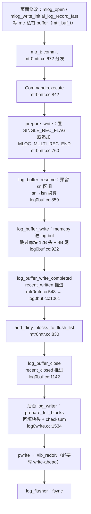

# InnoDB Redo Log 深度解析

> 基于 MySQL 8.0.39 源码，涵盖 redo 组织结构（LSN 空间 → 文件 → block → record 层级）、内存 buffer 布局（log_t）、mtr 生命周期与 log mode、mtr commit 写入路径、8.0 无锁化并发模型、checkpoint 机制、文件管理与 resize（水位线与容量体系）、文件级 redo 与 DDL（DROP/TRUNCATE）、sn/lsn 序号体系。

## 目录

- [概述](#概述)
- [理论基础](#理论基础)
- [组织结构总览（LSN 空间）](#组织结构总览lsn-空间)
- [文件层（物理结构）](#文件层物理结构)
- [log block 层（512B）](#log-block-层512b)
- [redo record 层](#redo-record-层)
- [内存 buffer 布局（log_t）](#内存-buffer-布局log_t)
- [mtr（mini-transaction）](#mtrmini-transaction)
  - [mtr 的原子性如何实现](#mtr-的原子性如何实现写时连续读时丢尾组)
- [mtr commit 写入路径](#mtr-commit-写入路径)
- [sn 与 lsn 序号体系](#sn-与-lsn-序号体系)
- [8.0 无锁化并发模型](#80-无锁化并发模型)
- [checkpoint 机制](#checkpoint-机制)
- [文件管理与 resize（水位线与容量体系）](#文件管理与-resize水位线与容量体系)
- [文件级 redo 与 DDL（DROP/TRUNCATE）](#文件级-redo-与-ddldroptruncate)
- [Misc](#misc)
- [关键源码位置速查](#关键源码位置速查)

---

## 概述

### 是什么

InnoDB 的重做日志，以 **physiological logging** 方式记录对数据页面的修改：定位到物理页（space_id, page_no），页内是逻辑操作描述。它是 WAL（write-ahead logging）的载体——页面修改先写 redo，脏页后刷盘。

### 用途

- 崩溃恢复：已提交事务的修改经 redo 重放重建，保证持久性（D）
- 配合 checkpoint：脏页异步批量刷，随机写转顺序写
- 支撑热备（MEB）、Clone、redo log archiving

### 版本演进

| 版本 | 变化 |
|------|------|
| 5.6 | 固定 `ib_logfile0/1`（log group）；用户线程持 log mutex 写 buffer，并自己触发写盘/fsync；块头第 4 字段为 checkpoint no |
| 5.7 | 同架构增量优化；块头第 4 字段改为 epoch no |
| 8.0.11 | redo 无锁化：Link_buf + 专用后台线程（log_writer / log_flusher / notifier / checkpointer），用户线程只写 buffer |
| 8.0.30 | 新文件格式 `#innodb_redo/#ib_redo0..31`（32 个文件），`innodb_redo_log_capacity` 在线可调；新增 `ALTER INSTANCE DISABLE/ENABLE INNODB REDO_LOG`（WL#13795） |

---

## 理论基础

### 设计模式

- **mtr（mini-transaction）**：redo 生成的原子单元。一个 mtr 对一组页面的修改作为一个 record group 写入日志，恢复时原子应用（全应用或全不应用）
- **生产者-消费者**：8.0 起用户线程（生产者）只把 redo 拷贝进 log buffer，后台线程（消费者）负责写盘与 fsync，靠无锁水位推进衔接
- **逻辑时钟**：LSN 全局单调递增定义全序（Lamport clock 思想），checkpoint、脏页 oldest_modification、恢复起点都以它为基准

### 相关论文

- **ARIES**（Mohan et al., 1992）：physiological logging——physical to a page, logical within a page。redo 记录定位到页，页内是逻辑描述（如 `MLOG_REC_INSERT`），重放幂等
- WAL 协议：脏页刷盘必须先于该页面对应 redo 的持久化（靠 flush list 的 oldest_modification 与 checkpoint 推进保证）

### 算法与数据结构

- **512B log block**：与磁盘扇区对齐，块尾 4B crc32，防 torn write
- **环形 log buffer**：`lsn % buf_size` 直接定址
- **Link_buf**：无锁并发区间完成度跟踪（recent_written / recent_closed），8.0 无锁化核心
- **sn/lsn 双序号**：sn 只数数据字节，lsn 数全部字节（含块头尾），单调换算

### 类似实现对比

| 系统 | 机制 | 与 InnoDB redo 对比 |
|------|------|------|
| MySQL binlog | 逻辑日志（行/SQL），server 层，event 公共头含 4B unix timestamp | redo 是引擎层物理日志，无任何时间戳，LSN 即"时间" |
| PostgreSQL WAL | 同为 physiological，但 full_page_write 把整页镜像写进日志 | InnoDB 不往 redo 写整页，靠 doublewrite buffer 防 partial page |
| Oracle redo | log buffer + LGWR 后台写 | 与 8.0 的 log_writer / log_flusher 模型同构 |

### 历史背景

早期 InnoDB 用户线程在 log mutex 保护下写 log buffer，写盘/fsync 也在用户线程上下文完成，高并发下 log mutex 与同步 IO 是吞吐瓶颈。8.0.11 重写写入路径（WL#10319 系列）：引入 recent_written / recent_closed 两个 Link_buf 与后台线程，用户线程只拷贝进 buffer 即返回。8.0.30 重构文件层为 32 个固定文件 + 动态容量，替代固定大小的 ib_logfile 组。

---

## 组织结构总览（LSN 空间）

redo 全局只有一个**线性 LSN 空间**（编号包含块头/块尾开销）。内存 buffer 与物理文件都是这个空间的载体，三者关系：

```
LSN 空间 ─────────────────────────────────────────────►
        |◄── 已 fsync ──►|◄── 已写盘 ──►|◄── 已拷贝进 buffer ──►|◄ 已预留(sn)
        0           flushed_to_disk_lsn  write_lsn   ready_for_write_lsn   sn
                  |◄──────── 物理文件（32 段循环复用） ────────►|
                                    |◄── log.buf 滑动窗口 ──►|
```

层级分解：**文件（LSN 空间的分段）→ log block（512B 原子单元）→ redo record（变长字节流）**。内存 buffer 与文件共享 block/record 两层格式，仅文件层多出自描述头。

---

## 文件层（物理结构）

### 文件集合：32 段循环

- 目录 `#innodb_redo/`（log0constants.h:73），文件 `#ib_redo0` ~ `#ib_redo31` 共 **32 个**（`LOG_N_FILES=32`，:83）
- 单文件大小 = `innodb_redo_log_capacity / 32`（总容量 8M ~ 512G，:94-97）
- 每个文件对应 LSN 空间的一段：`Log_file::m_start_lsn` / `m_end_lsn`（512 对齐，log0types.h:483-487）
- 文件内偏移换算：`offset = LOG_FILE_HDR_SIZE + (lsn - m_start_lsn)`（:518）
- 写满置 `LOG_HEADER_FLAG_FILE_FULL` 标志，`m_current_file` 切到下一个（log0sys.h:297）；旧文件由 `log_files_governor` 在 checkpoint 推进后回收重写（log0files_governor.cc）

### 单文件布局

```
| block 0  | block 1           | block 2          | block 3           | block 4 ... N
| 文件头    | LOG_CHECKPOINT_1  | LOG_ENCRYPTION   | LOG_CHECKPOINT_2  | 数据 block 序列
|◄--------------------- 2KB（LOG_FILE_HDR_SIZE，log0constants.h:176） ---------------------►|
```

### 文件头 4 block 明细

| block | 内容 | 关键字段（log0constants.h:178-245） |
|-------|------|------|
| 0 | 文件头 | format(0) / log_uuid(4) / start_lsn(8) / creator(16, 32B, 如 "MySQL 8.0.39") / flags(48) / 末尾 checksum |
| 1 | `LOG_CHECKPOINT_1`（:167） | checkpoint 页（仅第一个文件有效） |
| 2 | `LOG_ENCRYPTION`（:170） | redo 加密元信息 |
| 3 | `LOG_CHECKPOINT_2`（:173） | 与 checkpoint 1 交替写，防 torn write |

checkpoint 页内容：`checkpoint_no`(0, 8B) + `checkpoint_lsn`(8, 8B) + padding + 末尾 checksum（:241-245）。`checkpoint_lsn` 是崩溃恢复的扫描起点。

---

## log block 层（512B）

### 块布局

buffer 与文件共用同一格式（`OS_FILE_LOG_BLOCK_SIZE=512`，os0file.h:193）：

```
| 0         4        6                8        12                    508    512
| hdr_no 4B | data_len 2B | first_rec_group 2B | epoch_no 4B | 数据 496B | crc32 4B |
|◄---------------- 12B 块头 -----------------►|◄── LOG_BLOCK_DATA_SIZE ──►|◄ 尾 ►|
```

### 12B 块头字段（log0constants.h:253-306）

| 偏移 | 字段 | 含义 |
|------|------|------|
| 0 | `hdr_no` | 块号（1 ~ `LOG_BLOCK_MAX_NO` 循环，:260）；最高位在老版本是 flush bit（标记一次 write 的首块，:257） |
| 4 | `data_len` | 本块已写字节数（含块头）；最高位 8.0.30 起为 encrypt bit（:267） |
| 6 | `first_rec_group` | 本块内第一个 record group 的偏移；0=本块无新组开始；==data_len 表示组尚未追加（:269-280）。恢复/归档解析靠它定位组边界 |
| 8 | `epoch_no` | 纪元号 = start_lsn/512/`LOG_BLOCK_MAX_NO`，与 hdr_no 组合得绝对块号（:282-294）。5.6 叫 checkpoint_no，**不是时间戳** |

块尾 4B：`log_block_store_checksum`（log0files_io.h:590），crc32，恢复时校验块完整性。

### buffer 与文件中 block 的关系

- 写入 buffer 时**块头大部分字段不填**：`hdr_no`/`data_len`/`epoch_no`/checksum 由 log_writer 写盘前**就地在 log buffer 里回填**（`prepare_full_blocks`，log0write.cc:1534 → `log_data_block_header_serialize`，log0files_io.h:627-634）
- 唯一例外 `first_rec_group`：由 mtr 写入路径即时维护——跨块时清零（log0buf.cc:1037），新组起始时设置（`mtr_write_log_t`，mtr0mtr.cc:525+）
- 写"未完成块"（最后一个未写满的块）时，先拷贝到 `write_ahead_buf` 再补全头部与 checksum 写盘（log0write.cc:1617-1669）——因为 mtr 可能正并发往该块追加记录

---

## redo record 层

### 单条 record 格式

redo 数据区（block 的 496B 数据域）就是**一条条变长 redo log record** 首尾相接，由 mtr 产生：

```
| type (1B) | space_id (压缩, 1~5B) | page_no (压缩, 1~5B) | body（长度/内容由 type 决定） |
```

- 写入：`mlog_write_initial_log_record_low`（mtr0log.ic:169-184）
- 压缩编码：`mach_write_compressed`，7-bit 变长（1~5B）
- **记录没有任何公共头部**：无长度、无 LSN、无时间戳，位置由 LSN 隐式承载

### 类型分类（`mlog_id_t`，mtr0types.h:63-274，共 76 种）

| 类别 | 代表类型 | body 内容 |
|------|----------|-----------|
| 定长值写入 | `MLOG_1/2/4/8BYTES`（1/2/4/8） | 1/2/4/8B 原值 |
| 任意字节串 | `MLOG_WRITE_STRING`（30） | offset(2B)+len(2B)+原始字节 |
| 记录级（8.0.28+ 新格式） | `MLOG_REC_INSERT`(67) / `REC_DELETE`(69) / `REC_UPDATE_IN_PLACE`(70) / `REC_CLUST_DELETE_MARK`(68) / `LIST_END_COPY_CREATED`(71) / `LIST_END/START_DELETE`(75/76) | 索引描述+字段长度数组+记录内容（`mlog_open_and_write_index`） |
| 记录级（行格式相关） | `MLOG_REC_SEC_DELETE_MARK`(11) / `REC_MIN_MARK`(26) / `COMP_REC_MIN_MARK`(36) | 记录定位信息 |
| ≤8.0.27 旧格式（升级兼容） | 带 `_8027` 后缀（9,10,13-18,38-46） | 新格式的前身，仅供从旧版本恢复 |
| 页面级逻辑 | `MLOG_PAGE_CREATE`(19) / `COMP_PAGE_CREATE`(37) / RTREE(57/58) / SDI(63/64)、`PAGE_REORGANIZE`(72) | 页面级参数；重放=重跑整个操作 |
| undo 专用 | `MLOG_UNDO_INSERT`(20) / `UNDO_ERASE_END`(21) / `UNDO_INIT`(22) / `UNDO_HDR_REUSE`(24) / `UNDO_HDR_CREATE`(25) | undo 页/头操作 |
| 压缩页 | `MLOG_ZIP_*`(48-53,73,74)、`IBUF_BITMAP_INIT`(27) | 压缩页字节/页头 |
| 表空间文件级 | `MLOG_FILE_CREATE`(33) / `RENAME`(34) / `DELETE`(35) / `EXTEND`(65)、`INIT_FILE_PAGE2`(59)、`INDEX_LOAD`(61) | 文件路径/大小等 |
| 动态元信息 | `MLOG_TABLE_DYNAMIC_META`(62) | 子类型+值（auto-inc、corrupted index 等） |
| 控制/填充 | `MLOG_MULTI_REC_END`(31) / `DUMMY_RECORD`(32) / `TEST`(66) | 无或填充 |

### mtr record group（原子应用单位）

- 单 record 的 mtr：type 字节最高位置 1（`MLOG_SINGLE_REC_FLAG=128`，mtr0types.h:67；设置于 `prepare_write`，mtr0mtr.cc:799）
- 多 record 的 mtr：末尾追加 `MLOG_MULTI_REC_END=31` 单字节记录（mtr0mtr.cc:806）
- 恢复时以 record group 为**原子单位**应用；`first_rec_group` + SINGLE_REC_FLAG 是解析锚点

---

## 内存 buffer 布局（log_t）

### log.buf：环形缓冲

- 一块 512 对齐的连续内存（log0sys.h:111-124），大小 = `innodb_log_buffer_size`，512 整数倍
- 环形寻址：`lsn % buf_size`；与文件**同构**的 512B block 布局，数据区为 record 字节流，块头惰性回填
- `log_buffer_write`（log0buf.cc:922-1059）拷贝 record 时跳过每块 12B 头 + 4B 尾（:960-994）

### log_t 辅助结构（log0sys.h，文件层没有）

| 成员 | 作用 |
|------|------|
| `sn`（:103） | 已预留的数据字节序号（原子，fetch_add 分配）；最高位兼作锁位 |
| `buf_size_sn` / `buf_size`（:120/124） | buffer 容量（数据字节口径 / 总字节口径） |
| `recent_written`（:143） | Link_buf：跟踪已完整拷贝的 lsn 区间，推进 `buf_ready_for_write_lsn` |
| `recent_closed`（:157） | Link_buf：跟踪脏页已挂 flush list 的 lsn 区间，配合 checkpoint 推进 |
| `buf_limit_sn`（:174） | 预留上限（buffer 与文件空闲空间的最小值），防止覆盖未落盘数据 |
| `write_lsn`（:178） | 已写盘水位（不需 fsync） |
| `flushed_to_disk_lsn`（:234） | 已 fsync 水位 |
| `write_events[]` / `flush_events[]`（:188/223） | 按 lsn 分槽的通知事件，writer/flusher 推进后唤醒等待的用户线程 |
| `write_ahead_buf`（:274-281） | 4KB 对齐写缓冲：① write-ahead 写整 kernel page 避免 read-on-write；② 拷贝未完成块快照写盘（mtr 可并发写同一块） |
| `m_current_file`（:297） | log_writer 免锁定位当前写哪个文件 |

### buffer ↔ 文件组织差异对照

| 维度 | 内存 buffer | 物理文件 |
|------|------------|----------|
| 组织形态 | 一维环形字节窗（`lsn % buf_size`） | LSN 空间切成 32 个定长段，段内偏移 = 2KB + (lsn − start_lsn) |
| 持有范围 | LSN 尾部滑动窗口（未落盘部分） | 已持久化部分（循环复用） |
| 文件头/checkpoint 块 | 没有（checkpoint 由 log_checkpointer 单独写第一个文件） | 有，2KB 头 + 双 checkpoint block |
| 块头/checksum | 数据先到位，写盘前就地回填 | 落盘即完整 |
| 并发特征 | 多 mtr 按预留区间并发 memcpy（同一块可被多个 mtr 写） | 单 log_writer 顺序追加 |
| 覆写保护 | `buf_limit_sn` 限制预留 | checkpoint 推进才回收旧文件（governor） |

---

## mtr（mini-transaction）

### 是什么：redo 的生产者与三条职责

mtr 是 InnoDB 对**底层页面操作**的原子单元（区别于 trx 这种逻辑层长事务）。一次 B-tree 插入、一次页面重组、一次 undo 写入都是一个 mtr。它同时承担三条职责：

1. **redo 原子组**：一个 mtr 产生的所有 redo record 组成一个 record group，恢复时**全应用或全不应用**——保证"一组页面修改"不会在恢复后只剩一半（比如 B-tree 分裂改父页+子页）
2. **latch 协议**：修改期间持有页面 latch 直到 commit，其他线程只能看到 mtr 前或 mtr 后的页面状态，永远看不到中间态
3. **脏页跟踪**：commit 时把改过的页面挂入 flush list 并打上 LSN 标记（oldest_modification），这是 checkpoint 与刷脏机制的输入

### 结构（mtr_t::Impl，mtr0mtr.h:180）

| 成员 | 作用 |
|------|------|
| `m_log`（mtr_buf_t） | 拼接 redo 的**私有 buffer**：mlog 系列函数写到这里，commit 时一次性拷进共享 log buffer |
| `m_memo`（mtr_buf_t） | **资源栈**：持有的 latch/block 压成 slot（`mtr_memo_slot_t` = {object, type}，mtr0mtr.h:156），commit 时逆序处理 |
| `m_log_mode` | 四种 log mode（见下） |
| `m_modifications` / `m_n_log_recs` | 是否改了页 / 已写 record 数 |
| `m_flush_observer` | 脏页统计观察者（如 Clone） |
| `m_commit_lsn` | commit 后本 mtr redo 区间的 end_lsn（mtr0mtr.h:494；临时表空间或全局禁用时为 0） |

memo slot 类型（`mtr_memo_type_t`，mtr0types.h:280-298）：`PAGE_S_FIX` / `PAGE_X_FIX` / `PAGE_SX_FIX`（页面 latch）、`BUF_FIX`（只 fix 不加锁）、`S_LOCK` / `X_LOCK`（rw_lock_t）、`MODIFY`（仅 debug 标记页面被改）。

### 生命周期

```
mtr.start()                                    # 标记同步/异步（m_sync）
  │
  ├─ 访问页面：buf_page_get_gen → mtr_memo_push      # 持 latch 压入 m_memo
  │
  ├─ 写 redo：mlog_open                             # 在 m_log 预留 record 头位置
  │      mlog_write_initial_log_record_fast          # type + 压缩 space_id/page_no（mtr0log.ic:191）
  │      mlog_catenate_string / mlog_write_index ... # body
  │      mlog_close                                  # 回填
  │
  └─ mtr_t::commit（mtr0mtr.cc:672 分发）
       ├─ 有日志（或 NO_REDO 有修改）→ Command::execute (:842)
       │     prepare_write → log_buffer_reserve → log_buffer_write
       │     → log_buffer_write_completed（recent_written 推进）
       │     → add_dirty_blocks_to_flush_list (:830)
       │         逆序遍历 m_memo → buf_flush_note_modification (buf0flu.ic:57)
       │         【oldest_modification = mtr 的 start_lsn；首次变脏才挂 flush list】
       │     → log_buffer_close（recent_closed 推进）
       │     → release_all (:819)：逆序释放 m_memo 中的 latch
       └─ 纯 LOG NONE 无修改 → 直接 release_all (:678)
```

关键顺序：**先把 redo 拷进 log buffer（推进 recent_written），再挂脏页，最后 log_buffer_close 推进 recent_closed**——recent_closed 水位因此保证"水位以下 lsn 的脏页都已在 flush list"，这正是 checkpoint 选 LSN 时的 dpa_lsn 上限。

`buf_flush_note_modification`（buf0flu.ic:57-107）细节：页面**首次**变脏（不在 flush list）才插入 flush list 并设 `oldest_modification = start_lsn`；已在 flush list 则只更新 `newest_modification`（buf0flu.cc:503 `buf_flush_insert_into_flush_list`）。所以 flush list 天然按 oldest_modification 有序——page_cleaner 从尾部刷、checkpoint 从最老页取值都依赖这个序。

### 与 trx 的关系

- **mtr 是物理层短事务，trx 是逻辑层长事务**：一条 SQL 由若干 mtr 组成（每个 B-tree 操作一个 mtr）
- trx 的持久性最终也落在 mtr 上：commit 时写 undo header、GTID 等都是 mtr 操作
- mtr 没有回滚概念——它的"原子性"靠 redo record group 的原子应用 + latch 协议保证，出错只能 crash 恢复

### log mode

`mtr_log_t` 四种模式（mtr0types.h:42-57）：

| mode | 记日志 | 标脏入 flush list | 典型场景 |
|------|--------|-------------------|----------|
| `MTR_LOG_ALL` | 是 | 是 | 默认 |
| `MTR_LOG_NO_REDO` | 否 | **是** | 临时表（`dict_disable_redo_if_temporary`，dict0dict.ic:1055）、全局 redo disable |
| `MTR_LOG_NONE` | 否 | 否 | 页面重组等"先物理操作后补逻辑日志"场景 |
| `MTR_LOG_SHORT_INSERTS` | 是（短格式） | 是 | 临时状态，commit 前必须重置 |

模式切换状态机 `s_mode_update`（mtr0mtr.cc:439-449）：ALL→任意；NONE→ALL/NO_REDO；**NO_REDO 只能转 NONE，不能回 ALL**（设了就再无补日志机会）；SHORT_INSERTS 只能回 ALL。

8.0.30 全局开关：`ALTER INSTANCE DISABLE INNODB REDO_LOG` 把所有 mtr 标记为 NO_REDO（`mtr_t::Logging`，mtr0mtr.cc:611-634、898-939），用于批量导数提速，代价是崩溃不可恢复。

### mtr 的原子性如何实现（写时连续，读时丢尾组）

**写路径前提：组内连续、组间不交错**。mtr 的所有 record 在 `log_buffer_reserve` 一次性 fetch_add 预留整段**连续 LSN 区间**，整体 memcpy → redo 流天然是完整 record group 的序列，不同 mtr 的 record 绝不交错。崩溃时持久化的 redo 只能被截断在某个字节处——最坏情况只是最后一个组不完整。

**恢复防线一：块 checksum 终止扫描**。`recv_scan_log_recs`（log0recv.cc:3390-3405）：块 crc32 校验失败 → 视为"abrupt end of the redo log"直接停扫，截断点之后的字节不进入解析；另有 `epoch_no` 校验兜住上次恢复遗留的垃圾块（:3409-3419）。

**恢复防线二：`recv_multi_rec` 两阶段组解析**（log0recv.cc:3069-3225）：

```
阶段 1（:3076-3129）：整组 record 逐条解析到 save_rec 暂存，直到
        看到 MLOG_MULTI_REC_END。
        - 中途到 buffer 末尾（组不完整）→ return，不入 hash（:3090）
        - 组跨到尚未扫描的下一块 → return 等更多数据（:3131-3139）
阶段 2（:3141-3218）：确认整组齐了，才统一把全部 record 加入 hash 表
        （入 hash = 变为"可被应用"）
```

结论：**不完整的尾组永远不会被应用**——恢复后的页面状态恰好等于"所有完整 mtr 都应用了"，不存在半个 mtr。单记录组（`recv_single_rec`）同理。

**幂等重放**：每个数据页头 `FIL_PAGE_LSN` 记录最后修改该页的 redo end_lsn；`recv_recover_page` 应用时跳过 `start_lsn ≤ 页 LSN` 的记录；physiological 页内操作本身幂等 → 恢复可从任意 checkpoint 重放、重复恢复不出错（可重入）。

**事务级原子性 = redo 重放 + undo 回滚**：redo 只把页面恢复到崩溃瞬间的物理状态（含未提交事务的脏数据）；undo 页同为普通页受 redo 保护，恢复后段从 undo 重建事务状态并回滚未提交事务（`trx_rollback_or_clean_recovered`）。提交原子点 = undo header 置 `TRX_UNDO_COMMITTED` 与对应 redo 在同一 mtr 落盘；binlog 开启时由内部 2PC 的提交点（binlog fsync）裁决。

设计思想一句话：**用格式上的组标记 + 恢复时的整组校验，把"物理写可能被截断"转化为"逻辑上要么全有要么全无"；再用 FIL_PAGE_LSN 幂等重放保证恢复可重入**——不需要任何复杂的写时协议。

---

## mtr commit 写入路径



要点：

- 用户线程到此为止只做了"预留区间 + memcpy + 挂脏页"，**不碰磁盘 IO**
- 块头回填（`log_data_block_header_serialize`，log0files_io.h:627-634）在 log_writer 写盘前**就地在 log buffer 里完成**，含 crc32 入 trailer
- 纯 `MTR_LOG_NONE` 的 mtr（无日志且非 NO_REDO）在 `mtr_t::commit` 直接走 release 路径，不进 execute（mtr0mtr.cc:672-679）

---

## sn 与 lsn 序号体系

- **sn（sequence number）**：只数**数据字节**的序号，连续无洞
- **lsn（log sequence number）**：数**全部字节**（含每块 12B 头 + 4B 尾），是对外统一使用的序号（LSN_MAX 2^63-1，log0constants.h:159）
- 换算：`log_translate_sn_to_lsn` / `log_translate_lsn_to_sn`（如 log0buf.cc:898-900）
- `LOG_START_LSN = 16 * 512 = 8192`（log0constants.h:153），LSN 不从 0 起
- mtr 先按数据长度预留 sn 区间（无锁 fetch_add），再换算成 lsn 区间拷贝——这是 8.0 并发写 buffer 的基础

---

## 8.0 无锁化并发模型

- **recent_written**（Link_buf）：跟踪 buffer 中哪些 lsn 区间已被完整拷贝。`log_buffer_write_completed` 调 `add_link_advance_tail`（log0buf.cc:1106）推进 `buf_ready_for_write_lsn`，log_writer 只能写水位以下的连续区间
- **recent_closed**（Link_buf）：跟踪哪些区间对应的脏页已挂入 flush list（`log_buffer_close`，log0buf.cc:1142）。checkpoint 推进必须等脏页挂链完成，否则恢复时丢失 oldest_modification 起点
- 后台线程：`log_writer`（写盘）、`log_flusher`（fsync）、`log_write_notifier` / `log_flush_notifier`（通知等待的用户线程）、`log_checkpointer`（log0chkp.cc）、`log_files_governor`（8.0.30 文件管理，log0files_governor.cc）
- 等待/唤醒按 lsn 分槽（`log.write_events[]`，notify 见 log0write.cc:1590）

### Link_buf 内部结构（ut0link_buf.h:78）

无锁并发区间完成度跟踪的环形数组，是 8.0 无锁化的核心数据结构：

- `m_links[]`：`atomic<Distance>` 数组，容量必须为 2 的幂（:205），按 `position % capacity` 定址（`slot_index`）
- `m_tail`：`atomic<Position>`，缓存行对齐（:194），表示**已连续完成的水位**
- `add_link(from, to)`（:253）：在 `slot[from % cap]` 写 `to`，标记"from→to 这段已完成"
- `add_link_advance_tail(from, to)`（:277）：写 link 后尝试推进 tail——若 `from == tail` 直接 store 推进（**无锁快路径**），否则调 `advance_tail_until` 顺着已形成的连续 link 链向前走
- `advance_tail`（:306-387）：从 tail 出发沿 link 链跳，遇到空槽（`next <= position`）即停——水位就是"连续完成的最大前缀"
- `has_space(position)`（:407）：`tail + capacity > position` 才允许 add；`log_buffer_reserve` 用它判断 buffer 是否有空间

语义：生产者（用户线程）**乱序完成区间**并 `add_link`，消费者（log_writer / checkpointer）只需读 `m_tail` 就拿到"已连续完成到哪"。`recent_written` 跟踪 lsn→lsn（buffer 拷贝完成），`recent_closed` 跟踪 lsn→lsn（脏页挂 flush list 完成）。

### write-ahead 机制（log0write.cc）

目的：避免 sub-page 写触发 read-modify-write。文件以 `srv_log_write_ahead_size` 为单位提前填零，后续写在已 zero-fill 的区域可直接 `pwrite` 不需先读。

- `compute_write_size`（:1416）：决定本次从 `log.buf` 直接写多少。若不满足 write-ahead 需求或不足一个 block，则只写完整 block 部分，剩余走 write-ahead
- `current_write_ahead_enough`（:1487）：当前 write-ahead 区间够不够
- `compute_next_write_ahead_end`（:1491）：下一个 write-ahead 边界（对齐 `srv_log_write_ahead_size`）
- `copy_to_write_ahead_buffer`（:1617）：把 `log.buf` 内容 + 填零拷到 `write_ahead_buf`，凑齐 write-ahead 边界
- `prepare_for_write_ahead`（:1671）：实际 `pwrite` 填零区域

`write_ahead_buf` 的双重用途（内存布局章已述）：① 凑 write-ahead 边界填零；② 拷"未完成块"快照写盘（mtr 可并发往该块追加记录）。

---

## checkpoint 机制

### 语义：redo 回收的分界点

> `last_checkpoint_lsn`：所有 `oldest_modification < checkpoint_lsn` 的脏页都已刷盘 → 该 LSN 之前的 redo 可回收；崩溃恢复只需从 checkpoint_lsn 开始扫。

redo 文件固定容量循环复用，要让旧 redo 可被覆盖，必须保证其描述的页面修改已落到数据文件。checkpoint_age = current_lsn − last_checkpoint_lsn，同时约束恢复时长与 redo 空间。8.0 只有 **fuzzy checkpoint**（log_checkpointer 线程持续推进），脏页刷盘与 checkpoint 写完全异步解耦。

### checkpoint_lsn 的选择（三个上限）

`log_compute_available_for_checkpoint_lsn`（log0chkp.cc:208）：

```
available_lsn = min( 最老脏页 oldest_modification 的 LWM,
                     recent_closed 水位 (dpa_lsn),
                     flushed_to_disk_lsn )
```

1. **`buf_pool_get_oldest_modification_lwm()`**（:234）：不能超过最老未刷脏页，否则对应 redo 被回收后页就丢了；flush list 为空时取 dpa_lsn
2. **dpa_lsn**（`buf_dirty_pages_added_up_to_lsn`，:227）：防竞态——mtr 已把 redo 拷进 buffer 但脏页还没挂 flush list 时，checkpoint 不能超过这个点
3. **`flushed_to_disk_lsn`**（:261）：checkpoint 指向的 redo 本身必须已 fsync；若等 flusher 会死锁——log_writer 空间不足时也在等 checkpoint 前进（:248-259 注释）

附加约束：不落在 block 边界（:274-280，恢复假设 checkpoint 在块数据区）；单调不减（:287）；`dict_max_allowed_checkpoint_lsn` 可临时压低（`log_determine_checkpoint_lsn`:343，DD 动态元数据未持久化时）。

### 触发条件（log_should_checkpoint，log0chkp.cc:864）

| 条件 | 说明 |
|------|------|
| 显式请求 | `requested_checkpoint_lsn <= oldest_lsn`（:931）。请求方：`log_request_checkpoint`(:608)、`log_make_latest_checkpoint`(:703，shutdown / `ENABLE INNODB REDO_LOG` mtr0mtr.cc:928 / resize)、用户线程 `log_free_check_wait`(:1270) |
| 激进条件 | `checkpoint_age >= aggressive_checkpoint_min_age()`（:933）；age 含 margin：`current_lsn + margin − last_checkpoint_lsn`（:921） |
| 周期性 | 距上次 ≥ `innodb_log_checkpoint_every`（默认 1s），或 checkpoint 可落到下一文件（:955-956） |

### 与刷脏的关系：checkpoint 不刷脏页

`log_checkpoint` 只写 checkpoint header，一个脏页都不刷；刷脏是 page_cleaner 的活，checkpoint 被刷脏进度"拖着走"。协同阈值（`Log_files_capacity`，log0files_capacity.h:112-143）：

```
adaptive_flush_min_age   adaptive_flush_max_age   aggressive_checkpoint_min_age
       |                        |                        |
-------!------------------------!------------------------!---------> checkpoint_age
 常规刷脏(io_capacity)     自适应加速刷脏          激进刷脏(sync flush)+激进 checkpoint
```

- age 超 max_age：**sync flush**——checkpointer 主动唤醒 page_cleaner（`log_consider_sync_flush`:838 → `log_request_sync_flush`:718）
- 用户线程闸：`log_free_check()` 在不持 latch 的安全点周期调用，`current_lsn > free_check_limit_lsn` 则 `log_free_check_wait`（:1254）睡住，等 checkpoint 推进放行。`concurrency_margin`（:1118-1191）= 线程数 × 每线程 redo 上限（`LOG_CHECKPOINT_FREE_PER_THREAD × UNIV_PAGE_SIZE`）+ governor 余量 + 容量百分比——保证持最老脏页 latch 的线程一定能完成 mtr 释放页面，防死锁

### 完整流程与调用栈

`log_checkpoint`（log0chkp.cc:471）→ `log_files_next_checkpoint`（:364）：

1. `log_determine_checkpoint_lsn`（:343）定目标 LSN
2. 前置：`dict_persist_to_dd_table_buffer()`（`log_consider_checkpoint`:972，DD 动态元数据先落盘）；有 page tracking 则 `arch_page_sys->flush_at_checkpoint`（:487）
3. **`buf_flush_fsync()`（:492）——关键顺序**：fsync doublewrite buffer + 数据文件，确保数据页真正落盘后才推进 checkpoint
4. 写 checkpoint header 到第一个文件的 `LOG_CHECKPOINT_1`/`_2` **交替**（`log_next_checkpoint_header`:442，防 torn）→ fsync（:412）
5. `last_checkpoint_lsn.store()`（:421）
6. `log_update_limits_low`（:1207）：`free_check_limit_lsn = last_checkpoint_lsn + soft_capacity − margin`，放行 `log_free_check` 等待线程
7. 唤醒 `files_governor_event`（:398，回收旧 redo 文件）、`next_checkpoint_event`（:437）

```
log_checkpointer (log0chkp.cc:991)                        # 后台线程主循环
 ├─ log_consider_sync_flush (838) → log_request_sync_flush (718)   # 推 page_cleaner 刷脏
 └─ log_consider_checkpoint (959)
     ├─ log_should_checkpoint (864)                        # 三类触发条件
     ├─ dict_persist_to_dd_table_buffer                    # DD 动态元数据先落盘
     └─ log_checkpoint (471)
         ├─ log_determine_checkpoint_lsn (343)             # min(最老脏页, recent_closed, flushed)
         ├─ buf_flush_fsync (:492)                         # 数据文件 fsync
         └─ log_files_next_checkpoint (364)
             ├─ log_files_write_checkpoint_low (454)       # 写 checkpoint header，1/2 交替
             ├─ fsync (:412)
             ├─ last_checkpoint_lsn.store (:421)
             ├─ log_update_limits_low (1207)               # 放大 free_check_limit_lsn
             └─ os_event_set(governor / next_checkpoint)
```

### LSN 不变量

```
last_checkpoint_lsn ≤ 最老脏页 oldest_modification          # checkpoint 语义本身
last_checkpoint_lsn ≤ available_for_checkpoint_lsn
                    ≤ dpa_lsn (recent_closed)
                    ≤ ready_for_write_lsn ≤ write_lsn ≤ flushed_to_disk_lsn
checkpoint_age = current_lsn − last_checkpoint_lsn ≤ soft_logical_capacity   # 正常运行
```

崩溃恢复：`recv_find_max_checkpoint` 读两个 checkpoint 页，取 `checkpoint_no` 大者，从 `checkpoint_lsn` 所在 block 开始扫 redo 重放。

---

## 文件管理与 resize（水位线与容量体系）

### 消费者（consumer）模型

8.0.30 把"谁还需要旧 redo"抽象为注册的 `Log_consumer`（log0consumer.h）。`oldest_needed_lsn` = 最滞后消费者的 `consumed_lsn`（`log_consumer_get_oldest`，log0consumer.cc:86），是文件回收与容量计算的下界。

| consumer | 注册点 | consumed_lsn | 被催时动作（consumption_requested） |
|----------|--------|--------------|-------------------------------------|
| checkpointer（常驻） | 启动注册（log0log.cc:672） | `last_checkpoint_lsn` | `log_request_checkpoint_in_next_file`（log0consumer.cc:69） |
| archiver | redo archiving 激活（arch0log.cc:939） | 归档进度 | 催归档 |
| MEB 备份 | UDF `innodb_redo_log_consumer_register`（log0meb.cc:1687） | 备份拷贝进度（从 checkpoint_lsn 起步） | — |

- `newest_needed_lsn` = `write_lsn`（log0files_governor.cc:606）
- **logical_size** = `align_up(write_lsn) − align_down(oldest_needed)`（:611-631）——redo 真实占用
- governor 口径 **checkpoint_age** = `write_lsn − last_checkpoint_lsn`（:628）
- writer 硬闸（log0write.cc:2076-2085）：`next_write_lsn > oldest_needed + hard_logical_capacity` 则睡 10ms 重试，最多 1s 后强行写或崩溃；`m_oldest_need_lsn_lowerbound`（log0sys.h:343）为单调下界缓存

### 容量限制体系：梯度限流

铁律不变量：`write_lsn ≤ oldest_needed_lsn + 容量`。容量不是一条线，而是一组梯度线——系统逼近极限时**渐进降级**而非急刹：

```
                     占总容量百分比（以 soft 为 100% 计）
 87.5%          93.75%           96.875%        100%          ~105%
   │               │                │             │              │
   ▼               ▼                ▼             ▼              ▼
adaptive_     adaptive_       aggressive_      SOFT          HARD
flush_min     flush_max       checkpoint_    (用户线程闸)   (writer 闸)
```

**公式链**（全部源码常量）：

1. `hard = physical × 30/32 − 31×2KB（文件头）− 2×64KB（LOG_EXTRA_SAFETY_MARGIN）− spare 提前创建余量`（`hard_logical_capacity_for_physical`，log0files_capacity.cc:273-333）。`30/32`：恒留 2 个文件余量，保证下一文件永远建得出（:287-291）
2. `soft = hard × 0.95`（`LOG_EXTRA_WRITER_MARGIN_PCT=5%`，log0constants.h:352）
3. `adaptive_flush_min_age = soft × 7/8`（RATIO_MIN=8）、`adaptive_flush_max_age = soft × 15/16`（RATIO_MAX=16）、`aggressive_checkpoint_min_age = soft × 31/32`（RATIO_MIN=32）（`update_exposed`，log0files_capacity.cc:475-499）
4. `free_check_limit_lsn = last_checkpoint_lsn + soft − concurrency_margin`；`concurrency_margin = (innodb_thread_concurrency + 10) × 4 页 × 页大小`，封顶 soft 的 50%（log0chkp.cc:1118-1225）

**soft 语义**：用户线程视角的容量上限。达到 → 全部用户线程在 `log_free_check` 睡住 + error log 报警，但后台流水线（page_cleaner / writer / flusher / checkpointer）继续自救，oldest 一前进闸即前移，用户线程被唤醒。

**hard 比 soft 多 5% 的动机**（log0constants.h:340-352 注释）——防死锁：用户线程可能持页面 latch 被拦，page_cleaner 在等最老脏页；若 log_writer 同水位被拦 → 已拷进 buffer 的 redo 写不出 → fsync/checkpoint 停摆 → 闸永不前移 → 死锁。writer 的 5% 隐藏余量（不告知用户线程）保证系统必然自愈。

**concurrency_margin 在 soft 之前设闸**：被拦的是检查点，每个并发线程下次检查前最多还能产生 4 页 redo（`LOG_CHECKPOINT_FREE_PER_THREAD`，log0constants.h:380），须预留在途流量。

数值直觉（`innodb_redo_log_capacity=100MB`，近似）：hard ≈ 92.5MB、soft ≈ 87.9MB、aggressive_chkp ≈ 85.1MB、adaptive_max ≈ 82.4MB、adaptive_min ≈ 76.9MB。

### resize 流程（innodb_redo_log_capacity 在线变更）

入口：governor 每 10ms 迭代 → `log_files_update_capacity_limits`（log0files_governor.cc:1109）→ `Log_files_capacity::update` → `update_target`（log0files_capacity.cc:226）。

**调大（upsize）**：`m_current_physical_capacity = target` **立即生效**（:263-267），新文件按新 size 创建。

**调小（downsize）**：`m_resize_mode = RESIZING_DOWN`（:260），然后：

1. **梯度线立即前移**：`get_suggested_hard_logical_capacity`（capacity.cc:455-473）缩容时跟随 checkpoint_age 收缩 → 刷脏/checkpoint 加速 → `oldest_needed_lsn` 前进
2. **governor 三催熟**（`log_files_should_rush_oldest_file_consumption`:1224，缩容恒 true）：
   - 预测 10s 消费不完最老文件 → `consumer->consumption_requested()`（:1270-1277）
   - 最老文件即最新文件且 10s 填不满 → **truncate** 截断（:1284-1286）
   - 仍填不满 → 生成 **dummy redo 记录**填充（`LOG_FILES_DUMMY_INTAKE_SIZE=4KB`，:1345）
3. 文件消费：`log_files_mark_consumed_files`（`end_lsn ≤ oldest_needed` 标记 consumed）→ `log_files_process_consumed_files`（删除或回收为 unused spare）
4. **完成判据**（`is_target_reached_for_resizing_down`，capacity.cc:363，三条同时满足）：logical_size 装得下目标容量 + 现有物理总量 ≤ target + 最大单文件 ≤ target/32 → `current = target`、`mode = NONE`
5. 中途再改容量：先 `cancel_resize`（:242）再按新目标重来

状态变量：`innodb_redo_log_resize_status`（"OK" / "Resizing down"）、`innodb_redo_log_logical_size` / `physical_size` / `capacity_resized`。

### 水位线不变量汇总

```
oldest_needed_lsn = min(consumer.consumed_lsn) ≤ last_checkpoint_lsn（通常相等）
write_lsn ≤ oldest_needed_lsn + hard_logical_capacity            # writer 硬闸
current_lsn ≤ free_check_limit_lsn = last_chkp + soft − margin   # 用户闸
logical_size ≤ soft < hard ≤ (32−2)/32 × physical − overhead
Σ文件大小 ≤ current_physical_capacity                            # 磁盘守门
```

一句话：文件层水位 = "生产者写得多快（write_lsn）"与"最慢消费者读到哪（oldest_needed_lsn）"的夹逼；容量体系用 soft/hard 两道闸分别拦用户线程和 writer；resize down 就是人为把闸前移，逼整条流水线加速排空旧文件。

---

## 文件级 redo 与 DDL（DROP/TRUNCATE）

### MLOG_FILE_* 记录格式

`fil_op_write_log`（fil0fil.cc:4416-4473）写文件级逻辑日志（格式 8.0.11 引入）：

```
| type (1B) | space_id | page_no(=0) | [flags 4B, 仅 CREATE] | 2B len | path | [2B len | new path, 仅 RENAME] |
```

四种：`MLOG_FILE_DELETE`(35) / `MLOG_FILE_CREATE`(33) / `MLOG_FILE_RENAME`(34) / `MLOG_FILE_EXTEND`(65)（mtr0types.h:150-179）。

### DROP TABLE：一条 MLOG_FILE_DELETE

```
ha_innobase::delete_table
→ innobase_basic_ddl::delete_impl (ha_innodb.cc:14226)
→ row_drop_table_for_mysql (row0mysql.cc:3771)
→ fil_delete_tablespace (fil0fil.cc:4490)
→ Fil_shard::space_delete (fil0fil.cc:4493)
   ├─ mtr.start() → fil_op_write_log(MLOG_FILE_DELETE)   # :4568
   ├─ mtr.commit() → commit_lsn
   ├─ log_write_up_to(commit_lsn, true)                  # :4582 ★redo 先强制落盘
   └─ os_file_delete                                     # 再删文件
```

- 整表页面**不记任何页面级 redo**，只写一条 `MLOG_FILE_DELETE`
- WAL 顺序（:4576-4580 注释）：先持久化"文件将被删除"，再执行删除——崩溃在中间时，恢复重放会再删一次（幂等）
- 共享表空间中的表走 `btr_free` 页面级路径 + `BUF_REMOVE` 清 buffer pool

### TRUNCATE TABLE = rename + drop + create

`innobase_truncate<Table>::exec`（ha_innodb.cc:14748）→ `truncate()`（:14558）：

1. `rename_tablespace()`（:14653）：`fil_rename_tablespace`（fil0fil.cc:5404）把 .ibd 改为临时名 `#sql-ib<tid>` → **MLOG_FILE_RENAME**
2. `innobase_basic_ddl::delete_impl`（:14585）：走 DROP 路径删旧表 → **MLOG_FILE_DELETE**（先落盘再删）
3. 清 dd `se_private_id` / index `se_private_data`（:14595-14600）
4. `innobase_basic_ddl::create_impl`（:14620）：**新 space_id**，`fil_ibd_create` 写 **MLOG_FILE_CREATE**（fil0fil.cc:5744）；每索引 `btr_create` 建根页 → 页面级 redo

**效果**：truncate 后表获得新 space_id，旧文件整体废弃——redo 总量为几条文件级记录 + 每索引一条建根页记录，**与表大小无关**。

### 恢复侧：扫描阶段立即执行

`MLOG_FILE_*` 不进 hash 按页应用，而是 `recv_parse_or_apply_log_rec_body`（log0recv.cc:1582）**解析时直接执行**（`fil_tablespace_redo_delete/create/rename/extend`，:1590-1608）——页面级 redo 的应用要求文件已处于正确状态（该在的在、该没的没、名字正确）。全部幂等。

### 边界情形

- 临时表：`dict_disable_redo_if_temporary`（dict0dict.ic:1055）→ NO_REDO，drop/truncate 不写 redo
- 全局 redo 关闭窗口（`ALTER INSTANCE DISABLE INNODB REDO_LOG`）：文件级 redo 同样不写
- 临时表 DELETE 全表（row0mysql.cc:2506-2518）：truncate 索引重建，`btr_create` 用 `MTR_LOG_NO_REDO`

### 设计思想

**文件级逻辑日志**——`MLOG_PAGE_REORGANIZE` 思路从"页"升到"文件"：一条记录替代海量物理日志，恢复时重放 = 重跑整个文件操作；配合"先日志后操作"（`log_write_up_to(..., true)`）保证崩溃后可补做未完成的那半步。

---

## Misc

### redo 里没有 timestamp

整个 redo 子系统（`storage/innobase/log/`）无任何 wall-clock 时间戳（全目录搜 "timestamp" 0 命中）。redo 的"时间"就是 **LSN 逻辑时钟**——恢复、checkpoint、脏页排序只需要全序，不需要墙钟。块头第 4 字段是 `epoch_no`（由 LSN 推算，log0constants.h:282-294），部分中文资料误称 checkpoint no，也不是时间。对比：binlog event 公共头有 4B unix timestamp，那是 server 层逻辑日志。

### LOG NONE 与"逻辑日志"模式

LOG NONE 的典型用法：操作过程中关日志省掉大量物理日志，完成时补一条页面级逻辑日志。以页面重组 `btr_page_reorganize_low`（btr0btr.cc:1141）为例：

1. 页面 X-fix 钉住（:1160 断言），拷贝到 temp_block
2. `mtr_set_log_mode(mtr, MTR_LOG_NONE)`（:1170）
3. `page_create` + `page_copy_rec_list_end_no_locks` 内存中物理重建
4. 恢复 log mode（:1294）
5. 只写一条 `MLOG_PAGE_REORGANIZE`（:1306-1319）

恢复时重放该记录 = 在页面上重跑整个重组（log0recv.cc:2099），与页内偏移无关、幂等。

---

## 关键源码位置速查

| 位置 | 说明 |
|------|------|
| `mtr0types.h:42` | `mtr_log_t` 四种 log mode |
| `mtr0types.h:63` | `mlog_id_t` redo record 类型枚举（76 种） |
| `mtr0log.ic:169` | `mlog_write_initial_log_record_low`：record 头格式（type+压缩 space/page） |
| `mtr0mtr.cc:439` | `s_mode_update` log mode 状态机 |
| `mtr0mtr.cc:760` | `prepare_write`：SINGLE_REC_FLAG / MULTI_REC_END |
| `mtr0mtr.cc:842` | `Command::execute`：mtr commit 写 redo 主流程 |
| `mtr0mtr.h:180` | `mtr_t::Impl`：m_memo（资源栈）+ m_log（私有 redo buffer） |
| `mtr0types.h:280` | `mtr_memo_type_t`：memo slot 类型（PAGE_S/X/SX_FIX、BUF_FIX、S/X_LOCK） |
| `mtr0mtr.cc:319` | `Add_dirty_blocks_to_flush_list`：commit 时挂脏页 |
| `mtr0mtr.cc:819` | `release_all`：逆序释放 memo 中的 latch |
| `buf0flu.ic:57` | `buf_flush_note_modification`：设 oldest_modification 并入 flush list |
| `log0buf.cc:859` | `log_buffer_reserve`：预留 sn 区间并换算 lsn |
| `log0buf.cc:922` | `log_buffer_write`：memcpy 进 log.buf，跳过块头尾 |
| `log0buf.cc:1061` | `log_buffer_write_completed`：recent_written 推进 |
| `log0buf.cc:1142` | `log_buffer_close`：recent_closed 推进 |
| `log0write.cc:1534` | `prepare_full_blocks`：写盘前回填块头 |
| `log0write.cc:1617` | `copy_to_write_ahead_buffer`：未完成块快照 + write-ahead |
| `log0files_io.h:627` | `log_data_block_header_serialize`：块头序列化 + checksum |
| `log0constants.h:253-306` | log block 12B 头 / 4B 尾布局常量 |
| `log0constants.h:167-245` | 文件头 4 block + checkpoint 页布局 |
| `log0sys.h:111-124` | `log.buf` / `buf_size_sn` / `buf_size` |
| `log0sys.h:143-297` | `log_t` 辅助结构（Link_buf×2、水位线、事件槽、write_ahead_buf、m_current_file） |
| `log0types.h:454-519` | `Log_file`：m_start_lsn/m_end_lsn、offset 换算 |
| `log0chkp.cc:208` | `log_compute_available_for_checkpoint_lsn`：checkpoint 候选 LSN 三上限 |
| `log0chkp.cc:471` | `log_checkpoint`：checkpoint 主流程（含 `buf_flush_fsync`） |
| `log0chkp.cc:864` | `log_should_checkpoint`：三类触发条件 |
| `log0chkp.cc:991` | `log_checkpointer`：后台线程主循环 |
| `log0chkp.cc:1207` | `log_update_limits_low`：checkpoint 后放大 `free_check_limit_lsn` |
| `log0files_capacity.h:112` | `Log_files_capacity`：flush/checkpoint 激进阈值模型 |
| `log0consumer.cc:86` | `log_consumer_get_oldest`：最滞后消费者（oldest_needed_lsn） |
| `log0files_governor.cc:611` | `log_files_logical_size_and_checkpoint_age`：logical_size/age 计算 |
| `log0files_governor.cc:1229` | `log_files_governor_iteration_low`：governor 迭代（消费/催熟/建文件） |
| `log0files_capacity.cc:273` | `hard_logical_capacity_for_physical`：physical→hard 公式 |
| `log0files_capacity.cc:475` | `update_exposed`：hard→soft→各 age 梯度 |
| `log0files_capacity.cc:226` | `update_target`：resize up/down 分叉 |
| `log0write.cc:2076` | writer 硬闸（hard_logical_capacity） |
| `log0sys.h:503` | `log.m_consumers`：注册的消费者集合 |
| `os0file.h:193` | `OS_FILE_LOG_BLOCK_SIZE=512` |
| `dict0dict.ic:1055` | `dict_disable_redo_if_temporary`：临时表设 NO_REDO |
| `mtr0mtr.cc:898` | `mtr_t::Logging::enable`：全局 redo disable/enable |
| `btr0btr.cc:1141` | `btr_page_reorganize_low`：LOG NONE + 逻辑日志范例 |
| `log0recv.cc:3069` | `recv_multi_rec`：两阶段组解析，不完整组不入 hash |
| `log0recv.cc:3390` | `recv_scan_log_recs`：块 checksum 失败即停扫（abrupt end） |
| `log0recv.cc:2099` | 恢复时重放 `MLOG_PAGE_REORGANIZE` |
| `fil0fil.cc:4416` | `fil_op_write_log`：MLOG_FILE_* 文件级记录格式 |
| `fil0fil.cc:4493` | `Fil_shard::space_delete`：DROP 写 MLOG_FILE_DELETE，先落盘再删文件 |
| `fil0fil.cc:5404` | `fil_rename_tablespace`：TRUNCATE 第一步 rename 为临时名 |
| `fil0fil.cc:5744` | `fil_ibd_create`：写 MLOG_FILE_CREATE |
| `ha_innodb.cc:14558` | `innobase_truncate::truncate`：rename+drop+create 流程 |
| `log0recv.cc:1590` | `recv_parse_or_apply_log_rec_body`：MLOG_FILE_* 扫描期立即执行 |
| `ut0link_buf.h:78` | `Link_buf` 模板：无锁区间完成度跟踪（m_links 环形数组 + m_tail） |
| `log0write.cc:1416` | `compute_write_size`：write-ahead 决策 |
