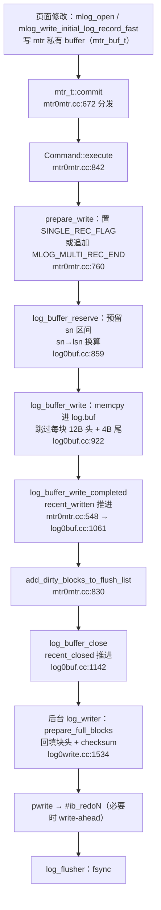

# InnoDB Redo Log 深度解析

> 基于 MySQL 8.0.39 源码，涵盖 redo 组织结构（LSN 空间 → 文件 → block → record 层级）、内存 buffer 布局（log_t）、mtr 生命周期与 log mode、mtr commit 写入路径、8.0 无锁化并发模型、checkpoint 机制、文件管理与 resize（水位线与容量体系）、文件级 redo 与 DDL（DROP/TRUNCATE）、sn/lsn 序号体系。

## 目录

- [概述](#概述)
- [理论基础](#理论基础)
- [组织结构总览（LSN 空间）](#组织结构总览lsn-空间)
- [文件层（物理结构）](#文件层物理结构)
  - [redo 文件格式演进（Log_format / ruleset）](#redo-文件格式演进log_format--ruleset)
- [log block 层（512B）](#log-block-层512b)
- [redo record 层](#redo-record-层)
  - [写入原语：mlog_open / close / catenate](#写入原语mlog_open--mlog_close--mlog_catenate)
  - [★ mlog_open_and_write_index](#mlog_open_and_write_index记录级-redo-的核心)
  - [主要 record 类型的完整布局](#主要-record-类型的完整布局)
  - [解析侧：如何把 redo 变回页面](#解析侧如何把-redo-变回页面)
  - [mtr record group（原子应用单位）](#mtr-record-group原子应用单位)
- [内存 buffer 布局（log_t）](#内存-buffer-布局log_t)
  - [log buffer 的在线变更](#log-buffer-的在线变更)
- [mtr（mini-transaction）](#mtrmini-transaction)
  - [mtr 的原子性如何实现](#mtr-的原子性如何实现写时连续读时丢尾组)
- [mtr commit 写入路径](#mtr-commit-写入路径)
- [sn 与 lsn 序号体系](#sn-与-lsn-序号体系)
- [8.0 无锁化并发模型](#80-无锁化并发模型)
  - [并发 mtr 写 buffer：生产者侧的并发模型](#并发-mtr-写-buffer生产者侧的并发模型)
  - [redo 的落盘时机：何时 write、何时 fsync](#redo-的落盘时机何时-write何时-fsync)
- [redo 的 I/O 路径：与数据文件的对比](#redo-的-io-路径与数据文件的对比)
- [checkpoint 机制](#checkpoint-机制)
- [崩溃恢复（redo 侧的衔接）](#崩溃恢复redo-侧的衔接)
- [文件管理与 resize（水位线与容量体系）](#文件管理与-resize水位线与容量体系)
- [文件级 redo 与 DDL（DROP/TRUNCATE）](#文件级-redo-与-ddldroptruncate)
- [相关的系统变量/状态变量](#相关的系统变量状态变量)
- [Misc](#misc)
- [关键源码位置速查](#关键源码位置速查)
- [参考](#参考)

---

## 概述

### 是什么

InnoDB 的重做日志，以 **physiological logging** 方式记录对数据页面的修改：定位到物理页（space_id, page_no），页内是逻辑操作描述。它是 WAL（write-ahead logging）的载体——页面修改先写 redo，脏页后刷盘。

### 用途

- 崩溃恢复：已提交事务的修改经 redo 重放重建，保证持久性（D）
- 配合 checkpoint：脏页异步批量刷，随机写转顺序写
- 支撑热备（MEB）、Clone、redo log archiving

### 版本演进

| 版本 | 变化 |
|------|------|
| 5.6 | 固定 `ib_logfile0/1`（log group）；用户线程持 log mutex 写 buffer，并自己触发写盘/fsync；块头第 4 字段为 checkpoint no |
| 5.7 | 同架构增量优化；块头第 4 字段改为 epoch no |
| 8.0.11 | redo 无锁化：Link_buf + 专用后台线程（log_writer / log_flusher / notifier / checkpointer），用户线程只写 buffer |
| 8.0.30 | 新文件格式 `#innodb_redo/#ib_redo0..31`（32 个文件），`innodb_redo_log_capacity` 在线可调；新增 `ALTER INSTANCE DISABLE/ENABLE INNODB REDO_LOG`（WL#13795） |

---

## 理论基础

### 设计思想与权衡

redo 要同时满足三件事：崩溃后恢复已提交修改（正确性）、恢复时间有界（可运维性）、稳态开销低 + 高并发可扩展（性能）。每个设计点都是这三者的折中：

**根本前提：缓冲管理采用 no-force + steal 策略**（主流 DBMS 通用选择）：

| 策略 | 含义 | 为保证 ACID 必须付出的代价 |
|------|------|---------------------------|
| **no-force** | 事务提交时**不要求**数据页立即落盘 | 崩溃后已提交事务的修改可能还没落盘 → **必须记 redo 前滚重放** |
| **steal** | 允许在事务提交**之前**就把脏页刷盘 | 崩溃时磁盘上可能有未提交事务的修改 → **必须记 undo 回滚** |

这两条决定了 **redo 与 undo 必然共存**：no-force 要 redo、steal 要 undo。也解释了恢复为什么是"先 redo 后 undo"两阶段——redo 把页面推到崩溃瞬间的物理状态（含未提交数据），undo 再把未提交的部分逻辑回退。若不采用 steal（no-steal）就不需要 undo、但脏页会长时间占住 buffer pool；若不采用 no-force（force）就不需要 redo、但提交要同步刷所有脏页。**MySQL 选 no-force + steal 是为了吞吐与内存效率，代价是必须同时维护两套日志**。

1. **physiological logging（页内逻辑）——体积与重放确定性的折中**。纯物理日志（整页镜像）实现最简单、重放最安全，但日志量 ∝ 页面大小；纯逻辑日志（SQL 级）最小，但重放要重跑查询、不确定。InnoDB 选生理日志：定位到页（物理、可并行应用），页内是幂等操作（逻辑、体积小）。**代价**：每种 record 类型都要一对 parse/apply 实现（`mlog_parse_*` / `recv_parse_or_apply_log_rec_body`），且页内操作必须幂等——这反过来约束了"什么操作能记 redo"。

2. **WAL vs shadow paging**。InnoDB 选 WAL：随机写转顺序写。**代价**：崩溃后要重放，恢复时间 ∝ 日志量，所以必须用 checkpoint 把恢复起点前推、给日志量封顶（`soft_logical_capacity`）。shadow paging 无重放但牺牲局部性、产生碎片，被否决。

3. **redo 只保物理、逻辑一致性交给 undo**。redo 重放会把未提交事务的脏数据也恢复到页上，逻辑正确性靠 undo 回滚（两阶段恢复：先 redo 后 undo）。**代价**：undo 页本身也必须被 redo 保护（否则回滚依据丢失），redo/undo 深度耦合。

4. **8.0 无锁化的权衡**。把 5.7 串行写（log mutex）换成无锁并发写 + 后台线程，换可扩展性；**代价**是引入 recent_written/recent_closed 两个 Link_buf 的复杂度、用户线程可能在水位处等待（`log_free_check` 睡住）、writer/flusher/notifier 多线程协调。**失效场景**：`innodb_thread_concurrency=0`（无限并发）时 `concurrency_margin = (线程数+10)×4 页` 可能顶到容量 50% 上限（`LOG_CONCCURENCY_MARGIN_MAX_PCT`），此时 `is_safe=false`——防死锁预留不再保证，是无锁化在极端并发下的退化点。

5. **512B block + crc32 防 torn write**。每块 16B 头尾开销（约 3% 浪费），换来崩溃时能精确停在撕裂块（checksum 失败即停扫）而非整段 redo 失效——这是"恢复原子性"的基础。

6. **文件级逻辑日志（MLOG_FILE_*）**。DROP/TRUNCATE 一条记录替代海量页面日志；**代价**是文件操作必须在扫描阶段立即执行（破坏"先扫描后按页应用"的干净分层），且幂等性要单独保证。

### 设计模式

- **mtr（mini-transaction）**：redo 生成的原子单元。一个 mtr 对一组页面的修改作为一个 record group 写入日志，恢复时原子应用（全应用或全不应用）
- **生产者-消费者**：8.0 起用户线程（生产者）只把 redo 拷贝进 log buffer，后台线程（消费者）负责写盘与 fsync，靠无锁水位推进衔接
- **逻辑时钟**：LSN 全局单调递增定义全序（Lamport clock 思想），checkpoint、脏页 oldest_modification、恢复起点都以它为基准

### 相关论文

- **ARIES**（Mohan et al., 1992）：physiological logging——physical to a page, logical within a page。redo 记录定位到页，页内是逻辑描述（如 `MLOG_REC_INSERT`），重放幂等
- WAL 协议：脏页刷盘必须先于该页面对应 redo 的持久化（靠 flush list 的 oldest_modification 与 checkpoint 推进保证）

### 算法与数据结构

- **512B log block**：与磁盘扇区对齐，块尾 4B crc32，防 torn write
- **环形 log buffer**：`lsn % buf_size` 直接定址
- **Link_buf**：无锁并发区间完成度跟踪（recent_written / recent_closed），8.0 无锁化核心
- **sn/lsn 双序号**：sn 只数数据字节，lsn 数全部字节（含块头尾），单调换算

### 类似实现对比

| 系统 | 机制 | 与 InnoDB redo 对比 |
|------|------|------|
| MySQL binlog | 逻辑日志（行/SQL），server 层，event 公共头含 4B unix timestamp | redo 是引擎层物理日志，无任何时间戳，LSN 即"时间" |
| PostgreSQL WAL | 同为 physiological，但 full_page_write 把整页镜像写进日志 | InnoDB 不往 redo 写整页，靠 doublewrite buffer 防 partial page |
| Oracle redo | log buffer + LGWR 后台写 | 与 8.0 的 log_writer / log_flusher 模型同构 |
| AWS Aurora（MySQL 兼容版） | 存储计算分离：redo 下推存储层，存储侧重放构造页 | 见下段 VCL/VDL/CPL 术语对照 |

**Aurora 的 VCL/VDL/CPL 术语**（AWS 官方文档 / 论文，**仅属 Aurora，社区 MySQL 无此概念**）：

| Aurora 术语 | 定义 | 社区 InnoDB 的对应 |
|-------------|------|---------------------|
| CPL（consistency point LSN） | mini-transaction 的最后一条日志记录 | record group 边界（`MLOG_MULTI_REC_END` 之后）——两者本质相同：**mtr 原子性的锚点** |
| VCL（volume complete LSN） | 存储层已确认提交的 LSN（可含未提交事务的日志） | 社区无对应（存储层不存在）；近似概念是 `flushed_to_disk_lsn`（已 fsync） |
| VDL（volume durable LSN） | 所有 CPL 中最大且 < VCL 的值 | 用于保证 mtr 原子性：社区用恢复时的"丢尾组"机制实现同一目标 |

核心对应关系：**Aurora 用 VDL（取最大完整 mtr 的 CPL）保证 mtr 原子性，社区 InnoDB 用恢复期块 checksum + 组解析两阶段丢弃不完整尾组**——同一条"不写半截 mtr"的铁律，两种实现路径。

### 历史背景

早期 InnoDB 用户线程在 log mutex 保护下写 log buffer，写盘/fsync 也在用户线程上下文完成，高并发下 log mutex 与同步 IO 是吞吐瓶颈。8.0.11 重写写入路径（WL#10319 系列）：引入 recent_written / recent_closed 两个 Link_buf 与后台线程，用户线程只拷贝进 buffer 即返回。8.0.30 重构文件层为 32 个固定文件 + 动态容量，替代固定大小的 ib_logfile 组。

---

## 组织结构总览（LSN 空间）

redo 全局只有一个**线性 LSN 空间**（编号包含块头/块尾开销）。内存 buffer 与物理文件都是这个空间的载体，三者关系：

```
LSN 空间 ─────────────────────────────────────────────►
        |◄── 已 fsync ──►|◄── 已写盘 ──►|◄── 已拷贝进 buffer ──►|◄ 已预留(sn)
        0           flushed_to_disk_lsn  write_lsn   ready_for_write_lsn   sn
                  |◄──────── 物理文件（32 段循环复用） ────────►|
                                    |◄── log.buf 滑动窗口 ──►|
```

层级分解：**文件（LSN 空间的分段）→ log block（512B 原子单元）→ redo record（变长字节流）**。内存 buffer 与文件共享 block/record 两层格式，仅文件层多出自描述头。

---

## 文件层（物理结构）

### 文件集合：32 段循环

- 目录 `#innodb_redo/`（log0constants.h:73），文件 `#ib_redo0` ~ `#ib_redo31` 共 **32 个**（`LOG_N_FILES=32`，:83）
- 单文件大小 = `innodb_redo_log_capacity / 32`（总容量 8M ~ 512G，:94-97）
- 每个文件对应 LSN 空间的一段：`Log_file::m_start_lsn` / `m_end_lsn`（512 对齐，log0types.h:483-487）
- 文件内偏移换算：`offset = LOG_FILE_HDR_SIZE + (lsn - m_start_lsn)`（:518）
- 写满置 `LOG_HEADER_FLAG_FILE_FULL` 标志，`m_current_file` 切到下一个（log0sys.h:297）；旧文件由 `log_files_governor` 在 checkpoint 推进后回收重写（log0files_governor.cc）

### 单文件布局

```
| block 0  | block 1           | block 2          | block 3           | block 4 ... N
| 文件头    | LOG_CHECKPOINT_1  | LOG_ENCRYPTION   | LOG_CHECKPOINT_2  | 数据 block 序列
|◄--------------------- 2KB（LOG_FILE_HDR_SIZE，log0constants.h:176） ---------------------►|
```

### 文件头 4 block 明细

| block | 内容 | 关键字段（log0constants.h:178-245） |
|-------|------|------|
| 0 | 文件头 | format(0) / log_uuid(4) / start_lsn(8) / creator(16, 32B, 如 "MySQL 8.0.39") / flags(48) / 末尾 checksum |
| 1 | `LOG_CHECKPOINT_1`（:167） | checkpoint 页（仅第一个文件有效） |
| 2 | `LOG_ENCRYPTION`（:170） | redo 加密元信息 |
| 3 | `LOG_CHECKPOINT_2`（:173） | 与 checkpoint 1 交替写，防 torn write |

checkpoint 页内容（8.0.30 新格式）：**只有 `checkpoint_lsn`(0, 8B) 一个有效字段** + padding + 末尾 checksum（:241-245）。旧的 `checkpoint_no` 字段**已废弃**——`Log_checkpoint_header`（log0types.h:236）只剩 `m_checkpoint_lsn`，`m_checkpoint_no` 仅存在于 pre-8.0.30 的 `Checkpoint_header`（log0pre_8_0_30.h:81，注释明写 "stored in older formats"）。**后果**：8.0.39 恢复时两个 checkpoint 槽位**比的是 lsn，不是 checkpoint_no**（详见 [`recovery.md`](recovery.md)）。`checkpoint_lsn` 是崩溃恢复的扫描起点。

### redo 文件格式演进（Log_format / ruleset）

**格式版本枚举**（`Log_format`，log0types.h:138-168）：

| 版本 | 值 | 说明 |
|------|----|------|
| LEGACY | 0 | 未知/最旧格式 |
| 5.7.9 | 1~5 | 5.7 系列 redo 格式 |
| **VERSION_8_0_30** | 6 | 当前格式（CURRENT） |

**8.0.30（VERSION_8_0_30=6）的关键变化**（:160-163 注释）：

- write_lsn **不再重入** checkpoint_lsn 所在文件（旧格式会绕回头，新格式严格分段）
- `epoch_no` 恢复时**严格校验**（旧格式宽松，可能误吃垃圾块）
- 32 个文件**按需创建**、可不同大小、不循环复用（旧格式预创建固定大小循环绕回）

**两套 ruleset**（`Log_files_ruleset`，:172-189）：

| ruleset | 命名/位置 | 创建/复用 | 格式 |
|---------|----------|-----------|------|
| `PRE_8_0_30` | `ib_logfile0..101` 在根目录 | 启动预创建、绕回复用、用 `ib_logfile101` 标记未初始化 | < VERSION_8_0_30 |
| `CURRENT`（8.0.30+） | `#ib_redo0..` 在 `#innodb_redo/` 子目录 | 运行期按需创建、不绕回、可变大小 | ≥ VERSION_8_0_30 |

**兼容升级**：`log0pre_8_0_30.cc` 负责发现旧 `ib_logfile` → 读出 redo 数据 → 写入新 `#ib_redo` 格式 → 删旧文件。升级在启动 recovery 阶段完成，对用户透明。

**文件头字段的新旧对比**（8.0.30 前 `ib_logfilex` 的 `LOG_FILE_HEADER` vs 8.0.30+）：

| 8.0.30 前（`LOG_FILE_HEADER`, 共 2048B） | 8.0.30+（log0constants.h:178-239） | 说明 |
|---|---|---|
| `LOG_HEADER_FORMAT` | `LOG_HEADER_FORMAT`(0) | 格式版本，8.0.30+ 存 `Log_format` 枚举值（LEGACY=0 … VERSION_8_0_30=6） |
| `LOG_HEADER_PAD1` | `LOG_HEADER_LOG_UUID`(4) | 旧版是未使用填充；新版用 log_uuid 识别数据目录 |
| `LOG_HEADER_START_LSN` | `LOG_HEADER_START_LSN`(8) | 该文件第一个 lsn（两版含义一致） |
| `LOG_HEADER_CREATOR` | `LOG_HEADER_CREATOR`(16, 32B) | 创建者字符串 |
| —（旧版无独立 flags） | `LOG_HEADER_FLAGS`(48) | 8.0.30+ 的状态标志（CRASH_UNSAFE / NOT_INITIALIZED / FILE_FULL 等） |
| `LOG_BLOCK_CHECKSUM` | 末尾 checksum | 头块自身的校验 |

### redo 加密（redo log encryption）

**开关**：`innodb_redo_log_encrypt`（默认 OFF，`srv_redo_log_encrypt`，srv0srv.cc:240；ON_UPDATE 走 `srv_enable_redo_encryption`）。只读模式下不可开（ha_innodb.cc:4178-4187）。

**加密落地位置**：

- **文件头**：第 3 个 2KB block 是 `LOG_ENCRYPTION`（log0constants.h:170），存加密元信息（`log_encryption_header_write` / `log0encryption.cc`）
- **逐块标记**：8.0.30 起块头 `data_len` 字段的**最高位**是 encrypt bit（`LOG_BLOCK_ENCRYPT_BIT_MASK = 0x8000`，log0constants.h:267）——恢复时按位判断该块是否加密再解密
- **跨文件**：checkpoint 换文件时若开启加密，会先把加密头写进新文件（`log_encryption_header_write`，log0chkp.cc:388-395）

**与 redo 流程的关系**：加密发生在 log_writer **写盘前**（对 buffer 中的块内容加密后 pwrite），恢复时扫描解密——对上层的 mtr / sn-lsn 编号逻辑完全透明（加密不改变字节数）。

---

## log block 层（512B）

### 块布局

buffer 与文件共用同一格式（`OS_FILE_LOG_BLOCK_SIZE=512`，os0file.h:193）：

```
| 0         4        6                8        12                    508    512
| hdr_no 4B | data_len 2B | first_rec_group 2B | epoch_no 4B | 数据 496B | crc32 4B |
|◄---------------- 12B 块头 -----------------►|◄── LOG_BLOCK_DATA_SIZE ──►|◄ 尾 ►|
```

### 12B 块头字段（log0constants.h:253-306）

| 偏移 | 字段 | 含义 |
|------|------|------|
| 0 | `hdr_no` | 块号（1 ~ `LOG_BLOCK_MAX_NO` 循环，:260）；最高位在老版本是 flush bit（标记一次 write 的首块，:257） |
| 4 | `data_len` | 本块已写字节数（含块头）；最高位 8.0.30 起为 encrypt bit（:267） |
| 6 | `first_rec_group` | 本块内第一个 record group 的偏移；0=本块无新组开始；==data_len 表示组尚未追加（:269-280）。恢复/归档解析靠它定位组边界 |
| 8 | `epoch_no` | 纪元号 = start_lsn/512/`LOG_BLOCK_MAX_NO`，与 hdr_no 组合得绝对块号（:282-294）。5.6 叫 checkpoint_no，**不是时间戳** |

块尾 4B：`log_block_store_checksum`（log0files_io.h:590），crc32，恢复时校验块完整性。

### buffer 与文件中 block 的关系

- 写入 buffer 时**块头大部分字段不填**：`hdr_no`/`data_len`/`epoch_no`/checksum 由 log_writer 写盘前**就地在 log buffer 里回填**（`prepare_full_blocks`，log0write.cc:1534 → `log_data_block_header_serialize`，log0files_io.h:627-634）
- 唯一例外 `first_rec_group`：由 mtr 写入路径即时维护——跨块时清零（log0buf.cc:1037），新组起始时设置（`mtr_write_log_t`，mtr0mtr.cc:525+）
- 写"未完成块"（最后一个未写满的块）时，先拷贝到 `write_ahead_buf` 再补全头部与 checksum 写盘（log0write.cc:1617-1669）——因为 mtr 可能正并发往该块追加记录

---

## redo record 层

### 单条 record 格式

redo 数据区（block 的 496B 数据域）就是**一条条变长 redo log record** 首尾相接，由 mtr 产生：

```
| type (1B) | space_id (压缩, 1~5B) | page_no (压缩, 1~5B) | body（长度/内容由 type 决定） |
```

- 写入：`mlog_write_initial_log_record_low`（mtr0log.ic:169-184）
- 压缩编码：`mach_write_compressed`，7-bit 变长（1~5B）
- **记录没有任何公共头部**：无长度、无 LSN、无时间戳，位置由 LSN 隐式承载

### redo 的三种分类视角（page / space / 额外信息）

按"**这条 redo 描述的对象是谁**"分三类，比单纯看 type 更好理解：

| 分类 | 描述对象 | 代表类型 | 是否需要 page frame |
|------|----------|----------|---------------------|
| **关于 page 的 redo** | 某个表空间内某一页的修改 | `MLOG_REC_INSERT`(67) / `REC_DELETE`(69) / `REC_UPDATE_IN_PLACE`(70) / `WRITE_STRING`(30) / `COMP_PAGE_CREATE`(37) / `PAGE_REORGANIZE`(72) | **是**（`mlog_write_initial_log_record_fast` 从 page frame 取 space/page_no） |
| **关于 space 的 redo** | 表空间级别的操作（不涉及具体页内容） | `MLOG_FILE_CREATE`(33) / `FILE_DELETE`(35) / `FILE_RENAME`(34) / `FILE_EXTEND`(65) / `INIT_FILE_PAGE2`(59) | 否（page_no 记 0） |
| **额外信息 redo** | 元数据、控制信息 | `MLOG_TABLE_DYNAMIC_META`(62) / `INDEX_LOAD`(61) / `MULTI_REC_END`(31) / `DUMMY_RECORD`(32) | 否 |

**相邻两条 mlog 的 lsn 关系**（直觉）：因为 lsn 是逐字节编号的连续序列，**相邻两条 mlog 的 lsn 之差 = 前一条 mlog 的长度**：

```
lsn(mlog2) − lsn(mlog1) = len(mlog1)
```

（严格说还要加上跨越的块头/块尾字节——这正是 sn↔lsn 换算要处理的，见 lsn/sn/offset 小节）

### 类型分类（`mlog_id_t`，mtr0types.h:63-274，共 76 种）

| 类别 | 代表类型 | body 内容 |
|------|----------|-----------|
| 定长值写入 | `MLOG_1/2/4/8BYTES`（1/2/4/8） | 1/2/4/8B 原值 |
| 任意字节串 | `MLOG_WRITE_STRING`（30） | offset(2B)+len(2B)+原始字节 |
| 记录级（8.0.28+ 新格式） | `MLOG_REC_INSERT`(67) / `REC_DELETE`(69) / `REC_UPDATE_IN_PLACE`(70) / `REC_CLUST_DELETE_MARK`(68) / `LIST_END_COPY_CREATED`(71) / `LIST_END/START_DELETE`(75/76) | 索引描述+字段长度数组+记录内容（`mlog_open_and_write_index`） |
| 记录级（行格式相关） | `MLOG_REC_SEC_DELETE_MARK`(11) / `REC_MIN_MARK`(26) / `COMP_REC_MIN_MARK`(36) | 记录定位信息 |
| ≤8.0.27 旧格式（升级兼容） | 带 `_8027` 后缀（9,10,13-18,38-46） | 新格式的前身，仅供从旧版本恢复 |
| 页面级逻辑 | `MLOG_PAGE_CREATE`(19) / `COMP_PAGE_CREATE`(37) / RTREE(57/58) / SDI(63/64)、`PAGE_REORGANIZE`(72) | 页面级参数；重放=重跑整个操作 |
| undo 专用 | `MLOG_UNDO_INSERT`(20) / `UNDO_ERASE_END`(21) / `UNDO_INIT`(22) / `UNDO_HDR_REUSE`(24) / `UNDO_HDR_CREATE`(25) | undo 页/头操作 |
| 压缩页 | `MLOG_ZIP_*`(48-53,73,74)、`IBUF_BITMAP_INIT`(27) | 压缩页字节/页头 |
| 表空间文件级 | `MLOG_FILE_CREATE`(33) / `RENAME`(34) / `DELETE`(35) / `EXTEND`(65)、`INIT_FILE_PAGE2`(59)、`INDEX_LOAD`(61) | 文件路径/大小等 |
| 动态元信息 | `MLOG_TABLE_DYNAMIC_META`(62) | 子类型+值（auto-inc、corrupted index 等） |
| 控制/填充 | `MLOG_MULTI_REC_END`(31) / `DUMMY_RECORD`(32) / `TEST`(66) | 无或填充 |

### 写入原语：`mlog_open` / `mlog_close` / `mlog_catenate`

redo 记录不是"算好长度再写"，而是**先预留、再回填**——因为写的时候往往还不知道最终长度（比如 insert 要写"与 cursor 记录的差异尾段"，长度得比对完才知道）。

载体是 `mtr_buf_t`，即 `dyn_buf_t<DYN_ARRAY_DATA_SIZE>`（`dyn0buf.h:418`，块大小 **512**，`dyn0types.h:45`），内部是 **block 双向链表 + 内嵌首块**（`m_first_block`，避免小 redo 的堆分配）。

| 函数 | 位置 | 语义 |
|------|------|------|
| `mlog_open(mtr, size, ptr)` | `mtr0log.ic:41` | `dyn_buf_t::open(size)` **只返回尾块 `end()` 指针，不增加 `m_used`** —— 一块未记账的**预留区**；一次最多 512B |
| `mlog_close(mtr, ptr)` | `mtr0log.ic:58` | `m_used = ptr - begin()` —— 用实际末尾指针**回收**未用完的预留区 |
| `mlog_catenate_string(mtr, str, len)` | `mtr0log.cc:60` | `mtr->get_log()->push(str, len)`，**立即**记账，内部按 512B 自动切片跨块 |
| `mlog_catenate_ulint[_compressed]` | `mtr0log.ic:69/111` | 追加 1/2/4B **不压缩**整数，或 `mach_write_compressed` 1~5B |

**为什么需要两套机制**：预留区必须**物理连续**（调用方直接 `memcpy`），不能超过 512B；而变长 payload（如记录尾段）可能接近一页。所以 `push()` 内部循环切片：

```cpp
// include/dyn0buf.h:237-252
  void push(const byte *ptr, uint32_t len) {
    while (len > 0) {
      uint32_t n_copied;
      if (len >= MAX_DATA_SIZE) { n_copied = MAX_DATA_SIZE; }
      else { n_copied = len; }
      ::memmove(push<byte *>(n_copied), ptr, n_copied);
      ptr += n_copied; len -= n_copied;
    }
  }
```

**经典范式**（`page0cur.cc:1042`）：先预留 `MLOG_BUF_MARGIN` 让**小**情况零拷贝，放不下再退化成 catenate：

```cpp
  if (log_ptr + rec_size <= log_end) {
    memcpy(log_ptr, ins_ptr, rec_size);
    mlog_close(mtr, log_ptr + rec_size);
  } else {
    mlog_close(mtr, log_ptr);
    mlog_catenate_string(mtr, ins_ptr, rec_size);
  }
```

`MLOG_BUF_MARGIN = 256`（`mtr0log.h:272`）—— 512 − 256 = 256B 足以容纳绝大多数差异尾段。`dyn0types.h:43` 的约束 `DYN_ARRAY_DATA_SIZE > MLOG_BUF_MARGIN + 30` 正是为此。

### `mlog_write_initial_log_record_fast` / `_low`

| | `_low`（`mtr0log.ic:169`） | `_fast`（`mtr0log.ic:191`） |
|---|---|---|
| 入参 | 显式 `space_id` / `page_no` | 页内指针 `ptr`（自动推 space/page） |
| space/page 来源 | — | `page = ut_align_down(ptr, UNIV_PAGE_SIZE)`；`space = mach_read_from_4(page + FIL_PAGE_ARCH_LOG_NO_OR_SPACE_ID)`；`offset = mach_read_from_4(page + FIL_PAGE_OFFSET)` |
| 额外 | — | `ut_d(mtr->memo_modify_page(ptr))` 断言页已 X/SX latch；**doublewrite buffer 直接跳过**（`TRX_SYS_SPACE` 且 offset ∈ [FSP_EXTENT_SIZE, 3*FSP_EXTENT_SIZE) 时原样返回，不写任何字节） |
| 用途 | 元数据类 redo（无 page frame） | 物理页修改（`mlog_open_and_write_index` 等） |

布局都是 `type(1B) + space_id(1~5B) + page_no(1~5B)`，共 **3~11 字节**；`REDO_LOG_INITIAL_INFO_SIZE = 11`（`mtr0log.h:65`）是它的上界。

**`mach_write_compressed` 编码**（`mach0data.ic:156`）：

| 条件 | 字节 | 前缀 | 有效位 |
|---|---|---|---|
| `n < 0x80` | 1 | `0` | 7 |
| `n < 0x4000` | 2 | `10` | 14 |
| `n < 0x200000` | 3 | `110` | 21 |
| `n < 0x10000000` | 4 | `1110` | 28 |
| `n >= 0xFFFFFC00` | 2 | `111110`（扩展） | 10 |
| `n >= 0xFFFE0000` | 3 | `1111110`（扩展） | 17 |
| `n >= 0xFF000000` | 4 | `11111110`（扩展） | 24 |
| 其他 | 5 | `11110000` + 4B 原值 | 32 |

（先判小值再判极大值——接近 2^32 的大数用扩展短编码更省）

### ★ `mlog_open_and_write_index()`：记录级 redo 的核心

**定义**：`mtr/mtr0log.cc:795`；声明与文档 `mtr0log.h:247`。

```cpp
bool mlog_open_and_write_index(mtr_t *mtr, const byte *rec,
                               const dict_index_t *index, mlog_id_t type,
                               size_t size, byte *&log_ptr);
```

- `rec`：页内指针（可以是记录，也可以是 page frame 内任意位置）。用途 4 个：① 下对齐取 page 拿 space/page_no；② 断言该页已被 fix；③ `page_is_leaf()` 决定 `n_uniq` 取 leaf 还是 non-leaf 版本；④ 断言 `page_rec_is_comp(rec) == dict_table_is_comp(index->table)`
- `size`：调用方在 index 元信息**之后**还需要的 payload 字节数（预留值）
- `log_ptr`：**出参**，成功时指向预留区起始
- 返回 `false` 表示未 open（redo 被禁用，或 `size == 0`）

**完整字节布局**（`INDEX_LOG_VERSION_CURRENT = 1`）：

| # | 字段 | 字节 | 条件 |
|---|------|------|------|
| 1 | `type` | 1 | 总是 |
| 2 | `space_id`（compressed） | 1~5 | 总是 |
| 3 | `page_no`（compressed） | 1~5 | 总是 |
| 4 | `index_log_version`（=1） | 1 | 总是 |
| 5 | `flag`：`INSTANT 0x04` \| `VERSIONED 0x02` \| `COMPACT 0x01` | 1 | 总是 |
| 6 | `n`（字段数） | 2 | `is_versioned \|\| is_comp` |
| 7 | `n_instant_cols` | 2 | 仅 `is_instant` |
| 8 | `n_uniq` | 2 | 仅 `is_comp` |
| 9 | 每个字段 `len` | `2n` | 仅 `is_comp` |
| 10 | `n_versioned_fields` | 2 | 仅 `is_versioned` |
| 11 | 每个 versioned 字段 `logical_pos(2)+phy_pos(2)+[v_added 1]+[v_dropped 1]` | 4~6 each | 仅 `is_versioned` |
| — | **调用方 payload** | `size` | 由调用方写 |

字段 `len` 的编码（`mtr0log.cc:694`）：`fixed_len`；变长大列写 `0x7fff`；`DATA_NOT_NULL` 置最高位 `0x8000`。

**内联了什么 / 没内联什么**（重要澄清）：

- ✅ 内联：`n`、`n_uniq`、`n_instant_cols`、每字段长度 + NOT NULL 位、instant add/drop 的 `logical_pos`/`phy_pos`/`v_added`/`v_dropped`、`is_comp`/`is_instant`/`is_versioned` 三个标志、`index_log_version`
- ❌ **没有** `index->id`、**没有** `table->id`、**没有**完整 `prtype`（只取 NOT NULL 一个 bit）、**没有** `mbminmaxlen`、**没有**索引名/表名（恢复时用常量 `"LOG_DUMMY"`）

**为什么要内联**：崩溃恢复在**数据字典（DD）加载之前**就要 apply redo。重放 `MLOG_REC_INSERT` 需要知道记录有几个字段、每个多长、是否 COMPACT，才能切分记录、算 offsets、定位系统列。这些信息要么不在 page 里（COMPACT 没有固定 offsets 数组），要么依赖 DD，只能内联进 redo。

**历史背景（8.0.30 分水岭）**：

- 8.0.29 及以前：用**两套 type** 区分行格式 —— `MLOG_REC_INSERT_8027=9`（REDUNDANT）vs `MLOG_COMP_REC_INSERT_8027=38`（COMPACT），delete/update 同理
- 8.0.30 起：新增**统一 type** `MLOG_REC_INSERT=67` / `CLUST_DELETE_MARK=68` / `REC_DELETE=69` / `REC_UPDATE_IN_PLACE=70`（`mtr0types.h:261-270`），行格式改由内联的 flag 字节承载
- 老 type 保留为 `*_8027`，仅用于从 ≤8.0.27 升级后的向后兼容恢复

**函数体三段关键逻辑**：

```cpp
// mtr0log.cc:819 — ① 空间估算（含 versioned 字段的顺序变更检测）
  size_needed = 0;
  log_index_get_size_needed(index, size, n, is_comp, is_versioned, is_instant,
                            fields_with_changed_order, size_needed);
  size_t alloc = size_needed;
  if (alloc > mtr_buf_t::MAX_DATA_SIZE) { alloc = mtr_buf_t::MAX_DATA_SIZE; }  // 512
  if (!mlog_open(mtr, alloc, log_ptr)) { ... return false; }
```

```cpp
// mtr0log.cc:859 — ② 写 initial + version + flag + counts
  log_ptr = mlog_write_initial_log_record_fast(rec, type, log_ptr, mtr);
  log_index_log_version(INDEX_LOG_VERSION_CURRENT, log_ptr);
  uint8_t flag = 0;
  if (is_instant) SET_INSTANT(flag);
  if (is_versioned) SET_VERSIONED(flag);
  if (is_comp) SET_COMPACT(flag);
  log_index_flag(flag, log_ptr);
  log_index_column_counts(index, n, rec, is_comp, is_versioned, is_instant, log_ptr);
```

```cpp
// mtr0log.cc:921 — ③ 收尾：保证调用方能 memcpy 至少 size 字节的连续区
  if (size == 0) {
    mlog_close(mtr, log_ptr);
    log_ptr = nullptr;
  } else if (log_ptr + size > log_end) {
    mlog_close(mtr, log_ptr);
    bool success = mlog_open(mtr, size, log_ptr);   // 重开一块
    ut_a(success);
  }
```

注意 lambda `f`（`:881-888`）：index 元信息本身也可能超过一个 block，每写一批前检查，不够就 `close_and_reopen_log`（`mtr0log.cc:656`）—— 所以**一条 redo 记录的 index 元信息可以跨 mtr_buf block**。

**调用点**：

| write_log 函数 | 位置 | type | `size` |
|---|---|---|---|
| `page_cur_insert_rec_write_log` | `page0cur.cc:978` | `MLOG_REC_INSERT` | `2+5+1+5+5+MLOG_BUF_MARGIN` |
| `page_cur_delete_rec_write_log` | `page0cur.cc:2253` | `MLOG_REC_DELETE` | 2 |
| `btr_cur_update_in_place_log` | `btr0cur.cc:3314` | `MLOG_REC_UPDATE_IN_PLACE` | `1+7+14+2+MLOG_BUF_MARGIN` |
| `btr_cur_del_mark_set_clust_rec_log` | `btr0cur.cc:4355` | `MLOG_REC_CLUST_DELETE_MARK` | `1+1+7+14+2` |

### 主要 record 类型的完整布局

**`MLOG_REC_INSERT`**（`page0cur.cc:968-1049`）—— 最复杂的一种：

```
[type][space][page_no] [index 元信息] ┊ [cursor_rec offset:2]
                                      ┊ [end_seg_len: compressed]  ← 奇偶即标志位
                                      ┊ 若为奇数: [info_bits:1][origin_offset: compressed][mismatch_index: compressed]
                                      ┊ [差异尾段: rec_size - mismatch_index 字节原始记录]
```

- `end_seg_len = 2*(rec_size-i) + 1`（奇数 = 后面带 extra info）或 `2*(rec_size-i)`（偶数 = 不带）
- **只写"与 cursor 记录不同的尾段"**，靠 `mismatch_index` 标明从第几个字段开始不同
- `origin_offset` = extra_size（记录头的变长部分长度）

**`MLOG_REC_DELETE`**（`page0cur.cc:2249`）：只有 2 字节 `page_offset(rec)` —— 删除的信息全在 page 里，redo 只需说"删这个偏移的记录"。

**`MLOG_REC_UPDATE_IN_PLACE`**（`btr0cur.cc:3314`）：

```
[flags:1] [系统列: TRX_ID位置 compressed + roll_ptr 7B + trx_id u64-compressed] [page_offset:2] [update vector 变长]
```

注意**二级索引也要写一份"哑"系统列**（全 0），因为解析侧不区分（`btr0cur.cc:3332` 注释）。

**`MLOG_REC_CLUST_DELETE_MARK`**（`btr0cur.cc:4351`）：`0(1B) + 1(1B) + 系统列 + page_offset(2B)`。

**物理日志（非记录级）**：

| 函数 | 布局 | 位置 |
|------|------|------|
| `mlog_write_ulint` | `[type][space][page_no][offset:2][val:1~5 compressed]` → 6~18B | `mtr0log.cc:256` |
| `mlog_write_string` | `[type][space][page_no][offset:2][len:2]` + **数据体（catenate，不占预留区）** | `mtr0log.cc:327/342` |
| `mlog_log_string` | 同上但不改内存（只记日志） | `mtr0log.cc:342` |

### 解析侧：如何把 redo 变回页面

> ⚠️ 位置澄清：`mlog_parse_index()` / `mlog_parse_index_8027()` 定义在 **`mtr/mtr0log.cc`**，不是 `log0recv.cc`（那里只调用）。

`mlog_parse_index`（`mtr0log.cc:1215`）→ `mlog_parse_index_v1`（`:1242`）做四件事：

1. 读 flag 拆出 `is_comp` / `is_instant` / `is_versioned`（`:1244-1253`）
2. **凭空造一个 dummy 表 + dummy 索引**：`dict_mem_table_create(RECOVERY_INDEX_TABLE_NAME="LOG_DUMMY", ...)`（`:1266`）、`dict_mem_index_create(...)`（`:1277`）
3. 逐字段还原列：`parse_index_fields`（`:1018`）按 2B len 重建每个列，`len & 0x7fff` 是长度、`len & 0x8000` 是 NOT NULL（`:1034-1041`）
4. versioned 字段还原 + 物理位置回填（`:1298-1346`）

然后 `recv_parse_or_apply_log_rec_body`（`log0recv.cc:1582`）按 type 分派：

| type | case 行 | 解析函数 |
|---|---|---|
| `MLOG_REC_INSERT` | `:1927` | `page_cur_parse_insert_rec` `:1934` |
| `MLOG_REC_CLUST_DELETE_MARK` | `:1952` | `btr_cur_parse_del_mark_set_clust_rec` `:1959` |
| `MLOG_REC_UPDATE_IN_PLACE` | `:2007` | `btr_cur_parse_update_in_place` `:2014` |
| `MLOG_REC_DELETE` | `:2226` | `page_cur_parse_delete_rec` `:2233` |
| `MLOG_PAGE_REORGANIZE` | `:2099` | `btr_parse_page_reorganize` `:2106` |

每个 case 后都有 `ut_a(!page || page_is_comp(page) == dict_table_is_comp(index->table));` —— 校验内联的 COMPACT 标志与页面实际行格式一致。

### mtr record group（原子应用单位）

一个 mtr 写出的所有 record 构成一个 **record group**，它是恢复时的**原子应用单位**。为了让解析方能找出组的边界，用了两个控制标记：

| 常量 | 值 | 位置 |
|---|---|---|
| `MLOG_SINGLE_REC_FLAG` | 128 | `mtr0types.h:67` |
| `MLOG_MULTI_REC_END` | 31 | `mtr0types.h:150` |
| `MLOG_BIGGEST_TYPE` | 76 | `mtr0types.h:273` |

> 最大合法 type 是 76，**bit7（0x80）永远空闲**，所以可以安全地把它 OR 到 type 字节上做标志位。

**写入侧** — `mtr_t::Command::prepare_write()`（`mtr0mtr.cc:760`）：

```cpp
  if (n_recs <= 1) {
    ut_ad(n_recs == 1);
    /* Flag the single log record as the only record in this mini-transaction. */
    *m_impl->m_log.front()->begin() |= MLOG_SINGLE_REC_FLAG;      // :799
  } else {
    /* Because this mini-transaction comprises multiple log records,
    append MLOG_MULTI_REC_END at the end. */
    mlog_catenate_ulint(&m_impl->m_log, MLOG_MULTI_REC_END, MLOG_1BYTE);  // :806
    ++len;                                                                // :807
  }
```

为什么 `m_log.front()->begin()` 就是第一条记录的 type 字节？

- `front()` = `m_first_block`（内嵌首块，`dyn0buf.h:326`）
- 第一条 redo 记录的第一个字节正是 `mlog_write_initial_log_record_low` 写的 `mach_write_to_1(log_ptr, type)`（`mtr0log.ic:176`）
- 即使 `mlog_open_and_write_index` 后来因跨块而 `close_and_reopen_log`，**首字节始终留在 `m_first_block` 偏移 0 处**

**解析侧的完整性判定**（这是"原子性"真正落地的地方）：

1. `recv_parse_log_rec`（`log0recv.cc:2821`）：`MLOG_MULTI_REC_END` **不允许**带 SINGLE_REC_FLAG，带了就是 corrupt（`:2862-2865`）；剥离标志位在 `mlog_parse_initial_log_record`（`mtr0log.cc:143`，`*type = *ptr & ~MLOG_SINGLE_REC_FLAG`）
2. 扫描分派（`:3241-3258`）：`single_rec = !!(*ptr & MLOG_SINGLE_REC_FLAG)` → 走 `recv_single_rec`（`:2965`）还是 `recv_multi_rec`（`:3069`）
3. `recv_multi_rec`（`:3076-3129`）三处判定：
   - `:3093` 组中间再遇 SINGLE_REC_FLAG → corrupt
   - `:3117` 必须读到 `type == MLOG_MULTI_REC_END` 才算组完整，否则继续读
   - `:3131-3139` 若 `new_recovered_lsn > scanned_lsn` 要求把下一个 block 也扫进来

**一句话**：一条 record 的 type 字节 bit7 = "本 mtr 只有我这一条"。置位则单条即完整组；未置位则必须一直读到 `MLOG_MULTI_REC_END`，中途断掉就判为 corrupt log 或等待更多数据 —— 这保证了**永远不会应用到半个 mtr**。

---

## 内存 buffer 布局（log_t）

### log.buf：环形缓冲

- 一块 512 对齐的连续内存（log0sys.h:111-124），大小 = `innodb_log_buffer_size`，512 整数倍
- 环形寻址：`lsn % buf_size`；与文件**同构**的 512B block 布局，数据区为 record 字节流，块头惰性回填
- `log_buffer_write`（log0buf.cc:922-1059）拷贝 record 时跳过每块 12B 头 + 4B 尾（:960-994）

### log_t 辅助结构（log0sys.h，文件层没有）

| 成员 | 作用 |
|------|------|
| `sn`（:103） | 已预留的数据字节序号（原子，fetch_add 分配）；最高位兼作锁位 |
| `buf_size_sn` / `buf_size`（:120/124） | buffer 容量（数据字节口径 / 总字节口径） |
| `recent_written`（:143） | Link_buf：跟踪已完整拷贝的 lsn 区间，推进 `buf_ready_for_write_lsn` |
| `recent_closed`（:157） | Link_buf：跟踪脏页已挂 flush list 的 lsn 区间，配合 checkpoint 推进 |
| `buf_limit_sn`（:174） | 预留上限（buffer 与文件空闲空间的最小值），防止覆盖未落盘数据 |
| `write_lsn`（:178） | 已写盘水位（不需 fsync） |
| `flushed_to_disk_lsn`（:234） | 已 fsync 水位 |
| `write_events[]` / `flush_events[]`（:188/223） | 按 lsn 分槽的通知事件，writer/flusher 推进后唤醒等待的用户线程 |
| `write_ahead_buf`（:274-281） | 4KB 对齐写缓冲：① write-ahead 写整 kernel page 避免 read-on-write；② 拷贝未完成块快照写盘（mtr 可并发写同一块） |
| `m_current_file`（:297） | log_writer 免锁定位当前写哪个文件 |

### log buffer 的在线变更

log buffer 大小运行期可变，**两条路径**：

**① SET GLOBAL innodb_log_buffer_size**（动态变量）

`ha_innodb.cc:21857` → `log_buffer_resize`（log0log.cc:1281）：x-lock sn_lock + checkpointer_mutex + writer_mutex 三锁齐下 → `log_buffer_resize_low`（:1230）分配新 buffer、拷贝旧数据、dealloc 旧的。可扩可缩；**缩小时若现有数据超过新大小则失败**（注释 :21858-21861）。

**② reserve 时自动扩容**（log0buf.cc:778-806）

单个 mtr 的 `len > buf_size_sn` 时，在 **S-latch 路径下**直接调 `log_buffer_resize_low`（不能调 `log_buffer_resize`，因为它要 x-lock 而本线程持 S）。安全性（:760-772 注释）：此时 `write_lsn == start_sn`，无并发写。新大小 = `1.382 × len + 一个 block`（×1.382 避免反复扩几字节），对齐 512B。

**`log_calc_buf_size` 的最后一步约束**（log0log.cc:1315-1327）：

```
log.buf_size = srv_log_buffer_size;
log.buf_size_sn = log_translate_lsn_to_sn(log.buf_size);   // ← 必须最后更新
```

注释 :1321-1324：`buf_size_sn` 更新**必须是 resize 最后一步**——因为这一刻起，等空间的高 sn 写入会并发开始。此前所有拷贝/挂脏页都已就绪，保证不越界。

**配套只读参数**：`innodb_log_recent_written_size` / `innodb_log_recent_closed_size`（ha_innodb.cc:22666/22672，READONLY，启动期定）。

### buffer ↔ 文件组织差异对照

| 维度 | 内存 buffer | 物理文件 |
|------|------------|----------|
| 组织形态 | 一维环形字节窗（`lsn % buf_size`） | LSN 空间切成 32 个定长段，段内偏移 = 2KB + (lsn − start_lsn) |
| 持有范围 | LSN 尾部滑动窗口（未落盘部分） | 已持久化部分（循环复用） |
| 文件头/checkpoint 块 | 没有（checkpoint 由 log_checkpointer 单独写第一个文件） | 有，2KB 头 + 双 checkpoint block |
| 块头/checksum | 数据先到位，写盘前就地回填 | 落盘即完整 |
| 并发特征 | 多 mtr 按预留区间并发 memcpy（同一块可被多个 mtr 写） | 单 log_writer 顺序追加 |
| 覆写保护 | `buf_limit_sn` 限制预留 | checkpoint 推进才回收旧文件（governor） |

---

## mtr（mini-transaction）

### 是什么：redo 的生产者与三条职责

mtr 是 InnoDB 对**底层页面操作**的原子单元（区别于 trx 这种逻辑层长事务）。一次 B-tree 插入、一次页面重组、一次 undo 写入都是一个 mtr。它同时承担三条职责：

1. **redo 原子组**：一个 mtr 产生的所有 redo record 组成一个 record group，恢复时**全应用或全不应用**——保证"一组页面修改"不会在恢复后只剩一半（比如 B-tree 分裂改父页+子页）
2. **latch 协议**：修改期间持有页面 latch 直到 commit，其他线程只能看到 mtr 前或 mtr 后的页面状态，永远看不到中间态
3. **脏页跟踪**：commit 时把改过的页面挂入 flush list 并打上 LSN 标记（oldest_modification），这是 checkpoint 与刷脏机制的输入

### 结构（mtr_t::Impl，mtr0mtr.h:180）

| 成员 | 作用 |
|------|------|
| `m_log`（mtr_buf_t） | 拼接 redo 的**私有 buffer**：mlog 系列函数写到这里，commit 时一次性拷进共享 log buffer |
| `m_memo`（mtr_buf_t） | **资源栈**：持有的 latch/block 压成 slot（`mtr_memo_slot_t` = {object, type}，mtr0mtr.h:156），commit 时逆序处理 |
| `m_log_mode` | 四种 log mode（见下） |
| `m_modifications` / `m_n_log_recs` | 是否改了页 / 已写 record 数 |
| `m_flush_observer` | 脏页统计观察者（如 Clone） |
| `m_commit_lsn` | commit 后本 mtr redo 区间的 end_lsn（mtr0mtr.h:494；临时表空间或全局禁用时为 0） |

memo slot 类型（`mtr_memo_type_t`，mtr0types.h:280-298）：`PAGE_S_FIX` / `PAGE_X_FIX` / `PAGE_SX_FIX`（页面 latch）、`BUF_FIX`（只 fix 不加锁）、`S_LOCK` / `X_LOCK`（rw_lock_t）、`MODIFY`（仅 debug 标记页面被改）。

### 生命周期

```
mtr.start()                                    # 标记同步/异步（m_sync）
  │
  ├─ 访问页面：buf_page_get_gen → mtr_memo_push      # 持 latch 压入 m_memo
  │
  ├─ 写 redo：mlog_open                             # 在 m_log 预留 record 头位置
  │      mlog_write_initial_log_record_fast          # type + 压缩 space_id/page_no（mtr0log.ic:191）
  │      mlog_catenate_string / mlog_write_index ... # body
  │      mlog_close                                  # 回填
  │
  └─ mtr_t::commit（mtr0mtr.cc:672 分发）
       ├─ 有日志（或 NO_REDO 有修改）→ Command::execute (:842)
       │     prepare_write → log_buffer_reserve → log_buffer_write
       │     → log_buffer_write_completed（recent_written 推进）
       │     → add_dirty_blocks_to_flush_list (:830)
       │         逆序遍历 m_memo → buf_flush_note_modification (buf0flu.ic:57)
       │         【oldest_modification = mtr 的 start_lsn；首次变脏才挂 flush list】
       │     → log_buffer_close（recent_closed 推进）
       │     → release_all (:819)：逆序释放 m_memo 中的 latch
       └─ 纯 LOG NONE 无修改 → 直接 release_all (:678)
```

关键顺序：**先把 redo 拷进 log buffer（推进 recent_written），再挂脏页，最后 log_buffer_close 推进 recent_closed**——recent_closed 水位因此保证"水位以下 lsn 的脏页都已在 flush list"，这正是 checkpoint 选 LSN 时的 dpa_lsn 上限。

`buf_flush_note_modification`（buf0flu.ic:57-107）细节：页面**首次**变脏（不在 flush list）才插入 flush list 并设 `oldest_modification = start_lsn`；已在 flush list 则只更新 `newest_modification`（buf0flu.cc:503 `buf_flush_insert_into_flush_list`）。所以 flush list 天然按 oldest_modification 有序——page_cleaner 从尾部刷、checkpoint 从最老页取值都依赖这个序。

### 与 trx 的关系

- **mtr 是物理层短事务，trx 是逻辑层长事务**：一条 SQL 由若干 mtr 组成（每个 B-tree 操作一个 mtr）
- trx 的持久性最终也落在 mtr 上：commit 时写 undo header、GTID 等都是 mtr 操作
- mtr 没有回滚概念——它的"原子性"靠 redo record group 的原子应用 + latch 协议保证，出错只能 crash 恢复

### log mode

`mtr_log_t` 四种模式（mtr0types.h:42-57）：

| mode | 记日志 | 标脏入 flush list | 典型场景 |
|------|--------|-------------------|----------|
| `MTR_LOG_ALL` | 是 | 是 | 默认 |
| `MTR_LOG_NO_REDO` | 否 | **是** | 临时表（`dict_disable_redo_if_temporary`，dict0dict.ic:1055）、全局 redo disable |
| `MTR_LOG_NONE` | 否 | 否 | 页面重组等"先物理操作后补逻辑日志"场景 |
| `MTR_LOG_SHORT_INSERTS` | 是（短格式） | 是 | 临时状态，commit 前必须重置 |

模式切换状态机 `s_mode_update`（mtr0mtr.cc:439-449）：ALL→任意；NONE→ALL/NO_REDO；**NO_REDO 只能转 NONE，不能回 ALL**（设了就再无补日志机会）；SHORT_INSERTS 只能回 ALL。

8.0.30 全局开关：`ALTER INSTANCE DISABLE INNODB REDO_LOG` 把所有 mtr 标记为 NO_REDO（`mtr_t::Logging`，mtr0mtr.cc:611-634、898-939），用于批量导数提速，代价是崩溃不可恢复。

### mtr 的原子性如何实现（写时连续，读时丢尾组）

**写路径前提：组内连续、组间不交错**。mtr 的所有 record 在 `log_buffer_reserve` 一次性 fetch_add 预留整段**连续 LSN 区间**，整体 memcpy → redo 流天然是完整 record group 的序列，不同 mtr 的 record 绝不交错。崩溃时持久化的 redo 只能被截断在某个字节处——最坏情况只是最后一个组不完整。

**恢复防线一：块 checksum 终止扫描**。`recv_scan_log_recs`（log0recv.cc:3390-3405）：块 crc32 校验失败 → 视为"abrupt end of the redo log"直接停扫，截断点之后的字节不进入解析；另有 `epoch_no` 校验兜住上次恢复遗留的垃圾块（:3409-3419）。

**恢复防线二：`recv_multi_rec` 两阶段组解析**（log0recv.cc:3069-3225）：

```
阶段 1（:3076-3129）：整组 record 逐条解析到 save_rec 暂存，直到
        看到 MLOG_MULTI_REC_END。
        - 中途到 buffer 末尾（组不完整）→ return，不入 hash（:3090）
        - 组跨到尚未扫描的下一块 → return 等更多数据（:3131-3139）
阶段 2（:3141-3218）：确认整组齐了，才统一把全部 record 加入 hash 表
        （入 hash = 变为"可被应用"）
```

结论：**不完整的尾组永远不会被应用**——恢复后的页面状态恰好等于"所有完整 mtr 都应用了"，不存在半个 mtr。单记录组（`recv_single_rec`）同理。

**幂等重放**：每个数据页头 `FIL_PAGE_LSN` 记录最后修改该页的 redo end_lsn；`recv_recover_page` 应用时跳过 `start_lsn ≤ 页 LSN` 的记录；physiological 页内操作本身幂等 → 恢复可从任意 checkpoint 重放、重复恢复不出错（可重入）。

**事务级原子性 = redo 重放 + undo 回滚**：redo 只把页面恢复到崩溃瞬间的物理状态（含未提交事务的脏数据）；undo 页同为普通页受 redo 保护，恢复后段从 undo 重建事务状态并回滚未提交事务（`trx_rollback_or_clean_recovered`）。提交原子点 = undo header 置 `TRX_UNDO_COMMITTED` 与对应 redo 在同一 mtr 落盘；binlog 开启时由内部 2PC 的提交点（binlog fsync）裁决。

设计思想一句话：**用格式上的组标记 + 恢复时的整组校验，把"物理写可能被截断"转化为"逻辑上要么全有要么全无"；再用 FIL_PAGE_LSN 幂等重放保证恢复可重入**——不需要任何复杂的写时协议。

---

## mtr commit 写入路径



要点：

- 用户线程到此为止只做了"预留区间 + memcpy + 挂脏页"，**不碰磁盘 IO**
- 块头回填（`log_data_block_header_serialize`，log0files_io.h:627-634）在 log_writer 写盘前**就地在 log buffer 里完成**，含 crc32 入 trailer
- 纯 `MTR_LOG_NONE` 的 mtr（无日志且非 NO_REDO）在 `mtr_t::commit` 直接走 release 路径，不进 execute（mtr0mtr.cc:672-679）

**代码级展开** — `Command::execute()`（`mtr0mtr.cc:842`）：

```cpp
void mtr_t::Command::execute() {
  ulint len = prepare_write();                          // :846 补 SINGLE_REC_FLAG / MULTI_REC_END
  if (len > 0) {
    mtr_write_log_t write_log;
    write_log.m_left_to_write = len;
    auto handle = log_buffer_reserve(*log_sys, len);    // :853 预留 [start_lsn, end_lsn]
    write_log.m_handle = handle;
    write_log.m_lsn = handle.start_lsn;
    m_impl->m_log.for_each_block(write_log);            // :858 逐 block 拷贝进 log.buf
    log_wait_for_space_in_log_recent_closed(*log_sys, handle.start_lsn);   // :863
    add_dirty_blocks_to_flush_list(handle.start_lsn, handle.end_lsn);      // :867
    log_buffer_close(*log_sys, handle);                                    // :869
    m_impl->m_mtr->m_commit_lsn = handle.end_lsn;                          // :871
  } else {
    add_dirty_blocks_to_flush_list(0, 0);
  }
  release_all();          // 逆序释放 m_memo 里的 latch
  release_resources();
}
```

拷贝由仿函数 `mtr_write_log_t::operator()`（`mtr0mtr.cc:505-553`）完成，逐 block 调 `log_buffer_write`（`:518`）并在最后一块设置 `log_buffer_set_first_record_group`（`:545`）—— 这个 "first record group" 标记是**恢复扫描的起点锚点**，8.0 每个 log block 头部都记它，替代了 5.7 的单一 `LOG_CHECKPOINT_1ST_REC_GROUP`。

> 注意 `mtr_write_log` 在 8.0 已改名成 `mtr_write_log_t`（是个函数对象，不再是自由函数）。

---

## sn 与 lsn 序号体系

- **sn（sequence number）**：只数**数据字节**的序号，连续无洞
- **lsn（log sequence number）**：数**全部字节**（含每块 12B 头 + 4B 尾），是对外统一使用的序号（LSN_MAX 2^63-1，log0constants.h:159）
- **精确换算公式**（log0log.h:85-88，`constexpr inline log_translate_sn_to_lsn`）：

```cpp
lsn = sn / 496 * 512 + sn % 496 + 12
```

即每满 496 数据字节进 1 块（512B），余数落在块数据区内，最后加 12B 块头。例：`sn=496` → `lsn=508`（恰好一块数据区末尾，不含块尾 4B）；`sn=500` → `lsn=12+4=16`（下一块头之后第 4 字节）。**常见笔误**：网上有的公式把余数写成 `sn%512`，那是错的——余数必须对 496（数据区容量）取模。反方向 `log_translate_lsn_to_sn`（:94-108）对落在块头内的 lsn 一律回退到块数据区起点。
- `LOG_START_LSN = 16 * 512 = 8192`（log0constants.h:153），LSN 不从 0 起（"must be non-zero"）。**网上流传的初始值 8704 与 8.0.39 源码不符**
- mtr 先按数据长度预留 sn 区间（无锁 fetch_add），再换算成 lsn 区间拷贝——这是 8.0 并发写 buffer 的基础

### lsn / sn / offset 三者关系与换算

同一段 redo 数据有三个坐标视角：

```
        sn（数据字节序号）──► lsn（全局字节序号）──► offset（逻辑大文件偏移）
        └ 只数 496B 数据域     └ 含块头/块尾        └ 含文件头, 分段线性
```

**① sn ↔ lsn**（log0log.h:85-88 / :94-108 源码公式）：

```cpp
// sn → lsn：每 496 数据字节嵌成 512B 块，余数落数据区，加 12B 块头
lsn = sn / 496 * 512 + sn % 496 + 12;

// lsn → sn：块头内的 lsn 回退到块数据区起点（块头字节在 sn 里没有对应）
sn = lsn / 512 * 496 + max(lsn % 512 - 12, 0);
```

**起点微妙性**（网上文章普遍没写清）：`LOG_START_LSN = 8192`（16×512，lsn 不从 0 起），对应 `sn = 7936`（= 8192/512×496）。换算函数是**绝对值映射、不额外加 LOG_START_LSN**——"起点"藏在初值里（`log.sn` 初始化为 7936），**sn 也不从 0 起**。

**② lsn → offset**（`Log_file::offset`，log0types.h:532-534 实际代码）：

```cpp
static os_offset_t offset(lsn_t lsn, lsn_t file_start_lsn) {
  return LOG_FILE_HDR_SIZE + (lsn - file_start_lsn);
}
```

- 先把 32 个文件首尾相接视为一个**逻辑大文件**（"大文件偏移"）
- 但**每个文件的 2KB 头不占 lsn 序列**——所以 offset 对 lsn 是**分段线性**（每文件一段，段间跳 2KB），**没有全局线性公式**，必须先 `find(lsn)` 定位所在文件：

```
lsn:    …|── file_i：start_i ────────── end_i ──|── file_i+1 …──►
offset: …| 2KB头 | data_i（lsn 连续）           | 2KB头 | data_i+1
              ↑ offset(start_i) = 2048              ↑ lsn = end_i 时已属下一文件
```

**③ 完整数值例子**（`innodb_redo_log_capacity = 100MB`）：

```
每文件大小   = 100MB / 32 = 3,276,800 B（含 2KB 头）
每文件 lsn 段 = 3,276,800 − 2048 = 3,274,752 B
file_0: [8192, 3,282,944)        file_1: [3,282,944, 6,557,696)    …
```

- `lsn = 1,000,000`（file_0 内）→ `offset = 2048 + (1,000,000 − 8192) = 993,856`
- `lsn = 3,282,944`（恰为 file_1 起点）→ 属 file_1，`offset = 2048`——**跨文件瞬间 offset 跳 2KB**
- **块内定位**：`block_no = lsn / 512`，块内偏移 `lsn % 512` 恒落在 `[12, 508)`（数据区）

**④ 边界与断言**：

| 情形 | 行为 |
|------|------|
| `lsn == file.m_end_lsn` | `offset()` 允许返回（log0types.h:523 显式放行），用于定位下一文件首块 |
| `lsn % 512 < 12` 或 `≥ 508` | 非法数据 lsn；`log_translate_lsn_to_sn` 回退到块数据区起点 |
| 跨文件写 | log_writer 一次只写单文件内（`compute_write_size` 截断），跨文件换 `m_current_file` |

**为什么需要三套坐标**：sn 给 mtr 预留（fetch_add 纯数据长度、无跳变，并发友好）；lsn 给运行时全局排序（水位/checkpoint/页 FIL_PAGE_LSN 都是 lsn）；offset 给文件读写（pwrite 定位）。换算均 O(1)，但每层都"吞掉"一些字节（块头尾 16B/块、文件头 2KB/文件）——这正是三套坐标不能合并的原因。

**`recv_calc_lsn_on_data_add`（log0recv.cc）**：给一条 record 的长度 `len` 求"从 lsn 开始写完后的新 lsn"时必须用这个函数——因为 lsn 含块头/块尾，**加上 len 后可能跨块**，直接相加会落在块头/块尾的非法位置。它按上面的 sn↔lsn 规则精确推进，并保证返回值仍在合法数据位（`log_is_data_lsn`）。恢复解析 record 时每消费一条都靠它推进 `recovered_lsn`。


---

## 8.0 无锁化并发模型

- **recent_written**（Link_buf）：跟踪 buffer 中哪些 lsn 区间已被完整拷贝。`log_buffer_write_completed` 调 `add_link_advance_tail`（log0buf.cc:1106）推进 `buf_ready_for_write_lsn`，log_writer 只能写水位以下的连续区间
- **recent_closed**（Link_buf）：跟踪哪些区间对应的脏页已挂入 flush list（`log_buffer_close`，log0buf.cc:1142）。checkpoint 推进必须等脏页挂链完成，否则恢复时丢失 oldest_modification 起点
- 后台线程：`log_writer`（写盘）、`log_flusher`（fsync）、`log_write_notifier` / `log_flush_notifier`（通知等待的用户线程）、`log_checkpointer`（log0chkp.cc）、`log_files_governor`（8.0.30 文件管理，log0files_governor.cc）
- 等待/唤醒按 lsn 分槽（`log.write_events[]`，notify 见 log0write.cc:1590）

### 并发 mtr 写 buffer：生产者侧的并发模型

8.0 的核心改造：多个用户线程的 mtr commit **并发往 log buffer 拷 redo**，无需全局锁（5.7 是 log mutex 串行写 buffer + 用户线程自己写盘/fsync，高并发下是瓶颈）。

**怎么做到无冲突**：

- **sn 原子分配 disjoint 区间**：`log_buffer_reserve`（log0buf.cc:859）里 `log.sn.fetch_add(len)`（log0sys.h:103 `atomic_sn_t sn`）返回每个 mtr 独有的 start_sn → 换算成 lsn 区间后**互不重叠**且单调递增
- **并发 memcpy 各自区间**：`log_buffer_write`（log0buf.cc:922）只往 `log.buf + (lsn % buf_size)` 自己的区间拷，区间 disjoint 故无数据竞争
- **sn_lock 持 S-latch**：reserve 路径持共享锁（`log_buffer_s_lock_enter_reserve`，log0buf.cc:880），多线程并发持有；X-latch 只在 resize 等特殊场景

**共享但不争抢——block 头/尾**：同一 512B block 可能被多个 mtr 的记录占据，但 12B 头/4B 尾 mtr **不写**，由后台 log_writer 单线程（持 writer_mutex）回填（`prepare_full_blocks`）——并发 mtr 之间不争抢块头。唯一例外 `first_rec_group` 由 mtr 写入路径即时维护（跨块清零 / 新组起始设置），单 slot 写可覆盖、语义安全。

**乱序完成 → 缝合连续水位**（关键收尾）：

- mtr 按 sn 顺序预留区间，但**完成顺序乱序**（mtr B 可能先拷完，mtr A 后拷完）
- 每个 mtr 拷完调 `log_buffer_write_completed`（log0buf.cc:1061）→ `recent_written.add_link(start_lsn, end_lsn)`
- log_writer 只读 `buf_ready_for_write_lsn`（recent_written 的 tail）——只写"连续已完成的最大前缀"，**绝不写半截 mtr**（这是 mtr 原子性的**运行期**保障，不只是恢复期；与"原子性章"讲的恢复期丢尾组是同一原理的两面）
- `recent_closed` 同理缝合脏页挂链的乱序完成 → checkpoint 推进

**空洞与缝合示意**（对应"log_buffer 不再按 LSN 顺序写入"的问题）：

```
redo log buffer（按 lsn 字节序）:
|■■■■ A 已完成 ■■■■|□□□□□□ B 拷贝中 □□□□□□|■■■■ C 已完成 ■■■■|□□□□ D 拷贝中 □□□□|
                  ↑ 空洞：A、C 完成得快，B 慢

recent_written（link-buffer，每 slot 存该 from 的 to）:
tail ──A──► B.from …… B 完成后才连上 C
    buf_ready_for_write_lsn = tail = A.end

log_writer 视角：只写 [write_lsn, A.end) 的连续区间，
B 的 add_link 一到（无论 B 是第几个完成的），tail 才能跨过 B 继续推进
```

**三个位置的区间语义**（理解无锁化的关键坐标）：

```
write_lsn ──────────► buf_ready_for_write_lsn ──────────► current_lsn
   │                          │                              │
   └─ 已 pwrite 到 OS cache    └─ 已被 mtr 拷完的连续结尾      └─ 已分配给 mtr 的最大 lsn

[write_lsn, buf_ready_for_write_lsn)  ← log_writer 下一次可以连续 pwrite 的范围
[buf_ready_for_write_lsn, current_lsn) ← 当前各 mtr 正在并发写 Log Buffer 的范围（含空洞）
```

即：writer 只消费"已连续完成"的左半段，右半段是生产者并发工作的地带；`recent_written` 的作用就是把右半段的乱序完成**不断吸收进左半段**。

**为什么不会死锁**：用户线程 reserve 时若 buffer 满会等水位推进（`log_wait_for_space_after_reserving`），但持的是 S-latch 不阻塞 log_writer；log_writer 持 writer_mutex 写盘推进水位后唤醒用户。对比 5.7：用户线程持 log mutex 写盘/fsync，一个慢全堵；8.0 用户线程只 memcpy，IO 全在后台线程。

**生产者侧调用栈**（N 个 user thread 并发跑这段，区间 disjoint）：

```
user thread: mtr.commit → Command::execute (mtr0mtr.cc:842)
  → log_buffer_reserve (log0buf.cc:859)           # sn.fetch_add → lsn 区间, S-latch
  → log_buffer_write (log0buf.cc:922)            # memcpy 进自己区间
  → log_buffer_write_completed (log0buf.cc:1061)  # recent_written.add_link
  → log_buffer_close (log0buf.cc:1142)           # recent_closed.add_link + 释放 S-latch
```

### sn_lock 与 SN_LOCKED：无锁 rwlock 的实现

sn 的最高位（`SN_LOCKED = 1ULL << 63`，log0constants.h:162）被借来当"写锁标志"——整个 sn_lock 是**无锁发号 + 高位锁位**的 rwlock：

**S 路径（预留发号）**——`log_buffer_s_lock_enter_reserve`（log0buf.cc:533-564）：

```cpp
sn_t start_sn = log.sn.fetch_add(len);          // ① 无锁发号
if (UNIV_UNLIKELY((start_sn & SN_LOCKED) != 0)) {
  start_sn &= ~SN_LOCKED;                        // ② 撞上 X 锁：抹掉锁位
  log_buffer_s_lock_wait(log, start_sn);         // ③ 等 X 锁释放（sn_lock_event）
}
```

逐段：① S 方永远无锁 fetch_add 发号——"并发写 buffer"的根基；② 若发到的号带着 SN_LOCKED 高位，说明此刻有 X 锁持有者（fetch_add 把锁位也加进来了）；③ 抹掉锁位后睡等 `sn_lock_event`。**关键语义：X 锁期间的 fetch_add 仍成功"预约"，但要等 X 释放才能用**——X 锁插入在所有未完成的 S 预约之前。

**X 路径（独占）**——`log_buffer_x_lock_enter`（log0buf.cc:586-658）：

```cpp
mutex_enter(&log.sn_x_lock_mutex);               // ① X 之间互斥
sn_t sn = log.sn.load(std::memory_order_acquire);
sn_t sn_locked;
do {
  ut_ad((sn & SN_LOCKED) == 0);
  sn_locked = sn | SN_LOCKED;
  log.sn_locked.store(sn, std::memory_order_relaxed);   // ② 先发布"锁住的 sn 值"
} while (!log.sn.compare_exchange_weak(sn, sn_locked, std::memory_order_acq_rel));
                                                  // ③ CAS 置锁位
os_event_set(log.sn_lock_event);                  // ④ 唤醒等锁的 S 方
// ⑤ 之后 spin → yield → sleep 20μs 四阶段等 recent_closed 追平到 current_lsn
```

逐段：① X 与 X 之间用 `sn_x_lock_mutex` 串行；② **先存 `sn_locked` 再 CAS**（:612-614 注释"needs to update log.sn_locked before log.sn"）——S 方在锁位上看到锁后要读 `sn_locked` 知道"锁前的 sn 到哪了"；③ CAS 循环把锁位打上，与并发 S 的 fetch_add 竞争同一原子；⑤ X 锁拿稳后**等所有已发号的 mtr 拷完**（recent_closed 追平，spin/yield/sleep 四阶段递进，:621-647），此时整个 buffer 静止，可安全做 resize 等操作。

**为什么不用真 rwlock**：S 方核心需求是"无锁 fetch_add 发号"，真 rwlock 的 S 锁与发号是两步、有额外原子开销；用最高位当锁位，S 发号与 X 抢锁共享同一条原子指令，零额外同步。代价：X 期间 S 方可能加出"伪号"（抹位等待），且可用 sn 空间只剩 63 位。

### Link_buf 内部结构（ut0link_buf.h:78）

无锁并发区间完成度跟踪的环形数组，是 8.0 无锁化的核心数据结构。

**字段**：

- `m_links[]`：`atomic<Distance>` 数组，容量必须为 **2 的幂**（:205）——`slot_index` 用 `position & (cap-1)` 等价 mod 但免除除法
- `m_tail`：`atomic<Position>`，缓存行对齐（:194），表示**已连续完成的水位**

**基础 API**：

- `add_link(from, to)`（:253）：`slot[from & (cap-1)].store(to, release)`，标记"from→to 这段已完成"
- `add_link_advance_tail(from, to)`（:277）：写 link 后推进 tail——若 `from == tail` 直接 store 推进（**无锁快路径**，无 CAS），否则调 `advance_tail_until`

**`advance_tail_until` 的 CAS 协议**（ut0link_buf.h:306-387，全篇最精细的一段）：

```cpp
bool Link_buf<Position>::advance_tail_until(Stop_condition stop, uint32_t max_retry) {
  auto position = m_tail.load(std::memory_order_acquire);   // ① 起点
  auto from = position;
  uint32_t retry = 0;
  while (true) {
    auto &slot = m_links[slot_index(position)];
    auto next_load = slot.load(std::memory_order_acquire);  // ② 读 link

    if (next_load >= position + m_capacity) {               // ③ wrap 检测
      position = m_tail.load(std::memory_order_acquire);
      if (position != from) { from = position; continue; }
    }
    if (next_load <= position || stop(position, next_load))  // ④ 无 link / 命中停条件
      return false;

    if (slot.compare_exchange_strong(next_load, position,     // ⑤ 消费 link
                                     std::memory_order_acq_rel)) {
      position = m_tail.load(std::memory_order_acquire);      // ⑥ 确认仍落后
      if (position == from) { position = next_load; break; }
    }
    if (++retry > max_retry) return false;                   // ⑦ 放弃重试
    UT_RELAX_CPU();
    position = m_tail.load(std::memory_order_acquire);
    if (position == from) return false;
    from = position;
  }
  while (true) {                                             // ⑧ 顺链跳到最后
    Position next;
    if (next_position(position, next) || stop(position, next)) break;
    position = next;
  }
  m_tail.store(position, std::memory_order_release);         // ⑨ 发布
  return position != from;
}
```

逐段解释：

- **① 起点**：`acquire` 读 m_tail，作为"我推进前的起点"（`from`）——后面判断"别人是否抢先推进"就靠它。
- **② 读 link**：每个 slot 存的是"从 position 出发能跳到哪"（`to` 值）。`acquire` 保证 link 写入（release）与之配对，消费者能看到完整数据。
- **③ wrap 检测**：`next_load >= position + capacity` 只可能是两种：要么 tail 已被别人推进越界（此时重读、若变了就从头再来），要么出现超过整容量的超长 link（不可能，作防御）。
- **④ 无 link**：`next_load <= position` 表示 slot 没有有效 link（0 或已被消费的旧值），或者命中调用方停条件——**水位就是"连续完成的最大前缀"，这里就是前缀尽头**。
- **⑤ 消费 link（核心 CAS）**：`compare_exchange_strong(next_load, position)` 把 slot 从 `to` 改回 `position`——这一步**同时**验证 slot 没被别人改、并"抢到推进权"。**用 CAS 而非简单 store** 的原因：多个线程可能同时想把 tail 推进过这个 link，只有 CAS 成功者独占推进权，失败者走重试。
- **⑥ 确认仍落后**：CAS 成功后**必须重读 m_tail**（:337-347 注释解释了原因）——CAS 成功到此刻之间，别的线程可能已经把 tail 推进到更远；只有 `position == from`（tail 还在我起点）才轮到我把 tail 推进到 `next_load`。
- **⑦ 放弃**：`retry > max_retry` 就返回 false 让出——避免高争用下死等；下次 `add_link_advance_tail` 再试。
- **⑧ 顺链跳到最后**：抢到推进权后，不再需要 CAS（此时没人能再越过我），普通循环沿连续链一直跳到无 link 处，一次性推进到位（合并多个已完成的 link）。
- **⑨ 发布**：`release` store 最终 tail——所有已完成的前缀对外可见，等水位（`has_space` 等待者、log_writer）被唤醒。

**`add_link_advance_tail` 的无锁快路径**（:277-302）：先读 tail，若 `from == tail`（我正是下一个待完成的区间）则**直接 `store(to)` 推进，无 CAS**——这是最常见的顺序完成情形，几乎零开销；只有乱序完成（from > tail）才走上面的 CAS 路径写 link。

**slot 复用安全性**（易误解点）：消费 link 时 **slot 不清零**（只 CAS 改回 `position`，但 `position` 仍 < 新 to）。下次 `add_link` 复用该 slot 时，`has_space` 已保证 `tail > from`，新 `to > from > 旧值`；消费者读到旧值会被 `next_position` 判为 `next <= position`（无 link），不影响正确性。

**内存序**：add_link 用 release store、advance_tail 用 acquire load——保证 slot 的数据写入在 link 发布前对消费者可见。log0buf.cc:1088-1096 注释特意说明**不依赖 Link_buf 内部的 seq_cst**，还在外层额外加了 acq-rel 同步（用户线程 ↔ log_writer），以备有人弱化 Link_buf 内部序时不破坏正确性。

**wrap 处理**（:319-327）：若 `next_load >= position + capacity` 说明 tail 已被别人推进越界（或出现不可能的超长 link），重读 m_tail；若 tail 已变则从头再来。

**两个 Link_buf 大小不同**（log0constants.h:493-509）：

| Link_buf | 默认大小 | 含义 | 参数 |
|----------|----------|------|------|
| `recent_written` | 1MB | buffer 拷贝完成度（lag 小，因 memcpy 快） | `innodb_log_recent_written_size`（READONLY） |
| `recent_closed` | 2MB | 脏页挂 flush list 完成度（lag 大，因挂链慢、跨 mutex） | `innodb_log_recent_closed_size`（READONLY） |

recent_closed 默认更大正是因为它的"完成-水位"延迟更高。两者都是启动期固定、运行期不变。

语义：生产者（用户线程）**乱序完成区间**并 `add_link`，消费者（log_writer / checkpointer）只需读 `m_tail` 就拿到"已连续完成到哪"。

### write-ahead 机制（log0write.cc）

目的：避免 sub-page 写触发 read-modify-write。文件以 `srv_log_write_ahead_size` 为单位提前填零，后续写在已 zero-fill 的区域可直接 `pwrite` 不需先读。

- `compute_write_size`（:1416）：决定本次从 `log.buf` 直接写多少。若不满足 write-ahead 需求或不足一个 block，则只写完整 block 部分，剩余走 write-ahead
- `current_write_ahead_enough`（:1487）：当前 write-ahead 区间够不够
- `compute_next_write_ahead_end`（:1491）：下一个 write-ahead 边界（对齐 `srv_log_write_ahead_size`）
- `copy_to_write_ahead_buffer`（:1617）：把 `log.buf` 内容 + 填零拷到 `write_ahead_buf`，凑齐 write-ahead 边界
- `prepare_for_write_ahead`（:1671）：实际 `pwrite` 填零区域

`write_ahead_buf` 的双重用途（内存布局章已述）：① 凑 write-ahead 边界填零；② 拷"未完成块"快照写盘（mtr 可并发往该块追加记录）。

### 用户线程等待链：log_write_up_to 逐行（log0write.cc:1086）

用户线程（事务提交）需要 redo 落到某水位时走这条链，是"后台线程模型"的用户侧入口：

```cpp
Wait_stats log_write_up_to(log_t &log, lsn_t end_lsn, bool flush_to_disk) {
  if (recv_no_ibuf_operations) return Wait_stats{0};   // ① 恢复期不落盘

  log.write_to_file_requests_total... + 1;             // ② 低频请求统计（省后台线程自旋）

  ut_a(end_lsn <= log_get_lsn(log));                   // ③ 只能等到已预留的位置

retry:
  if (log.writer_threads_paused.load(acquire)) {       // ④ 后台线程被暂停？
    wait_stats += log_self_write_up_to(log, end_lsn, flush_to_disk, &interrupted);
    if (interrupted) goto retry;                       //    用户线程自己写，writer_mutex 互斥
    return wait_stats;
  }

  if (flush_to_disk) {
    if (log.flushed_to_disk_lsn >= end_lsn) return wait_stats;  // ⑤ 快路径：已 fsync
    if (srv_flush_log_at_trx_commit != 1) {
      if (log.write_lsn < end_lsn)                     // ⑥ 通知链路关闭时先补等 write
        wait_stats += log_wait_for_write(log, end_lsn, &interrupted);
    }
    wait_stats += log_wait_for_flush(log, end_lsn, &interrupted);   // ⑦ 等 fsync
  } else {
    if (log.write_lsn >= end_lsn) return wait_stats;
    wait_stats += log_wait_for_write(log, end_lsn, &interrupted);   // ⑧ 只等写盘
  }
  if (interrupted) goto retry;                         // ⑨ paused 翻转竞态 → 重试
}
```

逐行解释：

- **① 恢复期特判**：`recv_no_ibuf_operations` 为真时日志系统未启动，直接返回（注释 :1089-1104：恢复期刷脏页会走这里，但 redo 正被重放，无需写）
- **④ 暂停分支**：`writer_threads_paused` 为真时后台线程已停，**用户线程亲自写盘**（`log_self_write_up_to`，:948-1084：持 writer_mutex 与可能复活的 log_writer 互斥，循环 `log_writer_write_buffer` 写满 `ready_lsn`，flush 用 `old_flush_event` 等交接）。interrupted = paused 状态又变了 → 重试
- **⑤ 快路径**：多数事务提交时组提交的 fsync 已完成，无等待直接过
- **⑥ 补等 write**：`flush_log_at_trx_commit != 1` 时 writer 不主动通知 flusher（flusher 按 1s 节律自醒），用户必须先确认 `write_lsn` 到位再唤醒 flusher——否则 flusher 醒来没新数据又睡 1s，用户白等
- **⑦⑧ 等 fsync / 等写盘**：对应 `log_wait_for_flush` / `log_wait_for_write`（:845-940）：

```cpp
os_event_set(log.writer_event);                       // 催后台线程
const uint64_t max_spins = log_max_spins_when_waiting_in_user_thread(
    srv_log_wait_for_write_spin_delay);                // 自旋短等（低延迟）
auto stop_condition = [&](bool wait) {
  if (write_lsn >= lsn) { *interrupted = false; return true; }   // 水位到 → 走
  if (writer_threads_paused.load()) { *interrupted = true; return true; }  // 暂停 → 重试
  if (wait) os_event_set(log.writer_event);            // 睡醒后重新催一次
  return false;
};
const size_t slot = log_compute_write_event_slot(log, lsn);        // lsn 分槽
os_event_wait_for(log.write_events[slot], max_spins, timeout, stop_condition);
```

`flush` 版额外：`flush_avg_time >= srv_log_wait_for_flush_spin_hwm` 时 `max_spins = 0`（历史平均 fsync 太长就不自旋）；等待挂 `THD_WAIT_GROUP_COMMIT` 睡眠阶段。**分槽事件**（`log_compute_write_event_slot` 按 lsn 取模）把等待者按临近 lsn 分组，notifier 一次只唤醒相关槽，避免惊群。

- **⑨ interrupted 重试**：等待中发现 paused 翻转（暂停/恢复竞态），goto retry 走正确分支

### redo 的落盘时机：何时 write、何时 fsync

redo 从产生到持久**分三个独立动作**，由不同角色在不同时机完成——这是理解持久性（D）的关键：

| 动作 | 执行者 | 推进的水位 | 时机 |
|------|--------|-----------|------|
| memcpy 进 `log.buf` | **用户线程**（mtr commit） | `ready_for_write_lsn`（经 recent_written 缝合） | mtr 提交时；**既不 write 也不 fsync** |
| `pwrite` 到 OS cache | **log_writer 线程** | `write_lsn` | 线程循环：有连续数据就写；无数据则在 `writer_event` 上等待（带超时）。用户线程 `log_write_up_to` 会 set 该事件催它 |
| `fsync` 落盘 | **log_flusher 线程** | `flushed_to_disk_lsn` | 见下，受 `innodb_flush_log_at_trx_commit` 控制 |

**fsync 的触发时机（关键，`srv_flush_log_at_trx_commit`，默认 1）**：

1. **=1（默认）**：事务提交路径 `log_write_up_to(lsn, flush_to_disk=true)`，**等 fsync 完成才返回**。且 log_writer 每次推进 `write_lsn` 后，**只有 =1 时**才主动 `os_event_set(flusher_event)` 唤醒 flusher（log0write.cc:1591-1596）
2. **=2**：提交时只等 write 到 OS（`flush_to_disk=false`）；fsync 交给 flusher 按 `innodb_flush_log_at_timeout`（默认 1s，srv0srv.cc:394；范围 0~2700）周期性做——**崩溃时可能丢最近 1s 的已提交事务**（OS 没崩则不丢）
3. **=0**：提交时连 write 都不等，完全交给后台（writer 循环 + flusher 每秒）——**崩溃可能丢约 1s 的已提交事务**
4. **组提交优化**（binlog 开启时）：prepare 阶段设 `HA_IGNORE_DURABILITY`，redo **不 fsync**；到 ordered_commit 的 **flush 阶段**由 `ha_flush_logs` 一次性批量 fsync 本组所有事务的 redo——把 N 次 fsync 降为 1 次（详见「redo 与 binlog 的一致性」）
5. **刷脏页前**：刷某脏页前必须 `log_write_up_to(newest_modification, true)`——WAL 约束，保证修改该页的 redo 先落盘
6. **checkpoint 推进时**：候选 lsn 本身被 `flushed_to_disk_lsn` 上限约束（三上限之一），所以 checkpoint 推进时 redo 必然已 fsync；注意 `log_checkpoint` 里的 `buf_flush_fsync()` fsync 的是**数据文件**，不是 redo
7. **强制落盘点**：`log_make_latest_checkpoint`（shutdown / `ENABLE INNODB REDO_LOG` / redo resize）、DDL 关键步（如 DROP 删文件前 `log_write_up_to(commit_lsn, true)`）、redo 归档停止等

**一句话**：mtr commit 只负责"进 buffer"，write 与 fsync 全在后台线程；**只有 `flush_log_at_trx_commit=1` 才保证每次提交都 fsync**，其余靠后台周期性落盘（有丢失窗口）。

### 后台线程的暂停与恢复（writer_threads_paused）

**用途**：在"后台线程写"与"用户线程自己写"两条路径间动态切换。触发：`innodb_log_writer_threads` 变量（`log_control_writer_threads`，log0log.cc:1111——非 0 恢复、0 暂停）。

**暂停**（`log_pause_writer_threads`，log0log.cc:1051-1085）：

```cpp
os_event_reset(log.writer_threads_resume_event);
log.writer_threads_paused.store(true);          // ① 先置标志
os_event_set(writer/flusher/write_notifier/flush_notifier_event);  // ② 唤醒全部后台线程
for (i...) os_event_set(log.write_events[i]);   // ③ 唤醒所有睡着的用户线程
for (i...) os_event_set(log.flush_events[i]);
while (write_notifier_resume_lsn == 0 || flush_notifier_resume_lsn == 0)
  sleep(1ms);                                   // ④ 等 notifier 确认已退出
```

顺序语义：① **先置标志再唤醒**——后台线程醒来第一眼看到 paused 就退出，不再干一轮；③ 用户线程从 event 醒来检查 paused（log_write_up_to ④），转入"自己写"路径；④ notifier 退出前把 `*_notifier_resume_lsn` 置非零（log0write.cc:2662-2673：置 resume_lsn → 等 `writer_threads_resume_event` → 清零后继续循环），pause 方拿这个"确认码"保证 notifier 已停。

**恢复**（`log_resume_writer_threads`，:1087-1109）：

```cpp
log.writer_threads_paused.store(false);        // ① 先撤标志
os_event_set(log.old_flush_event);             // ② 唤醒"自己写"路径上等 flush 的用户
log.write_notifier_resume_lsn.store(log.write_lsn.load());          // ③ 给 notifier 恢复水位
log.flush_notifier_resume_lsn.store(log.flushed_to_disk_lsn.load());
os_event_set(log.writer_threads_resume_event);                      // ④ 放行 notifier
while (write_notifier_resume_lsn != 0 || flush_notifier_resume_lsn != 0)
  sleep(1ms);                                 // ⑤ 等 notifier 清零确认已恢复
```

notifier 恢复后从 `resume_lsn + 1` 继续通知（log0write.cc:2671），切换期间落盘的 lsn 由 resume_lsn 精确交代，不漏通知。

**为什么要有这套机制**：后台线程常驻对低负载是纯开销（轮询/自旋烧 CPU）；暂停后用户线程直接自己写（`log_self_write_up_to`），负载回升再切回。`log_write_up_to` 里的 paused 分支 + interrupted 重试，就是为这个切换设计的两侧协作。

---

## redo 的 I/O 路径：与数据文件的对比

> 本章从 [`io.md`](io.md) 的「redo log 的 I/O」迁入，与上面的「落盘时机」互补：**那一节讲"什么时候 write / fsync"，这一节讲"谁来写、怎么写、以及 redo 与数据文件在 I/O 方式上的根本差异"**。

### 写路径：五个专用后台线程

8.0 把 redo 的写彻底从用户线程剥离，由专用线程承担（全部在 `log0log.cc:920-944` 创建）：

| 线程 | 入口 | 职责 |
|------|------|------|
| `log_writer` | `log/log0write.cc:2236` | 把 log buffer 写到 redo 文件（`log_writer_write_buffer` → `log_write_buffer`） |
| `log_flusher` | `log/log0write.cc:2501` | fsync redo，推进 `flushed_to_disk_lsn` |
| `log_checkpointer` | `log/log0chkp.cc:991` | 定期写 checkpoint header |
| `log_write_notifier` | `log/log0write.cc:2638` | 唤醒等 `write_lsn` 的用户线程 |
| `log_flush_notifier` | `log/log0write.cc:2760` | 唤醒等 `flushed_to_disk_lsn` 的用户线程 |
| `log_files_governor` | `log/log0files_governor.cc:1349` | 预创建/回收/resize redo 文件 |

> **★ `log_closer` 线程在 8.0.39 已不存在**——只剩 `log.closer_mutex`（`log0log.cc:636`），由用户线程在 `log0buf.cc:1114` 抢锁代劳。

`log_writer_write_buffer`（`log0write.cc:2122`）的关键片段：

```cpp
  size_t start_offset = last_write_lsn % log.buf_size;
  size_t end_offset = next_write_lsn % log.buf_size;

  if (start_offset >= end_offset) {
    ut_a(next_write_lsn - last_write_lsn >= log.buf_size - start_offset);
    end_offset = log.buf_size;
    next_write_lsn = last_write_lsn + (end_offset - start_offset);
  }
  ...
  byte *buf_begin =
      log.buf + ut_uint64_align_down(start_offset, OS_FILE_LOG_BLOCK_SIZE);
  byte *buf_end = log.buf + end_offset;

  const dberr_t err = log_write_buffer(
      log, buf_begin, buf_end - buf_begin,
      ut_uint64_align_down(last_write_lsn, OS_FILE_LOG_BLOCK_SIZE));
```

**算法要点**：

- log buffer 是**环形缓冲区**，用 `lsn % buf_size` 定位；`start >= end` 表示绕回，本次只写到 buffer 尾部。
- **对齐到 `OS_FILE_LOG_BLOCK_SIZE`（512）**——这是 redo 对块设备提出的**唯一且最低**的原子性要求。

刷盘由 `log_flush_low`（`log0write.cc:2427`）完成：

```cpp
static void log_flush_low(log_t &log) {
  ut_ad(log_flusher_mutex_own(log));

#ifndef _WIN32
  bool do_flush = srv_unix_file_flush_method != SRV_UNIX_O_DSYNC;
#else
  bool do_flush = true;
#endif
  ...
  if (do_flush) {
    log_sync_point("log_flush_before_fsync");
    log.m_current_file_handle.fsync();
  }
  ...
  log.flushed_to_disk_lsn.store(flush_up_to_lsn);
```

**关键分支**：**只有 `innodb_flush_method != O_DSYNC` 时才调 fsync**——因为 O_DSYNC 模式下 redo 文件是用 `O_SYNC` 打开的，内核在每次 `pwrite` 返回时已保证落盘。

### ★ redo 与数据文件的 I/O 方式差异

| | 数据文件 | redo 文件 |
|---|---|---|
| O_DIRECT | **是**（仅 `OS_DATA_FILE`/`OS_CLONE_DATA_FILE`/`OS_DBLWR_FILE` 且 flush_method ∈ {O_DIRECT, O_DIRECT_NO_FSYNC}） | **否**（`OS_LOG_FILE` 不在该分支） |
| O_SYNC | 否 | **是**（仅当 flush_method = O_DSYNC/littlesync） |
| 写路径 | 异步 AIO（`io_submit`）为主 | **同步 `pwrite`**（log_writer 线程自己做） |
| 大小对齐 | 页大小（16K 等） | **512 字节**（`OS_FILE_LOG_BLOCK_SIZE`），有断言 |
| 文件锁 | 加 `os_file_lock` | 不加 |

> **一句话**：**redo 永远不走 AIO**（`os_aio_func` 里有 `ut_a(!type.is_log())`），也**永不开 O_DIRECT**。它只有同步 `pwrite` + `fsync`（或 `O_SYNC`）。这与数据文件"异步 AIO + 可选 O_DIRECT"是完全不同的两条路。

### write-ahead：避免 read-on-write

`innodb_log_write_ahead_size`（默认 **8192**，`INNODB_LOG_WRITE_AHEAD_SIZE_DEFAULT`，`log0constants.h:521`；范围 `[512, ...]`，必须是 `OS_FILE_LOG_BLOCK_SIZE`(512) 的倍数，且被 `srv_page_size` 截断并向下取到 2 的幂）。

**它解决什么问题**：现代磁盘的物理块（block size）通常是 4096 字节。如果一次只写 512 字节，设备必须先**把整个 4096 块读进内存、改写其中一部分、再整体写回**——这就是 **read-on-write（读改写）**。用 `srv_log_write_ahead_size` 对齐写入（尾部补零）就可以整块覆盖，免去读的那一半。

```cpp
// log/log0write.cc:1404
      ut_uint64_align_down(real_offset, srv_log_write_ahead_size);
```

- 源码还有多处断言确保对齐：`log0write.cc:1504`、`1573`、`1619`。
- **代价**：尾部补零带来的写放大；**收益**：消除读改写。**在云盘/网络存储上（读的代价尤其高）这个参数的价值更明显。**
- 相关结构：`log_t::write_ahead_buf`（`log0sys.h:281`），`log.write_ahead_buf_size`。

### fsync vs fdatasync

`os_file_fsync_posix`（`os0file.cc:2815-2840`）封装了系统调用：

```cpp
const auto ret = srv_use_fdatasync ? fdatasync(file) : fsync(file);
```

- `fsync`：刷**数据 + 文件元数据**（大小、时间戳等）；
- `fdatasync`：只刷**数据**（和必要的元数据），省掉元数据写入，**更快**。

由 `innodb_use_fdatasync` 控制（默认 false，用 fsync）。**对 redo 这类"大小固定、只追加数据"的文件，fdatasync 更合适**；对数据文件（会改大小）则 fsync 更稳妥。

> 三档刷盘策略（`innodb_flush_log_at_trx_commit` = 0/1/2）与组提交优化见上面[「redo 的落盘时机」](#redo-的落盘时机何时-write何时-fsync)，此处不重复。

---

## checkpoint 机制

### 语义：redo 回收的分界点

> `last_checkpoint_lsn`：所有 `oldest_modification < checkpoint_lsn` 的脏页都已刷盘 → 该 LSN 之前的 redo 可回收；崩溃恢复只需从 checkpoint_lsn 开始扫。

redo 文件固定容量循环复用，要让旧 redo 可被覆盖，必须保证其描述的页面修改已落到数据文件。checkpoint_age = current_lsn − last_checkpoint_lsn，同时约束恢复时长与 redo 空间。

**两种 checkpoint 形态**（5.x 常用分类，8.0 的对应关系）：

| 类型 | 含义 | 8.0 现状 |
|------|------|----------|
| sharp checkpoint | 把所有脏页刷盘后再推进分界点（通常是关闭时） | 关闭路径：`log_make_latest_checkpoint` 循环到 lsn 稳定（log0log.cc:1020-1031）+ 全量刷脏 |
| fuzzy checkpoint | 只推进分界点，脏页由后台异步刷 | 运行期 `log_checkpointer` 线程持续推进 |

8.0 运行期**只有 fuzzy**——不再有 5.6 时代 master thread 周期性 sharp 的划分；关闭时的"sharp"本质是最后一次 latest checkpoint（此时已无新写入）。脏页刷盘与 checkpoint 写完全异步解耦。

### checkpoint_lsn 的选择（三个上限）

`log_compute_available_for_checkpoint_lsn`（log0chkp.cc:208）：

```
available_lsn = min( 最老脏页 oldest_modification 的 LWM,
                     recent_closed 水位 (dpa_lsn),
                     flushed_to_disk_lsn )
```

1. **`buf_pool_get_oldest_modification_lwm()`**（:234）：不能超过最老未刷脏页，否则对应 redo 被回收后页就丢了；flush list 为空时取 dpa_lsn
2. **dpa_lsn**（`buf_dirty_pages_added_up_to_lsn`，:227）：防竞态——mtr 已把 redo 拷进 buffer 但脏页还没挂 flush list 时，checkpoint 不能超过这个点
3. **`flushed_to_disk_lsn`**（:261）：checkpoint 指向的 redo 本身必须已 fsync；若等 flusher 会死锁——log_writer 空间不足时也在等 checkpoint 前进（:248-259 注释）

附加约束：不落在 block 边界（:274-280，恢复假设 checkpoint 在块数据区）；单调不减（:287）；`dict_max_allowed_checkpoint_lsn` 可临时压低（`log_determine_checkpoint_lsn`:343，DD 动态元数据未持久化时）。

### 脏页的 oldest/newest_modification 与 recent_closed 的必要性

**脏页的两个 lsn**（`buf_page_t`，buf0buf.h:1576-1587）：

| 字段 | 取值 | 何时更新 | 用途 |
|------|------|----------|------|
| `oldest_modification` | **第一个**修改该页的 mtr 的 **start_lsn** | 页首次变脏时写入，之后**不再改** | 决定"回收点"：checkpoint 能否推进、redo 能否覆盖 |
| `newest_modification` | **最近一个**修改该页的 mtr 的 **end_lsn** | 每次被修改都更新 | 决定"刷盘前提"：WAL 要求刷该页前 redo 已 fsync 到这个 lsn |

**写入点**：`mtr_t::Command::execute` → `add_dirty_blocks_to_flush_list`（mtr0mtr.cc:830）→ `buf_flush_note_modification`（buf0flu.ic:57-107）：

```cpp
if (!block->page.is_dirty()) {
  /* 首次变脏：插入 flush list，并把 start_lsn 作为 oldest_modification */
  buf_flush_insert_into_flush_list(buf_pool, block, start_lsn);
} else if (start_lsn != 0) {
  /* 已在 flush list：不重复插入，只更新 newest（注释 :87-92：可能被再次修改，
     "we don't want to change oldest/newest lsns" 指不改动 oldest） */
  ut_ad(block->page.get_oldest_lsn() <= start_lsn);
}
```

即：**第一次变脏 → 入链并锁死 oldest；后续每次修改 → 只推进 newest**。

**flush list 的有序性**：按 `oldest_modification` **降序**（tail 最老）。因为页只入链一次、oldest 不再变，链表顺序稳定；同一页被反复改不会插新节点（只更新 newest），所以 flush list 每页一个节点，长度=脏页数而非修改次数。

**WAL 约束（刷脏页的前置条件）**：刷某脏页前，必须先 `log_write_up_to(newest_modification, flush_to_disk=true)`——保证"修改这个页的 redo"比页本身先落盘。若违反，崩溃后页上有修改但对应 redo 没持久化，无法重放/回滚。

**两个 lsn 缺一不可**：只有 oldest 则不知道"刷这页前要 fsync 到哪"；只有 newest 则不知道"这页从多早开始是脏的（回收点在哪）"。

**多次修改的例子**（承接上文 mtr1/2/3 的 lsn）：

```
页 P 被 mtr1[8716,8916) 首次修改 → oldest=8716, newest=8916，入 flush list
页 P 再被 mtr3[9948,10000) 修改  → oldest 仍=8716, newest=10000，不重复入链
→ 刷 P 之前必须 fsync redo 到 10000（newest）
→ 但 checkpoint 回收点看的是 8716（oldest）：P 不刷，checkpoint 就不能越过 8716
```

**8.0 之前** checkpoint_lsn 直接取 flush list 末尾（最老）脏页的 `oldest_modification` 即可——因为当时 mtr 串行提交，flush list 严格按 oldest_modification 有序。

**8.0 并发改造后不行了**：`mtr buffer → log buffer` 与 `dirty page → flush list`（都在 `mtr_t::Command::execute` → `add_dirty_blocks_to_flush_list` 里完成）由多个用户线程**并发**执行——**脏页加入 flush list 的顺序 ≠ mtr 的 lsn 顺序**。于是 flush list 里 `oldest_modification` 最小的页，**未必是真正最老的脏页**（可能有个 lsn 更小但还没挂进来的页正在半路）。

这正是必须引入 `recent_closed` 的原因：它跟踪"到哪个 lsn 为止，所有脏页都已挂入 flush list"（dpa_lsn），checkpoint 候选 lsn 取 `min(最老脏页 lwm, dpa_lsn)`——**只有把"还没挂进来的"也考虑进去，才敢断言该 lsn 之前的脏页全部可见**。

**数字例子**（mtr1/mtr2/mtr3 并发提交）：

```
mtr1: [8716, 8916)   mtr2: [8916, 9948)   mtr3: [9948, 10000)
分配顺序 mtr1 < mtr2 < mtr3，但完成（挂 flush list）顺序可能是 mtr3、mtr1、mtr2
→ 此刻 flush list 里最老的是 mtr1 的页（oldest=8716），但 mtr2 尚未挂入
→ 若无 recent_closed，会误以为 8916 之前都安全；实际 dpa_lsn 仍停在 8716
```

### 触发条件（log_should_checkpoint，log0chkp.cc:864）

| 条件 | 说明 |
|------|------|
| 显式请求 | `requested_checkpoint_lsn <= oldest_lsn`（:931）。请求方：`log_request_checkpoint`(:608)、`log_make_latest_checkpoint`(:703，shutdown / `ENABLE INNODB REDO_LOG` mtr0mtr.cc:928 / resize)、用户线程 `log_free_check_wait`(:1270) |
| 激进条件 | `checkpoint_age >= aggressive_checkpoint_min_age()`（:933）；age 含 margin：`current_lsn + margin − last_checkpoint_lsn`（:921） |
| 周期性 | 距上次 ≥ `innodb_log_checkpoint_every`（默认 1s），或 checkpoint 可落到下一文件（:955-956） |

### 与刷脏的关系：checkpoint 不刷脏页

`log_checkpoint` 只写 checkpoint header，一个脏页都不刷；刷脏是 page_cleaner 的活，checkpoint 被刷脏进度"拖着走"。协同阈值（`Log_files_capacity`，log0files_capacity.h:112-143）：

```
adaptive_flush_min_age   adaptive_flush_max_age   aggressive_checkpoint_min_age
       |                        |                        |
-------!------------------------!------------------------!---------> checkpoint_age
 常规刷脏(io_capacity)     自适应加速刷脏          激进刷脏(sync flush)+激进 checkpoint
```

- age 超 max_age：**sync flush**——checkpointer 主动唤醒 page_cleaner（`log_consider_sync_flush`:838 → `log_request_sync_flush`:718）
- 用户线程闸：`log_free_check()` 在不持 latch 的安全点周期调用，`current_lsn > free_check_limit_lsn` 则 `log_free_check_wait`（:1254）睡住，等 checkpoint 推进放行。`concurrency_margin`（:1118-1191）= 线程数 × 每线程 redo 上限（`LOG_CHECKPOINT_FREE_PER_THREAD × UNIV_PAGE_SIZE`）+ governor 余量 + 容量百分比——保证持最老脏页 latch 的线程一定能完成 mtr 释放页面，防死锁

### 完整流程与调用栈

`log_checkpoint`（log0chkp.cc:471）→ `log_files_next_checkpoint`（:364）：

1. `log_determine_checkpoint_lsn`（:343）定目标 LSN
2. 前置：`dict_persist_to_dd_table_buffer()`（`log_consider_checkpoint`:972，DD 动态元数据先落盘）；有 page tracking 则 `arch_page_sys->flush_at_checkpoint`（:487）
3. **`buf_flush_fsync()`（:492）——关键顺序**：fsync doublewrite buffer + 数据文件，确保数据页真正落盘后才推进 checkpoint
4. 写 checkpoint header 到第一个文件的 `LOG_CHECKPOINT_1`/`_2` **交替**（`log_next_checkpoint_header`:442，防 torn）→ fsync（:412）
5. `last_checkpoint_lsn.store()`（:421）
6. `log_update_limits_low`（:1207）：`free_check_limit_lsn = last_checkpoint_lsn + soft_capacity − margin`，放行 `log_free_check` 等待线程
7. 唤醒 `files_governor_event`（:398，回收旧 redo 文件）、`next_checkpoint_event`（:437）

```
log_checkpointer (log0chkp.cc:991)                        # 后台线程主循环
 ├─ log_consider_sync_flush (838) → log_request_sync_flush (718)   # 推 page_cleaner 刷脏
 └─ log_consider_checkpoint (959)
     ├─ log_should_checkpoint (864)                        # 三类触发条件
     ├─ dict_persist_to_dd_table_buffer                    # DD 动态元数据先落盘
     └─ log_checkpoint (471)
         ├─ log_determine_checkpoint_lsn (343)             # min(最老脏页, recent_closed, flushed)
         ├─ buf_flush_fsync (:492)                         # 数据文件 fsync
         └─ log_files_next_checkpoint (364)
             ├─ log_files_write_checkpoint_low (454)       # 写 checkpoint header，1/2 交替
             ├─ fsync (:412)
             ├─ last_checkpoint_lsn.store (:421)
             ├─ log_update_limits_low (1207)               # 放大 free_check_limit_lsn
             └─ os_event_set(governor / next_checkpoint)
```

### LSN 不变量

```
last_checkpoint_lsn ≤ 最老脏页 oldest_modification          # checkpoint 语义本身
last_checkpoint_lsn ≤ available_for_checkpoint_lsn
                    ≤ dpa_lsn (recent_closed)
                    ≤ ready_for_write_lsn ≤ write_lsn ≤ flushed_to_disk_lsn
checkpoint_age = current_lsn − last_checkpoint_lsn ≤ soft_logical_capacity   # 正常运行
```

崩溃恢复：`recv_find_max_checkpoint` 遍历所有 redo 文件的两个 checkpoint 槽位，取 **`checkpoint_lsn` 最大**者（8.0.30 起 header 已无 `checkpoint_no`，别再写"取 checkpoint_no 大者"），并校验该 lsn 落在所属文件的 lsn 区间内，再从 `checkpoint_lsn` 所在 block 开始扫 redo 重放。

---

## 崩溃恢复（redo 侧的衔接）

> **边界**：崩溃恢复已**独立成篇**——两阶段模型（redo 前滚 / undo 回滚）、扫描与解析状态机、`recv_sys_t` 恢复上下文、hash 聚合与按页应用、文件级 redo、clone/MEB 分支，全部见 [`recovery.md`](recovery.md)。本节只交代 **redo 侧与恢复直接相关的三个衔接点**。

- **恢复起点就是 `checkpoint_lsn`**（checkpoint 章）：checkpoint 之前的 redo 所描述的修改已确认落盘，无需回放；checkpoint 推进得越勤，恢复要扫的 redo 越少
- **扫描停点只认 checksum / `epoch_no` / 文件尾**：8.0 用并发 mtr 写 buffer（无锁化章），log buffer 里可能存在空洞，因此**不能**再假设"遇到 `data_len < 512` 的块就是最后一块"——5.7 时代的这条判据在 8.0 已不成立
- **record group 是恢复的原子单位**：不见 `MLOG_MULTI_REC_END` 的尾组永不入 hash、永不应用（mtr 原子性小节）；单记录组靠 `MLOG_SINGLE_REC_FLAG` 识别

**上下游闭环**：上游 = 崩溃后重启，`srv_start` 调 `recv_recovery_from_checkpoint_start` 消费本文所述的 redo；下游 = 前滚完成后回滚未提交事务，见 [`recovery.md`](recovery.md) 与 [`undo_log.md`](undo_log.md)。


---

## 文件管理与 resize（水位线与容量体系）

### 消费者（consumer）模型

8.0.30 把"谁还需要旧 redo"抽象为注册的 `Log_consumer`（log0consumer.h）。`oldest_needed_lsn` = 最滞后消费者的 `consumed_lsn`（`log_consumer_get_oldest`，log0consumer.cc:86），是文件回收与容量计算的下界。

| consumer | 注册点 | consumed_lsn | 被催时动作（consumption_requested） |
|----------|--------|--------------|-------------------------------------|
| checkpointer（常驻） | 启动注册（log0log.cc:672） | `last_checkpoint_lsn` | `log_request_checkpoint_in_next_file`（log0consumer.cc:69） |
| archiver | redo archiving 激活（arch0log.cc:939） | 归档进度 | 催归档 |
| MEB 备份 | UDF `innodb_redo_log_consumer_register`（log0meb.cc:1687） | 备份拷贝进度（从 checkpoint_lsn 起步） | — |

- `newest_needed_lsn` = `write_lsn`（log0files_governor.cc:606）
- **logical_size** = `align_up(write_lsn) − align_down(oldest_needed)`（:611-631）——redo 真实占用
- governor 口径 **checkpoint_age** = `write_lsn − last_checkpoint_lsn`（:628）
- writer 硬闸（log0write.cc:2076-2085）：`next_write_lsn > oldest_needed + hard_logical_capacity` 则睡 10ms 重试，最多 1s 后强行写或崩溃；`m_oldest_need_lsn_lowerbound`（log0sys.h:343）为单调下界缓存

**消费者反过来也会阻塞 log_writer**：`log_writer_wait_on_consumers`（log0write.cc:~2070-2100）——writer 写盘前检查 `next_write_lsn` 是否超出 `oldest_needed + hard_logical_capacity`，超出则**睡等最慢的消费者推进**（循环里 10ms 重试、每 1s 打一次 warning 点名该消费者）。这是"消费者模型"的另一半：消费者不前进，redo 空间无法回收，最终连 writer 都写不动。

**可能的消费者清单**：

| 消费者 | 消费位置 | 说明 |
|--------|----------|------|
| `Log_checkpoint_consumer` | `last_checkpoint_lsn` | 常驻，通常是最慢的那个 |
| `Arch_log_consumer` | 归档进度 | redo archiving 激活时（见下节） |
| `Log_user_consumer`（MEB） | 备份进度 | 通过 UDF 注册 |
| `Log_user_consumer`（Clone） | clone 进度 | clone 插件 |

### log_t 中与文件管理相关的字段

除"内存 buffer 布局"章的通用字段外，8.0.30 文件管理层还有这些（`log_t`，log0sys.h）：

| 字段 | 含义 |
|------|------|
| `Log_files_dict m_files` | 当前**在用**（used）的 redo 文件表（不含 unused 的 `_tmp`） |
| `Log_file m_current_file` | 正在写的那个文件；`m_end_lsn` 是按 `m_start_lsn + 容量/32` **推算**的界，实际写到哪看 `log.write_lsn` |
| `size_t m_unused_files_count` | 备用（`_tmp`）文件数量 |
| `atomic_sn_t dict_persist_margin` | 还没持久化到 `mysql.innodb_dynamic_metadata` 的 DD 动态元数据所需的 redo 余量 |
| `bool m_requested_files_consumption` | log_writer 在等下一文件时置位，催 governor 加速消费最老文件 |
| `bool m_writer_inside_extra_margin` | writer 已进入硬容量边缘的 5% 私有区（此时 `free_check_limit_lsn` 被置 0 拦死新用户线程） |

### redo log archiving（消费者模型的应用实例）

**是什么**：**8.0.17 引入**的特性（`innodb_redo_log_archive_dirs`），把 redo 流持续拷贝到归档目录，供在线备份（MEB）使用。

**引入动机**（官方）：备份工具在复制 redo 记录时可能跟不上 redo 生成速度（备份期间服务器活动量大、且 redo 文件介质比备份介质快），导致 redo 被覆盖丢失。归档功能除了 redo 文件外，另外顺序写一份归档文件，备份工具可从归档文件按需取 redo，避免丢数据。**本质上：用一个额外的"消费者"把 redo 的回收点钉住**。

**SQL 接口**：

```sql
SET GLOBAL innodb_redo_log_archive_dirs = 'label1:/path/to/dir1[;label2:/path/to/dir2]';
SELECT innodb_redo_log_archive_start('label1', 'subdir');   -- 开始归档
SELECT innodb_redo_log_archive_stop();                       -- 停止
```

**架构**（arch/）：

- `arch_init`（arch0arch.cc）：创建 `Arch_Log_Sys`（redo 归档）+ `Arch_Page_Sys`（页跟踪归档，clone 用）+ `log_archiver_thread` 后台线程（`arch_wake_threads` 唤醒）
- **消费者注册**：`Arch_log_consumer`（arch0log.cc:939）——归档激活时 `log_consumer_register`，`consumed_lsn` = 归档进度；governor 催最老消费者时它的 `consumption_requested()` 催归档线程加速。**这正是消费者模型的设计目的：归档进度直接顶住 `oldest_needed_lsn`**
- **状态机**：`ARCH_STATE_IDLE → INIT → ACTIVE → PREPARE_IDLE → IDLE`（arch0log.cc:336 置 ACTIVE 并 wake 线程；无其他 client 时 prepare idle）
- **文件布局**：归档目录下 `arch_<ts>_<log_uuid>.000001.log` 序列文件；每个文件带自定义 header（`Arch_Group::m_header_len` + `Get_file_header_callback` 格式化）；`Arch_File_Ctx` 管理 m_index/m_offset/m_size；gap（停启之间）产生新 group
- **checkpoint 协同**：active 期间 checkpoint 不能越过归档进度（`log_files_next_checkpoint` 用 consumers 的最小 consumed_lsn），即归档慢会拖住 checkpoint 和 redo 回收
- **停止**：等 archiver 线程 flush 完尾块（`wait_idle`，arch0log.cc:715），残留半组丢弃或保留供恢复（`Arch_Group::Recovery`，arch0recv.cc）

### 容量限制体系：梯度限流

铁律不变量：`write_lsn ≤ oldest_needed_lsn + 容量`。容量不是一条线，而是一组梯度线——系统逼近极限时**渐进降级**而非急刹：

```
                     占总容量百分比（以 soft 为 100% 计）
 87.5%          93.75%           96.875%        100%          ~105%
   │               │                │             │              │
   ▼               ▼                ▼             ▼              ▼
adaptive_     adaptive_       aggressive_      SOFT          HARD
flush_min     flush_max       checkpoint_    (用户线程闸)   (writer 闸)
```

**容量层次：物理 → 逻辑的逐层扣减**（每层都"吞掉"一部分，越往下留给普通线程越少）：

```
physical_capacity（磁盘上 redo 文件总大小 = innodb_redo_log_capacity）
   │
   ├─ 预留 2/32（FREE_FILE_RATIO）保证永远有空闲文件可建
   ↓
lsn_capacity = physical × 30/32
   │
   ├─ OVERHEAD = 31×2KB(文件头) + 2×64KB(LOG_EXTRA_SAFETY_MARGIN)   ← 永不写 redo
   ↓
   ├─ next_file_earlier_margin（提前备下一个文件的余量）
   ↓
hard_logical_capacity            ← log_writer 看到的容量（含 5% 私有救援空间）
   │
   ├─ 5% LOG_EXTRA_WRITER_MARGIN_PCT（writer 私有，用户线程看不到）
   ↓
soft_logical_capacity            ← 用户线程看到的容量
   │
   ├─ free_check_margin = concurrency_margin + dict_persist_margin
   ↓
log_free_check_capacity          ← 超过它用户线程在 log_free_check() 睡住
```

**`hard_logical_capacity_for_physical` 逐步推导**（log0files_capacity.cc:273-333）：

```cpp
/* ① 三个"最小容量"常量——只用于 static_assert / ut_a 断言（软校验），
      不参与实际返回值计算 */
LOG_CONCURRENT_MARGIN_MIN    = 10 个后台线程 × 每线程 4 页 × 最大页大小
                               + LOG_FILES_DUMMY_INTAKE_SIZE(4KB)
LOG_WRITER_SOFT_CAPACITY_MIN = 最大页大小 + 并发边界 / (50%／100%)
LOG_WRITER_HARD_CAPACITY_MIN = 软容量 / (1 − 5%)          // 软占硬的 95%
ut_a(LOG_WRITER_HARD_CAPACITY_MIN <= ret);                 // 实际返回值不小于它

/* ② 为什么留 2 个文件：FREE_FILE_RATIO = (32−2)/32 */
// 极端情况：oldest 落在最老文件的末尾、newest 落在最新文件的开头
// → 要保证"至少有一个空闲文件可建"，则最多只允许 31 个文件被占用
// → 因此预留 2/32 的空间

/* ③ 扣除永不写 redo 的开销 */
OVERHEAD = (LOG_N_FILES − 1) × LOG_FILE_HDR_SIZE      // 31 个文件的 2KB 头
         + LOG_EXTRA_SAFETY_MARGIN                     // 2 × 64KB，永不分配

/* ④ 真正的计算 */
lsn_capacity = physical_capacity × FREE_FILE_RATIO − OVERHEAD
hard         = align_down(lsn_capacity − next_file_earlier_margin(physical), 512)
```

**其余换算**：

| 量 | 公式 | 位置 |
|----|------|------|
| `soft` | `hard × (1 − 5%)`，floor 后向下对齐 512 | `soft_logical_capacity_for_hard`（:431-437） |
| `next_file_size` | `align_down(physical / 32, 页大小)` | `next_file_size`（:167/173） |
| `next_file_earlier_margin` | `align_up(next_file_size × 10%, 512)` | :186 |
| `free_check_margin` | `concurrency_margin + dict_persist_margin` | `log_free_check_margin`（log0chkp.cc:1234-1240） |
| `log_free_check_capacity` | `soft − free_check_margin`，对齐 512 向下 | :1242-1252 |

**`concurrency_margin` 的算法**（log0chkp.cc:1118-1191，防死锁预留）：

```
margin_per_thread = LOG_CHECKPOINT_FREE_PER_THREAD(4 页) × UNIV_PAGE_SIZE
                    ↑ 含义：单个后台线程在"两次 log_free_check() 之间"最多能写 4 页的 mtr
max_total_threads = srv_thread_concurrency + LOG_BACKGROUND_THREADS_USING_RW_MTRS(10)
margin            = margin_per_thread × max_total_threads
                  + LOG_FILES_DUMMY_INTAKE_SIZE(4KB)        // governor 填 dummy rec 的余量
                  + 5% × soft（LOG_EXTRA_CONC_MARGIN_PCT）
max_margin        = 55% × soft（50% 并发上限 + 5% 额外）
若 margin > max_margin → margin = max_margin 且 is_safe = false
```

`is_safe = false` 即"无限并发下的退化点"：`innodb_thread_concurrency = 0` 时线程数不设限，预留可能顶到上限，此时不再保证防死锁（见设计思想与权衡第 4 条）。

**公式链**（全部源码常量）：

1. `hard = physical × 30/32 − 31×2KB（文件头）− 2×64KB（LOG_EXTRA_SAFETY_MARGIN）− spare 提前创建余量`（`hard_logical_capacity_for_physical`，log0files_capacity.cc:273-333）。`30/32`：恒留 2 个文件余量，保证下一文件永远建得出（:287-291）
2. `soft = hard × 0.95`（`LOG_EXTRA_WRITER_MARGIN_PCT=5%`，log0constants.h:352）
3. `adaptive_flush_min_age = soft × 7/8`（RATIO_MIN=8）、`adaptive_flush_max_age = soft × 15/16`（RATIO_MAX=16）、`aggressive_checkpoint_min_age = soft × 31/32`（RATIO_MIN=32）（`update_exposed`，log0files_capacity.cc:475-499）
4. `free_check_limit_lsn = last_checkpoint_lsn + soft − concurrency_margin`；`concurrency_margin = (innodb_thread_concurrency + 10) × 4 页 × 页大小`，封顶 soft 的 50%（log0chkp.cc:1118-1225）

**soft 语义**：用户线程视角的容量上限。达到 → 全部用户线程在 `log_free_check` 睡住 + error log 报警，但后台流水线（page_cleaner / writer / flusher / checkpointer）继续自救，oldest 一前进闸即前移，用户线程被唤醒。

**hard 比 soft 多 5% 的动机**（log0constants.h:340-352 注释）——防死锁：用户线程可能持页面 latch 被拦，page_cleaner 在等最老脏页；若 log_writer 同水位被拦 → 已拷进 buffer 的 redo 写不出 → fsync/checkpoint 停摆 → 闸永不前移 → 死锁。writer 的 5% 隐藏余量（不告知用户线程）保证系统必然自愈。

**concurrency_margin 在 soft 之前设闸**：被拦的是检查点，每个并发线程下次检查前最多还能产生 4 页 redo（`LOG_CHECKPOINT_FREE_PER_THREAD`，log0constants.h:380），须预留在途流量。

数值直觉（`innodb_redo_log_capacity=100MB`，近似）：hard ≈ 92.5MB、soft ≈ 87.9MB、aggressive_chkp ≈ 85.1MB、adaptive_max ≈ 82.4MB、adaptive_min ≈ 76.9MB。

### resize 流程（innodb_redo_log_capacity 在线变更）

入口：governor 每 10ms 迭代 → `log_files_update_capacity_limits`（log0files_governor.cc:1109）→ `Log_files_capacity::update` → `update_target`（log0files_capacity.cc:226）。

**算法一：从物理容量算出各级逻辑容量**（源码 `hard_logical_capacity_for_physical` 等的伪代码化）

```
输入：physical_capacity
 1. FREE_FILE_RATIO ← (LOG_N_FILES − 2) / LOG_N_FILES                 // 30/32
 2. OVERHEAD        ← (LOG_N_FILES − 1) × LOG_FILE_HDR_SIZE
                     + LOG_EXTRA_SAFETY_MARGIN
 3. lsn_capacity    ← physical_capacity × FREE_FILE_RATIO − OVERHEAD
 4. hard_logical_capacity ← align_down(lsn_capacity
                            − next_file_earlier_margin(physical), 512)
 5. soft_logical_capacity ← align_down(hard × 95%, 512)
 6. free_check_margin     ← concurrency_margin + dict_persist_margin
 7. log_free_check_capacity ← align_down(soft − free_check_margin, 512)
输出：log_free_check_capacity（用户线程实际可写到 last_checkpoint_lsn + 它）
```

**算法二：渐进式缩小 redo log（缩容）**

```
输入：target_capacity
 1. m_resize_mode ← RESIZING_DOWN；m_target_physical_capacity ← target
 2. WHILE true:
 3.   logical_size ← 当前 redo 占用（write_lsn − 最老消费者 lsn，按 512 对齐）
 4.   IF logical_size ≤ soft_logical_capacity(target)                  // 条件①
 5.      AND 现有文件总大小 ≤ target × FREE_FILE_RATIO                  // 条件②
 6.      AND 最大单文件 ≤ target / LOG_N_FILES THEN                     // 条件③
 7.        m_current_physical_capacity ← target
 8.        m_resize_mode ← NONE
 9.        RETURN 完成
10.   // 未达标：把 hard_logical_capacity 往下压（跟随 checkpoint_age），
11.   // 逼 page cleaner 加速刷脏、checkpointer 加速推进；
12.   // governor 还会三催熟（催消费者 / truncate / 生成 dummy record）
13.   等待 checkpoint 推进，下一轮迭代重试
```

**完整调用链**（`SET GLOBAL innodb_redo_log_capacity`）：

**① 参数决策：决定最终物理容量**（`innodb_redo_log_capacity_init`，ha_innodb.cc:4658）

```
innodb_redo_log_capacity_init()                    // ha_innodb.cc:4658
├─ 检测三个参数是否显式设置：capacity_set / file_size_set / n_files_set
├─ capacity_set（用了 innodb_redo_log_capacity）：
│     忽略 file_size / n_files，各打一条 warning（*_UNUSED）
└─ 否则 file_size_set || n_files_set（旧参数）：
     srv_redo_log_capacity_used = srv_log_file_size × srv_log_n_files
     capacity_set = true（专用服务器模式下不再改）
     打 warning ER_IB_MSG_LOG_PARAMS_LEGACY_USAGE
└─ dedicated server 开启时按内存规模自动选容量（:4712-4736）
内部变量：srv_redo_log_capacity（用户设定） / srv_redo_log_capacity_used（最终生效）
```
调用它：innodb_init_params（:5068）→ innodb_init（:5343）→ ha_initialize_handlerton → plugin_initialize → init_server_components → mysqld_main。参数**值**的注入栈在更早：my_getopt.cc `init_one_value`(:1397) → `init_variables`(:1485) → `my_handle_options2` → `handle_options`(:145) → `test_plugin_options`(sql_plugin.cc:3567)。

**② 启动时创建 redo 文件**（只建 `#ib_redo0`）

```
log_sys_init(expect_no_files=true)                 // log0log.cc:1841（bootstrap 路径）
→ log_sys_check_directory       // 若已存在 ib_logfilex 或 #ib_redox 则报错
→ log_files_create              // log0files_governor.cc:1573
   → log_files_create_file      // :1498
      → log_files_prepare_unused_file  // :1438
         → log_create_unused_file      // log0files_io.cc:1019  建 #ib_redo0_tmp
→ log_mark_file_as_in_use       // rename 成 #ib_redo0（去掉 _tmp）
```
（`log_sys_init` 结束只创建 `#ib_redo0`；随后 `srv_start`(srv0start.cc:1853) → `log_start` 启动 governor 线程，由它循环补齐 1~31 号）

**③ 在线 resize 的完整调用链**（`SET GLOBAL innodb_redo_log_capacity`）

```
innodb_redo_log_capacity_update（ha_innodb.cc:21888）
├─ 更新 srv_redo_log_capacity / srv_redo_log_capacity_used = 新值
└─ log_files_resize_requested
   └─ log_files_wait_until_next_governor_iteration
      ├─ os_event_set(log.m_files_governor_event)        // 唤醒 governor
      └─ 自己等在 log.m_files_governor_iteration_event   // 等这轮迭代完成

governor 线程（睡在 os_event_wait_time_low(log.m_files_governor_event, 10ms)）被唤醒：
log_files_governor                                  // log0files_governor.cc:1372
└─ log_files_governor_iteration                     // :1331
   ├─ （先不带 writer_mutex 试一次；需要时带 mutex 重试）
   └─ log_files_governor_iteration_low               // :1229
      ├─ log_files_update_capacity_limits            // :1109
      │  ├─ std::tie(logical_size, checkpoint_age) = log_files_logical_size_and_checkpoint_age  // :611
      │  │    ├─ oldest_needed_lsn = log_consumer_get_oldest（最老消费者）
      │  │    ├─ write_lsn 上对齐 512、oldest_needed_lsn 下对齐 512（即使相等也差 512B）
      │  │    ├─ logical_size  = align_up(write_lsn) − align_down(oldest_needed_lsn)
      │  │    └─ checkpoint_age = write_lsn − last_checkpoint_lsn
      │  └─ Log_files_capacity::update(log.m_files, logical_size, checkpoint_age)
      │     ├─ update_target                          // :226
      │     │    ├─ 若 m_target == srv_redo_log_capacity_used：无变化，直接返回
      │     │    ├─ cancel_resize                     // 取消进行中的 resize（mode=NONE，target=current）
      │     │    ├─ m_target_physical_capacity = srv_redo_log_capacity_used（新目标）
      │     │    └─ 判方向：up → m_current = target 立即完成；down → mode = RESIZING_DOWN
      │     ├─ update_if_target_reached               // :371
      │     │    ├─ mode==NONE：什么都不做
      │     │    └─ mode==RESIZING_DOWN：is_target_reached_for_resizing_down(:363) 三条件
      │     │         ├─ is_target_reached_for_logical_size(:335)：当前 logical ≤ 目标 soft
      │     │         ├─ is_target_reached_for_physical_size(:342)：现有文件总大小 ≤ target
      │     │         └─ is_target_reached_for_max_file_size(:349)：最大单文件 ≤ target/32
      │     │         三条件齐 → m_current = m_target，mode=NONE，打 LOG_FILES_RESIZE_FINISHED
      │     ├─ get_suggested_hard_logical_capacity(checkpoint_age)   // :455
      │     │    ├─ 非缩容：hard_logical_capacity_for_physical(m_current_physical_capacity)
      │     │    └─ 缩容：max(目标容量的 hard, min(当前 exposed hard,
      │     │              guess_hard_for_soft(guess_soft_for_sync_flush(checkpoint_age))))
      │     │         ↑ 缩容时把 hard 往下压到"刚好容得下当前 checkpoint_age"，
      │     │           逼 page cleaner 与 checkpointer 加速（暴露值越小越激进）
      │     ├─ update_exposed(hard)                   // :475
      │     │    ├─ soft            = hard × 95%
      │     │    ├─ adaptive_flush_max = soft × (1−1/16)
      │     │    ├─ adaptive_flush_min = soft − soft/8
      │     │    └─ aggressive_checkpoint_min = soft − soft/32
      │     └─ update_status_variables                // :389
      │          （logical_size / physical_size / capacity_resized / resize_status）
      └─ log_update_limits_low（log0chkp.cc:1207）
         ├─ log_update_concurrency_margin（:1193）
         │    └─ log_concurrency_margin(soft, is_safe)（:1118，见容量层次节算法）
         ├─ 若 m_writer_inside_extra_margin：free_check_limit_lsn = 0（拦死所有新用户线程）
         └─ log_capacity = log_free_check_capacity（soft − free_check_margin）
            limit_lsn = last_checkpoint_lsn + log_capacity
            若比现有 limit 大 → 更新 log.free_check_limit_lsn（放行等空间的用户线程）

（回到 iteration_low 后续）
      ├─ log_files_adjust_unused_files_sizes（:1212）
      │    └─ 若 next_file_size 变了 → log_remove_unused_files 删全部 unused，
      │       m_unused_files_count = 0，更新 m_unused_file_size
      ├─ if (is_consumption_needed) log_files_mark_consumed_files（:795）
      │    └─ end_lsn ≤ oldest_needed 的文件置 m_consumed = true
      ├─ 有 consumed 文件 → log_files_process_consumed_files（需 writer_mutex；
      │    否则返回 RETRY_WITH_WRITER_MUTEX，外层带 mutex 重跑）
      ├─ log.m_files_stats.update（:1181，统计 lsn 生产/消费速率，供"催熟"预测用）
      └─ log_files_create_next_as_unused_if_needed（:1032）
           └─ log_files::might_create_unused_file（:879）= 两个条件同时满足：
              ├─ number_of_files_allows_to_create（:866）：
              │    used + unused + 1 ≤ 32
              │    或强制放行：unused == 0 且 newest_lsn 接近当前文件尾
              │              （余量 < next_file_earlier_margin，:839）
              └─ physical_capacity_allows_to_create：
                   现有总大小 + 新文件大小 ≤ m_current_physical_capacity
         → 返回 needs_more_intake 时，外层在 !log_free_check_is_required 前提下
           调 log_files_generate_dummy_records（LOG_FILES_DUMMY_INTAKE_SIZE = 4KB）
           生成 dummy redo 把最老文件填掉，加速退休
```

**文件创建时机**：初始化 `log_sys_init`（log0log.cc:1841）只建 **`#ib_redo0`**（先建 `_tmp` 再 `log_mark_file_as_in_use` rename 成正式名）；`srv_start → log_start` 启动 `log_files_governor` 线程后，由其循环把 1~31 号补齐（`log_files_create_next_as_unused_if_needed`，每次迭代最多建到 32 个）。

**调大（upsize）**：`m_current_physical_capacity = target` **立即生效**（:263-267），新文件按新 size 创建。

**调小（downsize）**：`m_resize_mode = RESIZING_DOWN`（:260），然后：

1. **梯度线立即前移**：`get_suggested_hard_logical_capacity`（capacity.cc:455-473）缩容时跟随 checkpoint_age 收缩 → 刷脏/checkpoint 加速 → `oldest_needed_lsn` 前进
2. **governor 三催熟**（`log_files_should_rush_oldest_file_consumption`:1224，缩容恒 true）：
   - 预测 10s 消费不完最老文件 → `consumer->consumption_requested()`（:1270-1277）
   - 最老文件即最新文件且 10s 填不满 → **truncate** 截断（:1284-1286）
   - 仍填不满 → 生成 **dummy redo 记录**填充（`LOG_FILES_DUMMY_INTAKE_SIZE=4KB`，:1345）
3. 文件消费：`log_files_mark_consumed_files`（`end_lsn ≤ oldest_needed` 标记 consumed）→ `log_files_process_consumed_files`（删除或回收为 unused spare）
4. **完成判据**（`is_target_reached_for_resizing_down`，capacity.cc:363，三条同时满足）：logical_size 装得下目标容量 + 现有物理总量 ≤ target + 最大单文件 ≤ target/32 → `current = target`、`mode = NONE`
5. 中途再改容量：先 `cancel_resize`（:242）再按新目标重来

状态变量：`innodb_redo_log_resize_status`（"OK" / "Resizing down"）、`innodb_redo_log_logical_size` / `physical_size` / `capacity_resized`。

### 水位线不变量汇总

```
oldest_needed_lsn = min(consumer.consumed_lsn) ≤ last_checkpoint_lsn（通常相等）
write_lsn ≤ oldest_needed_lsn + hard_logical_capacity            # writer 硬闸
current_lsn ≤ free_check_limit_lsn = last_chkp + soft − margin   # 用户闸
logical_size ≤ soft < hard ≤ (32−2)/32 × physical − overhead
Σ文件大小 ≤ current_physical_capacity                            # 磁盘守门
```

一句话：文件层水位 = "生产者写得多快（write_lsn）"与"最慢消费者读到哪（oldest_needed_lsn）"的夹逼；容量体系用 soft/hard 两道闸分别拦用户线程和 writer；resize down 就是人为把闸前移，逼整条流水线加速排空旧文件。

---

## 文件级 redo 与 DDL（DROP/TRUNCATE）

### MLOG_FILE_* 记录格式

`fil_op_write_log`（fil0fil.cc:4416-4473）写文件级逻辑日志（格式 8.0.11 引入）：

```
| type (1B) | space_id | page_no(=0) | [flags 4B, 仅 CREATE] | 2B len | path | [2B len | new path, 仅 RENAME] |
```

四种：`MLOG_FILE_DELETE`(35) / `MLOG_FILE_CREATE`(33) / `MLOG_FILE_RENAME`(34) / `MLOG_FILE_EXTEND`(65)（mtr0types.h:150-179）。

### DROP TABLE：一条 MLOG_FILE_DELETE

```
ha_innobase::delete_table
→ innobase_basic_ddl::delete_impl (ha_innodb.cc:14226)
→ row_drop_table_for_mysql (row0mysql.cc:3771)
→ fil_delete_tablespace (fil0fil.cc:4490)
→ Fil_shard::space_delete (fil0fil.cc:4493)
   ├─ mtr.start() → fil_op_write_log(MLOG_FILE_DELETE)   # :4568
   ├─ mtr.commit() → commit_lsn
   ├─ log_write_up_to(commit_lsn, true)                  # :4582 ★redo 先强制落盘
   └─ os_file_delete                                     # 再删文件
```

- 整表页面**不记任何页面级 redo**，只写一条 `MLOG_FILE_DELETE`
- WAL 顺序（:4576-4580 注释）：先持久化"文件将被删除"，再执行删除——崩溃在中间时，恢复重放会再删一次（幂等）
- 共享表空间中的表走 `btr_free` 页面级路径 + `BUF_REMOVE` 清 buffer pool

### TRUNCATE TABLE = rename + drop + create

`innobase_truncate<Table>::exec`（ha_innodb.cc:14748）→ `truncate()`（:14558）：

1. `rename_tablespace()`（:14653）：`fil_rename_tablespace`（fil0fil.cc:5404）把 .ibd 改为临时名 `#sql-ib<tid>` → **MLOG_FILE_RENAME**
2. `innobase_basic_ddl::delete_impl`（:14585）：走 DROP 路径删旧表 → **MLOG_FILE_DELETE**（先落盘再删）
3. 清 dd `se_private_id` / index `se_private_data`（:14595-14600）
4. `innobase_basic_ddl::create_impl`（:14620）：**新 space_id**，`fil_ibd_create` 写 **MLOG_FILE_CREATE**（fil0fil.cc:5744）；每索引 `btr_create` 建根页 → 页面级 redo

**效果**：truncate 后表获得新 space_id，旧文件整体废弃——redo 总量为几条文件级记录 + 每索引一条建根页记录，**与表大小无关**。

### 恢复侧：扫描阶段立即执行

`MLOG_FILE_*` 不进 hash 按页应用，而是 `recv_parse_or_apply_log_rec_body`（log0recv.cc:1582）**解析时直接执行**（`fil_tablespace_redo_delete/create/rename/extend`，:1590-1608）——页面级 redo 的应用要求文件已处于正确状态（该在的在、该没的没、名字正确）。全部幂等。

### 边界情形

- 临时表：`dict_disable_redo_if_temporary`（dict0dict.ic:1055）→ NO_REDO，drop/truncate 不写 redo
- 全局 redo 关闭窗口（`ALTER INSTANCE DISABLE INNODB REDO_LOG`）：文件级 redo 同样不写
- 临时表 DELETE 全表（row0mysql.cc:2506-2518）：truncate 索引重建，`btr_create` 用 `MTR_LOG_NO_REDO`

### 设计思想

**文件级逻辑日志**——`MLOG_PAGE_REORGANIZE` 思路从"页"升到"文件"：一条记录替代海量物理日志，恢复时重放 = 重跑整个文件操作；配合"先日志后操作"（`log_write_up_to(..., true)`）保证崩溃后可补做未完成的那半步。

---

## 相关的系统变量/状态变量

### 系统变量

| 变量名 | 默认值 | 作用域 | 说明 |
|--------|--------|--------|------|
| `innodb_log_buffer_size` | 16MB | Global（动态） | log buffer 大小；SET GLOBAL 在线 resize，单个 mtr 超限时自动扩容（×1.382） |
| `innodb_redo_log_capacity` | 100MB（8M~512G） | Global（动态） | 8.0.30+ 替代 `innodb_log_file_size`；redo 总容量，resize down 需排空旧文件 |
| `innodb_flush_log_at_trx_commit` | 1 | Global | 1=每次提交 fsync；0=每秒 fsync；2=每次提交 write 到 OS、每秒 fsync |
| `innodb_log_checksums` | ON | Global | redo block crc32 校验 |
| `innodb_log_write_ahead_size` | 页大小 | Global（动态） | write-ahead 填零单位（对齐到 2 的幂） |
| `innodb_log_recent_written_size` | 1MB | Global（READONLY） | recent_written Link_buf 容量（启动定） |
| `innodb_log_recent_closed_size` | 2MB | Global（READONLY） | recent_closed Link_buf 容量（启动定） |
| `innodb_log_writer_threads` | ON | Global | 后台 writer/flusher/notifier 线程开关；置 OFF 则暂停它们、用户线程自己写（见「后台线程的暂停与恢复」） |
| `innodb_redo_log_archive_dirs` | NULL | Global | redo 归档目录（`label:dir` 形式），配 `innodb_redo_log_archive_start/stop` 使用 |
| `innodb_redo_log_encrypt` | OFF | Global | redo 表空间加密（`srv_redo_log_encrypt`，srv0srv.cc:240） |
| `innodb_log_wait_for_flush_spin_hwm` | 400μs | Global | 平均 fsync 耗时超过此值就不再自旋（log0constants.h:459） |
| `innodb_log_spin_cpu_pct_hwm` | 50 | Global | 自旋的 CPU 使用率上限百分比（:436），用于计算自旋轮数 |
| `innodb_log_wait_for_write_spin_delay` | 25000 轮 | Global（实验性） | 等 write_lsn 的自旋轮数（:448；需 `ENABLE_EXPERIMENT_SYSVARS` 编译） |

### 状态变量

| 变量名 | 说明 |
|--------|------|
| `Innodb_log_waits` | 等待 log buffer 空间 / 写盘推进的次数 |
| `Innodb_log_writes` | log_writer 写盘次数 |
| `Innodb_log_write_requests` | mtr commit 写 redo 请求次数 |
| `Innodb_log_flushes` | fsync 次数 |
| `Innodb_redo_log_logical_size` / `physical_size` | redo 逻辑占用 / 磁盘物理占用 |
| `Innodb_redo_log_capacity_resized` | resize 完成后的物理容量 |
| `Innodb_redo_log_resize_status` | "OK" / "Resizing down" |

---

## Misc

### redo 里没有 timestamp

整个 redo 子系统（`storage/innobase/log/`）无任何 wall-clock 时间戳（全目录搜 "timestamp" 0 命中）。redo 的"时间"就是 **LSN 逻辑时钟**——恢复、checkpoint、脏页排序只需要全序，不需要墙钟。块头第 4 字段是 `epoch_no`（由 LSN 推算，log0constants.h:282-294），部分中文资料误称 checkpoint no，也不是时间。对比：binlog event 公共头有 4B unix timestamp，那是 server 层逻辑日志。

### LSN 观测与常见误解

**观测手段**：`SHOW ENGINE INNODB STATUS` 的 LOG 段打印各水位（`log_print`，log0log.cc:1162-1166）：

```
Log sequence number          LSN_PF     # 当前 lsn（log_get_lsn）
Log buffer assigned up to    LSN_PF     # buffer 已预留
Log flushed up to            LSN_PF     # flushed_to_disk_lsn
Pages flushed up to          LSN_PF     # 脏页已刷到的 lsn
Last checkpoint at           LSN_PF     # last_checkpoint_lsn
```

**常见讹传澄清**（Misc 惯例：容易误解处写清"此 X 非彼 X"）：

- **LSN 初始值 8704 是讹传**：8.0.39 源码 `LOG_START_LSN = 16×512 = 8192`（log0constants.h:153）。网上多篇博客沿用 8704，与源码不符
- **sn→lsn 公式余数是对 496 取模**：`lsn = sn/496×512 + sn%496 + 12`（log0log.h:85-88）。写成 `sn%512` 是常见笔误
- **VCL/VDL/CPL 不是社区概念**：Aurora 存储计算分离的术语，社区 InnoDB 源码搜不到（见理论基础·他库对比）

### 运维观测：waiting for log space

`SHOW PROCESSLIST` 里出现 **`waiting for log space`** 状态，就是用户线程卡在 `log_free_check_wait`（log0chkp.cc:1254）——**redo 空间不足，checkpoint 推进不过来**。判据与处置：

- 触发条件：`current_lsn > free_check_limit_lsn`（= `last_checkpoint_lsn + soft_capacity − margin`）
- 常见根因：① checkpoint 推进慢（刷脏跟不上，见 checkpoint 章的 age 阈值模型）② 有慢消费者拖住（MEB 备份 / clone / redo 归档，见消费者模型）③ redo 容量本身偏小
- 观测配合：`Innodb_log_waits`（累计等待次数）、`Innodb_redo_log_logical_size` vs `Innodb_redo_log_capacity_resized`、`Innodb_redo_log_resize_status`
- 与 `log_writer_wait_on_consumers` 的区别：后者是 **writer 线程**等消费者（后台侧），前者是**用户线程**等 checkpoint（前台侧）——两者根因常常同一个：消费者不前进

### redo 与 undo 的协同（为什么恢复必须先 redo 后 undo）

redo 与 undo 不是两套并列的日志，而是**同一条恢复链上不可交换的两环**；而且 undo 自身也依赖 redo 才能存活。

**1. undo 页本身受 redo 保护**：undo 就是 buffer pool 里的普通页，写 undo 记录同样产生 redo——`MLOG_UNDO_INSERT=20`、`MLOG_UNDO_INIT=22`、`MLOG_UNDO_HDR_REUSE=24`、`MLOG_UNDO_HDR_CREATE=25`（mtr0types.h:112-124）。所以**"redo 保住 undo"是两阶段恢复能成立的前提**：崩溃后 undo 段先被 redo 重建，才有东西可回滚。

**2. 分工**：redo 保 **D**（已提交事务的修改不丢），而且**不区分提交与否**——未提交事务的脏数据一样被前滚回物理状态；undo 保 **A**（未提交事务不残留）。两者合起来才是 ARIES 的"A/D 分离"。

**3. redo 里没有事务边界**：redo 只有一条条页级/记录级修改，**没有 begin/commit 标记**（`mlog_id_t` 76 种里没有"事务提交"类型）。事务的提交状态完全靠 **undo 段头的状态位**判定——`TRX_UNDO_ACTIVE=1` / `TRX_UNDO_PREPARED=6`（8.0.29+；5 是 `TRX_UNDO_PREPARED_80028`，7 是 `TRX_UNDO_PREPARED_IN_TC`，trx0undo.h:316-333）。这直接决定了恢复顺序：**必须先靠 redo 把 undo 页恢复到崩溃瞬间，才读得出谁没提交**，然后才轮到 `trx_rollback_or_clean_recovered` 回滚。

**4. 2PC 下由 binlog 裁决**：处于 `TRX_UNDO_PREPARED` 的事务，恢复后提交还是回滚取决于 binlog 里有没有对应 XID——见「redo 与 binlog 的一致性」与 [`trx.md`](trx.md)。

**5. 收尾**：回滚/提交后 undo 由 purge 异步清理，见 [`undo_log.md`](undo_log.md)。

> 恢复侧的同一主题（前滚/回滚两阶段、扫描解析状态机）另见 [`recovery.md`](recovery.md)。

### redo 与 doublewrite 的分工（为什么 redo 防不了半页写）

**redo 的能力边界**：redo 记录的是"页内逻辑操作"（如"在偏移 x 插入这条记录"），它假设**页本身是完整的**。如果崩溃时一个 16KB 页只写进去 6KB（partial page write），redo 重放就是在半个坏页上做手术——结果仍是损坏的。

**doublewrite 补的是这一环**：脏页刷盘前先顺序写入 doublewrite buffer（连续空间、不易半写），再写真正的数据文件；若数据文件页写坏，恢复时从 doublewrite 里取回完整副本，再在其上重放 redo。

| | 防的是什么 | 手段 |
|---|---|---|
| **redo** | 崩溃后已提交修改没落盘 | 记录页内操作，恢复时重放 |
| **doublewrite** | 脏页刷盘时只写了一半（半页写） | 先写一份完整副本，坏了用它兜底 |

**两者的协作顺序**（脏页刷盘路径）：`log_write_up_to(newest_modification)` 先保证 redo 落盘 → `dblwr::write` 写双写副本 → 再写数据文件。恢复时顺序相反：先 dblwr 修复坏页 → 再 redo 重放。

**分工点**：redo 管"逻辑内容"，doublewrite 管"物理完整"；**缺 doublewrite 则 redo 在半页上失效，缺 redo 则崩溃后修改丢失**。详见 [`buffer_pool.md`](buffer_pool.md)。

### redo 与 binlog 的一致性（内部 2PC 中 redo 的角色）

**问题**：binlog 在 server 层、redo 在引擎层，崩溃后两者可能不一致（redo 有事务、binlog 没有，或反之）——主从复制会错乱。

**机制**：binlog 作为协调者的**内部 2PC**（详述见 [`trx.md`](trx.md) 与 [`../server/replication/binlog.md`](../server/replication/binlog.md)，这里只讲 redo 视角的三步）：

1. **prepare**：InnoDB 把 undo 置 `TRX_UNDO_PREPARED`，对应 redo 写入 buffer 但**设 `HA_IGNORE_DURABILITY` 暂不 fsync**（`MYSQL_BIN_LOG::prepare`）——省掉一次 fsync
2. **flush 阶段**：`ha_flush_logs` 把 redo **批量 fsync** 落盘（prepare 持久化）→ binlog 写文件并 fsync——**提交点 = binlog fsync 那刻**（redo 先落、binlog 后落，顺序固定）
3. **commit 阶段**：引擎提交（undo 置 COMMITTED），redo 不再 fsync

**崩溃裁决**：恢复时引擎报告所有 prepared 事务，与 binlog 扫描出的 Xid 集合比对——binlog 有 Xid → commit（redo 已持久化 prepare）；没有 → rollback。**redo 提供"prepare 已持久化"的凭证，binlog 提供"是否对外可见"的裁决**，两者合起来 = 分布式事务的原子提交。

### MTR 与 mlog（易混淆概念）

用户笔记里特别强调"一定要区分好 mtr 与 mlog"——两者层级不同：

| | mtr（mini-transaction） | mlog（redo log record） |
|---|---|---|
| 性质 | **逻辑概念**：一组原子页面修改的集合 | **物理概念**：一条 redo 记录，redo 流的最小实体 |
| 关系 | 一个 mtr 包含 1~N 条 mlog | mlog 是 mtr 的组成单位 |
| 边界标记 | 多条：`MLOG_MULTI_REC_END`；单条：type 最高位 `MLOG_SINGLE_REC_FLAG` | 每条自带 type + space_id + page_no |
| 生命周期 | `mtr.start()` → mlog_open/write/close → `mtr.commit()` | 先写 mtr 私有 buffer，commit 时整体拷入 log buffer |
| 是否物理文件概念 | **否**（见下节） | 是（block 数据区的字节流） |

**写入细节**：`mlog_write_initial_log_record_low` 是在 mtr buffer 里**预留 header 大小的位置**并写入 type/space/page；真正的 header 数据落位在 `mtr_t::Command::execute()` 中完成——这是 mtr 与 mlog 分层的直接体现（mlog 只管写自己的字节，mtr 负责最终提交时的布局）。该函数末尾还调 **`mtr->added_rec()`** 递增 `m_n_log_recs`——这个计数是 `prepare_write` 判断"要不要追加 `MLOG_MULTI_REC_END`"的依据（1 条→置 type 最高位；多条→补结束记录），见 mtr 章。

### redo log block 与 mtr 的关系（易混淆）

- **mtr 不存在于物理文件上**：redo 物理文件只有 block 字节流；mtr 只是"把 redo 拷进 block 的**组织单位**"，不是文件上的结构
- **一条 mlog 可以跨两个 block**（前半在 block i、后半在 block i+1），mtr 同理——block 的写入以**字节（lsn/sn）为单位**，不是以 mlog/mtr 为单位对齐
- **block body 的第一个字节不一定是 mtr 的开头**：所以块头才有 `first_rec_group`（本块内第一条 mtr 的起始 offset），解析时靠它定位 record group 起点
- **块尾 trl（4B）存 crc32 checksum**，作用类似 binlog event 尾部的 checksum

### "lsn 是否包含文件头 2KB"（明确回答）

**不包含**。`LOG_FILE_HDR_SIZE`(2KB) 的字节**不进 lsn 序列**——lsn 只数 block 头(12B) + 数据 + 块尾(4B)。证据：

1. `Log_file::offset` 用 `LOG_FILE_HDR_SIZE + (lsn - m_start_lsn)`——若 lsn 已含文件头就不必再加 2KB
2. governor 注释明写 "LOG_FILE_HDR_SIZE bytes of next file are not counted in the lsn sequence"

所以 **lsn ↔ offset 是分段线性（每跨一个文件跳 2KB）**，详见 lsn/sn/offset 小节。

### LOG NONE 与"逻辑日志"模式

LOG NONE 的典型用法：操作过程中关日志省掉大量物理日志，完成时补一条页面级逻辑日志。以页面重组 `btr_page_reorganize_low`（btr0btr.cc:1141）为例：

1. 页面 X-fix 钉住（:1160 断言），拷贝到 temp_block
2. `mtr_set_log_mode(mtr, MTR_LOG_NONE)`（:1170）
3. `page_create` + `page_copy_rec_list_end_no_locks` 内存中物理重建
4. 恢复 log mode（:1294）
5. 只写一条 `MLOG_PAGE_REORGANIZE`（:1306-1319）

恢复时重放该记录 = 在页面上重跑整个重组（log0recv.cc:2099），与页内偏移无关、幂等。

---

## 关键源码位置速查

| 位置 | 说明 |
|------|------|
| `mtr0types.h:42` | `mtr_log_t` 四种 log mode |
| `mtr0types.h:63` | `mlog_id_t` redo record 类型枚举（76 种） |
| `mtr0types.h:67` / `:150` | `MLOG_SINGLE_REC_FLAG`(128) / `MLOG_MULTI_REC_END`(31) |
| `mtr0types.h:261-270` | 8.0.30+ 统一记录级 type：`MLOG_REC_INSERT`(67) / `CLUST_DELETE_MARK`(68) / `REC_DELETE`(69) / `REC_UPDATE_IN_PLACE`(70) |
| `mtr0log.ic:41` / `:58` | `mlog_open`（预留区，不记账）/ `mlog_close`（按实际末尾回收） |
| `mtr0log.ic:169` / `:191` | `mlog_write_initial_log_record_low` / `_fast`（后者含 doublewrite 过滤） |
| **`mtr0log.cc:795`** | **`mlog_open_and_write_index`（记录级 redo 核心）** |
| `mtr0log.cc:521` / `:591-646` / `:694` / `:710` | `log_index_get_size_needed` / log version+flag+counts / 字段 len 编码 / `log_index_fields` |
| `mtr0log.cc:656` / `:881-888` | `close_and_reopen_log`（index 元信息跨 block） |
| `mtr0log.cc:1215` / `:1242` / `:1018` | `mlog_parse_index` / `mlog_parse_index_v1` / `parse_index_fields` |
| `mtr0log.cc:414` | `mlog_parse_index_8027`（≤8.0.27 兼容格式） |
| `mtr0log.cc:256` / `:327` / `:342` | `mlog_write_ulint` / `mlog_write_string` / `mlog_log_string` |
| `mtr0log.cc:60` | `mlog_catenate_string` |
| `dyn0buf.h:184/201/237` / `dyn0types.h:45` | `dyn_buf_t::open/close/push`；`DYN_ARRAY_DATA_SIZE = 512` |
| `mtr0log.h:65` / `:272` | `REDO_LOG_INITIAL_INFO_SIZE = 11` / `MLOG_BUF_MARGIN = 256` |
| `page0cur.cc:978` / `:2253` | `page_cur_insert_rec_write_log` / `page_cur_delete_rec_write_log` |
| `btr0cur.cc:3314` / `:4355` | `btr_cur_update_in_place_log` / `btr_cur_del_mark_set_clust_rec_log` |
| `log0recv.cc:1582` / `:1927/1952/2007/2226` | `recv_parse_or_apply_log_rec_body` 及记录级 case |
| `log0recv.cc:2821/2965/3069` | `recv_parse_log_rec` / `recv_single_rec` / `recv_multi_rec` |
| `mach0data.ic:156` | `mach_write_compressed`（1~5B 编码规则） |
| `mtr0mtr.cc:439` | `s_mode_update` log mode 状态机 |
| `mtr0mtr.cc:760` | `prepare_write`：SINGLE_REC_FLAG / MULTI_REC_END |
| `mtr0mtr.cc:842` | `Command::execute`：mtr commit 写 redo 主流程 |
| `mtr0mtr.h:180` | `mtr_t::Impl`：m_memo（资源栈）+ m_log（私有 redo buffer） |
| `mtr0types.h:280` | `mtr_memo_type_t`：memo slot 类型（PAGE_S/X/SX_FIX、BUF_FIX、S/X_LOCK） |
| `mtr0mtr.cc:319` | `Add_dirty_blocks_to_flush_list`：commit 时挂脏页 |
| `mtr0mtr.cc:819` | `release_all`：逆序释放 memo 中的 latch |
| `buf0flu.ic:57` | `buf_flush_note_modification`：设 oldest_modification 并入 flush list |
| `log0buf.cc:859` | `log_buffer_reserve`：预留 sn 区间并换算 lsn |
| `log0buf.cc:922` | `log_buffer_write`：memcpy 进 log.buf，跳过块头尾 |
| `log0buf.cc:1061` | `log_buffer_write_completed`：recent_written 推进 |
| `log0buf.cc:1142` | `log_buffer_close`：recent_closed 推进 |
| `log0write.cc:1534` | `prepare_full_blocks`：写盘前回填块头 |
| `log0write.cc:1617` | `copy_to_write_ahead_buffer`：未完成块快照 + write-ahead |
| `log0files_io.h:627` | `log_data_block_header_serialize`：块头序列化 + checksum |
| `log0constants.h:253-306` | log block 12B 头 / 4B 尾布局常量 |
| `log0constants.h:167-245` | 文件头 4 block + checkpoint 页布局 |
| `log0sys.h:111-124` | `log.buf` / `buf_size_sn` / `buf_size` |
| `log0sys.h:143-297` | `log_t` 辅助结构（Link_buf×2、水位线、事件槽、write_ahead_buf、m_current_file） |
| `log0types.h:454-519` | `Log_file`：m_start_lsn/m_end_lsn、offset 换算 |
| `log0chkp.cc:208` | `log_compute_available_for_checkpoint_lsn`：checkpoint 候选 LSN 三上限 |
| `log0chkp.cc:471` | `log_checkpoint`：checkpoint 主流程（含 `buf_flush_fsync`） |
| `log0chkp.cc:864` | `log_should_checkpoint`：三类触发条件 |
| `log0chkp.cc:991` | `log_checkpointer`：后台线程主循环 |
| `log0chkp.cc:1207` | `log_update_limits_low`：checkpoint 后放大 `free_check_limit_lsn` |
| `log0files_capacity.h:112` | `Log_files_capacity`：flush/checkpoint 激进阈值模型 |
| `log0consumer.cc:86` | `log_consumer_get_oldest`：最滞后消费者（oldest_needed_lsn） |
| `log0files_governor.cc:611` | `log_files_logical_size_and_checkpoint_age`：logical_size/age 计算 |
| `log0files_governor.cc:1229` | `log_files_governor_iteration_low`：governor 迭代（消费/催熟/建文件） |
| `log0files_capacity.cc:273` | `hard_logical_capacity_for_physical`：physical→hard 公式 |
| `log0files_capacity.cc:475` | `update_exposed`：hard→soft→各 age 梯度 |
| `log0files_capacity.cc:226` | `update_target`：resize up/down 分叉 |
| `log0write.cc:2076` | writer 硬闸（hard_logical_capacity） |
| `log0sys.h:503` | `log.m_consumers`：注册的消费者集合 |
| `os0file.h:193` | `OS_FILE_LOG_BLOCK_SIZE=512` |
| `dict0dict.ic:1055` | `dict_disable_redo_if_temporary`：临时表设 NO_REDO |
| `mtr0mtr.cc:898` | `mtr_t::Logging::enable`：全局 redo disable/enable |
| `btr0btr.cc:1141` | `btr_page_reorganize_low`：LOG NONE + 逻辑日志范例 |
| `log0recv.cc:3069` | `recv_multi_rec`：两阶段组解析，不完整组不入 hash |
| `log0recv.cc:3390` | `recv_scan_log_recs`：块 checksum 失败即停扫（abrupt end） |
| `log0recv.cc:2099` | 恢复时重放 `MLOG_PAGE_REORGANIZE` |
| `fil0fil.cc:4416` | `fil_op_write_log`：MLOG_FILE_* 文件级记录格式 |
| `fil0fil.cc:4493` | `Fil_shard::space_delete`：DROP 写 MLOG_FILE_DELETE，先落盘再删文件 |
| `fil0fil.cc:5404` | `fil_rename_tablespace`：TRUNCATE 第一步 rename 为临时名 |
| `fil0fil.cc:5744` | `fil_ibd_create`：写 MLOG_FILE_CREATE |
| `ha_innodb.cc:14558` | `innobase_truncate::truncate`：rename+drop+create 流程 |
| `log0recv.cc:1590` | `recv_parse_or_apply_log_rec_body`：MLOG_FILE_* 扫描期立即执行 |
| `ut0link_buf.h:78` | `Link_buf` 模板：无锁区间完成度跟踪（m_links 环形数组 + m_tail） |
| `ut0link_buf.h:306` | `advance_tail_until`：CAS 推进协议（消费 link / 重试 / wrap） |
| `log0log.cc:1281` | `log_buffer_resize`：SET GLOBAL innodb_log_buffer_size 在线路径 |
| `log0buf.cc:778` | reserve 时自动扩容（len > buf_size_sn，S-latch 路径，×1.382） |
| `log0log.cc:1315` | `log_calc_buf_size`：buf_size_sn 必须最后更新 |
| `log0constants.h:493-509` | recent_written(1MB)/recent_closed(2MB) 默认+范围 |
| `log0types.h:138` | `Log_format` 枚举（LEGACY=0 / 5.7.9 / VERSION_8_0_30=6=CURRENT） |
| `log0types.h:172` | `Log_files_ruleset`（PRE_8_0_30 ib_logfile vs CURRENT #ib_redo） |
| `log0pre_8_0_30.cc` | 旧格式发现与兼容升级 |
| `log0write.cc:1416` | `compute_write_size`：write-ahead 决策 |

---

## 参考

**论文**
- Mohan, C., et al. *ARIES: A Transaction Recovery Method Supporting Fine-Granularity Locking and Partial Rollbacks Using Write-Ahead Logging*. ACM TODS, 1992.
- *数据库系统概念*（Database System Concepts）：WAL 与 redo/undo 两阶段恢复模型。

**官方文档 / WorkLog**
- MySQL 8.0 Reference Manual → InnoDB → Redo Log
- 8.0.11 redo 无锁化写入路径（Link_buf + 后台线程）——WorkLog 编号资料不一，有记为 [WL#10310](https://dev.mysql.com/worklog/task/?id=10310)、亦有记为 [WL#10319](https://dev.mysql.com/worklog/task/?id=10319)，**以官方 WorkLog 为准**（机制本身见本篇「8.0 无锁化并发模型」章，均已源码核实）
- WorkLog [WL#13795](https://dev.mysql.com/worklog/task/?id=13795)：8.0.30 `ALTER INSTANCE DISABLE/ENABLE INNODB REDO_LOG`

**内核月报 / 技术文章**

*redo 与 mtr 基础*
- 内核月报《InnoDB redo log 漫游》(2015-05，印风)：mtr 与 redo 源码入口
- 内核月报《Innodb 引擎 Redo 日志存储格式简介》(2017-09)：文件/块格式、lsn 与 offset 映射
- 内核月报《8.0 Innodb redo log record 源码分析》(2019-08，攒叶)、《Redo Log record 编码格式》(2022-01)：record 格式与编码
- 内核月报《InnoDB redo log 之 write ahead》(2020-01)：write-ahead 机制

*无锁化 / 8.0 重构*
- 《源码解读：MySQL 8.0 InnoDB 无锁化设计的日志系统》(sohu)
- 《MySQL8——REDO 无锁重构剖析》(liuyangming.tech)、《InnoDB——LogBuffer 与事务提交过程》(同站)
- 《Redo 日志无锁化设计并发写入 log buffer》(juejin, 2022)
- 《MySQL 8.0 Redo Log 进化》(CuiHulong)
- 《MySQL 引擎特性 · InnoDB Redo Log 解析》(MTR / 两阶段提交 / Redo 落盘时机 / 无锁并发写入)
- 《MySQL 特性分析 · 8.0 对 WAL 的设计修改》
- 知乎《MySQL 8.0 redo 物理文件与无锁化》(zhuanlan.zhihu.com/p/17808538077)

*物理文件 / 8.0.30 重构*
- 内核月报《InnoDB Redo Log 重构》(2022-09)：#ib_redo 文件格式
- 《源码分析 · InnoDB Redo Log 重构》(翊云)
- 博客园《8.0.30 redo log 重构》(kerrycode, p/17546528)

*checkpoint*
- 博客园《InnoDB checkpoint》(binyue, p/17299558)、keithlan《fuzzy_checkpoint 触发条件》

*内部 XA（redo/binlog 一致性）*
- 内核月报《内部 XA 和组提交》(2020-05)：redo/binlog 一致性（详述见 [`trx.md`](trx.md)）

*崩溃恢复*
- 恢复类资料（前滚/回滚、扫描解析、checkpoint 与恢复起点）已归 [`recovery.md`](recovery.md)「参考」章，此处不重复列

*其他*
- 庖丁解 redo（catkang.github.io, 2020-02）：lsn/sn/offset 与无锁写
- 《MySQL Innodb MTR 源码解析》
- 《搞懂 MySQL Redo Log（二）：Redo Log 的分类和格式分析》(Joe Wang)
- MySQL 8.0 Reference Manual → 15.6.5 Redo Log / 17.6.5 Redo Log

> ⚠️ 以上月报/博客的函数名与行号多基于 5.7 或 8.0 早期版本，与 8.0.39 几乎全对不上——**只取问题视角与理论脉络，机制一律以本篇源码核实为准**（如 8.0.39 的 `log_buffer_reserve` 在旧文里叫 `log_reserve_and_write_fast`）。

**相关文档**
- **崩溃恢复**已独立成篇：两阶段模型（redo 前滚 / undo 回滚）、扫描与解析状态机、`recv_sys_t` 恢复上下文、hash 聚合应用，见 [`recovery.md`](recovery.md)
- undo 的管理与 purge 见 [`undo_log.md`](undo_log.md)（恢复中的回滚阶段见 [`recovery.md`](recovery.md#redo-与-undo-的协同)）
- 事务提交 / 内部 2PC 见 [`trx.md`](trx.md)
- 脏页刷盘 / doublewrite 见 [`buffer_pool.md`](buffer_pool.md)
- binlog 与 2PC 协调见 [`../server/replication/binlog.md`](../server/replication/binlog.md)
