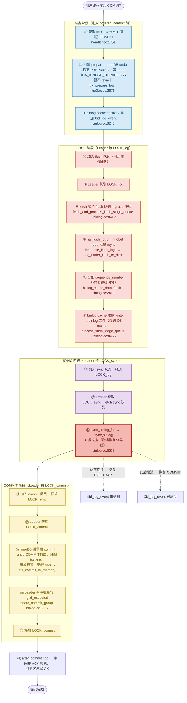

# MySQL Binlog 机制深度解析

> 基于 MySQL 8.0.39 源码，涵盖 binlog 物理结构与写入路径（magic/FD/IO_CACHE/binlog cache/rotate/purge）、Ordered Commit 三阶段流水线与源码级剖析、BGC Ticket 系统、内部 2PC、**崩溃后 binlog 如何裁决 prepared 事务**、binlog_order_commits 参数、commit 阶段与 trx->no、Anonymous_Gtid、**GTID 与 binlog 的持久化交互**、事件字节级布局、Row Image 记录过程、**读侧 dump 线程**、**半同步与 binlog 的衔接**。
>
> **边界**：本篇讲 binlog 侧机制（物理结构、BGC 流水线、2PC 协调与裁决、事件字节布局、GTID 持久化、读侧 dump、半同步）。**外部 XA**（由外部 TM 裁决的分布式事务、`XA_prepare_log_event`、`Xa_state_list` 六态）已独立成篇，见 [`../xa.md`](../xa.md)；2PC 的引擎侧执行（trx prepare 逐行剖析、undo 状态）与事务生命周期见 [`../../innodb/trx.md`](../../innodb/trx.md)；崩溃恢复的引擎侧（redo 前滚、扫描解析状态机）见 [`../../innodb/recovery.md`](../../innodb/recovery.md)。

## 目录

- [binlog 物理结构与写入路径](#binlog-物理结构与写入路径)
  - [文件布局：magic + FD + 顺序事件流](#文件布局magic--fd--顺序事件流)
  - [IO_CACHE：唯一的落盘通道](#io_cache唯一的落盘通道)
  - [binlog cache：两个 cache 与临时文件溢出](#binlog-cache两个-cache-与临时文件溢出)
  - [事件序列化：三段式 + 流式 CRC32](#事件序列化三段式--流式-crc32)
  - [文件管理：rotate / purge / 出错策略](#文件管理rotate--purge--出错策略)
- [Ordered Commit 三阶段流水线](#ordered-commit-三阶段流水线)
  - [提交流程全景图](#提交流程全景图)
  - [ordered_commit 源码级剖析](#ordered_commit-源码级剖析)
- [BGC Ticket 系统](#bgc-ticket-系统)
- [内部 2PC（两阶段提交）](#内部-2pc两阶段提交)
- [binlog 与崩溃恢复：2PC 裁决](#binlog-与崩溃恢复2pc-裁决)
- [原子 DDL 与 binlog 的交互](#原子-ddl-与-binlog-的交互)
- [binlog_order_commits 参数](#binlog_order_commits-参数)
- [Commit 阶段与 trx_no](#commit-阶段与-trx_no)
- [Anonymous_Gtid](#anonymous_gtid)
- [GTID 与 binlog 的持久化交互](#gtid-与-binlog-的持久化交互)
- [Event 格式速览](#event-格式速览)
- [binlog 文件加密（binlog_encryption）](#binlog-文件加密binlog_encryption)
- [Row Image 记录过程](#row-image-记录过程)
- [binlog 事务压缩（binlog_transaction_compression）](#binlog-事务压缩binlog_transaction_compression)
- [binlog 读侧：dump 线程（Binlog_sender）](#binlog-读侧dump-线程binlog_sender)
- [半同步复制与 binlog 的衔接](#半同步复制与-binlog-的衔接)
- [业界 binlog 优化方案（大事务 / 提交锁 / 传输）](#业界-binlog-优化方案大事务--提交锁--传输)
- [参考](#参考)

---

## binlog 物理结构与写入路径

### 文件布局：magic + FD + 顺序事件流

```c
#define BINLOG_MAGIC "\xfe\x62\x69\x6e"   // \xfe 'b' 'i' 'n'
#define BIN_LOG_HEADER_SIZE 4U
#define LOG_EVENT_HEADER_LEN 19U          // 每个事件的固定头长度
#define BINLOG_CHECKSUM_LEN CHECKSUM_CRC32_SIGNATURE_LEN   // 4
#define LOG_EVENT_BINLOG_IN_USE_F 0x1
```

magic 只在**新建空文件**时写一次（`open_binlog()`），紧接着写 FD：

```c
  if (m_binlog_file->is_empty()) {
    m_binlog_file->write(pointer_cast<const uchar *>(BINLOG_MAGIC), BIN_LOG_HEADER_SIZE);
    write_file_name_to_index_file = true;
  }
  if (!is_relay_log) s.common_header->flags |= LOG_EVENT_BINLOG_IN_USE_F;
  if (write_event_to_binlog(&s)) goto err;        // FD (FORMAT_DESCRIPTION_EVENT)
  ... Previous_gtids_log_event                    // 仅 GTID 模式 / relay log
  if (m_binlog_file->flush_and_sync()) goto err;
```

- magic 是"这个文件是 binlog"的唯一自证标识；读端 `read_binlog_magic()` 用 `memcmp` 判定，失败即 `BAD_BINLOG_MAGIC`（加密文件以 `ENCRYPTION_MAGIC` 占位）
- **FD 必须是文件里第一个事件**——它携带 `binlog_version`、server version、以及各事件类型的 post-header length 数组，读者必须先解析 FD 才能解析后续任何事件
- FD 头打 `LOG_EVENT_BINLOG_IN_USE_F`，正常关闭时清 0；重启后该位仍为 1 即判定为 **crash binlog**，进入恢复流程（截断不完整事件 + 清标志）

```
┌──────────────────── binlog.000007 ────────────────────┐
│ 0   │ fe 62 69 6e                magic（4B）           │
│ 4   │ FORMAT_DESCRIPTION_EVENT   flags |= IN_USE_F    │
│     │ PREVIOUS_GTIDS_LOG_EVENT   （GTID 开启时）        │
│     ├─────────────────────────────────────────────────┤
│     │ GTID / ANONYMOUS_GTID                           │
│     │ QUERY("BEGIN")                                  │
│     │ TABLE_MAP → WRITE_ROWS → ... → XID   ← 一个事务  │
│ ... │ ROTATE("binlog.000008")     ← 轮转时追加在旧文件尾│
└───────────────────────────────────────────────────────┘
  每个 event = [19B 通用头][私有 post-header + body][4B CRC32?]
  通用头：timestamp(4) type(1) server_id(4) event_size(4) end_log_pos(4) flags(2)
```

★ **事件之间没有"下一个偏移"指针**：靠物理紧邻（写完 N 字节就停在那）+ 头里的 `end_log_pos`（本事件结束后的文件绝对偏移）。所以 binlog **只能顺序读**；`end_log_pos` 的价值是自校验与提供复制位点，不是跳转。这也是"出现半个事件必须截断到最后一个合法边界"的原因。

`.index` 索引文件内容极简（每行一个 binlog 路径），但写入是 **crash-safe 三步**：

```c
int MYSQL_BIN_LOG::add_log_to_index(...) {
  if (open_crash_safe_index_file()) goto err;
  if (copy_file(&index_file, &crash_safe_index_file, 0)) goto err;   // ① 整份拷贝
  my_b_write(&crash_safe_index_file, log_name, log_name_len);
  my_b_write(&crash_safe_index_file, pointer_cast<const uchar *>("\n"), 1);
  flush_io_cache(&crash_safe_index_file);                            // ② append + flush
  mysql_file_sync(crash_safe_index_file.file, MYF(MY_WME));          //    + fsync
  if (close_crash_safe_index_file()) goto err;
  if (move_crash_safe_index_file_to_index_file(need_lock_index)) goto err;   // ③ rename
}
```

任意时刻崩溃，index 要么是旧版、要么是完整新版，不会出现半行。文件编号由 `generate_new_name()` 扫目录取最大 N + 1。

### IO_CACHE：唯一的落盘通道

```c
struct IO_CACHE {
  my_off_t pos_in_file{0};      // buffer 首字节对应的文件偏移
  my_off_t end_of_file{0};      // 写缓存：容量上限（binlog cache 复用为阈值）
  uchar *write_buffer{nullptr}; // 写 buffer
  uchar *write_pos{nullptr};    // 当前写点
  uchar *write_end{nullptr};    // 写区上界
  int (*write_function)(IO_CACHE *, const uchar *, size_t){nullptr};
  ulong disk_writes{0};         // 真正落盘次数 → binlog_cache_disk_use
  bool disk_sync{false};        // flush 时是否顺带 fsync
};

inline int my_b_write(IO_CACHE *info, const uchar *buffer, size_t count) {
  if (info->write_pos + count <= info->write_end) {   // 快路径：纯 memcpy
    memcpy(info->write_pos, buffer, count);
    info->write_pos += count;
    return 0;
  }
  return (*info->write_function)(info, buffer, count); // 慢路径：_my_b_write
}
```

★ 8.0.39 **已无 `write_io_cache` 符号**（老版本名），现在是 `my_b_write` / `my_b_safe_write` / `flush_io_cache` 三件套。

- `my_b_flush_io_cache()` 只做 `write(2)`（经 `mysql_encryption_file_write`），**不等于 fsync**；fsync 只在 `disk_sync` 为真时顺带做，binlog 主文件不走这条路而是显式 `sync()`
- `_my_b_write()` 的 `pos_in_file + buffer_length > end_of_file` 是**容量超限的唯一判定点**，返回 `EFBIG`

```
 事务线程                     FLUSH 阶段(leader)         SYNC 阶段(leader)
 ─────────                     ────────────────           ────────────────
 Log_event::write()
   └─ IO_CACHE_ostream::write
        └─ my_b_safe_write ──► IO_CACHE.write_buffer（用户态内存）
                                    │ write_pos 越过 write_end
                                    ▼
                          my_b_flush_io_cache()
                          mysql_encryption_file_write()   ← write(2)
                                    ▼
                              OS page cache
                                    │ sync_binlog_file(): mysql_file_sync()
                                    ▼
                                 磁盘 (fsync)
```

**`sync_binlog` 语义**（由 leader 在 SYNC 阶段执行，`sync_counter` 按**组**计数，不是按事务/事件）：

| 值 | fsync 次数 | 说明 |
|---|---|---|
| 0 | 从不 fsync | 只 `flush()` 到 OS page cache，靠 OS 刷盘 |
| 1 | 每个 group commit 一次 | 最安全；`update_binlog_end_pos_after_sync = true`，fsync 后才对外公布 end_pos |
| N | 每 N 个 group 一次（`++sync_counter >= N` 后清零） | 崩溃最多丢最近 N-1 个 group |

relay log 是**另一套计数器**：`after_write_to_relay_log()` 每个事件都 `flush_and_sync`，周期取 `sync_relay_log`。

### binlog cache：两个 cache 与临时文件溢出

```c
class binlog_cache_mngr {
  binlog_stmt_cache_data stmt_cache;   // 非事务表
  binlog_trx_cache_data  trx_cache;    // 事务表
  binlog_cache_data *get_binlog_cache_data(bool is_transactional) {
    if (is_transactional) return &trx_cache; else return &stmt_cache;
  }
  int flush(THD *thd, ...) {           // 顺序固定：先 stmt 后 trx
    stmt_cache.flush(...); trx_cache.flush(...);
  }
};
```

**为什么必须两个**：非事务表的修改无法回滚，其 binlog 也不能丢；事务表的 binlog 必须能被 `ROLLBACK` 整段丢弃（trx_cache 有 `truncate()` / `cache_state_map` / `before_stmt_pos` 支持语句级与 savepoint 级回退，stmt_cache 没有）。混在一个 cache 里就无法实现"回滚事务表部分、保留非事务表部分"。

```
        binlog_cache_data::write_event(ev) → binary_event_serialize → my_b_safe_write
                  │
        ┌───────────────────────┐   write_pos + len <= write_end ?
        │ 内存 buffer            │──是──► memcpy 返回（0 次磁盘 IO）
        │ binlog_cache_size      │
        └───────────────────────┘
                  │ 否 → _my_b_write()
                  ▼
   pos_in_file + buffer_length > end_of_file(=max_binlog_cache_size) ?
        │是                              │否
        ▼                                ▼
   errno=EFBIG → ER_TRANS_CACHE_FULL   my_b_flush_io_cache()
   （或 ER_STMT_CACHE_FULL）            if (file==-1) real_open_cached_file()
                                          → 惰性创建 tmp file（tmpdir/MLxxxx）
                                        ++disk_writes → binlog_cache_disk_use++
```

`binlog_cache_size` 只是**初始内存 buffer 大小**，`max_binlog_cache_size` 才是溢出阈值。溢出到临时文件不算错误，只是性能下降；**超限**（超过 max）才报 `ER_TRANS_CACHE_FULL`。

`finalize()` 负责"event → IO_CACHE"（补 pending rows event、写 XID/COMMIT），`flush()` 负责"IO_CACHE → binlog 文件"。`do_write_cache()` 不重新解析事件，而是 `stream_copy()` 把 cache 字节流按页喂给 `Binlog_event_writer`，因此**一个事件跨多个 cache 页也能正确重组**。

#### savepoint 级 / 语句级回退

上面说 trx_cache 支持回退，但"回退"不是重放日志，而是**「字节截断 + 元数据快照恢复」**两个动作的组合。这是 binlog cache 最容易被误解的一层。

**`cache_state_map` 的准确语义**：它是 `std::map<my_off_t, cache_state>`——key 是边界处的字节位置，value 是**元数据快照结构体**（不是"截断后长度"）：

```cpp
struct cache_state {
  bool with_sbr, with_rbr, with_start, with_end, with_content;
  size_t event_counter;
};
std::map<my_off_t, cache_state> cache_state_map;
```

为什么需要它：`truncate(pos)` 只能把底层 `IO_CACHE` 的写指针回拨到 `pos`（字节级截断），但 `flags.with_rbr/with_sbr/with_start/with_end` 和 `event_counter` 是"事务进行到当前位置"的**累积状态**，字节回退了这些标志不会自动回退。所以每次在边界打快照（`cache_state_checkpoint`），回退时按 `pos` 查 map 恢复（`cache_state_rollback`）。

**两个回退粒度**（`binlog_trx_cache_data` 的成员）：

- `m_cannot_rollback`（事务级）：一旦有"不能安全回退"的语句进入 trx_cache，置 true 后整个事务不可回退；
- `before_stmt_pos`（语句级）：当前语句开始前的 cache 字节位置，用于单语句失败回退。

**打快照与恢复**：

```cpp
void set_prev_position(my_off_t pos) {
  before_stmt_pos = pos;
  cache_state_checkpoint(before_stmt_pos);      // 打快照
}
void restore_savepoint(my_off_t pos) {
  binlog_cache_data::truncate(pos);             // ① 字节截断
  if (pos <= before_stmt_pos) before_stmt_pos = MY_OFF_T_UNDEF;
  cache_state_rollback(pos);                    // ② 元标志恢复
}
```

**savepoint 回退的核心分岔**（`binlog_savepoint_rollback`）：

```cpp
if (trans_cannot_safely_rollback(thd)) {
  // 事务里改过非事务表（MyISAM），引擎侧已提交、无法回滚 → 不能截断 cache
  // 只能把 "ROLLBACK TO SAVEPOINT `name`" 当一条语句写进 binlog，让从库重放对齐
  ...写 Query_log_event("ROLLBACK TO SAVEPOINT ...")
} else {
  // 只有事务表 → 直接截断 cache + 恢复快照（引擎侧和 binlog 侧一起原子回退）
  cache_mngr->trx_cache.restore_savepoint(pos);
}
```

这就是"事务表可回退、非事务表不可回退"的**代码落点**：非事务表（MyISAM）在引擎侧已经提交了、物理上无法回滚，binlog 不能截断，只能把 `ROLLBACK TO SAVEPOINT` 作为语句重放；只有纯事务表时才能直接 truncate。`truncate(THD*, bool all)` 的 `all` 参数区分两种：`all=true` 滚回 0（整事务回退），`all=false` 滚回 `before_stmt_pos`（单语句回退）。

**语句级回退**走同一条链：单条语句执行失败 → `binlog_stmt_rollback` → 用 `before_stmt_pos` 截断到语句开始前。而 `stmt_cache`（非事务缓存）没有这套回退机制——它只按语句清空，不做字节级 truncate，因为非事务表的 binlog 一经产生就不能丢。

### 事件序列化：三段式 + 流式 CRC32

```c
// 每个 event::write() 都是这三段
return (write_header(ostream, sizeof(xid)) ||
        wrapper_my_b_safe_write(ostream, (uchar *)&xid, sizeof(xid)) ||
        write_footer(ostream));
```

- `write_header`：写 19B 头；若需要 checksum 则初始化 crc 并把 `BINLOG_CHECKSUM_LEN` 计入 `event_size`
- `wrapper_my_b_safe_write`（body）：`crc = checksum_crc32(crc, buf, size)` **增量累加**
- `write_footer`：尾部追加 4B crc32

★ 关键细节：**FD 事件算 crc 前先临时清除 `LOG_EVENT_BINLOG_IN_USE_F`**，因为正常关闭会清该位，否则校验永远对不上。

**进 cache 时 `end_log_pos=0`**（此时不知道最终文件偏移），真正的 `end_log_pos` 与 checksum 由 `Binlog_event_writer::update_header()` 在 flush 时回填——所以它必须逐字节重组事件头，跨页处理复杂。

### 文件管理：rotate / purge / 出错策略

```c
int MYSQL_BIN_LOG::new_file_impl(...) {
  mysql_mutex_lock(&LOCK_xids);
  while (get_prep_xids() > 0)                       // ① 等 in-flight 原子 DDL/XA 提交完
    mysql_cond_wait(&m_prep_xids_cond, &LOCK_xids);
  ...
  if ((error = ha_flush_logs(true))) goto end;       // ② 先让引擎 redo 落盘
  if ((error = generate_new_name(new_name, name))) goto end;
  if (m_binlog_file->is_open()) {
    Rotate_log_event r(new_name + dirname_length(new_name), ...);
    if ((error = write_event_to_binlog(&r))) goto end;   // ③ ROTATE 写在旧文件末尾
    if ((error = m_binlog_file->flush())) goto end;
  }
  close(LOG_CLOSE_TO_BE_OPENED | LOG_CLOSE_INDEX, false, false);
  error = open_binlog(old_name, new_name_ptr, ...);      // ④ 开新文件（magic+FD+Prev_gtids）
}
```

轮转 = "写 ROTATE 到旧文件尾 → flush → 关旧 → 开新 → 追加 index 行"。两处屏障的意义：**等 `prep_xids==0`** 防止原子 DDL 的 binlog 与引擎状态在文件边界撕裂；**`ha_flush_logs`** 保证轮转时引擎侧已持久化。

**purge 的优先级**：`binlog_expire_logs_seconds` **优先于** `expire_logs_days`——只要前者 > 0 后者被完全忽略（8.0 里设 seconds 时 days 会被置 0）。`purge_logs()` 按文件名边界删，`purge_logs_before_date()` 按 mtime 删；都跳过当前活跃文件与被 dump 线程占用的文件。

#### purge 的触发点（一个常见误解）

**8.0.39 没有独立的 purge 后台线程**（`Purge_controller` / `Binlog_background_thread` 这类符号在官方 8.0 源码里 grep 不到，是早期开发分支或某些 fork 的实现）。自动 purge 只在**两个时机**触发（`sys_vars.cc` 里 `binlog_expire_logs_seconds` 的注释明确写 "Purges happen at startup and at binary log rotation."）：

- **启动时**：`auto_purge_at_server_startup()`；
- **rotate 时**：`FLUSH LOGS` / 正常轮转里调用 `auto_purge()`。

两次都会先过两道闸门：

```cpp
check_auto_purge_conditions()   // ① opt_binlog_expire_logs_auto_purge 开关 && retention 已配置
calculate_auto_purge_lower_time_bound()  // ② 算过期时间下界（seconds 优先于 days）
```

这意味着 `binlog_expire_logs_seconds` 不是"到点就删"，而是**下次 rotate（或重启）时**才真正执行清理——binlog 文件多、rotate 不频繁时，过期文件会滞留到下一次轮转。

#### 手动 purge 的入口

`PURGE BINARY LOGS TO 'x'` / `BEFORE 'datetime'` 走 `purge_source_logs_to_file` / `purge_source_logs_before_date`，两者都先拿 **Shared Backup Lock**（与在线备份 `LOCK INSTANCE FOR BACKUP` 互斥，防止备份途中 binlog 被删），再调用核心 `purge_logs`。注意本版本 purge **没有** `Purge_statement` 命令类（未做 `Sql_cmd_*` 对象化），直接走 `sql_parse.cc` 的分支执行。

#### purge_logs 的核心逻辑（crash-safe 两阶段）

```cpp
int MYSQL_BIN_LOG::purge_logs(to_log, included, need_lock_index, ...) {
  if (need_lock_index) lock_index();                    // LOCK_index
  find_log_pos(&log_info, to_log);                       // 定位目标文件 → entry_index
  no_of_log_files_to_purge = log_info.entry_index;       // 该文件之前的所有文件
  open_purge_index_file(true);                           // ① 先写 .~rec~ 登记文件
  // 从最旧开始遍历 index，逐个删
  while (no_of_log_files_to_purge > 0) {
    // ② 活跃文件(正在写) → break；被 dump 线程占用(log_in_use) → break
    //    其余 → 从 index 移除 + 删物理文件
  }
  // ③ 全部完成后 close + 清 .~rec~ 登记文件
}
```

**crash-safe 的关键**：purge 是两阶段事务式的——先在 `purge_index_file`（`.~rec~` 登记文件）记录"待删清单"，再更新 index 文件、最后删物理文件。中途崩溃后，下次启动能从 `.~rec~` 恢复，避免"index 已删但物理文件还在"或相反的不一致。

**与 dump 线程的并发**：删除前检查 `log_in_use()`——若某个文件正被 dump 线程（`Binlog_sender`）读取，就 `break`，只删到它之前。手动 purge 时对活跃文件报 `ER_WARN_PURGE_LOG_IS_ACTIVE`、对被占用文件报 `ER_WARN_PURGE_LOG_IN_USE`（警告而非报错，说明"只 purge 到该文件之前"）。这是"清理不打断复制"的保证。

**GTID 约束**：purge 后 `mysql.gtid_executed` 会重写，`Previous_gtids` 由 `Gtid_set::purge` 重算，见 [`gtid.md`](gtid.md)。

**写失败的两种策略**（`binlog_error_action`）：

| 值 | 行为 |
|---|---|
| `ABORT_SERVER`（默认） | `exec_binlog_error_action_abort()` → `ER_BINLOG_LOGGING_IMPOSSIBLE` + `my_abort()`，宁可停服也不让 binlog 与引擎分叉 |
| `IGNORE_ERROR` | `close(LOG_CLOSE_STOP_EVENT)` 关闭 binlog 并写 Stop 事件，让引擎继续提交（复制中断需人工介入） |

## Ordered Commit 三阶段流水线

### 提交流程全景图

下图是事务从发起 COMMIT 到完成的完整流程（对应 `ha_commit_trans` → `ordered_commit`），按准备/FLUSH/SYNC/COMMIT 四段着色，并标注崩溃恢复分界：



> 关于右下"写盘层次"：⑨ 的 `write` 只把 binlog cache 写入 **OS page cache**（sync_binlog=1 时此处仍可能因崩溃丢失）；⑫ 的 `fsync` 才把数据刷到 **binlog 物理文件**，这才是持久化与崩溃恢复的分界。InnoDB 侧同理——⑦ 的 redo fsync 保证 prepare 记录落盘，但引擎自身的 commit（undo COMMITTED / trx->no）在 ⑮ 才发生，且不再强制 fsync（`trx->flush_log_later`）。

事务提交进入 `MYSQL_BIN_LOG::ordered_commit`（binlog.cc:8853）后，经历三个阶段的流水线。Leader 线程代表整个 group 穿越所有 stage，Follower 线程从进入 flush stage 起沉睡，直到 `signal_done` 才被唤醒。

### Flush Stage（持 LOCK_log）

Leader 串行处理 group 内每个事务的 binlog cache，将其写入 binlog 文件。这一阶段是提交的真正瓶颈所在——`process_flush_stage_queue`（binlog.cc:8456）串行 flush 每个事务的 binlog cache。

关键操作包括：调用 `ha_flush_logs(true)` 将整组事务的 InnoDB redo prepare 记录批量 fsync（redo 持久化），然后将 binlog cache（含 `Xid_log_event`）写入 binlog 文件。

崩溃注入点 `crash_commit_before_log`（binlog.cc:8867）位于写 binlog 之前。

### Sync Stage（持 LOCK_sync）

对 binlog 文件执行 `fsync`。`sync_binlog_file`（binlog.cc:8659）只是普通的 fsync 调用，没有 group 概念——group 的合并在 stage queue 层面完成，sync 阶段只是把整组事务的落盘合并成一次 fsync。

**这里是提交点（Point of No Return）**。崩溃注入点 `crash_commit_after_log`（binlog.cc:8964）位于 fsync 成功之后。在此之后崩溃，事务视为已提交。

### Commit Stage（持 LOCK_commit）

Leader 按 binlog 顺序逐个调用引擎层 commit（`finish_transaction_in_engines`），释放行锁、更新 MVCC 可见性。详见后文 [Commit 阶段与 trx_no](#commit-阶段与-trx_no)。

### 分组控制参数

| 参数 | 作用 |
|------|------|
| `binlog_group_commit_sync_delay` | 事务延迟提交的微秒数（最大 1 秒），增加组内事务数量，减少 sync 次数 |
| `binlog_group_commit_sync_no_delay_count` | 组内事务数达到此值时立即提交，无需等待 delay |

### Group 的形成

Group 的形成完全由 `LOCK_log` 和 stage queue 控制，与 ticket 无关。Leader 持有 `LOCK_log` 期间，新到达的事务进入 flush stage 队列成为 Follower。Leader 释放 `LOCK_log` 后，下一个事务成为新 group 的 Leader。

---

### ordered_commit 源码级剖析

> 上面是流水线概览，本节给代码级实现：谁当 leader、队列怎么组织、三把 mutex 怎么交接、follower 什么时候醒。

**leader / follower 的判定**——`change_stage` → `enroll_for`，判据是"**入队前队列是否为空**"，没有任何选举协议：

```cpp
bool Commit_stage_manager::enroll_for(StageID stage, THD *thd,
                                      mysql_mutex_t *stage_mutex,
                                      mysql_mutex_t *enter_mutex) {
  bool leader = this->append_to(stage, thd);        // 队列空 ⇒ 我是 leader
  ...
  if (stage_mutex) mysql_mutex_unlock(stage_mutex);  // ★ 先释放上一阶段的 stage mutex

  if (!leader) {                                    // ===== follower：睡 =====
    mysql_mutex_lock(&m_lock_done);
    while (thd->tx_commit_pending)                  // ★ while：共享 cond，防虚假唤醒
      mysql_cond_wait(&m_stage_cond_binlog, &m_lock_done);
    mysql_mutex_unlock(&m_lock_done);
    return false;
  }
  if (leader && enter_mutex != nullptr) mysql_mutex_lock(enter_mutex);  // ===== leader：加锁干活 =====
  return leader;
}
```

★ **"先解锁旧的、再加锁新的"** 是流水线能重叠的关键：本组在 sync 时，下一组已经可以拿 `LOCK_log` 开始 flush。

**队列**：`Commit_stage_manager` 单例持有 5 个 `Mutex_queue`（FLUSH / SYNC / COMMIT / AFTER_COMMIT / COMMIT_ORDER_FLUSH），每个队列是**用 `THD::next_to_commit` 串起来的侵入式单链表**，`m_last` 是指针的指针：

```
        m_queue[SYNC_STAGE]
        ┌──────────────────────────────────────────────┐
        │ m_first ─► THD1 ──next_to_commit──► THD2 ──► THD3 ──► nullptr │
        │ m_last ──────────────────────────────────────────▲ (&THD3->next)│
        └────────────────────────────────────────────────────────────────┘
  append():  *m_last = first; 走到链尾; m_last = &tail->next_to_commit;
             返回「入队前是否为空」⇒ leader 判据
  fetch_and_empty(): result = m_first; 清空（链表本身不拆，仍串着整组）
```

注意 **队列锁 `m_queue_lock[]` 与 stage mutex（`LOCK_log`/`LOCK_sync`/`LOCK_commit`）是两把不同的锁**：入队（短操作）与阶段工作（长，含 I/O）因此不互斥。

**三阶段主干**（leader 视角，错误处理已略）：

```cpp
int MYSQL_BIN_LOG::ordered_commit(THD *thd, bool all, bool skip_commit) {
  init_thd_variables(thd, all, skip_commit);     // tx_commit_pending = true（follower 的谓词）

  /* Stage #1 FLUSH：进入时拿 LOCK_log */
  if (change_stage(thd, BINLOG_FLUSH_STAGE, thd, nullptr, &LOCK_log))
    return finish_commit(thd);                   // 我是 follower → 直接收尾
  flush_error = process_flush_stage_queue(&total_bytes, &wait_queue);
  if (flush_error == 0 && total_bytes > 0) flush_error = flush_cache_to_file(&flush_end_pos);

  /* Stage #2 SYNC：交出 LOCK_log，拿 LOCK_sync；整批 wait_queue 入 sync 队列 */
  if (change_stage(thd, SYNC_STAGE, wait_queue, &LOCK_log, &LOCK_sync))
    return finish_commit(thd);
  if (!flush_error && (sync_counter + 1 >= get_sync_period()))
    Commit_stage_manager::get_instance().wait_count_or_timeout(
        opt_binlog_group_commit_sync_no_delay_count,
        opt_binlog_group_commit_sync_delay, SYNC_STAGE);      // ★ throttle
  final_queue = Commit_stage_manager::get_instance().fetch_queue_acquire_lock(SYNC_STAGE);
  std::pair<bool, bool> result = sync_binlog_file(false);     // ★ fsync

  /* Stage #3 COMMIT（+ AFTER_COMMIT） */
  if (change_stage(thd, COMMIT_STAGE, final_queue, &LOCK_sync, &LOCK_commit))
    return finish_commit(thd);
  process_commit_stage_queue(thd, commit_queue);              // ★ 引擎提交在这里
  if (change_stage(thd, AFTER_COMMIT_STAGE, commit_queue, &LOCK_commit, &LOCK_after_commit))
    return finish_commit(thd);
  process_after_commit_stage_queue(thd, after_commit_queue);

  Commit_stage_manager::get_instance().signal_done(final_queue);  // ★ 唤醒全部 follower
  (void)finish_commit(thd);
  ... rotate ...
}
```

**FLUSH 阶段做三件事**（leader 一个人替整组干完）：

```cpp
  THD *first_seen = fetch_and_process_flush_stage_queue();   // ① ha_flush_logs：整组 prepared redo 落盘
  assign_automatic_gtids_to_flush_group(first_seen);         // ② 按入队顺序分配 GTID
  for (THD *head = first_seen; head; head = head->next_to_commit)
    flush_thread_caches(head);                               // ③ 逐个把 binlog cache 拷进共享 IO_CACHE
  m_binlog_file->flush();                                    //    最后一次 write(2)
```

**SYNC 阶段的 throttle**（`binlog_group_commit_sync_delay` / `sync_no_delay_count`）：

```cpp
void Commit_stage_manager::wait_count_or_timeout(ulong count, long usec, StageID stage) {
  long delta = std::max<long>(1, (to_wait * 0.1));           // 按 10% 切片
  while (to_wait > 0 && (count == 0 || m_queue[stage].get_size() < count)) {
    my_sleep(delta);                                         // ★ 分段 sleep 轮询队列长度，不是 cond_timedwait
    to_wait -= delta;
  }
}
```

- 位置：sync stage、**持 `LOCK_sync`**、且在 `fetch_queue_acquire_lock` **之前**——晚到的会话能继续入队，达到 `no_delay_count` 就提前结束等待
- ★ leader **持锁睡眠**，会阻塞其它组进入 sync
- `sync_binlog=0` 时 `get_sync_period()==0`，条件恒真 ⇒ **每组都延迟**

**COMMIT 阶段**：`process_commit_stage_queue` 遍历链表做两件大事——`m_dependency_tracker.update_max_committed(head)`（并行复制依赖跟踪，见 prpl.md）与 `finish_transaction_in_engines()`（InnoDB 真正提交），然后 `gtid_state->update_commit_group(first)` **按链表顺序**把 GTID 入 `gtid_executed`（乱序会产生临时空洞，导致 Gtid_set 反复增删 interval）。AFTER_COMMIT 独立成第四阶段，因为 `after_commit` hook 可能很慢（如 Group Replication），不让它占 `LOCK_commit`。

**follower 何时醒**：只有最后一次 `signal_done(final_queue)`（commit/after-commit 全部完成、锁都释放之后）才把 `tx_commit_pending` 置 false 并 broadcast。中间阶段切换 follower 一直是睡着的 ⇒ **三阶段流水线对 follower 完全透明**。

**与 2PC 的衔接**（提交点在 flush 之后、引擎 commit 之前）：

```
ha_flush_logs（prepared redo 落盘）
  → binlog write + flush（flush_cache_to_file）
  → after_flush hook
  → sync_binlog_file（sync_binlog=1 时 fsync）      ← ★ 提交点：此后崩溃也要重做
  → call_after_sync_hook（半同步在此回 ACK）
  → process_commit_stage_queue → ha_commit_low    ← 引擎提交
```

`ordered_commit` 返回后**不再有** `ha_commit_low`：引擎提交只发生在 (a) leader 的 `process_commit_stage_queue`，或 (b) `binlog_order_commits=0` / follower 路径下的 `finish_commit`。

| 决策 | 收益 | 代价 / 约束 |
|---|---|---|
| leader 判定 = "入队前队列为空" | 无选举协议、无额外原子操作 | 谁是 leader 不确定；leader 慢会拖整组 |
| 队列锁与 stage mutex 分离 | 入队（短）与阶段工作（长，含 I/O）不互斥 | 须严格遵守"先解锁旧再加锁新"以免死锁 |
| 先解锁旧锁再加新锁 | 相邻阶段可重叠（组 A sync 时组 B flush） | 存在极短无 stage 锁窗口 |
| follower 睡到组末 | follower 零 I/O；顺序由 leader 保证 | 尾延迟 = 整组最慢成员 |
| GTID 由 leader 批量 `update_commit_group` | `gtid_executed` 保持单区间 | 必须在有序提交语义下 |
| throttle 持 `LOCK_sync` 用 `my_sleep` 轮询 | 简单，能随时响应 `no_delay_count` | 阻塞其它组进入 sync |
| `sync_counter` 按"组"计数 | 语义清晰、实现极简 | `sync_binlog=N` 的粒度是 group 而非事务数 |
| AFTER_COMMIT 独立成第四阶段 | 慢 hook（GR）不占 `LOCK_commit` | 多一次入队/交接 |
| `after_sync` 早于引擎 commit | 半同步可在主库可见前回 ACK | sync 失败连带影响提交路径 |

## BGC Ticket 系统

### Ticket 的基本机制

`Bgc_ticket_manager`（bgc_ticket_manager.h）维护两个单调递增的 ticket 值：`front_ticket`（当前正在放行的号）和 `back_ticket`（下次分配的号）。

三个核心操作用 ticket 原子变量的最高位（MSB）当锁位做 CAS 来串行化：

- `assign_session_to_ticket`：给事务分配当前 back_ticket（幂等由 THD 侧 `Binlog_group_commit_ctx::assign_ticket()` 保证——`m_session_ticket.is_set()` 则跳过，manager 侧函数本身不幂等）
- `push_new_ticket`：递增 back_ticket，开启新的一轮
- `pop_front_ticket`：推进 front_ticket 到下一个号

线程进入 flush stage 队列前，先调 `wait_for_ticket_turn`（rpl_commit_stage_manager.cc:214），**只有当自己的 ticket == front_ticket 时才被放行进队列**。

### 一个 group 内 ticket 一定相同

因为 `append_to` 先 `wait_for_ticket_turn`（只放行 ticket==front）再进队列，而 group 本质是 leader 用 `fetch_queue` 对队列做的一次快照。能同时待在队列里的成员都满足 ticket==front，所以 group 内所有成员的 ticket 必然等于同一个 front 值。

反过来不成立：ticket 相同不代表是同一个 group。在普通 BGC 中所有事务 ticket 都是 1，但系统仍按 `LOCK_log` + stage queue 切出多个不同的 group。

### 普通BGC中 ticket 不激活

`push_new_ticket` 只在 GR（Group Replication）视图变更和 debug 测试注入中调用。普通 BGC 中 `back_ticket = front_ticket = 1` 永不变化，`wait_for_ticket_turn` 直接短路通过（零开销存在）。Group 形成完全由 `LOCK_log` + stage queue 控制。

### Ticket 的底层实现：63 位值 + 1 位 MSB 锁

`BgcTicket` 把"值"和"临界区状态"编码进同一个 64 位原子：低 63 位是 ticket 值（`max_ticket_value = 2^63-1`，超界回绕到 1），最高位是 in-use 锁位。`AtomicBgcTicket::set_in_use` 用 CAS 自旋拿锁：

```cpp
std::pair<BgcTicket, BgcTicket> AtomicBgcTicket::set_in_use(
    bool inc_next_before_lock, bool inc_next_before_release) {
  BgcTicket prev_ticket, next_ticket;
  while (true) {
    auto current_value =
        m_ticket->load(std::memory_order_acquire) & BgcTicket::clear_bit;
    prev_ticket = next_ticket = BgcTicket(current_value);
    BgcTicket in_use_ticket = prev_ticket;
    if (inc_next_before_lock) {
      in_use_ticket.set_next();
      next_ticket.set_next();
    } else if (inc_next_before_release) {
      next_ticket.set_next();
    }
    in_use_ticket.set_in_use();
    if (m_ticket->compare_exchange_strong(current_value, in_use_ticket.get(),
                                          std::memory_order_release)) {
      return std::make_pair(prev_ticket, next_ticket);
    }
    std::this_thread::yield();
  }
}
```

`AtomicBgcTicketGuard`（RAII）构造时 `set_in_use`（拿锁 = MSB 置 1），析构时 `set_used`（写入新值，`assert` 校验 MSB 必为 0 即释放）。**与 server 层 `Integrals_lockfree_queue`（`sql/containers/`）head/tail 的 MSB 占用位是同构手法**——一个原子变量同时承载"值"与"临界区状态"。

### 会话计数队列与"计数对齐"放行协议

`m_sessions_per_ticket` 是 `Integrals_lockfree_queue<uint64_t>`（无锁队列，见 infra/structure 篇）实例，记录每个"已关闭分配"的 ticket 的会话总数。**容量硬编码 1024（`max_concurrent_tickets`），无 sysvar 控制**。叫号的唯一放行条件在 `pop_front_ticket`：

```cpp
BgcTicket::ValueType front_ticket_sessions =
    this->m_sessions_per_ticket.front();
if (prev_front != this->m_back_ticket.load() &&
    this->m_front_ticket_processed_sessions_count == front_ticket_sessions) {
  this->m_front_ticket_processed_sessions_count = 0;
  this->m_sessions_per_ticket.pop();
  front_ticket_guard.set_next(prev_front.next());  /* 放行下一个号 */
}
```

即：**当前 ticket 的"已处理会话数" == 入队时记录的"该 ticket 会话总数"才推进 front**——计数对齐即放行，叫号无需遍历等待者。会话数来自 `assign_session_to_ticket` 的 `++m_back_ticket_sessions_count`，`push_new_ticket` 关闭旧号时把总数入队。

### 等待与放行：1 秒 timedwait

等待侧 `Commit_stage_manager::wait_for_ticket_turn`：`ticket != front_ticket && ticket > coalesced_ticket && !thd->killed` 时在 `m_cond_wait_for_ticket_turn` 上 **1 秒 `cond_timedwait` 循环**（防丢失 broadcast）。放行后经 `update_session_ticket_state` → `add_processed_sessions_to_front_ticket(1, ticket)` 计入已处理，并尝试 `signal_end_of_ticket` → `pop_front_ticket`——前后值不同则 broadcast 唤醒下一号所有等待者。

### manual_ticket_setting 开关与 GR 调用链

普通 BGC 零开销的机制是 `Binlog_group_commit_ctx::manual_ticket_setting()`（`Aligned_atomic<bool>`，默认 false）：**只由 GR 插件**通过 `Commit_stage_manager::enable_manual_session_tickets()`（恢复完成后）/ `disable_manual_session_tickets()`（GR 停止）翻转，**不是 sysvar**。

GR 视图变更时 `Certification_handler::generate_view_change_bgc_ticket()`：

```cpp
ticket_manager.push_new_ticket();            /* 关旧号、旧号会话数入队 */
ticket_manager.pop_front_ticket();           /* 旧号处理完则推进 front */
auto [ticket, _] = ticket_manager.push_new_ticket(
    binlog::BgcTmOptions::inc_session_count);/* View Change Event 独占新号 */
```

返回的 ticket 随 View Change Log Event 传输，applier 经 `set_session_ticket()` 赋给应用线程（仅 manual 模式生效）。`coalesce()`（GR 停止时）清空计数队列、置 `m_coalesced_ticket`，此后所有 ticket 比较直接通过——**零开销逃生舱**，避免屏障泄漏 hang。

### 版本与关系澄清

- **版本**：文件 copyright 2022（**8.0.28 开发周期**产物），不是 8.0.27。
- **与 Commit_order_manager 的关系**：`Commit_order_manager` 在 `sql/rpl_replica_commit_order_manager.h`，是 **slave 侧 MTS 保序提交**机制（worker 按主库顺序提交），**Bgc_ticket_manager 不是为解决它而引入**——两者无替代关系、可共存。ticket 系统为 **GR 视图变更**提供屏障（官方注释原文：View Change Event 被授予单独 ticket 值，屏障前的事务都提交完、之后的才开始）。
- **无 sysvar**：容量硬编码 1024，开关是 `manual_ticket_setting()` 原子 bool；不存在 `binlog_group_commit_ticket_capacity`、`use_bgc_ticket_manager` 这类变量。

### Ticket 的目的

为 Group Replication（MGR）的**认证线程（certification）**与**binlog 提交流水线**之间提供可插入的有序屏障（barrier synchronization）。MGR 下事务先经过 Paxos（XCom）广播 + 认证才能提交，认证是异步进行的。视图变更（成员加入/退出）时，必须保证屏障之前的所有事务都提交完，之后的才开始。Ticket 的"发号-叫号"机制精确地实现了这个屏障。

### 工业界的类似实现

Ticket lock 算法最早由 Mellor-Crummey 和 Scott 在 1991 年 TOCS 论文中系统化提出。工业界最著名的实现是 Linux 内核的 ticket spinlock（2.6.25 引入），后来在 4.16 前后 ARM64 等架构转向 qspinlock（基于 MCS lock 的变体）。

需要强调的是，MySQL 的 `Bgc_ticket_manager` **不是自旋锁**，而是基于条件变量 `cond_timedwait` 阻塞的高层批次调度器。它只借了"发号-叫号、可按序放行、可插入屏障"的思想，用途和实现都与内核 ticket spinlock 完全不同。

### 关于代码中的 "fackbook" 注释

`bgc_ticket_manager.h:217-218` 的文字是用户手写学习笔记（引用了 CSDN 博客，且 "fackbook" 是 "facebook" 的笔误），**不是 MySQL 官方注释**。官方源码未声称 `Bgc_ticket_manager` 源自 Facebook 的 ticket lock，该关联是笔记作者的联想，无官方依据。

### MGR 与 XCom（简述）

MGR 完全开源（GPLv2），代码位于 `plugin/group_replication/`。上层 `src/` 负责认证、成员管理、恢复、流控；下层 `libmysqlgcs/` 封装组通信，其内部核心是 **XCom**——MySQL 自研的 Multi-Paxos 实现，主体在 `libmysqlgcs/src/bindings/xcom/xcom/xcom_base.cc`（307KB），负责在成员间对事务顺序达成一致（total order broadcast）。Ticket 屏障正是服务于 `src/` 认证线程与 binlog 提交之间的同步。

---

## 内部 2PC（两阶段提交）

### 为什么需要 2PC

一个事务的持久化数据分散在两个独立的日志系统：InnoDB redo/undo log（保证引擎内部原子性和持久性）和 binlog（保证复制和 PITR）。两者必须原子地一起提交，否则会导致主从不一致。

### 协调者与参与者

`tc_log` 是全局抽象基类指针，运行时指向具体实现：

- 开启 binlog 时，`tc_log = &mysql_bin_LOG`，binlog 文件充当事务协调日志
- 关闭 binlog 时，`tc_log` 指向 `TC_LOG_DUMMY`，退化为引擎自己 1PC

存储引擎若实现了 `handlerton::prepare` 回调，就是 2PC 参与者。事务注册参与者时，若引擎没有 prepare 方法，直接标记为 `no_2pc`（handler.cc:1333）。

### 2PC 的完整调用链

入口是 `ha_commit_trans`（handler.cc:1615）：

```
第一阶段 PREPARE（handler.cc:1772）:
  仅当 rw_ha_count > 1 且非 no_2pc
  tc_log->prepare(thd, all)
    → ha_prepare_low → 各引擎 prepare
    → InnoDB: 写 prepare 记录到 undo header

第二阶段 COMMIT（handler.cc:1788）:
  tc_log->commit(thd, all)
    → ordered_commit 三阶段流水线
    → flush: ha_flush_logs 持久化 redo prepare + 写 binlog(含 Xid_log_event)
    → sync:  fsync(binlog) ← 提交点
    → commit: ha_commit_low → InnoDB 引擎层真正 commit
```

### Transaction_ctx：提交路径的每事务状态包

`ha_commit_trans` 主链上的每个决策点（是否走 prepare、是否 2PC、real_commit 还是 commit_low、要不要跑 after_commit hook）读写的状态，都装在一个对象里——`Transaction_ctx`（transaction_info.h），挂在 `THD::m_transaction`（每线程一个）。它是标准的 context 模式：提交流程横跨 `ha_commit_trans` → `tc_log` → `ordered_commit` → `process_commit_stage_queue` → `finish_transaction_in_engines` 多层函数链，没有集中上下文就得把十几个状态参数层层传递。

#### 完整成员清单（按功能域分组）

| 功能域 | 成员 | 说明 |
|--------|------|------|
| 双作用域引擎状态 | `THD_TRANS m_scope_info[2]`（STMT / SESSION） | 语句级与事务级两套引擎参与记录（见下） |
| 2PC 判定 | `m_no_2pc` / `m_rw_ha_count` / `m_ha_list` | 是否有引擎不支持 prepare、读写参与者数、注册的引擎链表 |
| 回滚安全性 | `m_unsafe_rollback_flags` | 不能安全回滚的语句位图（见下） |
| binlog 提交标志 | `m_flags` | enabled / xid_written / real_commit / commit_low / run_hooks / ready_preempt |
| MTS 逻辑时间戳 | `last_committed` / `sequence_number` + `store_commit_parent()` | 绝对值，写入 binlog 时转相对值（详析见 prpl.md） |
| XA 状态 | `m_xid_state`（`XID_STATE`） | 外部 XA 的 XID 与状态（见 xa.md） |
| savepoint | `SAVEPOINT *m_savepoints` | 链表：prev / name / length / ha_list / **mdl_savepoint**——savepoint 快照的不只是名字，还有引擎事务状态和 MDL 状态，供 `ROLLBACK TO SAVEPOINT` 还原 |
| 事务内存池 | `MEM_ROOT m_mem_root` | 事务生命周期的分配池：`allocate_memory()` / `strmake()` / `claim_memory_ownership()` / `free_memory()`；结束 `ClearForReuse()` 复用 |
| 复制上下文 | `m_rpl_transaction_ctx` / `m_transaction_write_set_ctx` | `Rpl_transaction_ctx` + `Rpl_transaction_write_set_ctx`（writeset 载体，见 prpl.md「Writeset Hash 生成机制」） |
| hook 去重 | `trans_begin_hook_invoked` | begin hook 只调一次 |

**★ 死代码勘误（8.0.39）**：`add_changed_table()` 与 `invalidate_changed_tables_in_cache()` 在 transaction_info.h **只有声明**——全仓库搜不到实现与调用点。它们是 query cache 时代（已删除）的遗留接口，写文档不要引用。

#### 双作用域 m_scope_info[2]：STMT vs SESSION

每个作用域是一份 `THD_TRANS`（引擎参与记录 + 2PC 判定 + 回滚安全标志）。为什么要两套：**非事务引擎（MyISAM）与临时表的语句**是语句级提交的（每条语句即事务），它们不能进 SESSION 作用域污染真正的事务；而 InnoDB 的多语句事务状态要跨语句保持。语句结束时 `merge_unsafe_rollback_flags()` 把 STMT 级的"不能安全回滚"标志合并进 SESSION 级——一条语句改了非事务表，整个事务就标记为不能安全回滚。**子语句**没有独立上下文，复用时把 STMT 标志在栈上保存、执行完合并（transaction_info.h 的长注释完整描述了这个生命周期）。

#### 2PC 判定三件套（ha_commit_trans 的分岔依据）

- **`m_ha_list`**（`Ha_trx_info` 侵入式链表）：本事务注册了哪些引擎。`Ha_trx_info::register_ha` 头插进链表，初始 `TRX_READ_ONLY`，写操作时 `set_trx_read_write()` 翻转；语句级读写通过 `coalesce_trx_with` 合并进会话级。`Ha_trx_info_list` 是它的**包装器 + 迭代器**（范围 for 友好）。
- **`m_rw_ha_count`**：读写参与者计数。`rw_ha_count > 1`（InnoDB + binlog 这个"参与者"也算一个）才走 prepare，否则 1PC。
- **`m_no_2pc`**：有引擎没实现 `prepare` 回调 → 整个事务降级 1PC。

#### m_unsafe_rollback_flags：三标志

`MODIFIED_NON_TRANS_TABLE`（改了非事务表）/ `CREATED_TEMP_TABLE` / `DROPPED_TEMP_TABLE`——这三类语句不能安全回滚（非事务表改动回滚不了、临时表 DDL 隐式提交），所以整个事务被标记 `cannot_safely_rollback()`。意义：**不能安全回滚的事务不允许走 2PC 的 rollback 路径**，binlog 侧据此决定事件处理（回滚时不写 binlog 而是写 rollback 事件）。

#### m_flags：六个提交标志 + 为什么不用 bitfield

```cpp
struct {
  bool enabled{false};      // see ha_enable_transaction()
  bool xid_written{false};  // The session wrote an XID
  bool real_commit{false};  // Is this a "real" commit?
  bool commit_low{false};   // see MYSQL_BIN_LOG::ordered_commit
  bool run_hooks{false};    // Call the after_commit hook
  bool ready_preempt{false};// internal in ordered_commit (debug only)
} m_flags;
```

注释点破了一个**工程事实**：这里曾经用 bitfield，后来改成独立 bool——"Modification will be lost when concurrently updating multiple bit fields"，并注明真实抓过一次 `xid_written` 与 `ready_preempt` 在 `ordered_commit` 并发更新中的竞态。bitfield 的不同位是同一个字节，多线程各自写自己的位是 read-modify-write，会互相覆盖；独立 bool 是独立字节，各写各的。`real_commit` / `commit_low` / `run_hooks` 三者组合决定 ordered_commit 之后走哪条收尾路径（引擎提交 + after_commit hook 还是跳过）。

#### 生命周期：cleanup() 清什么

`cleanup()`（事务结束统一调用）：`m_savepoints = nullptr` → `m_xid_state.cleanup()` → `m_rpl_transaction_ctx.cleanup()` → `m_transaction_write_set_ctx.reset_state()` → `trans_begin_hook_invoked = false` → `m_mem_root.ClearForReuse()`。注意 memroot 是**复用不清空**（ClearForReuse 保留已分配块），这是每事务分配器的标准姿势——事务内高频小分配（savepoint 名、writeset 等）在下个事务直接复用内存块。

> MTS 的 `sequence_number` / `last_committed` 两个字段的分配、消费与语义见 [`prpl.md`](prpl.md)「核心概念：两个逻辑时间戳」；`m_xid_state` 的 XA 语义见 [`../xa.md`](../xa.md)。

### binlog 侧的核心环节：finalize cache 与结束事件

> 2PC 的引擎侧剖析（prepare 五层逐行、undo 状态、`HA_IGNORE_DURABILITY` 的协同、触发条件 `rw_ha_count > 1`、外部 XA 的 detach / by_xid）见 [`../../innodb/trx.md`](../../innodb/trx.md)「事务与 binlog：2PC」。本篇只讲 binlog 自己的环节。

`MYSQL_BIN_LOG::commit` 在进 `ordered_commit` 之前，先 finalize binlog cache：

| 动作 | 位置 | 说明 |
|------|------|------|
| 记录 MTS last_committed | `store_commit_parent` | 取当前 `max_committed_timestamp` 作为 commit parent |
| 追加结束事件 | binlog.cc:8243 | 普通 2PC → `Xid_log_event`；XA → `XA_prepare_log_event`；1PC → `Query_log_event("COMMIT")` |
| finalize cache | `cache_mngr->trx_cache.finalize` | 将结束事件写入 trx cache，cache 冻结不再追加 |
| before_commit hook | binlog.cc:8278 | 插件钩子（如半同步复制） |

### 提交点与崩溃恢复

提交点是 sync stage 里 **binlog fsync 成功那一刻**。携带 XID 的 `Xid_log_event` 一旦落盘，事务就算提交。

崩溃恢复入口 `binlog::Binlog_recovery::recover`（binlog.cc:7916）：

1. 扫描最后一个 binlog 文件，收集所有 `Xid_log_event` 中的 XID → 组成 commit_list
2. 让每个存储引擎 recover → InnoDB 扫描 undo，返回所有处于 PREPARED 状态的 XID 列表
3. 对每个 PREPARED 的 XID 做仲裁：在 commit_list 中 → COMMIT；不在 → ROLLBACK

| 崩溃时机 | InnoDB 状态 | binlog 状态 | 恢复决定 |
|---------|------------|-------------|---------|
| `crash_commit_after_prepare` | prepared | 无 XID | rollback |
| `crash_commit_before_log` | prepared | 无 XID | rollback |
| `crash_commit_after_log` | prepared | 有 XID（已 fsync） | commit |
| `crash_commit_after` | committed | 有 XID | 已提交，无需处理 |

### 内部 2PC 与外部 XA

MySQL 的"2PC"有两副面孔，共用同一套 prepare/commit 引擎接口：

- **内部 2PC**：对用户透明，普通 `COMMIT` 内核自动完成，目的是 binlog/redo 一致性。
- **外部 XA**：用户显式 `XA START` / `XA PREPARE` / `XA COMMIT`，跨多个 MySQL 实例，额外写 `XA_prepare_log_event`。引擎侧细节（detach、by_xid 接口、XA 返回码、崩溃恢复状态机）见 [`../../innodb/trx.md`](../../innodb/trx.md)「外部 XA：与内部 2PC 的差异」。

---

## binlog 与崩溃恢复：2PC 裁决

> 「内部 2PC」节讲**正常提交**时 binlog 与引擎怎么配合；本节讲**崩溃后** binlog 凭什么裁决引擎里的 prepared 事务——这是 binlog 作为协调者的核心职责。

> ⚠️ **勘误（8.0.39 实测）**：`xid_cache` / `XID_cache` / `xid_cache_insert` 在 8.0 分支**已不存在**（5.6/5.7 的全局哈希缓存被移除）；`MYSQL_BIN_LOG::recover` 也**不是函数**，它只是 PSI 内存 key 的名字字符串。真实链路是 `open_binlog` → `binlog::Binlog_recovery::recover()` → `ha_recover()` → `recover_one_internal_trx()`。

### 启动恢复主流程

```
                    mysqld 启动
                        │
        MYSQL_BIN_LOG::open_binlog(opt_name)
        assert(!is_relay_log)        ← 只裁决 binlog，不管 relay log
                        │
        find_log_pos() → find_next_log()  定位最后一个 binlog 文件
                        │
        read_binlog_in_use_flag(binlog_file_reader)
                        │
        ┌───────────────┴────────────────┐
   flag 未置位                       flag 置位（崩溃）
   = 干净关闭                            │
   → ha_recover() 空跑               ER_BINLOG_RECOVERING_AFTER_CRASH_USING
   → return 0                            │
                        binlog::Binlog_recovery::recover()
                        顺序扫描事件，边扫边记账：
                          m_internal_xids ← XID_EVENT / atomic DDL ddl_xid
                          m_external_xids ← XA_PREPARE / XA COMMIT / XA ROLLBACK
                          m_valid_pos     ← 仅在事务边界推进
                                         │
                        ha_recover(&m_internal_xids, &xa_list)
                        对每个引擎 prepared 事务：
                          xid ∈ commit_list → commit_by_xid()
                          xid ∉ commit_list → rollback_by_xid()
                                         │
                        truncate_update_log_file(valid_pos)
                        截断尾部半个事务 + 清除 LOG_EVENT_BINLOG_IN_USE_F
```

### 崩溃分支：`open_binlog`

```cpp
  /* If the binary log was not properly closed it means that the server
     may have crashed. ... collect logged XIDs; complete the 2PC; collect
     the last valid position. */
  if (!read_binlog_in_use_flag(binlog_file_reader)) {
    error = ha_recover();          // ① 干净关闭：空跑兜底即可
    return error;
  }
  LogErr(INFORMATION_LEVEL, ER_BINLOG_RECOVERING_AFTER_CRASH_USING, opt_name);

  binlog::Binlog_recovery bl_recovery{binlog_file_reader};
  bl_recovery.recover();           // ② 扫描收集 XID 与最后一个合法位点

  my_off_t valid_pos = bl_recovery.get_valid_pos();
  my_off_t binlog_size = binlog_file_reader.ifile()->length();

  if (bl_recovery.is_binlog_malformed()) { ...return 1; }
  if (bl_recovery.has_engine_recovery_failed()) {
    /* truncate log file but do NOT clear LOG_EVENT_IN_USE_F flag */
    truncate_update_log_file(log_name, valid_pos, binlog_size, false);
    return 1;                      // ③ ★ 引擎侧失败要保留"犯罪现场"
  }
  if (valid_pos > 0) {
    truncate_update_log_file(log_name, valid_pos, binlog_size, true);  // ④ 截断 + 清 flag
  }
```

- ③ 用 `update=false`：引擎裁决失败时**保留** in-use 标记，下次启动再试，避免把证据抹掉

### 扫描阶段：收集 XID 与合法位点

```cpp
binlog::Binlog_recovery &binlog::Binlog_recovery::recover() {
  while (istream >> ev) {
    switch (ev->get_type_code()) {
      case binary_log::QUERY_EVENT:  this->process_query_event(...); break;
      case binary_log::XID_EVENT:    this->process_xid_event(...);   break;
      case binary_log::XA_PREPARE_LOG_EVENT: this->process_xa_prepare_event(...); break;
      default: break;
    }
    // Whenever the current position is at a transaction boundary, save it
    if (!this->m_is_malformed && !this->m_in_transaction &&
        !is_gtid_event(ev.get()) && !is_session_control_event(ev.get()))
      this->m_valid_pos = this->m_reader.position();     // ★ 只在事务边界推进
    if (this->m_is_malformed) break;
  }
  if (!this->m_is_malformed && total_ha_2pc > 1) {
    Xa_state_list xa_list{this->m_external_xids};
    this->m_no_engine_recovery = ha_recover(&this->m_internal_xids, &xa_list);
  }
  return (*this);
}
void binlog::Binlog_recovery::process_xid_event(Xid_log_event const &ev) {
  this->m_is_malformed = !this->m_in_transaction;        // 事务外出现 XID = 损坏
  if (this->m_is_malformed) return;
  this->m_in_transaction = false;
  if (!this->m_internal_xids.insert(ev.xid).second) {    // XID 重复 = 损坏
    this->m_is_malformed = true;
  }
}
```

★ `m_valid_pos` 只在**不在事务中、且非 GTID/会话控制事件**时推进——保证**永远截断在完整事务边界**，不会留下半个事务。

### 唯一的判决表达式

```cpp
void recover_one_internal_trx(xarecover_st const &info, handlerton &ht,
                              XA_recover_txn const &xa_trx, my_xid xid, ...) {
  if (info.commit_list ? info.commit_list->count(xid) != 0
                       : tc_heuristic_recover == TC_HEURISTIC_RECOVER_COMMIT) {
    exec_status = ht.commit_by_xid(&ht, const_cast<XID *>(&xa_trx.id));
  } else {
    exec_status = ht.rollback_by_xid(&ht, const_cast<XID *>(&xa_trx.id));
  }
}
```

**这就是全部裁决逻辑**：`commit_list->count(xid) != 0` → 提交，否则回滚。`commit_list` 就是扫描 binlog 得到的 `m_internal_xids`。引擎侧的 prepared 事务是"待决"状态，**binlog 是唯一裁决者**。

内/外部 XA 的区分靠 `xid_t::get_my_xid()`：能解出内部 XID（`"MySQLXid"` 前缀 + server_id + xid）即内部 2PC，返回 0 则是外部 XA（走 `Xa_state_list` 六态决策，详见 [`../xa.md`](../xa.md)）。

### XID 的分配与落盘

- **何时分配**：无全局缓存，直接复用 `thd->query_id`（全局单调）。第一个支持 2PC 的引擎注册时 `trn_ctx->xid_state()->set_query_id(thd->query_id)`，`is_null()` 保护只分配一次
- **写进哪个事件**：条件是 `rw_ha_count(trx_scope) > 1`——binlog handlerton 也算一个参与者，所以"InnoDB + binlog"就 >1 ⇒ 写 `Xid_log_event`；单引擎无 binlog 则退化成写 `COMMIT` 的 `Query_log_event`（**后者不进** `m_internal_xids`）
- `Xid_log_event` 的负载只有 `sizeof(xid)` 一个 8 字节整数，就是"内部 2PC 的 commit 记录"，与 InnoDB redo 里的 prepare 记录一一对应

### in-use 标记与截断

```cpp
  // 新建文件时置位
  if (!is_relay_log) s.common_header->flags |= LOG_EVENT_BINLOG_IN_USE_F;
  // 正常 close() 时清零
  if (!is_relay_log) {
    my_off_t offset = BIN_LOG_HEADER_SIZE + FLAGS_OFFSET;
    uchar flags = 0;
    (void)m_binlog_file->update(&flags, 1, offset);
  }
```

★ 两处都排除 relay log —— **relay log 永远不设 in-use 标记**，因此它不参与这套裁决。

截断由 `truncate_update_log_file()` 完成（`ofile->truncate(valid_pos)` + 清 flag）。index 文件则走 crash-safe 三步（临时文件 + fsync + rename）。一处例外：**index 文件损坏时无条件 abort**，不尊重 `binlog_error_action`（注释：危害远大于停机，会导致 purge 误删）。

### 持久化顺序：sync_binlog × innodb_flush_log_at_trx_commit

```
                    innodb_flush_log_at_trx_commit = 1   |  = 2        |  = 0
                  ┌─────────────────────────────────────┼─────────────┼──────────────
 sync_binlog = 1  │ 双 1：真正持久                        │ OS 崩溃丢    │ OS 崩溃丢
（真·crash safe） │ redo+binlog 均已落盘，2PC 裁决总正确  │ InnoDB 数据  │ InnoDB 数据
                  ├─────────────────────────────────────┼─────────────┼──────────────
 sync_binlog = N  │ 引擎已 commit、binlog 丢失            │ 两边都可能丢 │ 两边都可能丢
      (>1)        │ → **主从不一致**，最危险              │ 不一致       │ 不一致
                  ├─────────────────────────────────────┼─────────────┼──────────────
 sync_binlog = 0  │ binlog 有、引擎没有 → 提交被回滚       │ 同上         │ 两边都丢
                  │ 丢事务但不产生主从不一致              │             │ 仅靠 2PC 兜底
```

**为什么必须"双 1"**：2PC 的正确性前提是"prepare 落盘"与"binlog 落盘"两个动作各自持久化，崩溃后才能靠对账收敛。

★ **`sync_binlog=N>1` 为什么最危险**：XID 已写入 binlog 页缓存但尚未 fsync，COMMIT 阶段继续推进、InnoDB 已完成 `commit_by_xid`。此时**掉电/OS 崩溃** ⇒ binlog 尾部丢失；重启后 redo 里的事务处于 prepared 而 binlog 里找不到对应 XID ⇒ 被 `rollback_by_xid()` 回滚。**但客户端已收到 commit 成功**，且若 binlog 已发给从库则**从库有、主库无** ⇒ 主从永久不一致。

反向组合（`sync_binlog=0` + 引擎未落盘）是"安全降级"：binlog 有 XID → 提交，但 InnoDB 根本没有该 prepared 事务（无害），结果是**丢事务但不产生主从分歧**。

### relay log 不参与裁决

```cpp
  /* This function is used for 2pc transaction coordination. Hence, it
     is never used for relay logs. */
  assert(!is_relay_log);
```

从库新建 relay log 走多参版 `open_binlog`。relay log 的"恢复"不是截断修复，而是**丢弃重拉**：`init_recovery()` 先 `mts_recovery_groups()`，若有 MTS gap 先补 gap（见 prpl.md），无 gap 才 `recover_relay_log()`——以 applier 位点为准重建 receiver 位点 + 启用全新 relay log 文件，并清空 Retrieved_Gtid_Set 保证半截事务重新拉取。由 `relay_log_recovery=ON`（READ_ONLY）触发。

| 决策 | 实现 | 理由 / 代价 |
|---|---|---|
| 裁决方向 | binlog 单向裁决引擎 | 引擎 prepared 事务无自决能力；binlog 是唯一"已对外承诺"的记录 |
| 扫描范围 | 只扫**最后一个** binlog 文件 | 更早文件的 XID 早已收敛；重启时间不随历史增长 |
| XID 来源 | 复用 `thd->query_id`，无 cache | 去掉 5.7 全局哈希 + 锁，消除 cache 与 binlog 不一致的风险 |
| `m_valid_pos` 推进 | 仅事务边界 + 非 GTID/会话控制事件 | 宁可多截一点，也不留半截事务 |
| 引擎恢复失败 | 截断但**保留** in-use flag | 保住现场，下次重试 |
| relay log 不走 2PC 裁决 | `assert(!is_relay_log)` + 不设 in-use | 从库可重新索取，丢弃重拉比截断更简单可靠 |
| index 损坏 | 忽略 `binlog_error_action`，强制 abort | 会导致 purge 误删 |
| `sync_binlog` 默认 1 | 双 1 | `N>1` 会产生永久主从分歧，不可接受 |

## 原子 DDL 与 binlog 的交互

> 上一节讲的是普通 DML 事务的 2PC 裁决（Xid_log_event）。本节讲 **8.0 的原子 DDL**：它同样需要 binlog 充当 2PC 协调者，但它的"提交点"不是 Xid_log_event，而是**藏在 Query_log_event 里的一个 XID——`ddl_xid`**。这是 binlog 崩溃恢复里最容易被忽略的一条暗线。

### 背景：DDL 为什么需要 binlog 做协调者

5.7 的 DDL 不是原子的：`CREATE/ALTER/DROP` 失败或中途 crash 会留下 `#sql-xxxx.ibd` / `.frm` 中间文件，且元数据（`.frm` 文件）与 SE 物理数据可能不一致。8.0 的原子 DDL（WL#9175、WL#7743 等一组 worklog）要解决的核心问题是：

> DDL 同时改动**两个系统**——数据字典（Data Dictionary，DD）中的元数据，和存储引擎（SE，主要是 InnoDB）中的物理对象。二者必须**要么都提交、要么都回滚**。

但 DD 和 SE 是两个独立的、各自有持久化日志的子系统，谁都无法单方面保证跨系统的原子性。于是和普通 DML 一样，**binlog 被推举为协调者（Coordinator）**：

- DDL 执行时，引擎先把物理变更做成一个 **prepared 事务**（InnoDB 侧走 DDL log，见 [`../../innodb/ddl.md`](../../innodb/ddl.md)），并把该事务的 XID 记录下来；
- DDL 语句本体作为一个 **Query_log_event** 写入 binlog；
- 崩溃后，binlog 用这个 XID 判断：binlog 里有完整的 DDL 事件 → 该 prepared 事务应 commit；否则 rollback。

这正是 `log_event.h:4368` 注释点明的设计动机：

```cpp
/**
  The function lists all DDL instances that are supported
  for crash-recovery (WL9175).
  todo: the supported feature list is supposed to grow. Once
        a feature has been readied for 2pc through WL7743,9536(7141/7016) etc
        it needs registering in the function.
*/
```

### ddl_xid：藏在 Query_log_event 里的 XID

普通事务的结构是「一堆 DML 事件 + 收尾的 `Xid_log_event`」，恢复时扫到 `XID_EVENT` 就知道这是个完整的已提交事务。

原子 DDL 的事件主体是 `Query_log_event`（DDL 语句本身），它**没有独立的 Xid_log_event 收尾**，而是把 XID 直接塞进 Query_log_event 的 `ddl_xid` 字段。因此：

- `Query_log_event::ddl_xid`（声明于 `libbinlogevents/include/statement_events.h`）——DDL 的"事务结束点"标记；
- 默认值 `INVALID_XID = 0xFFFFFFFFFFFFFFFF`（全 1），表示"这不是原子 DDL"。

判定的核心函数在 `log_event.h:4360`：

```cpp
inline bool is_atomic_ddl_event(Log_event const *evt) {
  return evt != nullptr && evt->get_type_code() == binary_log::QUERY_EVENT &&
         static_cast<Query_log_event const *>(evt)->ddl_xid !=
             binary_log::INVALID_XID;
}
```

即：**一个 Query_event 且 `ddl_xid != INVALID_XID`，就是原子 DDL 事件**。这个判定贯穿了 binlog 的写侧（cache 标记）与崩溃恢复（XID 收集）两侧。

### ddl_xid 的生成：复用普通事务的 XID 分配

DDL 的 XID 不是另起一套，而是**和普通事务完全同源**。看 Query_log_event 的构造器（`sql/log_event.cc:4031-4059`）：

```cpp
} else if (is_atomic_ddl(thd, using_trans)) {
    assert(stmt_causes_implicit_commit(thd, CF_IMPLICIT_COMMIT_END));
    ...
    Transaction_ctx *trn_ctx = thd->get_transaction();
    /* Transaction needs to be active for xid to be assigned, */
    assert(trn_ctx->is_active(Transaction_ctx::SESSION));
    /* and the transaction's xid has been already computed. */
    assert(!trn_ctx->xid_state()->get_xid()->is_null());

    my_xid xid = trn_ctx->xid_state()->get_xid()->get_my_xid();
    ...
    ddl_xid = xid;
    ...
    event_logging_type = Log_event::EVENT_NORMAL_LOGGING;
    event_cache_type  = Log_event::EVENT_TRANSACTIONAL_CACHE;
}
```

要点：

1. `ddl_xid = trn_ctx->xid_state()->get_xid()->get_my_xid()`——就是 `MySQLXid(server_id, query_id)`，和上一节"XID 的分配"里普通事务的 XID 是**同一个分配器**（`thd->query_id`）；
2. 原子 DDL 事件被放进 **EVENT_TRANSACTIONAL_CACHE**（事务缓存），而不是语句缓存——这决定了它走事务提交路径、参与 2PC；
3. 序列化时，`ddl_xid` 放在 Query_event 的 **status_vars（状态变量区）**，用 `Q_DDL_LOGGED_WITH_XID` 状态变量标记其存在（`sql/log_event.cc:3590` 附近反序列化对应读取）。反序列化（从库/恢复端）读到该标记才会去解析 `ddl_xid`。

### is_atomic_ddl 判定链：哪些语句算原子 DDL

两层判定：

**第一层 `is_sql_command_atomic_ddl(const LEX *)`**（`sql/log_event.cc:3676`）：

```cpp
inline bool is_sql_command_atomic_ddl(const LEX *lex) {
  return ((sql_command_flags[lex->sql_command] & CF_POTENTIAL_ATOMIC_DDL) &&
          lex->sql_command != SQLCOM_OPTIMIZE &&
          lex->sql_command != SQLCOM_REPAIR &&
          lex->sql_command != SQLCOM_ANALYZE) ||
         (lex->sql_command == SQLCOM_CREATE_TABLE &&
          !(lex->create_info->options & HA_LEX_CREATE_TMP_TABLE) &&
          !lex->create_info->m_transactional_ddl) ||
         (lex->sql_command == SQLCOM_DROP_TABLE && !lex->drop_temporary);
}
```

三个来源：带 `CF_POTENTIAL_ATOMIC_DDL` 标志的命令（排除 `OPTIMIZE/REPAIR/ANALYZE` 这三个不走原子路径的维护命令）、`CREATE TABLE`（排除临时表、排除事务性 DDL）、`DROP TABLE`（排除临时表）。

**第二层 `is_atomic_ddl(THD *, bool using_trans)`**（`sql/log_event.cc:3733`）：

```cpp
bool is_atomic_ddl(THD *thd, bool using_trans_arg) {
  ...
  return using_trans_arg && is_sql_command_atomic_ddl(lex);
}
```

`using_trans` 表示"存在事务性变更"（即 DDL 真的落进了事务缓存），二者同时成立才判为原子 DDL。这一层还夹带了大量 `NDEBUG` 下的 `assert`，用来约束哪些命令允许/不允许 `using_trans`。

而 SE 侧是否支持原子 DDL，由 `ddl_is_atomic(hton)`（`sql/handler.h:2957`）判断 `HTON_SUPPORTS_ATOMIC_DDL` 标志位：

```cpp
inline bool ddl_is_atomic(const handlerton *hton) {
  return (hton->flags & HTON_SUPPORTS_ATOMIC_DDL) != 0;
}
```

### 提交路径：原子 DDL 不写 Xid_log_event

这是原子 DDL 与普通事务最本质的区别。普通事务在 `write_transaction` 里走"写 Xid_log_event 收尾"分支，原子 DDL 走**另一条分支**（`sql/binlog.cc:8225-8229`）：

```cpp
    /*
      If is atomic DDL, finalize cache for DDL and no further logging is needed.
    */
    else if ((is_atomic_ddl = cache_mngr->trx_cache.has_xid())) {
      if (cache_mngr->trx_cache.finalize(thd, nullptr)) return RESULT_ABORTED;
    }
```

注意两个关键点：

1. **`finalize(thd, nullptr)` 的第二参是 `nullptr`**——不追加结束事件。因为 DDL 的"事务结束标记"已经内嵌在 Query_log_event 的 `ddl_xid` 里，无需再写一个 `Xid_log_event`；
2. `has_xid()` 之所以为真，是因为 **cache 在写入事件时就把原子 DDL 标记成了 xid-requiring**。看 `binlog_cache_data::write_event`（`sql/binlog.cc:1579-1584`）：

```cpp
    if (ev->get_type_code() == binary_log::XID_EVENT ||
        ev->get_type_code() == binary_log::XA_PREPARE_LOG_EVENT)
      flags.with_xid = true;
    if (ev->is_using_immediate_logging()) flags.immediate = true;
    /* DDL gets marked as xid-requiring at its caching. */
    if (is_atomic_ddl_event(ev)) flags.with_xid = true;
```

而 `has_xid()`（`sql/binlog.cc:760`）就是读 `flags.with_xid`：

```cpp
  bool has_xid() const {
    // There should only be an XID event if we are transactional
    assert((flags.transactional && flags.with_xid) || !flags.with_xid);
    return flags.with_xid;
  }
```

所以整条链是：**Query_log_event 携带 ddl_xid → write_event 时 `is_atomic_ddl_event()` 命中 → `flags.with_xid=true` → 提交时 `has_xid()` 为真 → 走"原子 DDL 专属分支"只 finalize 不写 Xid**。

对比普通 2PC 事务的分支（`sql/binlog.cc:8241-8244`）：

```cpp
    else if (real_trans && xid && trn_ctx->rw_ha_count(trx_scope) > 1 &&
             !trn_ctx->no_2pc(trx_scope)) {
      Xid_log_event end_evt(thd, xid);
      if (cache_mngr->trx_cache.finalize(thd, &end_evt)) return RESULT_ABORTED;
    }
```

普通事务要 `rw_ha_count > 1`（真正跨 binlog + 引擎两个参与者）才写 `Xid_log_event`；原子 DDL 不判断 `rw_ha_count`，只要有 `with_xid` 就 finalize。

### Transactional_ddl_context 与 post_ddl

引擎侧的 DDL 提交完成后，需要一个**收尾钩子**做清理（例如删除 DDL log 里对应的记录、释放 SE 侧为原子 DDL 维护的资源）。server 侧通过 `Transactional_ddl_context` + `handlerton::post_ddl` 完成。

`Transactional_ddl_context`（`sql/sql_class.h`）声明了三个方法，实现在 `sql/sql_class.cc:3262-3320`：

- `init(db, tablename, hton)`（`:3262`）——记录 DDL 涉及的库表与引擎，`assert(sql_command == SQLCOM_CREATE_TABLE)`（当前仅 CREATE TABLE 使用该上下文）；
- `rollback()`（`:3280`）——事务回滚时清理：`mysql_unlock_tables`、`close_thread_table`、`tdc_remove_table` 移除 table share；
- `post_ddl()`（`:3312`）——commit/rollback **之后**调用引擎的 `post_ddl`：

```cpp
void Transactional_ddl_context::post_ddl() {
  if (!inited()) return;
  if (m_hton && m_hton->post_ddl) {
    m_hton->post_ddl(m_thd);
  }
  m_hton = nullptr;
  m_db = "";
  m_tablename = "";
}
```

`handlerton::post_ddl_t` 的语义注释（`sql/handler.h:2278-2281`）明确它是提交后的、不可失败的收尾：

```cpp
  called after successful commit of the statement we can't fail
  statement with error.
*/
typedef void (*post_ddl_t)(THD *thd);
```

此外还有 `post_recover_t`（`sql/handler.h:2283-2290`）：崩溃恢复阶段对已 commit/rollback 的 DDL 做 SE 侧清理（`ha_post_recover` → `ht->post_recover()`），与 `post_ddl` 是一对"正常路径/恢复路径"的镜像钩子。

调用时序（以 tablespace 类 DDL 为例，`sql/sql_tablespace.cc:173-193` 的 `complete_stmt`）：

```cpp
  if (!dont_write_to_binlog)
    if (write_bin_log(thd, false, thd->query().str, thd->query().length,
                      using_trans && ddl_is_atomic(hton))) {
      return true;
    }
  /* Commit the statement and call storage engine's post-DDL hook. */
  if (trans_commit_stmt(thd) || trans_commit(thd)) {
    return true;
  }
  dr();
  if (hton && ddl_is_atomic(hton) && hton->post_ddl) {
    hton->post_ddl(thd);
  }
```

顺序是：**先 `write_bin_log` 写 binlog → 再 `trans_commit` 提交引擎事务 → 最后 `post_ddl` 收尾**。binlog 提交在前、post_ddl 收尾在后，符合"binlog 是协调者、提交点"的定位。

### 崩溃恢复裁决：ddl_xid 汇入 m_internal_xids

上一节提到，恢复扫描最后一个 binlog 文件时，会把 `XID_EVENT` 的 xid 收集进 `m_internal_xids`（"binlog 侧已提交"的集合）。原子 DDL 的 `ddl_xid` 走**同一条集合**，只是入口不同（`sql/binlog/recovery.cc:217-230`）：

```cpp
void binlog::Binlog_recovery::process_atomic_ddl(Query_log_event const &ev) {
  this->m_is_malformed = this->m_in_transaction;
  if (this->m_is_malformed) {
    this->m_failure_message.assign(
        "Query_log event containing a DDL inside the boundary of a sequence of "
        "events representing an active transaction");
    return;
  }
  if (!this->m_internal_xids.insert(ev.ddl_xid).second) {
    this->m_is_malformed = true;
    this->m_failure_message.assign(
        "Query_log_event containing a DDL holds an invalid XID");
  }
}
```

关键点：

1. **原子 DDL 不能出现在一个显式事务的中间**——`m_in_transaction` 必须为 false（DDL 会隐式提交，天然如此，这里只是防御性校验）；
2. `ev.ddl_xid` 被插入 `m_internal_xids`，与普通 `XID_EVENT` 的 xid **汇入同一个集合**。扫描完成后，InnoDB 恢复（`innobase_recover_tc` → `ha_recover`）时对每个 prepared 事务问 binlog：xid 在 `m_internal_xids` 里就 `commit_by_xid`，否则 `rollback_by_xid`。

    也就是说，**原子 DDL 的崩溃裁决和普通 DML 完全共用一套 2PC 判决逻辑**，唯一区别只是"XID 从哪里扫到"：普通事务从 `Xid_log_event`，原子 DDL 从 `Query_log_event` 的 `ddl_xid`。这正是 WL#9175 设计的巧妙之处——不新增一套恢复协议，而是把 DDL 伪装成"带 XID 的事务"塞进现有 2PC 框架。

### 与普通 DML 2PC 的异同对照

| 维度 | 普通 DML 事务 | 原子 DDL |
|---|---|---|
| 事件主体 | Table_map + Rows | Query_log_event（DDL 语句） |
| 事务结束标记 | 独立的 `Xid_log_event` | Query_log_event 内嵌 `ddl_xid` |
| XID 来源 | `thd->query_id`（`MySQLXid`） | **同一分配器**，复用 `get_my_xid()` |
| 提交分支 | `rw_ha_count>1` 才写 Xid（binlog.cc:8241） | `has_xid()` 即 finalize，不写 Xid（binlog.cc:8227） |
| cache 标记 | `XID_EVENT` 置 `with_xid` | `is_atomic_ddl_event()` 置 `with_xid`（binlog.cc:1584） |
| 恢复收集 | `process_xid` 读 Xid_log_event | `process_atomic_ddl` 读 `ddl_xid`（recovery.cc:217） |
| 恢复判决 | 同一 `m_internal_xids` → commit_by_xid | **同一集合、同一判决** |
| 收尾钩子 | 无 | `post_ddl` / `post_recover` |

### 关键调用栈

**写侧（CREATE TABLE 为例）：**

```
Sql_cmd_create_table::execute()
  └─ mysql_create_table()
       └─ write_bin_log(...)                          // 写 DDL 事件
            └─ Query_log_event::Query_log_event(thd, query, ..., using_trans)
                 ├─ is_atomic_ddl(thd, using_trans)   // log_event.cc:4031
                 │    └─ is_sql_command_atomic_ddl(lex)  // log_event.cc:3676
                 └─ ddl_xid = xid_state()->get_xid()->get_my_xid()  // :4046-4054
  └─ MYSQL_BIN_LOG::commit → ordered_commit → flush_stage
       └─ write_transaction(...)                       // binlog.cc:8166+
            └─ trx_cache.finalize(thd, nullptr)        // :8228（原子 DDL 分支）
                 ├─ flush_pending_event()
                 ├─ write_event(end_event=nullptr)
                 └─ (无 Xid_log_event)
  └─ Transactional_ddl_context::post_ddl()             // sql_class.cc:3312
       └─ m_hton->post_ddl(thd)
```

**恢复侧：**

```
init_server_components()
  └─ MYSQL_BIN_LOG::open_binlog() → binlog 扫描
       └─ Binlog_recovery::process_event()
            └─ 遇到 Query_event 且 is_atomic_ddl_event(ev)  // log_event.h:4360
                 └─ process_atomic_ddl(ev)                   // recovery.cc:217
                      └─ m_internal_xids.insert(ev.ddl_xid)  // :225
  └─ ha_recover()（InnoDB 恢复）
       └─ 对每个 prepared trx：xid ∈ m_internal_xids ? commit : rollback
```

## binlog_order_commits 参数

### 参数定义

全局变量，默认 `true`（sys_vars.cc:1741）。控制 BGC 第三阶段 commit stage 里引擎层 commit 调用的顺序——具体是 `ha_commit_low`（`finish_transaction_in_engines`）这一步。

**它不影响 flush 和 sync 两个阶段**，binlog 写入顺序和 fsync 永远是有序的。它只控制"最后让 InnoDB 真正 commit"这一步是有序还是各自为政。

### ON（默认）

Leader 把整个 group 拉进 commit stage，按事务写入 binlog 的同一顺序，逐个调用引擎 commit。GTID 也由 leader 有序批量写入 `gtid_executed`（binlog.cc:9075 注释：这样 `gtid_executed` 始终是一个连续区间，避免产生临时空洞、避免频繁加锁 `Gtid_set`）。

### OFF

不进 commit stage，各线程回到 `finish_commit` 里各自调用 `finish_transaction_in_engines` 自己做引擎 commit——顺序不保证。`finish_commit` 里 8728 的注释明确点破这个语义。

### Clone 强制有序

即使 `opt_binlog_order_commits` 为 false，只要 `Clone_handler::need_commit_order()` 为真，仍强制走有序分支（binlog.cc:9054）。Clone、一致性备份依赖"引擎 commit 顺序 == binlog 顺序"。

### 为什么只有 commit 阶段有开关

三阶段本质不同：

- **flush 没得选**：写 binlog 文件字节流就是复制顺序，必须串行，一旦乱序就是复制正确性灾难。
- **sync 没得选**：对整个 binlog 文件做一次 fsync，BGC 的核心收益就是把整组落盘合并成一次 fsync。让多个线程各自 fsync 反而破坏了 group commit 的意义。
- **commit 有得选**：引擎层 commit（改自己事务状态、释放自己的行锁、写自己的 commit 标记）各事务相互独立，天然可并行。正因可并行，才出现"保持有序（leader 串行）还是放开并行（各线程自己干）"的权衡。

默认选有序，因为有序保证 GTID 连续性、支持 Clone/备份一致性、且整组一次加锁比每线程各加锁开销更小。关闭仅在极高并发下省 stage 切换 / `LOCK_commit` 争用，榨微弱吞吐，代价大不推荐。

### 开启 binlog 后都走 BGC

`binlog_order_commits` 和"是否走 BGC"是两件不同的事。只要开启 binlog，所有事务提交都进入 `ordered_commit` 的三阶段流水线，这就是 BGC 机制本身。BGC 不是可开关的，它是 binlog 提交的唯一路径。`binlog_order_commits` 只决定 BGC 内部 commit stage 是否保持有序。

---

## Commit 阶段与 trx_no

### commit order 的核心载体：trx->no

`binlog_order_commits` 控制的"引擎 commit 顺序"，本质就是内存态的提交顺序，核心体现是 `trx->no`（serialisation number）的分配顺序。

> `trx->no` 的分配细节（`trx_add_to_serialisation_list` / `trx_serialisation_number_get` 的 purge queue 优化）、`trx->id` vs `trx->no` 的对比、commit 阶段的内存收尾（undo COMMITTED / 放锁 / MVCC / GTID 落盘）见 [`../../innodb/trx.md`](../../innodb/trx.md)「事务提交」。commit 阶段可并发的理由见下文「为什么只有 commit 阶段有开关」。

`trx->no` 在 `finish_transaction_in_engines` 里、serialisation mutex 保护下按调用先后单调递增分配。谁先被调用 commit，谁的 `trx->no` 就更小。

`binlog_order_commits` ON → `trx->no` 分配顺序 == binlog 写入顺序；OFF → 顺序不保证。Clone、一致性备份、`START TRANSACTION WITH CONSISTENT SNAPSHOT` 依赖"引擎提交序 == binlog 序"来取一致快照。

---

## Anonymous_Gtid

### 与普通 Gtid 的区别

`Gtid_log_event`（type=33）和 `Anonymous_gtid_log_event`（type=34）共用同一个 C++ 类 `Gtid_log_event`，区别在于 `spec.type`：

| | Gtid_log_event | Anonymous_gtid_log_event |
|---|---|---|
| type code | 33 | 34 |
| 携带 SID:GNO | 有（全局唯一事务标识） | 无（`spec.set_anonymous()`，sid/gno 清空） |
| sequence_number/last_committed | 有 | 有（完全相同） |
| IGNORABLE 标志 | 无 | 有（`LOG_EVENT_IGNORABLE_F`） |
| gtid_next 类型 | `ASSIGNED_GTID` | `ANONYMOUS_GTID` |
| 生成条件 | gtid_mode = ON | gtid_mode = OFF |

区分逻辑在 `Gtid_log_event` 构造函数（log_event.cc:12996-13016）：根据 `gtid_next.type` 决定 event 类型和标志。

### 为什么引入 Anonymous_Gtid

5.7 引入逻辑时钟 MTS 后，需要每个事务前有一个统一的事务起始事件来携带 `sequence_number` / `last_committed`。在 gtid_mode=ON 时，`Gtid_log_event` 天然承担这个角色。但 gtid_mode=OFF 时不生成 Gtid_log_event，MTS 就没有地方放依赖信息。

解决方案是引入 `Anonymous_gtid_log_event`——即使 gtid_mode=OFF，也为每个事务写一个 Anonymous_Gtid 事件。它不带 GTID（匿名），但携带 sequence_number / last_committed，让 MTS 在不开 GTID 的情况下也能运行。同时标记 `LOG_EVENT_IGNORABLE_F`，表示对开 GTID 的从库来说这个事件可忽略。

log_event.cc:2935 的注释直接点明了这个必要性。

### 多重作用

1. **MTS 事务边界标记**：coordinator 据此识别事务边界、提取 sequence_number/last_committed 做依赖调度
2. **匿名 GTID 所有权管理**：从库收到时设置 `gtid_next=ANONYMOUS` 并获取匿名所有权（sql_class.h:3565）
3. **兼容 5.6 master**：5.6 master（gtid_mode=off）不生成任何 GTID 事件，从库在执行 Query_log_event 时通过 `gtid_reacquire_ownership_if_anonymous` 设置匿名所有权（rpl_rli_pdb.h:749）
4. **GTID 模式平滑升级**：OFF → OFF_PERMISSIVE → ON_PERMISSIVE → ON 的过渡期，Anonymous_Gtid 与 Gtid 混合存在，MTS 始终能工作

---

## GTID 与 binlog 的持久化交互

> **分工**：GTID 标识体系、集合算法、生命周期全貌与 InnoDB 侧落表（Clone_persist_gtid）见 [`gtid.md`](gtid.md)；本篇只讲 **binlog 侧视角**——GTID 在提交路径上与 binlog 文件的交互（Gtid_log_event 写入、Previous_gtids 生成、purge 约束）。
>
> ⚠️ **命名勘误（8.0.39）**：`GTID_GROUP` / `ANONYMOUS_GROUP` / `GTID_NOT_YET_DETERMINED_GROUP` **已不存在**，源码注释记录了重命名（`BUG#18089914`）：现行 `enum_gtid_type` 是 `AUTOMATIC_GTID` / `ASSIGNED_GTID`（旧 `GTID_GROUP`）/ `ANONYMOUS_GTID` / `UNDEFINED_GTID` / `NOT_YET_DETERMINED_GTID` / `PRE_GENERATE_GTID`。另外 `fetch_gtids_from_binlog`、`update_gtids_purged` 均不存在（对应物见下文）。

### 三处持久化：表 + 两类事件

`mysql.gtid_executed` 是 **InnoDB 表**，主键 `(source_uuid, interval_start)`，一行存一个 GNO 区间。

```
        ┌─────────────────────── 事务提交路径 ───────────────────────┐
        │  ordered_commit FLUSH 阶段: generate_automatic_gtid()      │
        │  write_transaction(): Gtid_log_event 写进 binlog 文件       │
        │  COMMIT 阶段: update_commit_group() → executed_gtids       │
        └───────┬──────────────────────────────┬────────────────────┘
                │ (1) 事务级                    │ (2) 落表：8.0.23+ 由
                v                               v     InnoDB 后台批量写
   ┌────────────────────────┐          ┌──────────────────────────┐
   │ binlog: Gtid_log_event │          │ mysql.gtid_executed 表    │
   │ / Anonymous_gtid_event │          │ (InnoDB, 区间行)          │
   └───────────┬────────────┘          └────────────┬─────────────┘
               │ rotate 时把"本文件之前的集合"       │ 启动时 read_gtid_
               │ 快照出来                            │ executed_from_table
               v                                     │
   ┌──────────────────────────────┐ <---- 合并 ----→┘
   │ binlog: Previous_gtids_log_event（每个文件头部）│
   └──────────────────────────────┘
```

- **(1) 事务级** `Gtid_log_event`：复制/恢复时"逐事务"重放的凭证
- **(2) 文件级** `Previous_gtids_log_event`：打开该文件时服务器已拥有的 GTID 集合快照，用于启动时 O(1~2 文件) 收敛
- **(3) 表级** `mysql.gtid_executed`：**与 binlog 生命周期解耦**的权威副本——binlog 会被 purge，表不会

**为什么必须双写**：只有表则无事件内容无法复制；只有 binlog 则 purge 后重启 GTID 永久丢失。

### 落表：8.0.23+ 已交给 InnoDB 后台

```cpp
int Gtid_state::save(THD *thd) {
  assert(thd->owned_gtid.sidno > 0);
  int ret = gtid_table_persistor->save(thd, &thd->owned_gtid);
  if (1 == ret) {
    /* Gtid table is not ready to be used, so failed to open it. Ignore. */
    thd->clear_error();
  } else if (-1 == ret) return -1;
  return 0;
}
```

- `ret == 1`（表还没准备好）**被静默容忍**——DDL 初始化/`mysql.gtid_executed` 尚未创建时不能让事务失败
- ★ 8.0.39 里 `Gtid_table_persistor::save(THD*, const Gtid*)` **几乎不写行**（只有 debug 分支写），真正落表的是 `thd->request_persist_gtid_by_se()` → InnoDB `Clone_persist_gtid` 后台累积后批量 `save(&set, compress=false)`。所以 `handler.cc` 里有 `if (thd->owned_gtid.sidno > 0 && !thd->se_persists_gtid()) error = gtid_state->save(thd);` —— **InnoDB 事务不再同步插表**，去掉了每事务一次表 IO

**五个触发时机**：

| 时机 | 调用点 |
|---|---|
| rotate | `new_file_impl()` → `save_gtids_of_last_binlog_into_table()` |
| shutdown | `if (opt_bin_log) gtid_state->save_gtids_of_last_binlog_into_table()`（失败只告警） |
| 启动收敛 | `mysqld_main()`：`gtid_state->save(&gtids_in_binlog_not_in_table)` |
| 压缩 | `Gtid_table_persistor::compress()` ← `compress_gtid_table` 线程 |
| `SET @@GLOBAL.GTID_PURGED` | `Gtid_state::add_lost_gtids()` |

rotate 的核心是**差集公式**（`executed_gtids - previous_gtids_logged - gtids_only_in_table`）：

```cpp
  /* Use local Sid_map, so that we don't need a lock while inserting into table. */
  Sid_map sid_map(nullptr);
  Gtid_set logged_gtids_last_binlog(&sid_map, nullptr);
  global_sid_lock->wrlock();
  ret = (logged_gtids_last_binlog.add_gtid_set(&executed_gtids) != RETURN_STATUS_OK);
  if (!ret) {
    logged_gtids_last_binlog.remove_gtid_set(&previous_gtids_logged);
    logged_gtids_last_binlog.remove_gtid_set(&gtids_only_in_table);
    if (!logged_gtids_last_binlog.is_empty()) {
      /* Prepare previous_gtids_logged for next binlog always. Need it
      even during shutdown to synchronize with innodb GTID persister. */
      if (previous_gtids_logged.add_gtid_set(&logged_gtids_last_binlog))
        ret = ER_OOM_SAVE_GTIDS;
      global_sid_lock->unlock();                       // ★ 先放锁
      if (!ret) if (save(&logged_gtids_last_binlog))   //   再做表 IO
        ret = ER_RPL_GTID_TABLE_CANNOT_OPEN;
    } else global_sid_lock->unlock();
  } else global_sid_lock->unlock();
```

★ 用**局部 `Sid_map`** 拷出集合、释放 `global_sid_lock` 后才做表 IO——避免持全局锁做 IO。

### `Gtid_state` 内存态

```cpp
  Gtid_set lost_gtids;             // 曾被 purge 过的 GTID ⊆ executed_gtids
  Gtid_set executed_gtids;         // @@GLOBAL.GTID_EXECUTED
  Gtid_set gtids_only_in_table;    // 只在表里、不在任何现存 binlog 里
  Gtid_set previous_gtids_logged;  // 已写入 PREVIOUS_GTIDS 的部分
  Owned_gtids owned_gtids;         // 正在被某线程持有（gno → owner thread_id）
  rpl_sidno server_sidno;          // 本实例 server_uuid 的 sidno
```

```
executed_gtids = gtids_only_in_table ∪ (现存 binlog 中的 GTID)
lost_gtids     = gtids_only_in_table ∪ purged_gtids_from_binlog
owned_gtids ∩ executed_gtids = ∅   （owned 只在 in-flight 期间）
```

★ `gtids_only_in_table` 是**双写去重的枢纽**：rotate 算"要补进表的新 GTID"和 `open_binlog` 生成 PREVIOUS_GTIDS 时都必须减掉它。

**为什么用 sidno 而不是 uuid**：`Sid_map` 维护 `_sidno_to_sid`（数组，O(1)）与 `_sid_to_sidno`（hash）。GTID 集合内部按 sidno 做**稠密数组下标**（`Gtid_set::m_intervals[sidno]`），集合运算全是整数操作；`Mutex_cond_array sid_locks` 也按 sidno 索引，`WAIT_FOR_EXECUTED_GTID_SET` 就等在这个 per-sidno 条件变量上。**sidno 只增不复用**（`add_sid` 分配 `max_sidno+1`），故 `ensure_sidno` 必须处处调用。

### GTID 分配：FLUSH 阶段，先于事件落盘

```cpp
  THD *first_seen = fetch_and_process_flush_stage_queue();
  assign_automatic_gtids_to_flush_group(first_seen);      // ★ 先给整组分配 GTID
  for (THD *head = first_seen; head; head = head->next_to_commit) {
    const auto [error, flushed_bytes] = flush_thread_caches(head);   // 再刷 cache
  }
```

顺序是确定的——`write_transaction()` 写 `Gtid_log_event` 时直接读 `thd->owned_gtid`，所以分配必须前置。

```cpp
  if (global_gtid_mode.get() >= Gtid_mode::ON_PERMISSIVE) {
    Gtid automatic_gtid = {specified_sidno, specified_gno};
    if (automatic_gtid.sidno == 0) automatic_gtid.sidno = get_server_sidno();
    if (automatic_gtid.gno == 0) {
      automatic_gtid.gno = get_automatic_gno(automatic_gtid.sidno);
      if (automatic_gtid.sidno == get_server_sidno() && automatic_gtid.gno != -1)
        next_free_gno = automatic_gtid.gno + 1;          // ★ 组提交优化：从上次+1 找空洞
    }
    if (automatic_gtid.gno == -1 || acquire_ownership(thd, automatic_gtid))
      ret = RETURN_STATUS_REPORTED_ERROR;
  } else {
    // GTID_MODE = OFF / OFF_PERMISSIVE：只标记匿名事务
    thd->owned_gtid.sidno = THD::OWNED_SIDNO_ANONYMOUS;
    thd->owned_gtid.gno = 0;
    acquire_anonymous_ownership();
  }
```

- `GTID_MODE = OFF/OFF_PERMISSIVE` 时**不分配 GTID**，后续写出 `Anonymous_gtid_log_event`
- `next_free_gno` 是组提交下的优化：避免整组都从 1 扫；回滚时会回退，防止永久留洞
- ★ 分配只是 `acquire_ownership()`（进 `owned_gtids`），**此时还没进 `executed_gtids`**——要等 COMMIT 阶段的 `update_commit_group()`。这正是"**崩溃后必须扫 binlog 补表**"的根因

### `Previous_gtids_log_event` 的生成

rotate → `new_file_impl()` → `open_binlog()`；注意**先补表再开新文件**。

```cpp
    if (!is_relay_log) {
      const Gtid_set *executed_gtids = gtid_state->get_executed_gtids();
      const Gtid_set *gtids_only_in_table = gtid_state->get_gtids_only_in_table();
      /* logged_gtids_binlog = executed_gtids - gtids_only_in_table */
      if (logged_gtids_binlog.add_gtid_set(executed_gtids) != RETURN_STATUS_OK) goto err;
      logged_gtids_binlog.remove_gtid_set(gtids_only_in_table);
    }
    Previous_gtids_log_event prev_gtids_ev(previous_logged_gtids);
    if (write_event_to_binlog(&prev_gtids_ev)) goto err;
```

★ 来源是**内存态差集** `executed_gtids - gtids_only_in_table`，不是"上一个文件的 PREVIOUS_GTIDS + 本文件 GTID"。relay log 走 `previous_gtid_set_relaylog`（即 Retrieved_Gtid_Set）。`current_thd == nullptr`（启动早期）时不写，由 `mysqld_main()` 在 GTID 初始化后补写（源码注释直言是历史包袱）。

**从库为什么靠它**：`read_gtids_from_binlog()` 读到 `PREVIOUS_GTIDS_LOG_EVENT` 就 `add_to_set(all_gtids)` 并停止回溯（`can_stop_reading = true`）——读任一个文件的头部就知道"该文件起点之前源端已有什么"，与自己的 `gtid_executed` 做差集即"我缺哪些"。

### 崩溃后的 GTID 收敛

```
  mysqld_main()
     ├─ gtid_state->init()                     // server_uuid → sidno, next_free_gno=1
     ├─ gtid_state->read_gtid_executed_from_table()
     │      └─ Gtid_table_persistor::fetch_gtids(&executed_gtids)   // 全表扫描
     └─ if (opt_bin_log)
          mysql_bin_log.init_gtid_sets(&gtids_in_binlog, &purged_gtids_from_binlog, ...)
             ├─ 反向遍历 index：找第一个含 PREVIOUS_GTIDS 的文件 → all_gtids
             └─ 正向遍历 index：找第一个"PREVIOUS_GTIDS + GTID"的文件 → lost_gtids
          │
          ├─ if (!gtids_in_binlog.is_subset(executed_gtids))    ← ★ 补表
          │     gtids_in_binlog_not_in_table = gtids_in_binlog - executed_gtids
          │     gtid_state->save(&gtids_in_binlog_not_in_table); executed_gtids += ...
          ├─ gtids_only_in_table = executed_gtids - gtids_in_binlog
          ├─ lost_gtids = gtids_only_in_table + purged_gtids_from_binlog
          └─ write_event_to_binlog_and_sync(Previous_gtids_log_event)
```

注释列明了四种必须补表的场景：① upgrade ② 从备份 provision 的从库 ③ 上次 `RESET MASTER` 后未 rotate 就崩溃 ④ **最后一个 binlog 的 GTID 未落表就崩溃**（最常见）。

`binlog_gtid_simple_recovery`（默认 ON，只读）开启时**最多读 2 个 binlog**；代价是若 binlog 序列不规则（5.6 升上来、`RESET MASTER` 后遗留空文件），算出的 `GTID_PURGED` 可能**偏小且不可逆**。

### purge 与 GTID 的约束

`MYSQL_BIN_LOG::purge_logs()` 在更新 index 之后、删文件之前重算 `lost_gtids`：

```cpp
  if (!is_relay_log) {
    global_sid_lock->wrlock();
    error = init_gtid_sets(nullptr,
                           const_cast<Gtid_set *>(gtid_state->get_lost_gtids()),
                           opt_source_verify_checksum, false, nullptr, nullptr);
    global_sid_lock->unlock();
  }
```

★ **purge 本身不校验 GTID 是否已落表**，它依赖一条**前置不变式**：rotate 时已把上一个文件的 GTID 全部写进表，且 purge 只能从 index 头部**顺序删除**不能跳删 ⇒ 被删文件的 GTID 必已落表。

因此 rotate 失败（`ER_RPL_GTID_TABLE_CANNOT_OPEN`）时 `new_file_impl` 会**拒绝轮换**并在文件满时关闭 binlog——宁可停写也不能让未落表的 GTID 被后续 purge 带走。违反的后果：重启后该 GTID 在表和 binlog 里都没有 ⇒ 从 `GTID_EXECUTED` 消失 ⇒ 从库重连时被判"未执行"而**重放，造成重复执行/主键冲突**。

`RESET MASTER` 是另一条路径：`reset_logs()` → `gtid_state->clear(thd)` 清空四个集合 + `gtid_table_persistor->reset(thd)`（`delete_all` 而非 truncate，因为 DDL 非事务）。

| 决策 | 选择 | 代价 / 收益 |
|---|---|---|
| GTID 双写 | 表是 purge 后仍存活的权威副本 | 每事务多一条持久化路径；换 purge/崩溃安全 |
| 落表延迟化（8.0.23+） | 由 InnoDB `Clone_persist_gtid` 后台批量写 | 去掉每事务表 IO；换来 SE/非 SE 写路径分离 |
| 表不可用静默容忍 | `ret==1` 清错继续 | 启动/DDL 期不误伤；靠启动补表兜底 |
| rotate 用内存差集 | `executed - previous_logged - only_in_table` | O(内存集合)；强依赖三集合严格维护 |
| FLUSH 分配、COMMIT 才入 `executed_gtids` | leader 批量分配 | 少锁竞争；产生"已落 binlog 未入内存"窗口 ⇒ 必须启动扫描补表 |
| purge 不校验落表 | 依赖"rotate 必先落表"不变式 | purge 路径简单；rotate 失败必须硬失败 |

## Event 格式速览

> binlog 的最小数据单元是 event：`19 字节公共头 + post-header + body + 可选 4 字节 CRC32`。公共头里写着 event 类型、总长度、下一个 event 的位置。完整的 event 三层类体系、序列化/反序列化机制、checksum 协商、以及每个事件类型（control / statement / rows / load_data / XA）的字段级字节布局，已独立成篇：**[`binlog_event.md`](binlog_event.md)**。

### mysqlbinlog 解读速查

mysqlbinlog 输出中每个 event 由三行组成，`# at` 是分隔符：

```
# at 157                          ← event 起始字节偏移
#260703 15:17:04 server id 1  end_log_pos 236  CRC32 0x...  GTID last_committed=0 sequence_number=1
<event 内容>                       ← 两个 # at 之间属于同一个 event
```

| mysqlbinlog 显示 | 内部 event 类型 | type code |
|---|---|---|
| `Start:` | `FORMAT_DESCRIPTION_EVENT` | 15 |
| `Previous-GTIDs` | `PREVIOUS_GTIDS_LOG_EVENT` | 35 |
| `GTID` / `Anonymous_GTID` | `GTID_LOG_EVENT` / `ANONYMOUS_GTID_LOG_EVENT` | 33 / 34 |
| `Query` | `QUERY_EVENT` | 2 |
| `Table_map` | `TABLE_MAP_EVENT` | 19 |
| `Update_rows` / `Write_rows` / `Delete_rows` | `ROWS_EVENT` | 31/30/32 |
| `Xid` | `XID_EVENT` | 16 |
| `Rotate` | `ROTATE_EVENT` | 4 |

调试常用：

```bash
mysqlbinlog --base64-output=DECODE-ROWS -vv binlog_file   # 解码行事件字段值
mysqlbinlog --hexdump binlog_file                          # 十六进制 dump 头部
```

一个事务的 event 序列：`Gtid(33)` → `Query "BEGIN"(2)` → `Table_map(19)` + `Rows(30/31/32)` → `Xid(16)`。每个事件的具体字节布局见 [`binlog_event.md`](binlog_event.md)。

---

## binlog 文件加密（binlog_encryption）

> **文件级**加密（8.0.14+，含 relay log），完整机制（两级密钥 / 512B TLV 文件头 / `Aes_ctr_cipher` 流密码 / keyring 轮换 + `reencrypt_logs` / 读侧透明解密）已独立成篇：**[`binlog_encryption.md`](binlog_encryption.md)**。此处只留最简速览：

```
  0    4   ENCRYPTION_MAGIC = 0xFD62696E   （对比 BINLOG_MAGIC = 0xFE62696E，差 1 字节）
  4    1   version + TLV 字段（HEADER_SIZE = 512，尾部补 0）
512   ─  加密数据区（AES-256-CTR）
```

**两级密钥**：`file password`（每文件 32 字节随机数）用 keyring 的 *Replication Encryption Key*（AES-256-CBC）加密后存文件头；数据区用 file password 派生的 file key（AES-256-CTR）加密。

## Row Image 记录过程

> 基于 MySQL 8.0.39 源码，ROW format binlog 中 DML 操作如何转化为行镜像（before-image/after-image）写入 binlog 的完整流程。

### DML 触发入口

所有 DML 操作在存储引擎执行成功后，通过 handler 层的 `ha_write_row` / `ha_update_row` / `ha_delete_row` 调用 `binlog_log_row()` 进入 binlog 记录流程：

| DML 类型 | 前镜像 (BI) | 后镜像 (AI) | 入口 |
|----------|-------------|-------------|------|
| INSERT | 无 | 新插入行 | `ha_write_row` → `binlog_log_row(table, nullptr, buf, ...)` |
| UPDATE | 修改前行 | 修改后行 | `ha_update_row` → `binlog_log_row(table, old_data, new_data, ...)` |
| DELETE | 被删除行 | 无 | `ha_delete_row` → `binlog_log_row(table, buf, nullptr, ...)` |

### 核心调度：binlog_log_row()

`binlog_log_row()`（handler.cc:7860）完成以下工作：

1. 检查当前表是否需要行格式 binlog（`check_table_binlog_row_based`）
2. 如果启用了 `transaction_write_set_extraction`，计算主键等价（PKE）用于写集合提取
3. 若是语句的第一行，先写入 `Table_map_event`（`write_locked_table_maps`）
4. 调用对应的 `Log_func` 函数指针（`binlog_write_row` / `binlog_update_row` / `binlog_delete_row`）

### 列筛选：binlog_row_image 参数

在打包前，根据 `binlog_row_image` 参数决定哪些列参与记录：

| 取值 | read_set（前镜像） | write_set（后镜像） |
|------|-------------------|-------------------|
| **FULL**（默认） | 所有列 | 所有列 |
| **NOBLOB** | PK 列 + 非 BLOB 列 | 非 BLOB 列 |
| **MINIMAL** | 仅主键列 | 仅被修改的列 |

`mark_columns_per_binlog_row_image()`（table.cc:5682）在语句准备阶段设置 bitmap；`binlog_prepare_row_images()`（binlog.cc:11249）在实际打包前进一步调整 read_set。若无主键，read_set 全部置位（无法用主键唯一标识行）。

### 行数据打包：pack_row()

`pack_row()`（rpl_record.cc:232）将内部记录格式转换为 binlog 传输格式：

```
+-----------+----------+----------+     +----------+
| null_bits | column_1 | column_2 | ... | column_N |
+-----------+----------+----------+     +----------+
```

`null_bits` 占 `ceil(N/8)` 字节，N 为 image 中包含的列数。对于 `PARTIAL_UPDATE_ROWS_EVENT`（JSON 部分更新优化），布局还包含 `value_options` 和 `partial_bits`。

### 行镜像类型

```cpp
enum class enum_row_image_type { WRITE_AI, UPDATE_BI, UPDATE_AI, DELETE_BI };
```

- `WRITE_AI`：INSERT 后镜像，用 `table->write_set` 打包
- `UPDATE_BI`：UPDATE 前镜像，用 `table->read_set` 打包
- `UPDATE_AI`：UPDATE 后镜像，用 `table->write_set` 打包，支持 JSON 部分更新
- `DELETE_BI`：DELETE 前镜像，用 `table->read_set` 打包

### UPDATE 完整调用链（最复杂的情况）

```
1. handler::ha_update_row(old_data, new_data)
   └─ 2. binlog_log_row(table, old_data, new_data, Update_rows_log_event::binlog_row_logging_function)
       ├─ 3. check_table_binlog_row_based()
       ├─ 4. add_pke() — 写集合提取
       ├─ 5. write_locked_table_maps() — 写入 Table_map_event
       └─ 6. THD::binlog_update_row(table, is_trans, before_record, after_record, extra_row_info)
           ├─ 7. binlog_prepare_row_images(thd, table) — 调整 read_set
           ├─ 8. pack_row(table, table->read_set, before_row, before_record, UPDATE_BI)
           ├─ 9. pack_row(table, table->write_set, after_row, after_record, UPDATE_AI, value_options)
           ├─ 10. binlog_prepare_pending_rows_event<Update_rows_log_event>() — 获取/创建事件
           ├─ 11. ev->add_row_data(before_row, before_size)
           ├─ 12. ev->add_row_data(after_row, after_size)
           └─ 13. 恢复原 read_set/write_set
```

### Rows_event 二进制格式

```
Post-Header:
  table_id     (6 bytes)
  flags        (2 bytes)

Body:
  width                    (packed integer) — 表的列数
  cols                     (bitfield) — 前镜像列位图
  cols_ai                  (bitfield, UPDATE only) — 后镜像列位图
  extra_row_info           (optional)
  row data: 序列化的行数据
    对于每行: null_bits + column_values
    UPDATE 每行包含 BI 和 AI 两部分
```

---

## binlog 事务压缩（binlog_transaction_compression）

> 8.0.20 引入。以**事务为单位**做 zstd 压缩：一个事务的所有事件被打包成一个 `Transaction_payload_log_event`（type 40）写盘。压缩发生在本章"内部 2PC"里提到的 **finalize cache** 阶段——在 binlog cache 已经写完、即将进入 BGC 流水线之前。读侧（dump / mysqlbinlog / 恢复）通过一层"解压事件对象流"透明还原。

### 设计动机与粒度选择

binlog 是顺序追加日志，天然不适合做块级/文件级压缩（会破坏"按位点读取"和"按事务回放"的语义）。8.0.20 选择了**事务粒度**压缩：

- 压缩单元 = 一个事务 = 从 GTID（可选）+ BEGIN 到 COMMIT/XID 的一整段事件流；
- 一个事务对应一个 `Transaction_payload_log_event`，其 payload 是"该事务原始事件字节流"的 zstd 压缩结果；
- 事件边界对上层完全透明：dump 线程、从库 IO/SQL 线程、mysqlbinlog、崩溃恢复都通过统一的解压层读取，**无感知**。

这样既保留了 binlog 按事务回放、按 GTID 定位的能力，又能在 RBR 大事务场景拿到可观的压缩比（重复行数据压缩率高）。代价是**每次提交多一次 zstd 压缩/解压的 CPU 开销**，以及单事务 `max_payload_length` 的上限约束（见下文）。

### 事件格式：post-header 为空的 TLV payload

`Transaction_payload_log_event` 是极少数 **post-header 长度为 0** 的事件——它的所有元数据都塞进 body 的 payload data header 里，用 **TLV（type-length-value）三元组**编码。常量定义在 `libbinlogevents/include/codecs/binary.h:62-73`：

```cpp
enum {
    OTW_PAYLOAD_HEADER_END_MARK = 0,           // 头结束标记
    OTW_PAYLOAD_SIZE_FIELD = 1,                // 压缩后 payload 长度
    OTW_PAYLOAD_COMPRESSION_TYPE_FIELD = 2,    // 压缩算法类型
    OTW_PAYLOAD_UNCOMPRESSED_SIZE_FIELD = 3,   // 压缩前长度
};
```

body 布局（`libbinlogevents/src/codecs/binary.cpp:289-317` 编码 / `:75-110` 解码）：

```
Transaction_payload_log_event:
  common-header (19B, type=40) + post-header (0B) + body
body:
  payload_data_header:
    [TYPE=2, LEN, VAL=compression_type]    仅当 type != NONE 才写
    [TYPE=3, LEN, VAL=uncompressed_size]   仅当 type != NONE 才写
    [TYPE=1, LEN, VAL=payload_size]
    [TYPE=0]                                // OTW_PAYLOAD_HEADER_END_MARK
  payload: 原始事务事件流的 zstd 压缩字节
```

压缩算法枚举 `binary_log::transaction::compression::type`：`NONE=0`、`ZSTD=1`。只有压缩成功后才会写 `compression_type` 和 `uncompressed_size` 两个字段——`NONE`（未压缩/回退）时 payload 头只写 `payload_size` + `END_MARK`。

### 压缩触发条件：shall_compress

压缩不是无条件进行的。`Binlog_cache_compressor::shall_compress()`（`sql/binlog.cc:2113`）依次检查四道闸门：

```cpp
  if (!m_thd.variables.binlog_trx_compression) return false;   // 1. 开关
  if (m_cache.has_incident()) return false;                     // 2. 无 Incident
  if (m_thd.get_transaction()->has_modified_non_trans_table(...)) return false; // 3. 无非事务表
  if (m_cache.may_have_sbr_stmts()) return false;               // 4. 无 SBR
  return true;
```

- **`binlog_transaction_compression`**（默认 OFF）：主开关；
- **Incident 事件**：`INCIDENT_EVENT` 表示"从库无法安全复现"，不能压缩（须原样透传）；
- **非事务表**：MyISAM 等非事务引擎的修改不能进事务压缩单元（它们无法按事务原子回放）；
- **SBR**：STATEMENT 格式的语句事件不压缩（`may_have_sbr_stmts()`），只压缩 RBR 事务。

### 压缩流程：finalize 阶段的一步

压缩发生在 `binlog_cache_data::finalize` 内部，紧跟在"写结束事件"之后（`sql/binlog.cc:2298-2306`）：

```cpp
  if (!is_binlog_empty()) {
    assert(!flags.finalized);
    if (int error = flush_pending_event(thd)) return error;   // 先把 pending event 写进 cache
    if (int error = write_event(end_event)) return error;     // 写结束事件(XID/Query/无)
    if (int error = this->compress(thd)) return error;        // ★ 压缩
    flags.finalized = true;
  }
```

`binlog_cache_data::compress`（`sql/binlog.cc:2276`）只是包一层 `Binlog_cache_compressor` 的 RAII 外壳。真正的执行流在 `Binlog_cache_compressor::compress()`（`sql/binlog.cc:2090`）：

```cpp
  bool compress() {
    if (!shall_compress()) return false;              // 四道闸门
    if (setup_compressor()) return false;             // 取 zstd 压缩器, pledged_input_size
    if (setup_buffer_sequence()) return false;        // 配 Managed_buffer_sequence
    if (compress_to_buffer_sequence()) return false;  // 真正压缩
    Transaction_payload_log_event tple{&m_thd};
    if (get_payload_event_from_buffer_sequence(tple)) return false;
    // 以下开始 truncate 原 cache，此后失败不能再回退 → return true 让事务 abort
    if (overwrite_cache_with_payload_event(tple)) return true;
    return false;
  }
```

各步职责：

1. `setup_compressor()`（`:2153`）——从 session 的 `Transaction_compression_ctx` 取 zstd 压缩器，`set_pledged_input_size(m_uncompressed_size)` 让 zstd 按已知输入大小优化内存；
2. `setup_buffer_sequence()`（`:2169`）——配置增长策略：`max_size = Transaction_payload_event::max_payload_length`（约 1GB，见下文）、`grow_factor=2`、`grow_increment=8192`，并与压缩器的 `get_grow_constraint_hint()` 合并；
3. `compress_to_buffer_sequence()`（`:2187`）——`Compressed_ostream` 包着压缩器，`m_cache_storage.copy_to(&stream)` 把 cache 里的原始事件流喂进 zstd，最后 `m_compressor->finish(...)` 收尾；
4. `get_payload_event_from_buffer_sequence()`（`:2216`）——把压缩结果写回 `tple`：`set_payload` / `set_compression_type` / `set_uncompressed_size` / `set_payload_size`；
5. `overwrite_cache_with_payload_event(tple)`（`:2103` 之前）——**truncate 掉原始未压缩 cache，把 `Transaction_payload_log_event` 写回去**，从此刻起 cache 里只有一个压缩事件。

关于**失败语义**，代码注释（`:2097-2102`）说得非常清楚，是一条精心设计的"回退 vs 中止"分界线：

> Errors occurring above this point prevent us from compressing the transaction, but allow us to fallback to uncompressed. Hence we return false. After this point, we truncate the uncompressed cache. Therefore, we can no longer fallback to uncompressed. So we return true.

即：`overwrite_cache_with_payload_event` **之前**的失败（压缩器取不到、压缩失败）→ 返回 false，静默回退到未压缩，事务照常提交；**之后**的失败（truncate 已发生但写入 IO 出错）→ 返回 true，事务必须 abort（此时 cache 已损坏，无法回退）。这个"切点"设计保证了压缩是**尽力而为、绝不丢事务**的。

统计信息在析构函数里写回（`sql/binlog.cc:2073-2080`），供 `performance_schema.binary_log_transaction_compression_stats` 表观测：

```cpp
  ~Binlog_cache_compressor() {
    m_managed_buffer_sequence.reset();
    m_cache.set_compression_type(m_compression_type);
    m_cache.set_compressed_size(m_compressed_size);
    m_cache.set_decompressed_size(m_uncompressed_size);
  }
```

### 读侧：Decompressing_event_object_istream 透明解压

读侧的解压不侵入原有事件循环，而是引入一层 **`Decompressing_event_object_istream`**（`sql/binlog/decompressing_event_object_istream.h/cc`），对上层表现为一个"能依次产出 `Log_event*` 的流"。它有两个构造入口（`:33-55`）：

- 包 `IBasic_binlog_file_reader&`：从 binlog 文件流读，**遇到 `Transaction_payload_log_event` 时自动切入解压流**，逐个吐出 payload 里的事件；
- 直接包一个 `Transaction_payload_log_event` + FDE：从单个压缩事件解压。

核心读取逻辑分两路（`operator>>` 在 `:258`，内部按状态分派）：

- `read_from_binlog_stream()`（`:222`）：从底层 reader 读下一个事件；若是普通事件直接返回，若是 `Transaction_payload_log_event` 则调用 `begin_payload_event()` 建立解压流，后续切换；
- `read_from_payload_stream()`（`:186`）：从解压后的 buffer 流逐个读事件，读空后回到 binlog 流继续；
- `decode_from_buffer()`（`:156`）：把 buffer 里的字节解码成单个事件。这里有个关键点（`:161-162` 注释）：

```cpp
  // Events contained in a Transaction_payload_log_event never have a
  // checksum (regardless of configuration). So we have to temporarily ...
```

**payload 里嵌套的事件不携带 checksum**（checksum 只覆盖整个 Transaction_payload_log_event 的外层），所以解压内层事件时须临时禁用 checksum 校验。

崩溃恢复扫描（`sql/binlog/recovery.cc:91-99`）也复用这层解压流，并对状态做防御性处理：

```cpp
  if (istream.has_error()) {
    switch (istream.get_status()) {
      case Status_t::corrupted:
      case Status_t::out_of_memory:
      case Status_t::exceeds_max_size:
        // @todo Uncomment this to fix BUG#34828252
        // this->m_is_malformed = true;
```

### 上限与交互

| 维度 | 说明 |
|---|---|
| `max_payload_length` | `max_log_event_size - max_length_of_all_headers`（`libbinlogevents/include/control_events.h:805`），`max_log_event_size` 默认 1GB，即单事务压缩后 payload 上限约 1GB，超限会回退或报错 |
| checksum | 外层 `Transaction_payload_log_event` 正常参与 CRC32；**内层嵌套事件无 checksum**（`decompressing_event_object_istream.cc:161`） |
| dump 线程 | dump 直接读 binlog 文件，经解压流后**原样把内层事件转发给从库**，从库无感知 |
| MTS / last_committed | 压缩不影响 `sequence_number` / `last_committed` 的计算（依赖追踪发生在写侧 cache 层，见 [`prpl.md`](prpl.md)），压缩只是"包装"了事件字节 |
| 半同步 | 半同步等待的是整个事务（含压缩事件）被从库 ACK，与压缩正交 |
| 恢复 | 恢复扫描用 `Decompressing_event_object_istream` 透明解压后正常收集 XID/GTID |
| 观测 | `performance_schema.binary_log_transaction_compression_stats` 记录压缩/解压字节数 |

### 关键调用栈

**写侧（提交时）：**

```
MYSQL_BIN_LOG::commit → ordered_commit → flush_stage
  └─ write_transaction(...)                          // binlog.cc:8166+
       └─ cache_mngr->trx_cache.finalize(thd, ...)   // binlog.cc:8217/8228/8244/8256
            ├─ flush_pending_event(thd)              // binlog.cc:2301
            ├─ write_event(end_event)                // binlog.cc:2302
            └─ binlog_cache_data::compress(thd)      // binlog.cc:2303
                 └─ Binlog_cache_compressor::compress()      // binlog.cc:2090
                      ├─ shall_compress()                   // :2113
                      ├─ setup_compressor()                 // :2153
                      ├─ setup_buffer_sequence()            // :2169
                      ├─ compress_to_buffer_sequence()      // :2187  (zstd)
                      ├─ get_payload_event_from_buffer_sequence() // :2216
                      └─ overwrite_cache_with_payload_event()     // truncate+写回
```

**读侧（dump / 恢复 / mysqlbinlog 统一入口）：**

```
Binlog_file_reader / Binlog_sender 读取循环
  └─ Decompressing_event_object_istream::operator>>(event)   // decompressing_event_object_istream.cc:258
       ├─ read_from_binlog_stream(event)                     // :222
       │    └─ 遇到 Transaction_payload_log_event → begin_payload_event()  // 建立解压流
       └─ read_from_payload_stream(event)                    // :186
            └─ decode_from_buffer(buffer, event)             // :156  (内层无 checksum)
```

## binlog 读侧：dump 线程（Binlog_sender）

> 前面都是写侧。本节讲 binlog 怎么被读出来发给从库——8.0 已完成 slave→replica 改名，但 dump 线程核心类仍叫 `Binlog_sender`。

> ⚠️ **命名勘误（8.0.39）**：`send_fake_rotate_event` → 实为 `fake_rotate_event`；`get_gtid_set_from_binlog` → 实为 `MYSQL_BIN_LOG::find_first_log_not_in_gtid_set()` + `read_gtids_from_binlog()`；`wait_for_update_binlog` → 实为 `MYSQL_BIN_LOG::wait_for_update()`；`Binlog_sender::send_event` → 实为 `send_packet()` / `send_packet_and_flush()`；**`LOG_EVENT_SKIP_REPLICATION_F` 全仓库不存在**，dump 线程也不做 server_id 过滤。

### 两个命令入口与僵尸连接踢除

`COM_BINLOG_DUMP`(0x12) 与 `COM_BINLOG_DUMP_GTID`(0x1E) 都落在 `sql/rpl_source.cc`：

- `com_binlog_dump()`：报文 `uint4 pos | uint2 flags | uint4 server_id | filename`。★ **pos 只有 4 字节**（注释："4 bytes is too little ... fixed in the new protocol"），以 `nullptr` 作为 exclude_gtid 调用 `mysql_binlog_send()`
- `com_binlog_dump_gtid()`：pos 扩到 8 字节，并构造 `Gtid_set slave_gtid_executed` 传入 ⇒ `m_using_gtid_protocol = (exclude_gtids != nullptr)`

两者都先 `check_global_access(REPL_SLAVE_ACL)`、申请 dump 资源，然后 **`kill_zombie_dump_threads()`**：用 `Find_zombie_dump_thread` 扫描所有 dump 连接，按 `@replica_uuid`（5.6+）匹配，无 UUID 时退化成 `server_id` 相等（5.5 老从库）。命中后**不调 `kill_one_thread()`**（避免二次遍历），而是 `duplicate_slave_id = true; awake(THD::KILL_QUERY)`，让新从库收到"已有同 UUID/server_id 的副本连接"**不要再重连**。

### 主循环

```
        com_binlog_dump / com_binlog_dump_gtid
          ACL → dump 资源 → kill_zombie_dump_threads
                    │
        mysql_binlog_send() → Binlog_sender::run()
   [init] register_log_info / check_start_file / transmit_start hook
                    │
   ┌────────────────▼───────────────────────────────────────┐
   │ run() 外层「文件循环」 while(!error && !killed)         │
   │   fake_rotate_event()      ← 假 ROTATE（总是发）        │
   │   reader.open(log_file)    ← magic + FD 校验            │
   │   send_binlog(reader, start_pos) ──┐                    │
   │        ┌───────────────────────────┘                    │
   │        │  send_format_description_event()               │
   │        │  has_previous_gtid_log_event()                 │
   │        │  ┌─ 内层「读-等循环」──────────────────────┐   │
   │        │  │ get_binlog_end_pos()                      │   │
   │        │  │   ├ wait_new_events()（update_cond）      │   │
   │        │  │   └ 冷文件 → end_pos = 0                  │   │
   │        │  │ send_events() → read / skip / send_packet │   │
   │        │  └───────────────────────────────────────────┘   │
   │   LOCK_index → find_next_log() → start_pos = 4            │
   └────────────────┬───────────────────────────────────────┘
              cleanup()：transmit_stop hook / unregister_log_info / my_eof
```

```cpp
void Binlog_sender::run() {
  init();
  reader.allocator()->set_sender(this);      // ★ 事件字节直接读进 m_packet，零拷贝
  while (!has_error() && !m_thd->killed) {
    /* 即使上一个 binlog 里已有真 ROTATE，这里仍无条件先发一个假 ROTATE */
    if (unlikely(fake_rotate_event(log_file, start_pos))) break;
    if (reader.open(log_file)) { set_fatal_error(...); break; }
    if (send_binlog(reader, start_pos)) break;
    mysql_bin_log.lock_index();
    if (!mysql_bin_log.is_open()) { /* binlog 被关：重开 index 找下一个 */ }
    int error = mysql_bin_log.find_next_log(&m_linfo, false);
    mysql_bin_log.unlock_index();
    if (unlikely(error)) { set_fatal_error("could not find next log"); break; }
    start_pos = BIN_LOG_HEADER_SIZE;         // 下一文件跳过 4 字节 magic
    reader.close();
  }
  if (was_killed_by_duplicate_slave_id)
    set_fatal_error("A replica with the same server_uuid/server_id ... has connected");
  cleanup();
}
```

`send_binlog()` 是"取终点 → 送到终点 → 再取终点"的循环：

```cpp
int Binlog_sender::send_binlog(File_reader &reader, my_off_t start_pos) {
  if (unlikely(send_format_description_event(reader, start_pos))) return 1;
  if (m_check_previous_gtid_event) {
    if (has_previous_gtid_log_event(reader, &has_prev_gtid_ev)) return 1;
    if (!has_prev_gtid_ev) return 0;         // ★ 无 Previous_gtids → 整个文件不发给从库
  }
  if (reader.position() != start_pos && reader.seek(start_pos)) return 1;
  while (!m_thd->killed) {
    auto [end_pos, code] = get_binlog_end_pos(reader);
    if (code) return 1;
    if (send_events(reader, end_pos)) return 1;
    if (end_pos == 0) return 0;              // 冷文件：读完即止
  }
  return 1;
}
```

只有**活跃文件**（`is_active()`）才有非零 `end_pos`。`has_previous_gtid_log_event()` 返回 false 时 `return 0`，外层会 `find_next_log()` 跳到下一个文件——这正是"从库用 GTID 协议连上、但主库有一批 GTID-free 老 binlog"时**静默跳过**这些文件的机制。

### 定位起点：`check_start_file()`

- **GTID auto-positioning**：`MYSQL_BIN_LOG::find_first_log_not_in_gtid_set()` **逆序**逐个只读各文件的 `Previous_gtids_log_event`，找到第一个 `previous_gtid_set.is_subset(gtid_set)` 的文件即起点
- 此前两道"从库超前"裁决：`m_exclude_gtid` 必须是 `executed_gtids ∪ owned_gtids` 的子集（否则 `ER_REPLICA_HAS_MORE_GTIDS_THAN_SOURCE`）；`gtid_state->get_lost_gtids()` 必须是 `m_exclude_gtid` 的子集（否则 `ER_SOURCE_HAS_PURGED_REQUIRED_GTIDS`）——**这是"要的 binlog 已被 purge"的唯一判定点**
- **pos 合法性**：`m_start_pos < BIN_LOG_HEADER_SIZE(4)` 报错；`> file length` 报错。magic/FD 的合法性由 `File_reader::open()` 与 `send_format_description_event()` 兜住

### 等待新事件与心跳

```cpp
int Binlog_sender::wait_new_events(my_off_t log_pos) {
  if (stop_waiting_for_update(log_pos)) return 0;   // 快路径：原子量已推进，不进锁不进 cond
  if (flush_net()) return 1;                        // ★ 等之前必须把 net buffer 冲干净
  mysql_bin_log.lock_binlog_end_pos();
  m_thd->ENTER_COND(mysql_bin_log.get_log_cond(),   // update_cond
                    mysql_bin_log.get_binlog_end_pos_lock(),
                    &stage_source_has_sent_all_binlog_to_replica, &old_stage);
  if (m_heartbeat_period.count() > 0) ret = wait_with_heartbeat(log_pos);
  else                                 ret = wait_without_heartbeat(log_pos);
  mysql_bin_log.unlock_binlog_end_pos();
  m_thd->EXIT_COND(&old_stage);
}
```

- 唤醒源是 commit 路径写完 binlog 后 `update_binlog_end_pos()` → `signal_update()` → `mysql_cond_broadcast(&update_cond)`
- ★ **心跳不是定时器线程**：`wait_with_heartbeat()` 是"条件变量带超时醒来 → 临时**释放** `LOCK_binlog_end_pos`（`Scope_guard` 负责重新加锁）→ `send_heartbeat_event()`"
- 心跳周期来自从库建连时 `SET @source_heartbeat_period`（旧名 `@master_heartbeat_period`）这个**用户变量**
- `get_binlog_end_pos()` 用原子量 `atomic_binlog_end_pos` 做**无锁快路径**，只在真要睡时才加锁

### 事件读取、过滤与改写

```cpp
  if (m_exclude_gtid && (in_exclude_group = skip_event(event_ptr, in_exclude_group))) {
    if (m_heartbeat_period > 0ns && (now - m_last_event_sent_ts) >= m_heartbeat_period) {
      if (send_heartbeat_event(log_pos)) return 1;   // 跳过太久也要发心跳
    } else exclude_group_end_pos = log_pos;          // 攒着，等下个要发的事件前补发
  } else {
    if (exclude_group_end_pos) { /* 先补一个心跳再发真事件（含 packet 现场保护/恢复） */ }
    if (before_send_hook(log_file, log_pos)) return 1;        // ← 半同步埋点
    if (unlikely(send_packet())) return 1;
    if (unlikely(after_send_hook(log_file, in_exclude_group ? log_pos : 0))) return 1;
  }
```

- **读侧不反序列化**：`read_event()` 只拿裸字节，除 FD / GTID / QUERY(DDL 判定) 外原样转发
- **过滤只有三类**：`check_event_type()`（GTID_MODE 与事件类型冲突 → 致命错）、`skip_event()`（GTID 在 exclude 集内则整组跳过，**ROTATE 永不跳过**）、合成事件
- **三个合成/改写事件**：
  - `fake_rotate_event()`：手工拼 ROTATE，`timestamp=0`（让从库能区分真假）、`LOG_EVENT_ARTIFICIAL_F`，物理上不存在于任何 binlog
  - `send_format_description_event()`：真 FD 会被**改写**——清 `LOG_EVENT_BINLOG_IN_USE_F`；GTID 协议且 `m_gtid_clear_fd_created_flag` 时把 `created` 置 0（防从库清临时表）；非 GTID 协议且 `start_pos > 4` 时把 `log_pos` 置 0（防从库推进 `group_master_log_pos`）；改完重算 checksum
  - `send_heartbeat_event()`：v1 的 log_pos 用 `int4store`（**>4GB 会截断**），v2 用 `binary_log::codecs` 支持 8 字节
- `send_packet()` 只 `my_net_write()` 进 net buffer；`flush_net()` 才 `net_flush()` 真正发出。★ `get_binlog_end_pos()` 与 `wait_new_events()` 在"追平要等"之前**必须** `flush_net()`，否则从库会误判主库无数据

### 传输层两个开关

- **checksum 协商**：从库建连后 `SET @source_binlog_checksum = @@global.binlog_checksum`；若从库 `UNDEF` 而主库开启 checksum → 直接终止 dump
- **压缩**：服务端变量是 `replica_compressed_protocol`（`slave_compressed_protocol` 只是废弃别名），压缩发生在 **net 层**（`net_write_packet()`），对 `Binlog_sender` 完全透明

| 决策 | 实现 | 代价 / 收益 |
|---|---|---|
| 文件循环 + 读-等循环双层 | `run()` 管切换，`send_binlog()` 管"取终点-送到终点" | 切换文件要重发 FD、重算 Previous_gtids；换 rotate 期间不丢事件 |
| 冷/热文件区分 | `is_active()` + `end_pos==0` | 冷文件读 EOF 就切下一个，热文件才进 `update_cond` 等 |
| 原子量快路径 | `get_binlog_end_pos()` 无锁读 | 避免每事件抢锁 |
| 心跳靠 cond 超时 | 非独立定时器 | 实现简单；精度受 broadcast 影响 |
| 假 ROTATE 无条件发 | `run()` 每次循环首行 | 从库多记一次 rotate（源码注释承认）；换 mysqlbinlog 兼容 |
| 跳过 GTID 补发心跳 | `exclude_group_end_pos` | 从库 `master_log_pos` 不被"静默跳过"卡住 |
| 事件零拷贝 | `Event_allocator` 直读进 `m_packet` | 省一次 memcpy；代价是 packet 需 4KB~4GB 自适应 |
| hook 默认关闭 | `m_observe_transmission` 由 `transmit_start` 出参决定 | 装了半同步/GR 才付 hook 成本 |

## 半同步复制与 binlog 的衔接

> 半同步的**完整机制**（插件架构、`active_tranxs_` 事务等待、`commitTrx` 逐行、从库 ACK、`Ack_receiver` 线程、降级/恢复状态机、参数/状态变量全清单）已独立成篇：**[`semisync.md`](semisync.md)**。本节只保留「半同步如何挂到 binlog 提交流水线上」这一衔接视角。

### 两种 wait point 在 BGC 流水线的精确埋点

半同步通过四个 delegate observer 挂到 server 钩子（详见 [`semisync.md`](semisync.md)「插件架构」），其中与提交流水线直接相关的是 `Binlog_storage_delegate`（after_flush/after_sync）和 `Trans_delegate`（after_commit）。两个等待埋点已合并进同一个 `commitTrx()`，由 `rpl_semi_sync_source_wait_point` 分流：

```cpp
static int repl_semi_report_binlog_sync(...) {          // after_sync 钩子
  if (wait_point == WAIT_AFTER_SYNC) return repl_semisync->commitTrx(log_file, log_pos);
  return 0;
}
static int repl_semi_report_commit(Trans_param *param) {  // after_commit 钩子
  if (wait_point == WAIT_AFTER_COMMIT && is_real_trans && param->log_pos)
    return repl_semisync->commitTrx(param->log_file, param->log_pos);
  return 0;
}
```

```
FLUSH   process_flush_stage_queue → flush_cache_to_file
        └─ after_flush → writeTranxInBinlog()   ← 登记位点进 active_tranxs_
SYNC    sync_binlog_file(false)
        change_stage(COMMIT_STAGE)
        ├─ ★ AFTER_SYNC 埋点：call_after_sync_hook → commitTrx()      【默认】
        ├─ process_commit_stage_queue() → 引擎 ha_commit_low()
        change_stage(AFTER_COMMIT_STAGE)
        └─ ★ AFTER_COMMIT 埋点：process_after_commit_stage_queue → commitTrx()
        → signal_done() → finish_commit() → 客户端收到 OK
```

**崩溃语义差别**：

- **AFTER_SYNC**（默认）：等待在引擎提交**之前**。主库等待后、引擎提交前崩溃 ⇒ 事务在主库被回滚，但 binlog 已落盘、从库已收到 ⇒ 客户端从未收到成功。
- **AFTER_COMMIT**：等待在引擎提交**之后**、回 OK **之前**。事务已在主库可见，此刻崩溃且从库未收到 ⇒ 数据丢失，且并发会话可能已读到这份将丢的数据。

### 与 binlog 发送的交互

半同步等待的是「从库 IO 线程已写 relay log」的 ACK，由 dump 线程发 binlog 时通过 `reserve_header`（预留 2 字节半同步头 `{0xef,0}`）+ `before_send_event`（`updateSyncHeader` 只对事务结束位点置 sync 位）驱动；ACK 由独立的 `Ack_receiver` 线程读取。`writeTranxInBinlog` 在 **after_flush**（`sync_binlog` 之前）登记位点，因此 **`sync_binlog=1` 是半同步"不丢"的前提之一**。完整细节见 [`semisync.md`](semisync.md)。

## 业界 binlog 优化方案（大事务 / 提交锁 / 传输）

> **边界说明**：本节讲的是**业界（腾讯云 / PolarDB / AliSQL / MariaDB / 鲲鹏 BoostDB）针对 binlog 性能痛点的自研优化**，**官方 8.0.39 原生代码里没有这些方案**。它们属于"别家分支 / 商业版"，事实来源是公开文档而非本仓库源码，故只记录**设计动机 + 方案原理 + 限制**，作为"他库对比 / 业界演进"的参考。但方案要解决的那三个串行瓶颈，在本仓库源码里都能精确对应到官方实现，已逐条标注官方落点。

### 三个串行瓶颈：业界优化的靶子

官方 8.0 的 binlog 链路存在三个与大事务 / 高并发强相关的串行点，它们的共性都是「**一个慢事务 / 一个热锁，拖住所有无辜者**」：

| # | 瓶颈 | 官方原生机制 | 对应本篇章节 | 业界解法 |
|---|---|---|---|---|
| 1 | 提交时 copy | cache 溢出到临时文件后，提交时 `stream_copy` 把 cache（含磁盘临时文件）搬回 binlog 文件，耗时 O(事务大小)，且持 `LOCK_log` 串行 | 「binlog cache」「Ordered Commit」 | rename 重定向 |
| 2 | dump 串行传输 | dump 线程按 binlog 顺序单线程发事件，大事务长期占用，半同步下后续小事务等 ACK 被拖住 | 「读侧 dump 线程」「半同步」 | 执行期实时传输 |
| 3 | BGC 锁误唤醒 | 三阶段 follower 共享等待，leader 广播唤醒所有等待者，跨阶段误唤醒 | 「Ordered Commit」 | 拆锁 |

### 一、大事务提交优化：rename 代替 copy

#### 痛点：为什么大事务提交会阻塞所有事务

事务提交的标志是「提交成功」，而提交要等 binlog 落盘。官方链路里，一个事务执行期间把 binlog 事件写进自己的 binlog cache，cache 内存满后溢出到临时文件（`open_cached_file` 惰性建 `MLxxxx`）；**提交时**再由 `do_write_cache → stream_copy` 把 cache 字节流（含磁盘临时文件部分）搬进 binlog 文件。这一步有两个致命特征：

1. **拷贝时间与事务 binlog 大小线性相关**：一个 100GB 的事务，提交时要把 100GB 从临时文件再 copy 一遍——数据其实早就写进磁盘了，只是"换个文件身份"，却要再读再写一次；
2. **拷贝在 `LOCK_log` 串行临界区内**：binlog 文件要求同一时刻只能写一个事务（顺序追加），所以大事务 copy 期间，队列里后续所有事务（哪怕它们只有几十字节）都得排队。

结果就是「**大事务提交 → 整个实例短时间不可写 → 慢 SQL、连接暴涨**」的经典稳定性事故。官方对它的唯一缓解是 `max_binlog_cache_size` 上限（超限直接 `ER_TRANS_CACHE_FULL` 报错），但那是"拒绝"，不是"优化"——合法的大事务照样会阻塞。

#### 方案核心：binlog cache 已经是文件了，直接 rename

优化的洞见非常直接：**binlog cache 溢出时，事件已经落到了磁盘临时文件里；提交时不需要把字节再 copy 一遍，只要把这个文件"改名"成 binlog 文件**。`rename` 是常量时间、与事务大小无关，`LOCK_log` 的持有时间从 O(事务大小) 降到微秒级。

具体要做四件事：

1. **临时文件要放在能 rename 的地方**：官方 cache 用的是系统临时文件（`tmpdir` 下的 `MLxxxx`），不能直接 rename 成数据目录里的正式 binlog 文件。所以方案在 binlog 目录下新建一个 `#binlog_cache_files` 目录，cache 溢出的文件改建成**普通文件**放这里（如 `ML_140413554102520`）。
2. **文件头预留空间**：binlog 文件开头必须有 magic + `Format_description_event` + `Previous_gtids_event` + 事务的 `Gtid_event` 等头部事件，而 cache 文件里只有事务的 body 事件。所以在 cache 文件头部**预留固定空间**（按 4KB 对齐），提交时把头部事件写进去。
3. **空洞填充**：头部事件实际占用通常不到 4KB，但 binlog 文件不允许有空洞。剩余空间用 **ignorable log event** 填充（或填充到 `Gtid_log_event` 尾部），保证文件字节连续、偏移自洽。写入 cache 时每个事件的 `log_pos` 要按「预留空间 + 偏移」重算。
4. **提交时的原子切换**：先持久化 cache 文件（还没到 rename，不阻塞他人）→ 触发 rotate 关闭当前 binlog → 把新文件头部内容 copy 进预留空间 → 生成 `Gtid_event` → 删除刚 rotate 出来的空 binlog → 把 cache 文件 rename 成新 binlog 文件。rename 只在极短窗口内持 binlog 切换锁。

#### 各家实现与触发参数

| 厂商 | 开关 / 参数 | 触发阈值 | 备注 |
|---|---|---|---|
| 腾讯云 TXSQL | `txsql_non_blocking_binlog_threshold` | 默认 `UINT64_MAX`（关闭），可设 ≥ 134217728（128MB） | 事务 binlog 量 ≥ 阈值即启用，需工单申请 |
| PolarDB MySQL | `loose_enable_large_trx_optimization` | — | 官方文档另有专章（`loose_enable_large_trx_optimization` 系列参数） |
| AliSQL / MariaDB 11.x | 同类 rename 方案 | 参考 MariaDB-11.7 官方说明 | 与 PolarDB 思路同源 |

#### 限制：两个硬约束

优化不是无代价的，公开文档明确给出两条限制：

1. **大事务所在 binlog 文件禁用 checksum**：因为从 cache 开始写到提交期间，`binlog_checksum` 相关参数可能变化，无法确定最终是否开 checksum，所以这个文件干脆不做校验。
2. **下游不能走 DATABASE 并行复制**：禁止 `slave_parallel_workers > 0 && slave_parallel_type = 'DATABASE'`，只允许 `logical_clock`——因为 rename 生成的 binlog 文件在事件偏移 / GTID 布局上破坏了 DATABASE 模式按库分派的假设。

这两条限制本身就很有信息量：它们暴露了「binlog 文件格式其实有两个隐含不变式——**checksum 全程可确定** 和 **事件偏移可被 DATABASE 模式按库切分**」——而 rename 方案为了换取「大事务不阻塞」，牺牲了这两个不变式。

### 二、大事务传输优化：执行期实时传输

#### 痛点：dump 线程被大事务独占

上一节解决的是「落盘」问题，这一节解决的是「传输」问题。在半同步复制下，主库 dump 线程按 binlog 顺序**单线程**把事件发给从库，从库 IO 线程写 relay log 后回 ACK。如果一个事务的 binlog 是 2GB，dump 线程要连续发 2GB，期间：

- 后续小事务虽然已经在 binlog 文件里了，但排在 2GB 之后，只能等；
- 半同步下小事务的 `commitTrx` 在等自己的 ACK，而 ACK 要等 dump 线程发到自己——被大事务死死拖住；
- 结果小事务 COMMIT 异常变长（实测可达秒级），直到半同步超时降级才恢复。

**大事务把「落盘瓶颈」转嫁成了「传输瓶颈」**——rename 只解决了前者。

#### 方案：把传输从"提交阶段"提前到"执行阶段"

AliSQL 的思路与上一节一脉相承：**大事务的事件不要等提交时才发，而是在 DML 执行期间就边产生边发**。

1. DML 执行期间，事务产生的 binlog 事件超过阈值时，把该事务注册为「大事务」；
2. dump 线程维护一个「大事务列表」，除了正常从 binlog 文件发已提交事件外，**额外从大事务的 cache 临时文件里读事件、提前发往从库**；
3. 大事务事件与 binlog 文件里的已提交事务事件**交替发送**，并对大事务传输**限流**——优先保证已提交事务的发送，不挤占正常提交的带宽；
4. 从库 IO 线程收到大事务事件后，先存进临时文件 **Relay Log Cache**（还不是正式 relay log）；
5. 大事务真正提交时，dump 只需把剩余事件发完、最后发一个 `Gtid_event`；从库收到 `Gtid_event` 确认事务完整后，把 Relay Log Cache 转正为正式 relay log。

**异常处理**：大事务在主库回滚 → dump 发 `rollback`，从库销毁对应 Relay Log Cache；连接断开 / `STOP SLAVE` → 从库销毁所有 Relay Log Cache，重连后重来。支持多个大事务同时实时传输。

#### 意义：RPO=0 不再怕大事务

半同步常被用来做 RPO=0（零丢失）方案，但大事务是这个方案最脆的点——一出现大事务整个集群可能不可写，传统做法是让半同步退化为异步（牺牲一致性）。实时传输让大事务不再阻塞提交，**不需要退化为异步**，为 RPO=0 架构扫清了关键障碍。这也解释了为什么这个优化会出现在 AliSQL 里：RPO=0 是云数据库的高可用卖点，大事务是它的命门。

### 三、提交锁优化：BGC 三阶段的锁拆分

#### 痛点：跨阶段误唤醒

BGC 三阶段（FLUSH / SYNC / COMMIT）里，follower 线程在进入 stage 失败后转入等待，由 leader 完成后广播唤醒。业界的观察是：**三阶段的 follower 共享同一把等待锁和条件变量**，当 COMMIT 阶段的 leader 提交成功做 `pthread_cond_broadcast` 时，FLUSH / SYNC 阶段的 follower 也会被一起唤醒，它们醒来发现"还轮不到我"，又 `pthread_cond_wait` 睡回去——这种**误唤醒**带来额外的系统调用开销和锁竞争，高并发下尤其明显。

官方 8.0 其实已经做了一部分锁分离：`Commit_stage_manager` 用 5 个独立 `Mutex_queue`（FLUSH / SYNC / COMMIT / AFTER_COMMIT / COMMIT_ORDER_FLUSH），且入队用的 `m_queue_lock[]` 与阶段工作用的 `LOCK_log`/`LOCK_sync`/`LOCK_commit` 是**两套锁**（入队是短操作、阶段工作含 I/O，解耦后互不阻塞）。这是 5.6 → 5.7 → 8.0 一路优化的结果。

#### 方案：把共享等待拆成按阶段的细粒度同步

鲲鹏 BoostDB 的拆锁优化针对的是**上一段优化没解决的残留问题**——即 follower 的等待唤醒仍存在跨阶段广播。方案是把 FLUSH / SYNC / COMMIT 各阶段共用的锁和条件变量**拆开**，让不同阶段的 follower 等不同的同步原语，使 COMMIT 阶段的唤醒只影响真正该继续的线程，不再惊扰 FLUSH / SYNC 阶段的等待者。

这属于**典型的"按阶段细化锁粒度"优化**：减少 `pthread_cond_broadcast` 的无效唤醒次数、降低多线程提交时的锁竞争与上下文切换。按鲲鹏公开数据，叠加 binlog 预分配、`writeset_history` 数据结构优化后，8C16G 容器下 Sysbench 只写场景提升约 13%（测试对象为 Percona Server 5.7.44）。

> 需要强调：这个数字和方案是**鲲鹏针对 Percona 5.7 分支**的，不代表官方 8.0 的现状——官方 8.0 的 `Commit_stage_manager` 已经是独立队列 + 双锁分离的设计。把它记在这里的价值在于：它揭示了「BGC 锁演进的下一步方向」——**按阶段拆分等待条件**，是官方未来也可能走的路。

### 小结：三个优化的共性

| 优化 | 本质 | 牺牲的不变式 |
|---|---|---|
| rename 重定向 | 把「提交时 copy」换成「执行期已落盘 + 常量时间 rename」 | checksum 全程可确定、事件偏移可被 DATABASE 模式切分 |
| 实时传输 | 把「提交期传输」换成「执行期边产生边发」 | dump 严格按序、事件流与文件字节一一对应 |
| 拆锁 | 把「全局广播」换成「按阶段定向唤醒」 | （无一致性问题，纯同步原语粒度） |

它们的共同设计哲学是：**把长尾操作从"串行临界区"里挪出去**——落盘挪到执行期（rename）、传输挪到执行期（实时）、唤醒按阶段隔离（拆锁）。这也是理解 binlog 性能优化的主线：瓶颈从来不在"写入本身"，而在"写入被迫与某个长事务/热锁绑在一起"。

## 参考

**官方文档**

- *MySQL 8.0 Reference Manual → Binary Log*
- *MySQL 8.0 Reference Manual → XA Transactions*
- *MySQL 8.0 Reference Manual → Binary Log Transaction Compression*（8.0.20+，`binlog_transaction_compression` / `binlog_transaction_compression_level_zstd`）
- *MySQL 8.0 Reference Manual → Atomic DDL*

**Worklog / 设计背景**

- WL#9175 / WL#7743 / WL#9536：原子 DDL 与 2PC（crash-recovery、`ddl_xid` 机制），见 `sql/log_event.h` `is_sql_command_atomic_ddl` 与 `sql/binlog/recovery.cc` 内注释
- binlog 事务压缩（8.0.20，zstd，`Transaction_payload_log_event`）见 MySQL 8.0.20 Release Notes

**业界优化方案（非官方，见「业界 binlog 优化方案」章）**

- 腾讯云 MySQL「大事务提交 binlog 优化」：`txsql_non_blocking_binlog_threshold` 参数（cloud.tencent.com/document/product/236/127571）
- PolarDB MySQL「Binlog 大事务优化」：`loose_enable_large_trx_optimization`（墨天轮《PolarDB MySQL版Binlog大事务优化方案》）
- 宋立兵《MySQL 大事务提交优化》/《MySQL 大事务的 Binlog 传输优化》（AliSQL rename 方案与执行期实时传输）
- 鲲鹏 BoostDB《MySQL Binlog拆锁优化 特性指南》（BGC 三阶段拆锁）

**相关文档**

- 2PC 引擎侧执行（prepare 五层逐行、undo 状态、外部 XA、崩溃恢复三幕）见 [`../../innodb/trx.md`](../../innodb/trx.md)
- 原子 DDL 的**引擎侧** DDL log / `mysql.innodb_ddl_log` / 提交后 replay 见 [`../../innodb/ddl.md`](../../innodb/ddl.md)（本篇只覆盖 binlog/server 侧的 `ddl_xid` 协调）
- **event 的三层类体系 / 序列化 / checksum / 各事件字节格式**见 [`binlog_event.md`](binlog_event.md)（本篇只留「Event 格式速览」）
- **SBR 语句级复制**（`binlog_format` 三态 / unsafe 判定 / MIXED 降级 / 上下文事件）见 [`binlog_sbr.md`](binlog_sbr.md)
- **binlog 文件加密**（两级密钥 / keyring 轮换 / `reencrypt_logs`）见 [`binlog_encryption.md`](binlog_encryption.md)
- GTID 的三条持久化路径见 [`gtid.md`](gtid.md)
- **MTS 依赖追踪**（`sequence_number` / `last_committed` 怎么算、三种模式、从库如何消费）见 [`prpl.md`](prpl.md)（本篇只覆盖"写进 binlog"这一段）
- 复制拓扑与故障转移见 [`replication.md`](replication.md)；GTID 见 [`gtid.md`](gtid.md)

