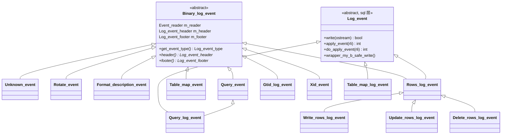
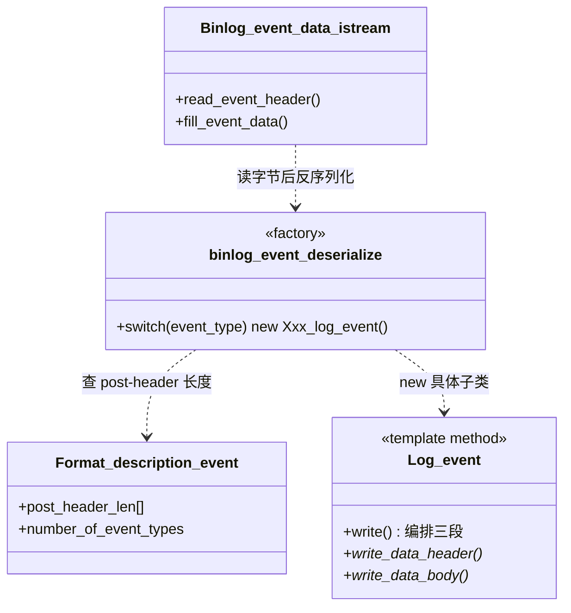

# binlog event 深度解析

> 基于 MySQL 8.0.39 源码，涵盖 binlog event 的三层类体系、序列化/反序列化机制、checksum 校验，以及各事件类型的字段级字节格式。
>
> **边界**：本篇只讲 event 这个「数据载体」本身——它长什么样、怎么被写进/读出字节流、怎么保证完整性。binlog 的整体写入流水线（Ordered Commit 三阶段、binlog cache、内部 2PC、崩溃恢复裁决）见 [`binlog.md`](binlog.md)；GTID 的持久化交互见 [`gtid.md`](gtid.md)；Row Image 怎么从行记录打包出来见 [`binlog.md`](binlog.md)「Row Image 记录过程」。

## 目录

- [概述](#概述)
- [理论基础](#理论基础)
- [核心实现](#核心实现)
- [★ 本机制里的工程实现技法](#-本机制里的工程实现技法)
- [可观测性](#可观测性)
- [Misc](#misc)
- [参考](#参考)

---

## 概述

### 是什么

binlog event 是 MySQL 复制协议里的**最小数据单元**。binlog 文件不是一份「SQL 语句清单」，而是一串二进制的 event 序列——每个 event 有一个 19 字节的公共头，写着「我是谁（type）、多长（event_size）、下一个 event 在哪（log_pos）」，后面跟着各事件自己格式的 post-header 和 body。

一个事务在 binlog 里表现为一串 event：

```
Gtid_log_event(33)          ← 携带 GTID + 逻辑时钟(last_committed/sequence_number)
Query_log_event(2): "BEGIN"  ← 事务起始（autocommit 的 DML/DDL 可能没有）
Table_map_log_event(19)      ← RBR：声明要操作哪张表、列类型
Write/Update/Delete_rows(30/31/32)  ← RBR：行镜像
Xid_log_event(16)            ← 内部 2PC 的 commit 记录
```

读侧（dump 线程、从库 IO 线程、mysqlbinlog、崩溃恢复）就是反复做同一件事：**读 19 字节头 → 查 FDE 得知 post-header 长度 → 反序列化出具体事件对象 → apply 或转发**。

### 用途

event 承担了复制协议里「自描述 + 版本兼容 + 完整性校验」三个职责：

1. **自描述**：每个 event 自己声明类型和长度，读侧无需任何外部 schema 就能定位边界——这是 binlog 能按「位点」随机访问、能跨版本读的前提。
2. **版本兼容**：`Format_description_event`（FDE）里有一个「每种事件 post-header 长度」的数组，旧版本读到不认识的 event 类型时，靠这个数组**跳过**而不是报错，保证升级路径平滑。
3. **完整性**：尾部 4 字节 CRC32 覆盖整个 event（含公共头），从库能检测 binlog 传输中的损坏。

### 版本演进

| 版本 | 变化 |
|------|------|
| 3.23~4.x | 早期 `START_EVENT_V3`（type=1），v3 格式头，`binlog_version=1/3` |
| 5.0 | 引入 FDE 的 `post_header_len[]` 数组机制，公共头定长 19 字节（`LOG_EVENT_HEADER_LEN`），`binlog_version=4` 沿用至今 |
| 5.1 | `START_EVENT_V3` 废弃（8.0.2 起纯占位）；行事件 V1（`WRITE_ROWS_EVENT_V1=23` 等）出现 |
| 5.6 | 引入 GTID：`GTID_LOG_EVENT=33`、`PREVIOUS_GTIDS_LOG_EVENT=35`；行事件 V2（`WRITE_ROWS_EVENT=30` 等，post-header 从 8 扩到 10 字节支持 extra_data） |
| 5.7 | `ANONYMOUS_GTID_LOG_EVENT=34`（逻辑时钟 MTS 需要无 GTID 时也有事务边界标记）；`XA_PREPARE_LOG_EVENT=38` |
| 8.0 | 新增 `TRANSACTION_CONTEXT_EVENT=36`、`VIEW_CHANGE_EVENT=37`（组复制）、`PARTIAL_UPDATE_ROWS_EVENT=39`（JSON 部分更新）、`TRANSACTION_PAYLOAD_EVENT=40`（事务压缩）、`HEARTBEAT_LOG_EVENT_V2=41`；`START_EVENT_V3` 在 8.0.2 标记废弃 |

关键演进动机在「理论基础 → 他库对比与演进动机」，此处只记变化本身。需要特别注意的是一条**冻结约定**：`Rotate` 的 post-header 长度被明确注释为 "frozen"（`ROTATE_HEADER_LEN=8`），一旦定死永远不改——因为 rotate 发生在 FDE 可被读到之前，读侧只能靠硬编码跳过它。

---

## 理论基础

### 设计思想与权衡

#### 权衡一：为什么拆出 `libbinlogevents` 这层「纯数据」库

binlog event 的数据结构被拆成两个物理层：

```
libbinlogevents/     binary_log::Xxx_event  —— 纯数据 + 序列化/反序列化，零 server 依赖
sql/log_event.h/cc   Log_event / Xxx_log_event —— 带 THD、apply 逻辑，mysqld 专属
```

`libbinlogevents` 编译成独立静态库，被 **mysqld、mysqlbinlog、libmysqlclient（`mysql_real_connect` 读 binlog 的客户端）、从库** 四方共用。它的头文件里满是 `#ifndef MYSQL_SERVER`——server 侧多出 `do_apply_event` 这套从库执行逻辑，纯客户端侧只有打印（`print_event_info`）能力。

**本来可以**把数据结构就放在 `sql/log_event.h` 里，让 mysqlbinlog 直接链接 mysqld 的 object 文件。**但没有**——因为那样 mysqlbinlog 会拖着整个 THD、锁、存储引擎的符号进去，且任何对事件结构的改动都要重编客户端。拆出来换来的是**协议层与执行层的隔离**：改从库 apply 逻辑不影响客户端读 binlog，改事件字段不影响执行层（只要序列化格式不变）。

**代价**：一个逻辑上的「事件类」被劈成两半，server 侧的具体类要**多继承** `binary_log::Xxx_event`（数据）+ `Log_event`（行为），产生了整个代码库里最复杂的菱形继承体系之一（详见「工程实现技法」）。

#### 权衡二：为什么用「FDE 里的 post-header 长度数组」而不是自描述头

所有 event 的公共头是固定 19 字节，但 post-header 长度每种事件都不一样（`Query` 是 13，`Xid` 是 0，`Table_map` 是 8）。读侧要定位 body 起点，必须知道当前 event 的 post-header 多长。

**方案 A**：在每个 event 头里加一个「post-header 长度」字段，自描述。缺点——浪费每个 event 的字节，且破坏了「公共头 19 字节」这个 5.0 定死的历史格式。

**方案 B（实际采用）**：把「每种 event 的 post-header 长度」集中放在 FDE 的 `post_header_len[]` 数组里。FDE 是 binlog 文件的第一个 event，读侧先读 FDE，之后遇到任何 event 都用 `post_header_len[type_code - 1]` 查长度。

方案 B 的巧妙之处在于**版本兼容**：

- 旧版本读新 binlog：遇到不认识的 event type，如果该 type 有 `LOG_EVENT_IGNORABLE_F` 标志就直接跳过；即使没有，只要 `event_type <= fde->number_of_event_types`，也能靠 FDE 数组里新版本预填的长度跳过。
- 代价是「鸡生蛋」：读 FDE 本身时还没有 FDE 可用。解法是 FDE（以及可能先到的 `Rotate`）**保证只用 19 字节固定头**，且 `binlog_version` 字段在永不变动的偏移上。这就是为什么 `ROTATE_HEADER_LEN` 被冻结、为什么 FDE 的第一个字段必须稳定。

#### 权衡三：checksum 放在 event 尾部而不是独立文件头

CRC32 是**边写边算**的流式校验，覆盖范围是「整个 event 除 checksum 自身外的所有字节，**含 19 字节公共头**」。**本来可以**只对 body 校验（头在传输中也会损坏，但对头单独做校验更复杂），或者用文件级校验（但 binlog 是流式追加、可能被截断，文件级校验无法定位坏点）。**实际选择**每个 event 独立 crc32，坏一个 event 只影响这一个，恢复时能精确到「哪个 event 坏了」。

一个关键设计细节：**FDE 尾部恒为「1 字节算法描述符 + 4 字节 crc」共 5 字节，即使 `binlog_checksum=OFF` 也占**。算法描述符字节 A=0 表示「本文件其余 event 无 checksum」，A=1 表示 CRC32。这样读侧只需看 FDE 尾部一个字节，就知道后续所有 event 有没有 checksum、用什么算法——**checksum 能力协商就藏在这 1 个字节里**。

### 理论溯源

- **流式 CRC32**：`wrapper_my_b_safe_write` 里 `crc = checksum_crc32(crc, buf, size)` 的增量更新，是 zlib 的 crc32 算法（`BINLOG_CHECKSUM_ALG_CRC32`）。选它而非更快的 xxhash/crc32c，是因为历史兼容——5.6 引入 checksum 时只有 zlib crc32 可用，协议一旦定死就无法换算法。
- **变长整数编码**（Packed Integer）：`net_store_length` / `net_field_length_ll` 的「首字节 <251 直接存、252→2字节、253→3字节、254→8字节」编码，本质是一种前缀变长编码，用于 table_id、列数、长度等高频小值字段省字节。

### 算法与数据结构

- **Packed Integer**：见上，O(1) 编解码，小值 1 字节、大值最多 9 字节。`251` 被保留为 `NULL_LENGTH` 哨兵，所以 `<251` 才是单字节直接存。
- **column bitmap**：`Rows_event` 里「哪些列出现在本 event」用位图表示（`ceil(n/8)` 字节），第 i 列对应第 i 位。读侧据此知道每行要解几个字段——比存列数更省，且天然支持稀疏列。
- **CRC32 增量校验**：读侧 `Log_event_footer::event_checksum_test` 对 `event_buf[0 .. event_len-4)` 重算 crc 与尾部 4 字节比对。

### 他库对比与演进动机

- **PostgreSQL WAL**：WAL 是**页级物理日志 + 逻辑解码（logical decoding）**两套东西。逻辑解码的复制协议（`pgoutput` 插件）在 9.4+ 才出现，且是「每事务一个消息流」，没有 MySQL 这种「按 event 类型分派、FDE 版本协商」的强自描述体系——因为 PG 的复制槽/位点机制下，从库版本基本受约束，不像 MySQL 主从可以跨大版本。MySQL 的 FDE + post_header_len 数组 + IGNORABLE 标志这套「尽力向前兼容」的设计，根源是 MySQL 主从长期支持**跨版本复制**（5.6 主 → 8.0 从）。
- **MariaDB**：同样从 MySQL 分叉出 binlog，但 MariaDB 10.x 的 GTID 是「(domain_id, server_id, seq_no)」三元组，event 类型编号有分叉（如 `ANNOTATE_ROWS_EVENT` 是 MariaDB 私有），这是「别家分支私有特性」，社区 MySQL 没有。
- **演进动机**：从 v1 行事件到 v2（post-header 8→10）是为了塞进 `extra_data`（NDB 分区信息、JSON 部分更新）；GTID 事件、`Transaction_payload` 压缩事件都是「事务粒度」能力叠加的结果，各自新增一个 event type 而不是改现有格式——这正是「加新类型而非改旧类型」的协议演进纪律。

---

## 核心实现

### 主链路

**写侧**（一条 DML 从执行到落盘）：

```
handler::ha_write_row / ha_update_row / ha_delete_row
  → binlog_log_row
    → write_locked_table_maps          // 首次写 Table_map_log_event
    → binlog_write_row / binlog_update_row / binlog_delete_row
      → Rows_log_event 构造            // pack_row 打包行镜像进 m_rows_buf
      → cache->write_event(ev)         // 序列化进 binlog cache
提交时：
MYSQL_BIN_LOG::commit → ordered_commit → flush_stage
  → write_transaction
    → binlog_cache_data::finalize
      → write_event(end_event)         // Xid / Query(COMMIT)
      → flush → Binlog_event_writer 逐个把 event 序列化到 IO_CACHE
```

**读侧**（从文件字节到事件对象）：

```
Binlog_file_reader / Binlog_sender 循环
  → Binlog_event_data_istream::read_event_header     // 读 19 字节头
  → Binlog_event_data_istream::fill_event_data       // 按 event_len 读整个 event
  → binlog_event_deserialize                         // ★ 工厂：type_code → 具体事件对象
    → switch(event_type): new Xxx_log_event(buf, fde)  // 反序列化构造
    → Log_event_footer::event_checksum_test          // 校验 CRC32
  → 事件对象交给 apply / 转发 / 打印
```

两条主链的交汇点是 **序列化格式**：写侧 `Xxx_log_event::write_data_*` 产出的字节，读侧 `Xxx_log_event(buf, fde)` 构造函数再原样读回。下面各节分别展开。

### 三层类体系

先厘清一个最常见的概念混淆：**`binary_log::Log_event` 这个类并不存在**。libbinlogevents 里唯一的抽象基类是 `binary_log::Binary_log_event`，`binary_log.h` 只是一个 `#include` 聚合头。真正的三层是：

```
第 1 层  binary_log::Binary_log_event   （纯数据/序列化抽象基类）
第 2 层  binary_log::Xxx_event          （各事件的数据定义，无纯虚）
第 3 层  sql::Log_event                 （server 侧抽象基类，带 THD + apply）
          ↓ 具体事件类多继承 第 2 层 + 第 3 层
```



第 1 层 `Binary_log_event` 有三个**值成员**（不是指针），构成一个事件对象在内存里的三件套：

- `m_reader`（`Event_reader`）——持有序列化缓冲区指针 + 长度，是反序列化的游标；
- `m_header`（`Log_event_header`）——19 字节公共头的内存表示；
- `m_footer`（`Log_event_footer`）——公共尾，当前只含 `checksum_alg`（注意：**checksum 值本身读后即丢弃，不存对象里**）。

它有两个构造函数，对应「写侧创建」和「读侧反序列化」两种身份：

```cpp
// 写侧：只设 type_code，m_reader 为空
explicit Binary_log_event(Log_event_type type_code)
    : m_reader(nullptr, 0), m_header(type_code) {}

// 读侧：从 buffer 反序列化，header/footer 构造时就把 reader 游标推进到 post-header 起点
Binary_log_event(const char **buf, const Format_description_event *fde);
```

抽象性来自纯虚析构 `virtual ~Binary_log_event() = 0`。设计上，构造时把 `type_code` 默认设为 `ENUM_END_EVENT`，这样子类若忘记覆写类型码，反序列化时会触发 assert——用断言在开发期抓「忘了 set type」的错误。

第 3 层 `Log_event` 是 server 侧的行为基类，关键虚函数：

- `write(Basic_ostream*)`——三段式序列化入口；
- `apply_event(Relay_log_info*)`——从库执行入口，内部先 `do_shall_skip` 判是否跳过，再 `do_apply_event`；
- `do_apply_event(Relay_log_info*)`——每个事件具体的 apply 逻辑（纯虚，子类实现）；
- `wrapper_my_b_safe_write`——带 checksum 增量计算的底层写。

`Query_event`（数据）+ `Log_event`（行为）多继承得到 `Query_log_event`，这就是菱形体系里最典型的一个。多继承带来的代价与解法见「工程实现技法」。

### 序列化：写入侧

#### write 三段式虚函数链

每个事件类的序列化不是一个大函数，而是由基类 `Log_event::write` 编排的三段式虚函数链：

```cpp
bool Log_event::write(Basic_ostream *ostream) {
  ...
  return (write_header(ostream, get_data_size()) ||   // ① 19 字节公共头
          write_data_header(ostream) ||               // ② post-header（子类覆写）
          write_data_body(ostream) ||                 // ③ body（子类覆写）
          write_footer(ostream));                     // ④ checksum footer
}
```

`write_header` 负责公共头，并在这里做两件关键事：

```cpp
bool Log_event::write_header(Basic_ostream *ostream, size_t event_data_length) {
  uchar header[LOG_EVENT_HEADER_LEN];
  ...
  common_header->data_written = event_data_length + LOG_EVENT_HEADER_LEN;
  if (need_checksum()) {
    crc = checksum_crc32(0L, nullptr, 0);          // ★ 初始化 crc 为 0
    common_header->data_written += BINLOG_CHECKSUM_LEN;  // event_len 把 crc 算进去
  }
  ...
}
```

`data_written`（即公共头里的 `event_len` 字段）= 19 + post-header + body **+ checksum 4 字节**。读侧靠这个字段知道要读多少字节，所以写侧必须先算出总长。

`write_data_header` / `write_data_body` 是子类各自覆写，但**所有子类都通过 `wrapper_my_b_safe_write` 写字节**，而不是直接 `ostream->write`：

```cpp
bool Log_event::wrapper_my_b_safe_write(Basic_ostream *ostream,
                                        const uchar *buf, size_t size) {
  if (size == 0) return false;
  if (need_checksum() && size != 0) crc = checksum_crc32(crc, buf, size);  // ★ 边写边算
  return ostream->write(buf, size);
}
```

这就是 checksum「流式」的落点：每写一段就增量更新成员 `crc`，`write_footer` 时把 `crc` 写到尾部。以 `Rows_log_event::write_data_header` 为例，可以看到子类如何逐字段调用：

```cpp
bool Rows_log_event::write_data_header(Basic_ostream *ostream) {
  uchar buf[Binary_log_event::ROWS_HEADER_LEN_V2];
  int6store(buf + ROWS_MAPID_OFFSET, m_table_id.id());   // 6 字节 table_id
  int2store(buf + ROWS_FLAGS_OFFSET, m_flags);           // 2 字节 flags
  ... // V2 还有 extra_data_len + extra_data
  return wrapper_my_b_safe_write(ostream, buf, ROWS_HEADER_LEN_V2);
}
```

`write_footer` 写「1 字节算法描述符 + 4 字节 crc」（FDE 之外的事件通常只写 crc 值，算法从 FDE 得知，但这里统一处理）：

```cpp
bool Log_event::write_footer(Basic_ostream *ostream) {
  // footer 含 checksum 算法描述符 + checksum 值
  ...
}
```

#### 两条写路径：三段式直写 vs Binlog_event_writer 流式

**一个必须先澄清的架构事实**：8.0 中期 Oracle 为支持 binlog 加密重构了写入链路，把旧版「`Binlog_event_writer` 持有裸 `IO_CACHE`」改成了 **`Basic_ostream` 管道（stream pipeline）**。旧版（5.7/8.0 早期）的 `IO_CACHE *m_cache` + `stream_copy` 模型已不存在。所以写侧实际有**两条并行的 CRC/写入路径**：

1. **`Log_event::write()` 三段式直写**：适用 FD、Rotate、Stop、Previous_gtids、GTID 这类「无缓存事件」，以及从库写 relay log。入口 `binary_event_serialize(ev, ostream)`（模板，等价 `ev->write(ostream)`）。
2. **`Binlog_event_writer::write()` 流式**：适用普通 DML/DDL 事务，把 binlog cache 的字节流 flush 到文件。

#### Binlog_event_writer：流式写入 + 跨页重组

`Binlog_event_writer`（`sql/binlog.cc`）继承 `Basic_ostream`，成员已变为：

```cpp
class Binlog_event_writer : public Basic_ostream {
  MYSQL_BIN_LOG::Binlog_ofile *m_binlog_file;  // 真正的文件写端（非裸 IO_CACHE）
  bool have_checksum;
  ha_checksum initial_checksum;                // my_checksum(0L, null, 0)
  ha_checksum checksum;                        // 当前累积 checksum
  uint32 end_log_pos;                          // 当前文件写位置（等价旧 m_log_pos）
  uchar header[LOG_EVENT_HEADER_LEN];          // 19 字节暂存 header
  my_off_t header_len = 0;                     // 已暂存 header 字节数
  uint32 event_len = 0;                        // 当前 event 剩余待写字节数
};
```

`end_log_pos` 在构造时初始化为 `binlog_file->position()`（当前 binlog 文件已有字节数）。`header[19]` + `header_len` + `event_len` 三个字段共同实现了**不完整 header 的缓存与跨页重组**——这正是「一个 event 跨多个 cache 页也能正确重组」的机制落点。

`write()` 的完整逻辑是一个双分支状态机（`sql/binlog.cc` 的 `Binlog_event_writer::write`）：

```cpp
bool write(const unsigned char *buffer, my_off_t length) override {
  while (length > 0) {
    if (event_len == 0) {                       // 分支1：还在收 header
      uint32 header_incr = std::min<uint32>(LOG_EVENT_HEADER_LEN - header_len, length);
      memcpy(header + header_len, buffer, header_incr);   // 累积到 header 缓冲
      header_len += header_incr; buffer += header_incr; length -= header_incr;
      if (header_len == LOG_EVENT_HEADER_LEN) {          // 凑齐 19 字节
        update_header();                                  // 修正 event_len/log_pos/checksum
        if (m_binlog_file->write(header, header_len)) return true;
        event_len -= header_len;                          // 扣掉 header 本身
        header_len = 0;
      }
    } else {                                    // 分支2：写 body（post-header+body+数据）
      my_off_t write_bytes = std::min<uint64>(length, event_len);
      if (m_binlog_file->write(buffer, write_bytes)) return true;
      if (have_checksum) checksum = my_checksum(checksum, buffer, write_bytes);
      event_len -= write_bytes; length -= write_bytes; buffer += write_bytes;
      if (have_checksum && event_len == 0) {             // 整个 event 写完，追加 checksum
        uchar checksum_buf[BINLOG_CHECKSUM_LEN];
        int4store(checksum_buf, checksum);
        if (m_binlog_file->write(checksum_buf, BINLOG_CHECKSUM_LEN)) return true;
        checksum = initial_checksum;
      }
    }
  }
  return false;
}
```

**跨页重组的关键**：`cache->copy_to(writer)` 会分多次、每次一段地把 cache 字节喂进来（`stream_copy` 按页搬运），喂进来的第一段可能不足 19 字节（header 被拆开）。分支 1 用 `header` 缓冲把不完整的 header 拼起来，凑齐后才 `update_header()` 再落盘——所以「event 跨页」对 writer 是完全透明的。

`update_header()` 做字节级修正（`sql/binlog.cc` 的 `Binlog_event_writer::update_header`）：

- 从拼好的 `header` 读出 `event_len`（`uint4korr(header + EVENT_LEN_OFFSET)`）→ 赋给 `event_len` 成员；
- 修正 `log_pos`：若 header 里的 `log_pos != 0`，则 `end_log_pos += log_pos`（binlog cache 里写的 log_pos 是相对偏移，flush 时叠加到文件绝对位置）；
- 若 `have_checksum`，把 `checksum = my_checksum(checksum, header, LOG_EVENT_HEADER_LEN)` 算上 header 的 19 字节。

这里解释了「event_len 与 log_pos 的回填」：cache 里存的事件字节，其 header 里的 `log_pos` 和 `end_log_pos` 是暂态的，真正落文件时才由 writer 用文件位置修正。

**`do_write_cache` → `copy_to` → `stream_copy`**：`binlog_cache_data::do_write_cache` 调用 `cache->copy_to(writer, &error)`，`copy_to` 内部再调模板 `stream_copy(&m_file, ostream, ...)` 把 cache 字节按页搬到 writer。这一层不再重解析事件，只做字节搬运。`max_log_event_size = 1GB` 仍是单 event 硬上限。

### 反序列化：读取侧

#### 工厂函数 binlog_event_deserialize

读侧的反序列化工厂是 `binlog_event_deserialize`（`sql/binlog_reader.cc`），核心是一个巨大的 `switch(event_type)`：

```cpp
switch (event_type) {
  case binary_log::QUERY_EVENT:   ev = new Query_log_event(buf, fde, QUERY_EVENT); break;
  case binary_log::ROTATE_EVENT:  ev = new Rotate_log_event(buf, fde); break;
  case binary_log::XID_EVENT:     ev = new Xid_log_event(buf, fde); break;
  ...
  case binary_log::GTID_LOG_EVENT:
  case binary_log::ANONYMOUS_GTID_LOG_EVENT: ev = new Gtid_log_event(buf, fde); break;
  ...
  default:
    // 不认识的 type：有 IGNORABLE_F 标志 → Ignorable_log_event；否则 nullptr
    if (uint2korr(buf + FLAGS_OFFSET) & LOG_EVENT_IGNORABLE_F)
      ev = new Ignorable_log_event(buf, fde);
    else
      ev = nullptr;
}
```

每个 case 用「缓冲区指针 + FDE」调用具体事件的**反序列化构造函数**，构造函数内部通过继承来的 `Event_reader` 逐字段读出。注意两点：

1. `GTID_LOG_EVENT` 和 `ANONYMOUS_GTID_LOG_EVENT` 都 `new Gtid_log_event`——同一个类处理两种 type（差异在 `spec.type`，见 [`gtid.md`](gtid.md)）；
2. `default` 分支体现了「IGNORABLE」协议：从库遇到不认识的 type，只要标志位声明可忽略就跳过继续，否则报错——这是跨版本复制的最后一道保险。

工厂在分派**之前**先做两道校验（代码在 switch 之前）：

```cpp
// ① checksum 校验（见下节）
// ② 事件类型是否超出 FDE 支持范围
if (event_type > fde->number_of_event_types) {
  // post_header_len 数组里没有这个 type，无法定位边界 → 拒绝
  return Binlog_read_error::INVALID_EVENT;
}
// 从 event_len 里去掉 checksum 长度，让各事件构造函数只看到纯数据
if (alg != UNDEF && (type == FDE || alg != OFF))
  event_len = event_len - BINLOG_CHECKSUM_LEN;
```

第二条 `event_type > number_of_event_types` 正是「post-header 长度数组机制」在代码里的体现——工厂必须确认 FDE 认识这个 type，否则连 post-header 有多长都不知道。

#### 反序列化构造函数：5 步模板 + READER_* 宏

**先纠正两个易错点**：8.0.39 里**不存在** `enum_read_error` 枚举（5.x 的 `log_event_old.cc` 遗留），也不存在 `read_str`/`read_u32`/`read_varint` 这类"读取宏"。当前的错误机制是三件套：`Event_reader::m_error`（`const char*` 错误消息指针）+ `Log_event_header::m_is_valid`（bool）+ 工厂返回的 `Binlog_read_error::Error_type` 枚举。`event_reader_macros.h` 里只有 `READER_*` 系列宏，变长整数是 `Event_reader::net_field_length_ll()` 成员方法。

**构造链的公共前奏**：每个事件类的 `Xxx_log_event(const char *buf, const Format_description_event *fde)` 第一步都调基类构造函数（`libbinlogevents/src/binlog_event.cpp`）：

```cpp
Binary_log_event::Binary_log_event(const char **buf,
                                   const Format_description_event *fde)
    : m_reader(*buf, LOG_EVENT_MINIMAL_HEADER_LEN),  // ① Event_reader，初始只给 19 字节
      m_header(m_reader) {                            // ② 用 m_reader 解析 19 字节头
  m_footer = Log_event_footer(m_reader, m_header.type_code, fde);  // ③ 读 footer/checksum
}
```

构造完成后，`m_reader` 的游标 `m_ptr` 已经指向 **post-header 的起始位置**（第 19 字节处），`m_header` 解析时还会把 reader 的真实长度 `set_length(data_written)` 修正为完整事件长度。

**每个事件类构造函数遵循统一的 5 步模板**（以最简单的 `Intvar_event` 为例，`libbinlogevents/src/statement_events.cpp`）：

```cpp
Intvar_event::Intvar_event(const char *buf, const Format_description_event *fde)
    : Binary_log_event(&buf, fde) {
  READER_TRY_INITIALIZATION;                              // ① 头无效则直接返回
  READER_ASSERT_POSITION(fde->common_header_len);         // ② 断言游标在 post-header 起点
  READER_TRY_CALL(forward, fde->post_header_len[INTVAR_EVENT - 1]);  // ③ 跳过 0 字节 post-header
  READER_TRY_SET(type, read<uint8_t>);                    // ③ 读 body 字段
  READER_TRY_SET(val, read<uint64_t>);                    // ③
  READER_CATCH_ERROR;                                     // ④ 把 reader 错误同步到 m_header
  BAPI_VOID_RETURN;                                       // ⑤ 返回
}
```

`READER_*` 宏定义在 `libbinlogevents/include/event_reader_macros.h`，核心几个：

```cpp
#define READER_CALL(func, ...) reader().func(__VA_ARGS__)          // 调 Event_reader 方法
#define READER_TRY_CALL(func, ...) \
  READER_CALL(func, __VA_ARGS__); \
  if (reader().get_error()) goto event_reader_footer              // 出错跳转
#define READER_SET(var, func, ...) var = reader().func(__VA_ARGS__)
#define READER_TRY_SET(var, func, ...) \
  READER_SET(var, func, __VA_ARGS__); \
  if (reader().get_error()) goto event_reader_footer
#define READER_CATCH_ERROR \
  event_reader_footer: \
  header()->set_is_valid(READER_CALL(has_error) == false)         // 错误汇总到 header
```

这套模板的意义：每个字段的读取都被 `TRY` 宏包住，一旦越界/错误就 `goto event_reader_footer`，最终把「是否有错」收敛到 `m_header.m_is_valid`。工厂和上层只查这个 bool，不用在几十个字段读取里反复判错。

#### Event_reader：类型安全游标

`Event_reader`（`libbinlogevents/include/event_reader.h`）是反序列化的核心，事件构造函数里所有「读一个字段」都通过它：

- `read<Type>()`——按类型读出并推进指针（模板，`read<uint8_t>`/`read<uint64_t>` 等）；
- `forward(size_t)` / `advance(size_t)`——跳过不关心的字节（如跳过 0 字节的 post-header）；
- `net_field_length_ll()`——读 packed integer（变长整数，`table_id`/`column_count`/`string 长度` 都走它）；
- `read_data_into_buffer`——读一段到目标缓冲；
- `get_error()` / `set_error(msg)` / `has_error()`——错误检测与设置（`m_error` 指针）。

它是「把二进制缓冲区封装成类型安全游标」的典型实现：事件类只声明「我要读一个 uint32、一个 string」，不必关心当前指针、剩余长度（越界由 reader 统一兜底并设 `m_error`）。每个 `read<Type>()` 都有边界检查，越界返回 0 值并设置错误。

#### Log_event_header / Log_event_footer 的反序列化

`Log_event_header` 构造函数从 buf 解析 19 字节的 `when/type_code/unmasked_server_id/data_written/log_pos/flags`，并把 `m_is_valid` 置初值；`Log_event_footer` 在读 FD 时解析 checksum 算法描述符。这两者的解析结果在 5 步模板的 `READER_CATCH_ERROR` 阶段统一汇总。

#### Event_reader::read 的字节序语义

`read<Type>(bytes)` 是反序列化的原子操作，它同时处理了「变长读取」和「字节序转换」两件事（`libbinlogevents/include/event_reader.h`）：

```cpp
template <typename T>
T read(unsigned char bytes = sizeof(T)) {
  if (!can_read(bytes)) { set_error("Cannot read from out of buffer bounds"); return 0; }
  T value = 0;
  ::memcpy((char *)&value, m_ptr, bytes);
  m_ptr = m_ptr + bytes;
  return (bytes > 1) ? letoh(value) : value;   // ★ 多字节做小端→主机序转换
}
```

要点：`bytes` 参数允许读少于 `sizeof(T)` 的字节（用于变长字段，如 7 字节时间戳读 `read<uint64_t>(7)`）；多字节一律 `letoh`（little-endian → host）转换。这就是为什么 `Q_SQL_MODE_CODE` 读 8 字节、GTID 时间戳读 7 字节都能正确还原。

#### Query_log_event 的两层构造与 status_vars 解析

反序列化分两层：

- **基类 `binary_log::Query_event(buf, fde)`**（`libbinlogevents/src/statement_events.cpp`）：做**纯字节解析**——读 post-header 的 `thread_id`(4)、`query_exec_time`(4)、`db_len`(1)、`error_code`(2)、`status_vars_len`(2)，然后按 `status_vars_len` 循环解析 status_vars，最后定位 db 名和 query 文本。
- **服务器侧 `Query_log_event(buf, fde, event_type)`**（`sql/log_event.cc`）：只做**资源初始化**——`slave_proxy_id = thread_id` 等成员映射，然后 `fill_data_buf` 把分散的指针（catalog/time_zone/user/host/db/query）连续打包进 `data_buf`，供从库 apply 使用。**真正的字段值解析已在基类完成**。

**status_vars 的逐 code 解析循环**（真实代码，`statement_events.cpp` 的 `Query_event(buf, fde)` 构造）：

```cpp
  /* variable-part: the status vars; only in MySQL 5.0  */
  end_variable_part = READER_CALL(position) + status_vars_len;
  while (READER_CALL(position) < end_variable_part) {
    uint8_t variable_type;
    READER_TRY_SET(variable_type, read<uint8_t>);       // ① 读 1 字节 code
    switch (variable_type) {
      case Q_FLAGS2_CODE:                               // 4 字节
        flags2_inited = true;
        READER_TRY_SET(flags2, read<uint32_t>);
        break;
      case Q_SQL_MODE_CODE:                             // 8 字节
        sql_mode_inited = true;
        READER_TRY_SET(sql_mode, read<uint64_t>);
        break;
      case Q_AUTO_INCREMENT:                            // 2+2 字节
        READER_TRY_SET(auto_increment_increment, read<uint16_t>);
        READER_TRY_SET(auto_increment_offset, read<uint16_t>);
        break;
      case Q_CHARSET_CODE:                              // 6 字节
        charset_inited = true;
        READER_TRY_CALL(memcpy<char *>, charset, 6);
        break;
      case Q_TIME_ZONE_CODE: {                          // 1 字节长度 + 字符串
        READER_TRY_SET(time_zone_len, read<uint8_t>);
        if (time_zone_len) {
          time_zone_str = READER_CALL(ptr);
          READER_TRY_CALL(forward, time_zone_len);
        }
        break;
      }
      case Q_MICROSECONDS: {                            // 3 字节微秒
        READER_TRY_SET(header()->when.tv_usec, read<uint32_t>, 3);
        break;
      }
      case Q_DDL_LOGGED_WITH_XID:                       // 8 字节 ddl_xid
        READER_TRY_SET(ddl_xid, read<uint64_t>);
        break;
      case Q_UPDATED_DB_NAMES: {                        // 1 + Σ(len+1)
        READER_TRY_SET(mts_accessed_dbs, read<uint8_t>);
        if (mts_accessed_dbs > MAX_DBS_IN_EVENT_MTS) {
          mts_accessed_dbs = OVER_MAX_DBS_IN_EVENT_MTS;
          break;
        }
        for (i = 0; i < mts_accessed_dbs && position < end_variable_part; i++)
          READER_TRY_CALL(strncpyz, mts_accessed_db_names[i],
                          min(NAME_LEN, remaining), NAME_LEN);
        break;
      }
      // ... 其余 code 类似：Q_CATALOG_NZ_CODE/Q_CATALOG_CODE/Q_LC_TIME_NAMES_CODE/
      //     Q_CHARSET_DATABASE_CODE/Q_TABLE_MAP_FOR_UPDATE_CODE/Q_INVOKER/
      //     Q_EXPLICIT_DEFAULTS_FOR_TIMESTAMP/Q_DEFAULT_COLLATION_FOR_UTF8MB4/
      //     Q_SQL_REQUIRE_PRIMARY_KEY/Q_DEFAULT_TABLE_ENCRYPTION ...
      default:
        /* That's why you must write status vars in growing order of code */
        READER_CALL(go_to, end_variable_part);  // ② 未知 code → 跳到 status_vars 末尾
    }
  }

  /* A 2nd variable part; this is common to all versions */
  db = READER_CALL(ptr);
  READER_TRY_CALL(forward, db_len + 1);                 // db 名 + 结尾 0x00
  q_len = data_len - db_len - 1;
  if (q_len != READER_CALL(available_to_read))
    READER_THROW("Invalid query length");
  query = READER_CALL(ptr, q_len);                      // query 文本到 event 尾
```

**② 是关键纠正**：遇到未知 code（`default` 分支）**不是报错，而是 `go_to(end_variable_part)` 直接跳到 status_vars 末尾**。注释点明了原因——status_vars **必须按 code 递增顺序写**，所以一旦读到比预期更大的 code，就说明后面的都是"比当前版本更新"的 code，无法理解、但能安全整体跳过（每个新 code 的值长度由写侧保证自洽）。这与「读侧按 status_vars_len 整体跳过」的惰性解析是同一哲学：**向前兼容靠"跳"，不靠"报错"**。

**① 循环边界**：`end_variable_part = 当前 position + status_vars_len`，循环条件是 `position < end_variable_part`——所以即使某个 code 读多了/读少了，`go_to` 或循环条件都能兜底，不会越界读进 db 名。读完 status_vars 后，`db`（含结尾 `\0`）和 `query`（`q_len = data_len - db_len - 1`）是 status_vars 之后的"第二段变长区"，所有版本通用。

#### binlog_reader 分层流

真正从文件读字节的，是 `sql/binlog_reader.h` 里的一套流式管道：

```
Basic_istream（文件 IO）
  → Binlog_event_data_istream（读 19 字节头 + 按 event_len 读整 event + checksum 校验）
    → Binlog_event_object_istream（调 binlog_event_deserialize 反序列化成对象）
      → Basic_binlog_file_reader（对外：一次产出 next_event）
```

其中 `Binlog_event_data_istream::fill_event_data` 里做 CRC32 校验：`Log_event_footer::event_checksum_test(event_data, event_len, alg)` 对读到的字节重算 crc 比对。校验失败返回 `CHECKSUM_FAILURE`，dump 线程据此报「binlog 损坏」。

### checksum 机制

#### 能力协商：藏在 FDE 尾部

checksum 算法不用独立配置下发，而是编码在 FDE 里：

- FDE 尾部恒有 5 字节：`(1 字节算法描述符 A) + (4 字节 crc V)`；
- `A` 的取值：`BINLOG_CHECKSUM_ALG_OFF=0`（本文件其余 event 无 checksum）、`BINLOG_CHECKSUM_ALG_CRC32=1`、`BINLOG_CHECKSUM_ALG_UNDEF=255`（旧版本 FDE 没这字段）；
- 读侧读完 FDE 就知道「后续 event 有没有 checksum、用哪种」。

这就是为什么 `binlog_checksum` 参数能在线切换、为什么 5.6 之前的老从库能读新主库——它看 FDE 的 A 字节，A=0 就按无 checksum 处理。

#### CRC 的三个精确落点（写侧三段式）

写侧 CRC 不是一次性算完，而是散布在 `Log_event::write` 的四个函数里，`crc` 成员（`ha_checksum crc`，构造时初始化 `crc(0)`）跨调用增量累积：

**(1) `write_header()` 初始化 + 算 header**（`sql/log_event.cc`）：

```cpp
bool Log_event::write_header(Basic_ostream *ostream, size_t event_data_length) {
  common_header->data_written = event_data_length + sizeof(header);   // 19 + 数据长
  if (need_checksum()) {
    crc = checksum_crc32(0L, nullptr, 0);              // ★ crc 初值 = 0（空输入）
    common_header->data_written += BINLOG_CHECKSUM_LEN; // ★ event_len 把 4 字节 crc 算进去
  }
  ...
  write_header_to_memory(header);
  ostream->write(header, LOG_EVENT_HEADER_LEN);        // 先写 19 字节 header
  // FD 场景：清掉 BINLOG_IN_USE_F 标志后再算（该标志不参与 crc）
  if (need_checksum() && (common_header->flags & LOG_EVENT_BINLOG_IN_USE_F)) {
    common_header->flags &= ~LOG_EVENT_BINLOG_IN_USE_F;
    int2store(header + FLAGS_OFFSET, common_header->flags);
  }
  crc = my_checksum(crc, header, LOG_EVENT_HEADER_LEN); // ★ 增量算 19 字节 header
  return ret;
}
```

**(2) `wrapper_my_b_safe_write()` 增量**（`sql/log_event.cc`）：每个 post-header / body 字段的写入都走它，`crc = checksum_crc32(crc, buf, size)`，实现"边写边算"。

**(3) `write_footer()` 回填**（`sql/log_event.cc`）：

```cpp
bool Log_event::write_footer(Basic_ostream *ostream) {
  if (need_checksum()) {
    uchar buf[BINLOG_CHECKSUM_LEN];   // 4 字节
    int4store(buf, crc);              // ★ 最终 crc 以小端写尾部
    return ostream->write((uchar *)buf, sizeof(buf));
  }
  return false;
}
```

**注意两条写路径的 CRC 实现不同**：上面三段式的 `crc` 是 `Log_event` 的成员；而 `Binlog_event_writer` 流式路径（普通事务）用的是 writer 自己的 `checksum` 成员（见上文 `write()` 的分支 2），两者互不干扰但算法一致。

#### my_checksum 的实现与硬件加速

`checksum_crc32()` 是 `my_checksum()` 的薄 wrapper（`libbinlogevents/include/binlog_event.h`），真正实现在 `include/my_checksum.h`：

```cpp
inline ha_checksum my_checksum(ha_checksum crc, const unsigned char *pos, size_t length) {
#ifdef HAVE_ARMV8_CRC32_INTRINSIC
  if (mycrc32::auxv_at_hwcap)
    return mycrc32::PunnedCrc32<std::uint64_t>(crc, pos, length);  // ARMv8 硬件 crc32
#endif
  return ...;  // 软件 zlib crc32 表驱动
}
```

即：在支持 `HAVE_ARMV8_CRC32_INTRINSIC` 的 ARM 平台上，checksum 走硬件 CRC32 指令（快数倍）；否则走软件 zlib 表驱动实现。算法本身是 zlib 的 CRC-32（多项式 0xEDB88320），选它而非 xxhash/crc32c 是 5.6 引入时的协议冻结决定——改了算法老版本从库就校验不过了。

#### 读侧校验与 FD 特例

读侧校验集中在 `Log_event_footer::event_checksum_test`：对 `event_buf[0 .. event_len - 4)` 重算 crc 与尾部 4 字节比对，**覆盖范围含 19 字节公共头**。校验失败返回 `CHECKSUM_FAILURE`，dump 线程/从库 IO 据此报 `Got fatal error 1236`。

#### 复制链路的 checksum 协商（dump 线程 ↔ 从库）

上面的「能力协商藏在 FDE 尾部」解决的是「读一个 binlog 文件时怎么知道算法」。但主从复制还有一条**独立的会话级协商**：从库要提前告诉主库「我能处理什么 checksum」，主库据此决定发不发、发什么。

**① 从库建连时声明能力**（`sql/rpl_replica.cc` 的 `get_master_version_and_clock`）：

```cpp
const char query[] =
    "SET @master_binlog_checksum = @@global.binlog_checksum, "
    "@source_binlog_checksum = @@global.binlog_checksum";   // 新旧两个名字都设
rc = mysql_real_query(mysql, query, ...);                  // 在主库会话里执行
// 然后 SELECT @source_binlog_checksum 读回，find_type 转枚举存入 mi->checksum_alg_before_fd
```

这个 `SET` 在**主库的 THD** 里执行，把主库 `@@global.binlog_checksum` 的值写进该会话的两个用户变量。从库再 `SELECT` 读回存入 `mi->checksum_alg_before_fd`。若主库是老版本不认识 `@source_binlog_checksum`（`ER_UNKNOWN_SYSTEM_VARIABLE`），`checksum_alg_before_fd` 保持 `UNDEF`（注释 "tolerable as OM -> NS is supported"）。

**② dump 线程读取从库声明**（`sql/rpl_binlog_sender.cc` 的 `init_checksum_alg`）：

```cpp
void Binlog_sender::init_checksum_alg() {
  m_slave_checksum_alg = BINLOG_CHECKSUM_ALG_UNDEF;         // 默认无感知
  mysql_mutex_lock(&m_thd->LOCK_thd_data);
  const auto &uv = get_user_var_from_alternatives(
      m_thd, "source_binlog_checksum", "master_binlog_checksum");  // 新旧名兼容
  if (uv && uv->ptr())
    m_slave_checksum_alg = static_cast<enum_binlog_checksum_alg>(
        find_type(uv->ptr(), &binlog_checksum_typelib, 1) - 1);
  mysql_mutex_unlock(&m_thd->LOCK_thd_data);
  m_event_checksum_alg = m_slave_checksum_alg;   // ★ 初始假设等于从库声明
}
```

`get_user_var_from_alternatives`（`sql/rpl_source.cc`）在 `thd->user_vars` 里先找 `source_binlog_checksum`、找不到再找 `master_binlog_checksum`——新旧名兼容的实现点。

**两个算法的区别**（`rpl_binlog_sender.h`）：`m_slave_checksum_alg` 是从库声明的「它能处理什么」；`m_event_checksum_alg` 是当前事件流**实际**用的算法，初始 = `m_slave_checksum_alg`（因为 `fake_rotate_event` 在读到任何 FD 之前就要发），读到主库 FD 后被更新为 FD 里的真实算法。判定函数 `event_checksum_on()`（`m_event_checksum_alg` 落在 `(OFF, ENUM_END)` 开区间）决定是否算/发 checksum。

**③ fake Rotate 的 checksum**（`fake_rotate_event`）：dump 开始前先发一个 `when=0`、`LOG_EVENT_ARTIFICIAL_F` 的假 Rotate，用 `event_checksum_on()` 判定、`calc_event_checksum()` 算 crc——这是「读 FD 之前」的唯一事件，checksum 只能用 `m_slave_checksum_alg` 推断。

**④ 从库侧 relay log 的 checksum 来源**（`sql/rpl_replica.cc` 的 `queue_event`）：从库收到主库 FD 后，把 relay log 的 checksum 算法**对齐到 FD**：

```cpp
mi->rli->relay_log.relay_log_checksum_alg = new_fdle->common_footer->checksum_alg;
```

即 **relay log 的 checksum 算法继承自主库 FD，不是从库自己的 `binlog_checksum` 参数**。但有一个分支：若从库 `checksum_alg_before_fd == UNDEF`（老从库，无 checksum 感知），从库会**改写 FD 的 checksum 描述符为 OFF**（`new_fdle->common_footer->checksum_alg = OFF`），后续写 relay log 时剥掉 4 字节 checksum（`event_len -= BINLOG_CHECKSUM_LEN`）——这就是 [`replica.md`](replica.md) 里「fake Rotate 与 FD 的 checksum 适配」的具体落点。

**⑤ UNDEF 终止 dump**（老从库读新主库）：若从库 `checksum_alg_before_fd == UNDEF` 而主库 FD 用了 checksum，从库 IO 线程报错停止：*"The checksum algorithm used by source is unknown to replica."*——宁可停，不复制可能损坏的数据。

**协商时序总览**：

```
从库 IO 线程                          主库 dump 线程
  │  SET @source_binlog_checksum=@@global.binlog_checksum
  ├────────────────────────────────►  (写入 thd->user_vars)
  │  SELECT @source_binlog_checksum
  │◄────────────────────────────────  (读回)
  │  checksum_alg_before_fd = 读回值
  │  COM_BINLOG_DUMP
  ├────────────────────────────────►  init_checksum_alg(): m_slave_checksum_alg
  │                                   fake_rotate_event()（用 m_slave_checksum_alg 算 crc）
  │◄────────────────────────────────  fake Rotate
  │                                   读主库 FD → m_event_checksum_alg = FD 的算法
  │◄────────────────────────────────  后续事件（带/不带 checksum）
  │  收到 FD → relay_log_checksum_alg = FD 的 checksum_alg
  │  （若从库 UNDEF → 改写 FD 为 OFF，剥 checksum 写 relay log）
```

**FD 的鸡生蛋问题**：读 FD 时还没有可靠的 checksum 算法（第一个 FDE 之前没有 FDE），所以 FD 尾部恒为「1 字节算法描述符 A + 4 字节 crc V」共 5 字节，即使 `binlog_checksum=OFF` 也占。`A` 的取值：`BINLOG_CHECKSUM_ALG_OFF=0`（本文件其余 event 无 checksum）、`BINLOG_CHECKSUM_ALG_CRC32=1`、`BINLOG_CHECKSUM_ALG_UNDEF=255`（旧版本 FDE 没这字段）。读侧在 `Binlog_event_data_istream::fill_event_data` 里对 FD 特殊处理：`if (event_data[EVENT_TYPE_OFFSET] == FORMAT_DESCRIPTION_EVENT) checksum_alg = Log_event_footer::get_checksum_alg(...)`——**以 FD 自己的尾部为准**，而不是用上一个 FDE 的算法。

**Rotate 的 checksum 特殊规则**：Rotate 在 FDE 可被读到之前就可能出现（文件头），它的 post-header 被冻结为 8 字节（`ROTATE_HEADER_LEN`），读侧硬编码跳过；checksum 判定同样依赖"读 Rotate 时还没有可靠算法"这一事实，只能按保守规则处理。

### 各事件类型格式

> 字节序除特别说明外均为**小端**（`int2store/int3store/int8store`）。公共头见下，之后每个事件给出 post-header 和 body 的字段级布局。post-header 长度来自 FDE 的 `post_header_len[]`，硬编码的枚举值见 `enum_post_header_length`。

#### 公共头（19 字节，所有事件通用）

| 偏移 | 字段 | 字节 | 含义 |
|------|------|------|------|
| 0 | `timestamp` | 4 | 事件创建时间（秒） |
| 4 | `type_code` | 1 | `Log_event_type` 事件类型 |
| 5 | `server_id` | 4 | 产生事件的 server id |
| 9 | `event_len`（`data_written`） | 4 | 事件总长（含 header+body+checksum） |
| 13 | `log_pos` | 4 | 下一个事件在 binlog 的起始偏移 |
| 17 | `flags` | 2 | 标志位 |

`flags` 关键位：`LOG_EVENT_BINLOG_IN_USE_F=0x1`（binlog 未正常关闭，仅 FDE）、`LOG_EVENT_THREAD_SPECIFIC_F=0x4`（依赖线程，如临时表）、`LOG_EVENT_SUPPRESS_USE_F=0x8`（抑制 USE 语句）、`LOG_EVENT_ARTIFICIAL_F=0x20`（人为生成不落盘）、`LOG_EVENT_RELAY_LOG_F=0x40`（从库 IO 线程写入 relay log）、`LOG_EVENT_IGNORABLE_F=0x80`（不认识的 type 可忽略）。

#### 控制事件（control_events.h）

**Format_description_event（type=15）**——文件第一个事件，一切解析的起点：

```
post-header（98 字节 = START_V3_HEADER_LEN + 1 + LOG_EVENT_TYPES）
  19  2   binlog_version (=4)
  21 50   server_version[50]（0 补齐）
  71  4   create_timestamp
  75  1   common_header_len (=19)
  76 41   post_header_len[41]（下标 i 对应 type=i+1 的 post-header 长度）
117  1   checksum 算法描述符 A
118  4   crc32 V
—— 事件总长 = 19 + 98 + 1 + 4 = 122 字节
```

`post_header_len[]` 是核心：`Query=13`、`Rotate=8`、`Xid=0`、`Table_map=8`、`Rows_v1=8`、`Rows_v2=10`、`GTID=42`、`Incident=2` 等。

##### FDE 完整生命周期机制（深度）

FDE 的本质不是"一个数据事件"，而是 **binlog 文件级解析上下文（parse context）的序列化载体**。任何要解析 binlog 的消费者（dump 线程、从库 IO/SQL 线程、mysqlbinlog、binlog browser）都必须先拿到一个 FDE，才能正确切分后续每个事件的 post-header 边界与 body。它的三个职责——版本声明、post-header 查表、checksum 协商——全部围绕"让不认识我的老版本也能安全读我"展开。

**① `post_header_len[]` 数组：版本协商的基石**

这是 FDE 最核心的价值。`enum_post_header_length`（`binlog_event.h:840-870`）逐个给出每种事件的 post-header 长度常量：

```cpp
enum enum_post_header_length {
  QUERY_HEADER_MINIMAL_LEN = (4 + 4 + 1 + 2),           // = 11（5.0 前）
  QUERY_HEADER_LEN = (QUERY_HEADER_MINIMAL_LEN + 2),    // = 13（5.0 起多 status_vars_len）
  ROTATE_HEADER_LEN = 8,                                // ★ 冻结（frozen）
  FORMAT_DESCRIPTION_HEADER_LEN = (START_V3_HEADER_LEN + 1 + LOG_EVENT_TYPES),
  //                              = 56 + 1 + 41 = 98
  XID_HEADER_LEN = 0,
  TABLE_MAP_HEADER_LEN = 8,
  ROWS_HEADER_LEN_V1 = 8,
  INCIDENT_HEADER_LEN = 2,
  ROWS_HEADER_LEN_V2 = 10,
  TRANSACTION_CONTEXT_HEADER_LEN = 18,
  VIEW_CHANGE_HEADER_LEN = 52,
  ...
};
```

`FORMAT_DESCRIPTION_HEADER_LEN = 98` 的构成：`START_V3_HEADER_LEN(56) + 1(common_header_len 字段) + LOG_EVENT_TYPES(41)`——即"FDE 的 post-header 长度 = 基础字段 + 那个 41 项的数组本身"，是自描述的固定值。`LOG_EVENT_TYPES = 41`（`ENUM_END_EVENT - 1`）。

写侧 `Format_description_event` 构造（`libbinlogevents/src/control_events.cpp`）把这个数组填满：

```cpp
Format_description_event::Format_description_event(uint8_t binlog_ver, const char *srv_ver)
    : Binary_log_event(FORMAT_DESCRIPTION_EVENT), created(0), common_header_len(LOG_EVENT_HEADER_LEN),
      number_of_event_types(LOG_EVENT_TYPES) {
  binlog_version = binlog_ver;                          // = 4
  strncpy(server_version, srv_ver, ST_SERVER_VER_LEN);  // 50 字节
  server_version[ST_SERVER_VER_LEN - 1] = 0;
  common_header_len = LOG_EVENT_HEADER_LEN;             // = 19
  number_of_event_types = LOG_EVENT_TYPES;              // = 41
  post_header_len.resize(number_of_event_types);        // ← 41 项的数组
  /* 按 enum_post_header_length 逐个填 */
  post_header_len[QUERY_EVENT - 1] = QUERY_HEADER_LEN;
  post_header_len[ROTATE_EVENT - 1] = ROTATE_HEADER_LEN;
  ...  // 依此类推
}
```

读侧用它的方式是**查表**：解析任意事件时，先读 common-header 拿到 `type_code`，再用 `fde->post_header_len[type_code - 1]` 定位 post-header 边界，之后才是 body。这就是"鸡生蛋"的解——FDE 自己**保证只用 19 字节固定头**（`LOG_EVENT_MINIMAL_HEADER_LEN`），读侧先硬编码读 19 字节拿到 FDE，再从中取出 `post_header_len[]` 供后续查表。

**版本协商的关键场景**：老版本从库遇到"自己不认识的新事件类型"（`type_code > number_of_event_types`）时，靠两件事安全跳过——① 事件类设置了 `LOG_EVENT_IGNORABLE_F` 标志 → 从库直接跳过；② 若没有该标志 → 从库报错。所以 8.0 加新事件类型时，要么老版本能 ignore（设 IGNORABLE_F），要么强制升级从库。这正是 `binlog_event.h` 里 `Log_event_type` 注释反复强调"新类型要慎重"的原因。

**② 写侧生成链路**

FDE 只在**新建 binlog 文件**时写一次。`MYSQL_BIN_LOG::open_binlog`（`sql/binlog.cc:4973`）打开新文件后写 FDE；`Format_description_log_event` 的无参构造（`sql/log_event.cc:5242`）：

```cpp
Format_description_log_event::Format_description_log_event()
    : Format_description_event(BINLOG_VERSION, ::server_version),
#ifdef MYSQL_SERVER
      Log_event(header(), footer(), Log_event::EVENT_INVALID_CACHE,
                Log_event::EVENT_INVALID_LOGGING)   // ★ FD 不走任何 cache，直接写文件
#else
      Log_event(header(), footer())
#endif
{
  common_header->set_is_valid(true);
}
```

`EVENT_INVALID_CACHE / EVENT_INVALID_LOGGING` 是重要信号：FD **不进 stmt/trx cache**，而是直接写 binlog 文件（`open_binlog` 里 `binary_event_serialize(&fde, ...)` 直写），因为它是文件头的组成部分，不属于任何事务。

**③ 读侧消费：建立解析上下文**

dump 线程 / 从库 IO / mysqlbinlog 读到 FDE 后，把它保存为"当前文件的描述事件"（从库存进 `Master_info` 的 `description_event`，dump 线程存进 `Binlog_sender::m_description_event`），后续每个事件的 `binlog_event_deserialize(buf, fde)` 都拿这个 FDE 去校验 `type_code`、查 `post_header_len[]`。relay log rotate 时，从库把主库的 FDE **原样重写**进新 relay log 头部（`MYSQL_BIN_LOG::write` 的 FD 分支），保证 relay log 自身可独立解析。

**④ 固定 19 字节 header 的设计决策**

`sql/log_event.cc:5254-5270` 有一段 Guilhem 写的经典注释，解释了为什么 FDE（和 Rotate）**必须**用固定 19 字节头：

> 问题在于：读 FDE 时我们还不知道"这个版本的固定头多长"（这个长度写在 FDE 的 post-header 里，但读 post-header 得先知道头多长）。所以 FDE 只能二选一——要么把 header 长度放在 header 里的一个永不改变的位置（但那样 header 会和别的 event "错位"），要么**所有未来版本都固定用 19 字节头**。Guilhem 选了后者。

这就是 `LOG_EVENT_MINIMAL_HEADER_LEN = 19` 被冻结的根本原因：FDE 和 Rotate（它可能先于 FDE 出现）都只用 19 字节，读侧才能在任何版本下先读出 FDE。

**Rotate_event（type=4）**：

```
post-header（8，已冻结）
  0  8   pos（旋转到的新文件位置）
body
  8  余  new_log_ident（下个 binlog 文件名，无长度前缀，占满到 event 尾）
```

不需要长度字段——post-header 之后到 `event_len - checksum` 的剩余字节就是文件名。

**Xid_event（type=16）**：post-header=0，body 就是 8 字节小端 xid（`XID_STATE` 分配的 `query_id`），随后 crc32。内部 2PC 的 commit 记录。

**Gtid_log_event（type=33/34）**：post-header 固定 42 字节：

```
  0  1   GTID flags（FLAG_MAY_HAVE_SBR=1）
  1 16   SID（server_uuid）
 17  8   gno（>=1；Anonymous 必须为 0）
 25  1   logical_timestamp_typecode（=2）
 26  8   last_committed
 34  8   sequence_number
body（变长，逐代追加）
 42  7   immediate_commit_timestamp（bit55 兼作「是否跟随 original 时间戳」标志）
 49  7   original_commit_timestamp（仅 bit55 置位）
 -- 1~9  transaction_length（变长编码）
 --  4   immediate_server_version（bit31 兼作标志）
 --  4   original_server_version（仅 bit31 置位）
 --  8   commit_group_ticket（BgcTicket，可选）
```

时间戳用 7 字节而非 8 字节，最高位（bit55）兼作「是否跟随 original 时间戳」的标志——省字节 + 兼容旧版本的取舍。

**Previous_gtids_log_event（type=35）**：post-header=0，body 是 `Gtid_set::encode()` 输出：

```
  0  8   n_sids
  8  ─   重复 n_sids 次：uuid(16) + n_intervals(8) + 重复 n_intervals 次 start(8)+end(8)
```

**Incident_log_event（type=26）**：post-header=2 字节 `incident_number`，body = `message_length(1) + message`。

**Heartbeat_log_event（type=27）**：post-header=0，body 是 `ident`（日志文件名），用于空闲期保活。

**Ignorable_log_event（type=28）**：空事件，用于让从库跳过不认识的内容。

**Transaction_context_event（type=36）**：组复制的事务上下文，post-header 18 字节（server_uuid 长度、thread_id、gtid_specified、snapshot_version 长度），body 含 write_set / read_set / snapshot_version。

**View_change_event（type=37）**：组复制视图变更标记，post-header 52 字节（view_id 等），body 含 certification_info。

**XA_prepare_event（type=38）**：post-header=0，body 是 XID 的序列化：

```
  0  1   onelog
  1  4   formatID
  5  4   gtrid_length
  9  4   bqual_length
 13  ─   gtrid + bqual（XID data，MY_XIDDATASIZE=128）
```

**Transaction_payload_event（type=40）**：post-header 声明为 0（但 FDE 数组里填 40，解码器不使用它），body 是 TLV 三元组 header + 压缩 payload，详见 [`binlog.md`](binlog.md)「binlog 事务压缩」。

#### 语句事件（statement_events.h）

**Query_event（type=2）**：post-header 13 字节：

```
  0  4   slave_proxy_id（thread id）
  4  4   execution_time（秒）
  8  1   schema_length
  9  2   error_code
 11  2   status_vars_length
 13  n   status_vars（状态变量区）
 13+n sl  schema（schema_length 字节 + 1 字节 0x00）
 ...  余  query（SQL 文本，到 event 尾）
```

`status_vars` 是「1 字节 code + 值」序列，按 code 递增。**先纠正三个易错 code**（8.0.39 实际源码为准）：`Q_HRNOW`、`Q_XID`、`Q_DEFAULT_DB_COLLATION` **在本版本不存在**（5.7.19 的高精度时间实现被 `Q_MICROSECONDS` 取代；DB 级默认 collation 是 `Q_CHARSET_DATABASE_CODE`）。完整 code 全集见下表（枚举 `Query_event::Query_event_status_vars`，匿名 enum，`statement_events.h`）：

| Code | 值 | 值体字节数 | 语义 |
|---|---|---|---|
| `Q_FLAGS2_CODE` | 0 | 4 | `OPTIONS_WRITTEN_TO_BIN_LOG` 的选项位（`OPTION_AUTO_IS_NULL` 等） |
| `Q_SQL_MODE_CODE` | 1 | 8 | `sql_mode` |
| `Q_CATALOG_CODE` | 2 | 1+len+**1** | 旧版 catalog（带结尾 `\0`，仅 5.0.0~5.0.3 老主库写） |
| `Q_AUTO_INCREMENT` | 3 | 2+2 | `auto_increment_increment` + `auto_increment_offset` |
| `Q_CHARSET_CODE` | 4 | 2+2+2 | client / conn / server 三个 charset 号 |
| `Q_TIME_ZONE_CODE` | 5 | 1+len | `time_zone` 名 |
| `Q_CATALOG_NZ_CODE` | 6 | 1+len | 新版 catalog（无结尾 `\0`） |
| `Q_LC_TIME_NAMES_CODE` | 7 | 2 | `lc_time_names` |
| `Q_CHARSET_DATABASE_CODE` | 8 | 2 | `collation_database` |
| `Q_TABLE_MAP_FOR_UPDATE_CODE` | 9 | 8 | 更新用的 table map |
| `Q_MASTER_DATA_WRITTEN_CODE` | 10 | — | 8.0.2 后占位，不再写 |
| `Q_INVOKER` | 11 | 1+ulen+1+hlen | 存储过程/函数/触发器的 user + host |
| `Q_UPDATED_DB_NAMES` | 12 | 1 + Σ(len+1) | MTS 访问的 db 名列表 |
| `Q_MICROSECONDS` | 13 | 3 | 高精度时间微秒（**替代旧 Q_HRNOW**） |
| `Q_COMMIT_TS` / `Q_COMMIT_TS2` | 14/15 | — | 旧提交时间戳，已废弃（迁到 Gtid_event） |
| `Q_EXPLICIT_DEFAULTS_FOR_TIMESTAMP` | 16 | 1 | `explicit_defaults_for_timestamp` |
| `Q_DDL_LOGGED_WITH_XID` | 17 | 8 | 原子 DDL 的 `ddl_xid`（见 [`binlog.md`](binlog.md)「原子 DDL」） |
| `Q_DEFAULT_COLLATION_FOR_UTF8MB4` | 18 | 2 | utf8mb4 默认 collation 号 |
| `Q_SQL_REQUIRE_PRIMARY_KEY` | 19 | 1 | `sql_require_primary_key` |
| `Q_DEFAULT_TABLE_ENCRYPTION` | 20 | 1 | `default_table_encryption` |

**status_vars 的编码与解析机制**（一个关键的"跳读"设计）：

- **写侧**（`Query_log_event` 构造，`sql/log_event.cc`）：逐 code 写，每个 code 后面跟固定/变长的值体，最后**回填总长** `int2store(buf + Q_STATUS_VARS_LEN_OFFSET, status_vars_len)`。
- **读侧**（`binary_log::Query_event(buf, fde)` 构造，`libbinlogevents/src/statement_events.cpp`）：这是真正逐 code 解析的地方，完整代码见下节「Query status_vars 的逐 code 解析」。
- **惰性解析的另一半**：mysqlbinlog 打印、从库"只看 query 文本"的路径，可以按 `status_vars_len` **整体跳过** status_vars 区直接定位 query（`query = buf + header + db_len + 1 + status_vars_len`）；而需要特定状态变量（`Q_FLAGS2_CODE` 恢复选项、`Q_DDL_LOGGED_WITH_XID` 做崩溃裁决、`Q_MICROSECONDS` 取时间）的路径才逐个 code 解析。

**Intvar_event（type=5）**：post-header=0，body = `type(1) + val(8)`。type：`LAST_INSERT_ID_EVENT=1`、`INSERT_ID_EVENT=2`。用于 `LAST_INSERT_ID()` / `INSERT_ID` 的值在 SBR 下的传递。

**Rand_event（type=13）**：post-header=0，body = `seed1(8) + seed2(8)`。`RAND()` 的种子，SBR 下保证从库随机序列一致。

**User_var_event（type=14）**：post-header=0，body = `name + is_null(1) + type(1) + charset(4) + value_len(4) + value`。用户变量值，SBR 下传递。

#### 行事件（rows_event.h）

**Table_map_event（type=19）**：post-header 8 字节：

```
  0  6   table_id（6 字节小端）
  6  2   flags
body
  var     schema_length（packed）+ schema + 0x00
  var     table_length（packed）+ table + 0x00
  var     column_count（packed）
  var cc  column_types[column_count]（每列 1 字节类型码）
  var     metadata_length（packed）+ metadata（各列类型决定的可变长度）
  var     null_bits（(cc+7)/8 字节，可空列位图）
  var 余  optional_metadata（binlog_row_metadata，TLV 序列）
```

`table_id` 用 6 字节（不是 8）是历史遗留——早期 table_id 是 4 字节指针，扩到 6 字节兼容。`optional_metadata` 含 `SIGNEDNESS`、`DEFAULT_CHARSET`、`COLUMN_CHARSET`、`COLUMN_NAME`、`GEOMETRY_TYPE`、`SIMPLE_PRIMARY_KEY`、`PRIMARY_KEY_WITH_PREFIX`、`COLUMN_VISIBILITY` 等（`binlog_row_metadata`）。

**metadata 数组也是"惰性解析"**：`binary_log::Table_map_event` 构造（`rows_event.cpp:34-104`）把 `m_field_metadata` 作为**一整段原始字节** `alloc_and_memcpy` 读进来（只做 `m_field_metadata_size > m_colcnt * 4` 的防越界检查），**不逐列解释**。真正的逐列解释延迟到 server 侧构建 `table_def` 时（`Table_map_log_event` 的 `m_table` 构建，`m_field_metadata` 指针原样传入 `table_def(m_coltype, m_colcnt, m_field_metadata, m_field_metadata_size, ...)`）。`table_def::field_metadata(col)` / `calc_field_size(col, ptr)` 按列类型去定位并解释 metadata 字节。

metadata 数组按**列顺序**紧密排列，每列消费的字节数由列类型决定（写侧 `Field::save_field_metadata()` 写多少、读侧就按同样规则读多少）：

| 列类型 | metadata 字节数 | 存的什么 |
|---|---|---|
| VARCHAR/STRING/VAR_STRING | 2 | 实际最大字节数（`max_length`） |
| NEWDECIMAL/DECIMAL | 2 | precision(1) + decimals(1) |
| BIT | 2 | bits(低8位) + bytes(高8位) |
| TINY/MEDIUM/LONG_BLOB、BLOB | 1 | pack length |
| DOUBLE/FLOAT | 1 | size |
| GEOMETRY / JSON | 1 | pack length |
| 其余（int/date/time/year…） | 0 | 定长，无需 metadata |

这正是 `calc_field_size` 能"只凭 metadata + 行数据字节就推算出列值长度"的基础——`unpack_row` 逐列解包时靠它先算长度再 `unpack_field`（见下节）。

##### Table_map 完整生命周期机制（深度）

Table_map 是 **RBR 里"跨事件关联"的桥梁**：Rows 事件**只携带 `table_id` + 行镜像字节流**，不含任何列类型/名称信息，从库（或 mysqlbinlog）必须先在 Table_map 中把 `table_id` 与列定义（`table_def`）建立映射，之后才能 `unpack_row` 把行镜像逐列还原。理解它要抓两条线：**写侧什么时候写、怎么写**，**读侧怎么建映射、怎么查**。

**① 写侧生成完整链路**

触发起点在存储引擎层的逐行回调：一条 RBR DML 最终落到 `handler::ha_write_row / ha_update_row / ha_delete_row`，它们完成真实写入后都调 `binlog_log_row`（`sql/handler.cc`）。以 INSERT 为例：

```cpp
int handler::ha_write_row(uchar *buf) {
  ...
  error = write_row(buf);                          // 真正写引擎
  if (unlikely(error)) return error;
  if (unlikely((error = binlog_log_row(table, nullptr, buf,
        Write_rows_log_event::binlog_row_logging_function))))
    return error;                                  // binlog 记录行事件
  return 0;
}
```

`binlog_log_row`（`sql/handler.cc:7862`）里的**关键判断**——Table_map 只在"本语句第一行"时写：

```cpp
int binlog_log_row(TABLE *table, const uchar *before_record,
                   const uchar *after_record, Log_func *log_func) {
  if (check_table_binlog_row_based(thd, table)) {
    /*
      If there are no table maps written to the binary log, this is
      the first row handled in this statement. In that case, we need
      to write table maps for all locked tables.
    */
    if (likely(!(error = write_locked_table_maps(thd)))) {   // 首行才走这里
      error = (*log_func)(thd, table, has_trans, before_record, after_record);
    }
  }
}
```

`write_locked_table_maps`（`sql/handler.cc:7763`）先检查 `thd->get_binlog_table_maps() == 0`（本语句还没写过任何 Table_map），是则遍历 `thd->lock` / `thd->extra_lock` 里**所有被写锁（`F_WRLCK`）且符合 RBR 的表**，逐个 `thd->binlog_write_table_map(table, has_trans)`。于是完整调用栈：

```
ha_write_row / ha_update_row / ha_delete_row      (sql/handler.cc)
  └─ binlog_log_row                                (sql/handler.cc:7862)
       └─ write_locked_table_maps                  (sql/handler.cc:7763)  仅首行
            └─ thd->binlog_write_table_map         (sql/binlog.cc)
                 └─ Table_map_log_event(构造，填列定义)  (sql/log_event.cc)
                      └─ write_event 进 trx_cache
```

**"每条语句的 Table_map 写在 Rows 之前、只写一次"** 是这个设计的核心：一条语句可能更新 N 行，产生 N 个 Rows 事件，但 Table_map 只写一次（首行前），后续行都复用同一个 `table_id`。

**② table_id 的分配机制**

`table_id` 是"表"在 binlog 里的紧凑标识，从 `table_def` 分配（`sql/sql_base.cc` 的 `assign_new_table_id` → `last_table_id++` 递增）。它是一个**全局递增计数器**，每个被写进 binlog 的表拿到一个唯一 id。Table_map 用 6 字节（`int6store`）而非 4/8 字节，是历史遗留——早期 table_id 复用了 4 字节的"表指针"，后来扩到 6 字节既够用又兼容旧解析。

**③ 读侧：table_def 构建 + table_mapping 缓存**

从库读到 Table_map 后，先构造 `table_def`（`sql/rpl_utility.cc:931`）——它是"列定义"的运行时表示：

```cpp
table_def::table_def(unsigned char *types, ulong size, uchar *field_metadata,
                     int metadata_size, uchar *null_bitmap, uint16 flags)
    : m_size(size), m_field_metadata_size(metadata_size), m_flags(flags), ... {
  m_memory = (uchar *)my_multi_malloc(..., &m_type, size,           // 列类型数组
        &m_field_metadata, size * sizeof(uint),                      // 逐列 metadata（uint 化）
        &m_is_array, size * sizeof(bool),                            // 多值索引标记
        &m_null_bits, (size + 7) / 8, nullptr);
  memcpy(m_type, types, size);                                       // 列类型直接拷贝
  if (m_size && metadata_size) {
    int index = 0;
    for (unsigned int i = 0; i < m_size; i++) {
      auto pack = read_field_metadata(field_metadata + index, binlog_type(i));
      // ★ 逐列解析：read_field_metadata 按列类型消费对应字节数，返回 (消费字节, 解析值)
      m_field_metadata[i] = pack.second.first;   // 存解析后的 metadata 值
      m_is_array[i] = pack.second.second;        // 8.0.17+ 多值索引(TYPED_ARRAY)标记
      index += pack.first;                       // 推进到下一列的 metadata
    }
  }
  if (m_size && null_bitmap) memcpy(m_null_bits, null_bitmap, (m_size + 7) / 8);
}
```

**关键点**：`table_def` 构造时就把"一整段原始 metadata 字节"**逐列解析成 `uint` 数组**（`m_field_metadata[i]`），供 `calc_field_size(col, ptr)` 和 `unpack_row` 直接索引。这一步是"metadata 惰性解析"的终点——libbinlogevents 层只搬字节，`table_def` 才真正按 `read_field_metadata` 的规则（`Field::save_field_metadata` 的镜像）逐列消费。

`table_def` 建好后进 `table_mapping`（`sql/rpl_tblmap.h` 的 `table_mapping` 类）——一个 `table_id → table_def` 的缓存（`std::map<my_off_t, table_def*>` 或哈希）。Rows 事件反序列化时按 `m_table_id` 反查：`table_mapping::get_table(id)` 拿到 `table_def`，再交给 `unpack_row` 逐列解包。

**④ 与 Rows 的完整配合时序**

```
写侧（主库）:                                   读侧（从库）:
  ha_write_row(第1行)
    → write_locked_table_maps                      
        → 写 Table_map(table_id=108, 列定义)  ──────► 读 Table_map
  → Write_rows(table_id=108, 行镜像)        ──────►    → table_def(列定义)
  ha_write_row(第2行)                                   → table_mapping[108]=table_def
    → Write_rows(table_id=108, 行镜像)        ──────► 读 Write_rows(table_id=108)
                                                        → get_table(108) 反查 table_def
                                                        → unpack_row 逐列解包
```

这个时序解释了为什么 Table_map 是"跨事件关联"的关键：Rows 只有 `table_id`（一个数字），列定义全在更早的 Table_map 里。一旦 Table_map 丢失（如从 `--start-position` 从 Rows 中间开始读），后续 Rows 就无法解包——这也是 mysqlbinlog 和从库都要维护 `table_mapping` 缓存、且 Table_map 必须先于 Rows 到达的根本原因。

**Rows_log_event（type=30/31/32/39）**：post-header V1=8、V2=10 字节：

```
  0  6   table_id
  6  2   flags
  8  2   extra_data_len（仅 V2，含自身 2 字节）
 10  ─   extra_data（extra_data_len-2 字节，typecode+值块；NDB=0、PART=1）
body
  var     column_count（packed，m_width）
  var     columns-present bitmap1（BI，ceil(n/8) 字节）
  var     columns-present bitmap2（AI）← 仅 UPDATE/PARTIAL_UPDATE
  var     行数据（重复到事件尾）
```

每行 = `null bitmap（ceil(该镜像列数/8)）` + 逐列值（NULL 列不占值空间）。行 flags：`STMT_END_F`、`NO_FOREIGN_KEY_CHECKS_F`、`RELAXED_FK_CHECKS`、`COMPLETE_ROWS_F` 等。`PARTIAL_UPDATE_ROWS_EVENT` 的 AI 前另有 `value_options + partial bits`，用于 `binlog_row_value_options=PARTIAL_JSON`。

#### Rows 反序列化：两层架构 + 逐列 unpack 完整走读

**一个必须先建立的认知**：Rows 的反序列化是**分两层的**，职责边界很清晰：

- **libbinlogevents 层**（`binary_log::Rows_event(buf, fde)` 构造，`rows_event.cpp`）：只做**结构解析**——把 table_id / flags / extra_data / column bitmap / 行数据**原始字节**抽出来，**不做逐列解包**。它把剩余所有行数据字节整体读进 `row` 这个 `std::vector<unsigned char>` 就收工了。
- **server 层**（`sql/log_event.cc` + `sql/rpl_record.cc`）：才做**逐列解包**——按 Table_map 的列类型，把 `row` 里的原始字节还原成字段值。它有两条独立路径：
  1. **从库 apply**：`Rows_log_event::unpack_current_row` → `::unpack_row` → `Field::unpack`（真正把字节写进 `table->record[]`）；
  2. **mysqlbinlog -v/-vv 打印**：`print_verbose_one_row` → `log_event_print_value`（纯显示，用 `calc_field_size` 算长度跳过字节，不落 record）。

##### libbinlogevents 层：Rows_event 构造（结构解析）

```cpp
Rows_event::Rows_event(const char *buf, const Format_description_event *fde)
    : Binary_log_event(&buf, fde), m_table_id(0), m_width(0),
      columns_before_image(0), columns_after_image(0), row(0) {
  READER_TRY_INITIALIZATION;
  READER_ASSERT_POSITION(fde->common_header_len);
  Log_event_type event_type = header()->type_code;
  const uint8_t post_header_len = fde->post_header_len[event_type - 1];

  if (post_header_len == 6)
    READER_TRY_SET(m_table_id, read<uint64_t>, 4);   // ① 5.1.4 前中间版：4 字节 id
  else
    READER_TRY_SET(m_table_id, read<uint64_t>, 6);   // ① 常规 6 字节 id
  READER_TRY_SET(m_flags, read<uint16_t>);           // ② 2 字节 flags

  if (post_header_len == ROWS_HEADER_LEN_V2) {       // ③ V2 的变长 header（extra_data）
    READER_TRY_SET(var_header_len, read<uint16_t>);
    var_header_len -= 2;                             // 长度含自身 2 字节
    uint64_t end = READER_CALL(position) + var_header_len;
    while (READER_CALL(position) < end) {            // 逐个 typecode 块
      READER_TRY_SET(type_placeholder, read<uint8_t>);
      switch (type) {
        case NDB:  /* ndb_infolen + ndb_info */ break;
        case PART: /* partition_id + source_partition_id */ break;
        default:   READER_CALL(go_to, end);          // 未知块 → 跳到 header 末尾
      }
    }
  }

  READER_TRY_SET(m_width, net_field_length_ll);      // ④ 列数（packed）
  if (m_width == 0) READER_THROW("Invalid m_width");
  n_bits_len = (m_width + 7) / 8;                    // bitmap 字节数 = ceil(width/8)
  READER_TRY_CALL(assign, &columns_before_image, n_bits_len);  // ⑤ BI bitmap

  if (event_type == UPDATE_ROWS_EVENT || event_type == UPDATE_ROWS_EVENT_V1 ||
      event_type == PARTIAL_UPDATE_ROWS_EVENT)
    READER_TRY_CALL(assign, &columns_after_image, n_bits_len);   // ⑥ AI bitmap
  else
    columns_after_image = columns_before_image;      // WRITE/DELETE 只有一个镜像

  data_size = READER_CALL(available_to_read);
  READER_TRY_CALL(assign, &row, data_size);          // ⑦ 剩余全部字节 = 行数据原始字节
  row.push_back(0);   // JAG: TODO 注释——额外补一个 0 字节

  READER_CATCH_ERROR;
  BAPI_VOID_RETURN;
}
```

要点：

- **⑦ 是"两层架构"的分界点**：libbinlogevents 层把 `m_width`（列数）、`columns_before_image`/`columns_after_image`（两个 column bitmap）、`row`（行数据原始字节）都读出来了，但**`row` 就是一大段未解释的字节**——列值在哪、每列多长，一概不知，留给 server 层。
- **`columns_before_image` 是 `std::vector<unsigned char>` 位图**：第 `i` 个 bit 表示"第 i 列是否出现在该镜像里"。WRITE_ROWS 只有 BI（全列），DELETE 只有 BI（通常是全列或含 PK），UPDATE 有 BI + AI 两个。
- **`row.push_back(0)`** 是防御性设计（源码 `// JAG: TODO` 注释自认没完全解释清）——解包循环可能读到 `row` 末尾之后一个字节，补 0 避免越界读。

##### server 层 apply 路径：unpack_row 的逐列解包

`::unpack_row`（`sql/rpl_record.cc`）签名接收 `row_data`（就是上面 `row` 的指针）、`column_image`（bitmap）、`table`（从库本地表），核心循环：

```cpp
  // ① NULL bits：从 row_data 头部读 null bitmap，并跳过它
  Bit_reader null_bits(pack_ptr);
  pack_ptr = translate_beginning_of_raw_data(
      pack_ptr, column_image, image_column_count, null_bits, tabledef, ...);

  // ② 逐列解包
  for (auto it = fields->begin(); it != fields->end() &&
       it.translated_pos() != source_column_count; ++it) {
    Field *field_ptr = *it;
    size_t col_i = it.translated_pos();              // 源表的列号
    ...
    if (bitmap_is_set(column_image, col_i)) {        // ③ 该列在 row image 里吗
      if (null_bits.get()) {                         // ④ 读该列的 null 位
        if (f->is_nullable()) { f->reset(); f->set_null(); }   // NULL：置空
        else { f->set_default(); push_warning(ER_BAD_NULL_ERROR, ...); }
      } else {
        f->set_notnull();                            // 非 NULL
        uint const metadata = tabledef->field_metadata(col_i);   // 列 metadata
        uint32 len = tabledef->calc_field_size(col_i, pack_ptr); // ⑤ 先算长度
        uint32 event_len = event_end - pack_ptr;
        if (len > event_len) { my_error(ER_REPLICA_CORRUPT_EVENT); return true; }
        if (only_seek)
          pack_ptr += len;                           // ⑥ only_seek：只跳过不解包
        else if (unpack_field(&pack_ptr, f, metadata, row_image_type, ...))
          return true;                               // ⑦ 真正按类型解包
        // 断言：calc_field_size 算的长度 == unpack 实际消耗的字节数
        assert(tabledef->calc_field_size(col_i, old_pack_ptr) ==
               (uint32)(pack_ptr - old_pack_ptr));
      }
      // ⑧ 类型转换：主库列类型 ≠ 从库列类型时，用 conv_table 做转换
      if (conv_field) { Copy_field copy; copy.set(field_ptr, f); copy.invoke_do_copy(); }
    }
  }
```

**这条循环揭示了 row image 解包的三个核心设计**：

1. **null bitmap 与 column bitmap 是两回事**：`column_image` 决定"哪些列**出现**在 row image 里"，`null_bits` 决定"出现的这些列里，哪些值是 NULL"。所以 null bitmap 的位数 = `image_column_count`（bitmap 里置位的列数），不是 `source_column_count`——`translate_beginning_of_raw_data` 就是按这个位数跳过 null bitmap 的。NULL 列**不占值空间**，`null_bits.get()` 读到 1 就直接置空、不解包。

2. **先 `calc_field_size` 算长度，再 `unpack_field` 解包**——这是"长度预判"设计：`calc_field_size` 用 `metadata`（来自 Table_map 的列 metadata，如 VARCHAR 的实际长度、DECIMAL 的精度）+ `pack_ptr` 指向的字节（如字符串的长度前缀、packed integer 的首字节）算出该字段占多少字节。有了长度，就能做越界检查（`len > event_len` 报 `ER_REPLICA_CORRUPT_EVENT`）、支持 `only_seek` 模式（只 `pack_ptr += len` 跳过，mysqlbinlog 打印跳过不需要的列时用）、并在解包后断言"算的 == 实际消耗的"。

3. **`only_seek` 与 `unpack_field` 的分岔**：从库 apply 需要真正还原值，走 `unpack_field`（内部按 `Field::unpack` 各类型解包：packed integer、定长 int、字符串、BLOB、DECIMAL、DATETIME 等）；而"只要跳过这列"的场景（如某些过滤）走 `only_seek`，只推进指针不碰 `Field`——省掉类型转换的开销。

**列类型 → 解包方式的映射**（`unpack_field` → `Field::unpack`，`sql/field.cc`）：

| 类型 | 字节编码 | 解包要点 |
|---|---|---|
| TINY/SHORT/LONG/LONGLONG | 1/2/4/8 定长 | 小端直接读 |
| FLOAT/DOUBLE | 4/8 定长 | IEEE754 小端 |
| NEWDECIMAL | 变长 | 按精度压缩的二进制（`bin2decimal`） |
| VARCHAR/VARBINARY | 长度前缀 + 字节 | 长度前缀是 1 字节还是 2 字节由 metadata（`max_length>255`）决定 |
| CHAR/BINARY | 定长 | metadata 给实际长度 |
| BLOB/TEXT | packed 长度前缀 + 字节 | 长度用 `net_field_length` |
| DATETIME/TIMESTAMP | 8 字节（含小数秒） | 带符号 int + 小数秒（`my_datetime_packed_from_binary`） |
| TIME | 3 字节 | 带符号 packed |
| DATE | 3 字节 | 3 字节小端 |
| YEAR | 1 字节 | 年份 + 1900 |
| BIT | 变长 | metadata 给位数 → 字节数 |
| JSON | packed 长度 + 二进制 JSON | 长度前缀 |
| GEOMETRY | packed 长度 + WKB | 类似 BLOB |

这些映射的权威实现是 `Field_*::unpack()` 系列，`calc_field_size` 是它的"长度镜像"（两者必须一致，否则触发上面的 assert）。

**Rows_query_event（type=29）**：post-header=0，body = 产生行事件的原始 SQL 文本（`binlog_rows_query_log_events` 开启时）。

#### LOAD DATA 事件（load_data_events.h）

LOAD DATA 在大文件场景把数据分块传输，对应四个事件：

- **Append_block_event（type=9）**：post-header=4（block 长度），body = 数据块；
- **Delete_file_event（type=11）**：post-header=4（file_id）；
- **Begin_load_query_event（type=17）**：post-header=4，body = 表名 + 列名 + 字段类型（LOAD DATA 的元数据）；
- **Execute_load_query_event（type=18）**：post-header=26（QUERY_HEADER_LEN + 13 字节 extra），body = 实际 `LOAD DATA` 语句。

这套事件在 RBR 下用来传递「从库无法从行事件反推」的 LOAD DATA 上下文。

### 内存管理与生命周期

事件对象在写侧和读侧的持有方式不同：

- **读侧（从库 apply / dump 转发）**：用 `Basic_binlog_file_reader` 的模板参数分配器。默认 `Default_binlog_event_allocator` 的 `DELEGATE_MEMORY_TO_EVENT_OBJECT = true`——事件对象接管缓冲区所有权，`allocate` 用 `my_malloc` 多分配 1 字节，销毁时由对象 `deallocate` 释放；而 `Binlog_sender::Event_allocator` 的该枚举为 `false`——dump 线程自己管理缓冲，事件对象不接管，避免每次转发都 malloc。
- **写侧**：事件对象在语句执行期 new 出来，序列化进 binlog cache 后即可销毁（字节已落 cache），对象生命周期与语句同步。

生命周期闭环（读侧）：

```
读 19 字节头 → 按 event_len 读整 event 到缓冲
  → binlog_event_deserialize 反序列化出对象（对象接管/借用缓冲）
    → 对象交给 apply / 转发 / 打印
      → 对象析构 → deallocate 释放缓冲
```

这一层「对象是否接管内存」的契约，正是「工程实现技法」里 C 与 C++ 边界的一个典型。

---

## ★ 本机制里的工程实现技法

binlog event 是 MySQL 代码库里 **C++ 复杂度最高、历史包袱最重**的模块之一。它的三层类体系、菱形多继承、所有权转移契约，都是值得单独讲透的。

### 一、高级语法技巧 / C++ 特性

**多继承（菱形）——一个事件类的完整构成**

以 `Query_log_event` 为例，它的继承链是：

```
Binary_log_event（数据抽象基类）
      ↑
Query_event（libbinlogevents 的数据定义）
      ↑
Query_log_event = Query_event + Log_event（server 行为基类）  ← 多继承
```

`Query_log_event` 同时「是一个数据容器（有 `db`、`query`、`status_vars` 这些成员）」和「是一个可执行单元（有 `do_apply_event`）」。libbinlogevents 侧只关心前者，server 侧才关心后者。

```cpp
class Query_log_event : public binary_log::Query_event, public Log_event {
 public:
  int do_apply_event(Relay_log_info const *rli) override;  // server 侧行为
  bool write_data_header(Basic_ostream *ostream) override;  // 覆写序列化
  bool write_data_body(Basic_ostream *ostream) override;
  ...
};
```

**为什么选多继承而不是组合**：事件对象的语义就是「既是数据又是行为」，组合（`Log_event` 持有一个 `Query_event` 成员）会让每一层调用都要 `.data_` 转发，且无法共享 `Binary_log_event` 里的 `m_header`/`m_footer`（header 必须只有一个）。多继承的代价是菱形体系带来的 dominance 问题——同一名字（如 `get_event_type`）在两个基类里都有时，派生类必须显式消歧，读者读代码时要时刻清楚「这个成员来自哪个基类」。

**纯虚析构做抽象基类**

`Binary_log_event` 用 `virtual ~Binary_log_event() = 0;` 声明抽象，但**纯虚析构必须给出定义**（否则链接失败）。这是「用纯虚析构把一个类标记为抽象、同时又不强加任何纯虚接口」的惯用法——`Binary_log_event` 没有任何纯虚的普通方法，全靠纯虚析构保证不可实例化。

**RAII + 所有权转移的边界（DELEGATE_MEMORY_TO_EVENT_OBJECT）**

读侧分配器用一个编译期枚举控制「事件对象是否接管缓冲区所有权」：

```cpp
class Default_binlog_event_allocator {
 public:
  enum { DELEGATE_MEMORY_TO_EVENT_OBJECT = true };  // 事件对象销毁时 deallocate 缓冲
  unsigned char *allocate(size_t);
  void deallocate(unsigned char *ptr);
};

class Binlog_sender::Event_allocator {
 public:
  enum { DELEGATE_MEMORY_TO_EVENT_OBJECT = false };  // dump 线程自己管理，对象不释放
};
```

`true`（从库 apply 路径）：`allocate` 用 `my_malloc` 多分配 1 字节，事件对象持有指针并在析构时释放——标准 RAII；`false`（dump 转发路径）：事件对象只「借用」缓冲，dump 线程循环复用同一块内存，避免每转发一个 event 就 malloc/free 一次。**同一个事件类，所有权语义由模板参数在编译期切换**——这是模板 + 契约的典型运用，代价是读代码时必须知道当前实例化的是哪个分配器。

| 特性 | 用在哪 | 为什么（收益） | 代价 / 反直觉处 |
|---|---|---|---|
| 多继承（菱形） | `Query_log_event = Query_event + Log_event` | 一个对象既是数据又是行为，共享唯一 header | dominance 消歧；读代码要时刻分清成员来源 |
| 纯虚析构 | `Binary_log_event` | 标记抽象、不强加纯虚接口 | 纯虚析构必须有定义体 |
| 编译期枚举切换所有权 | `DELEGATE_MEMORY_TO_EVENT_OBJECT` | 同一类两种内存语义，零运行时开销 | 读代码必须先知道实例化的是哪个分配器 |
| 虚函数三段式模板方法 | `write` 编排 header/data_header/data_body/footer | 序列化骨架复用，子类只填两段 | 每加字段要动 header/data 两处 |
| RAII（`Binlog_cache_compressor`） | 压缩上下文析构写统计 | 异常安全，路径必写统计 | 析构副作用，排查时易忽略 |

### 二、经典算法的实现落地

**流式 CRC32 的增量契约**

CRC32 教科书用法是「对完整数据块一次性算」。但 binlog 是流式写——`write_header` 时还不知道 body 的具体字节（body 由 `write_data_body` 分多次写）。落地方式是把 CRC 状态作为成员变量 `crc`，每写一段就增量更新：

```cpp
bool Log_event::write_header(Basic_ostream *ostream, size_t event_data_length) {
  ...
  if (need_checksum()) {
    crc = checksum_crc32(0L, nullptr, 0);   // 初始化：空输入
    common_header->data_written += BINLOG_CHECKSUM_LEN;
  }
  ...
}

bool Log_event::wrapper_my_b_safe_write(Basic_ostream *ostream,
                                        const uchar *buf, size_t size) {
  if (size == 0) return false;
  if (need_checksum() && size != 0) crc = checksum_crc32(crc, buf, size);  // 增量
  return ostream->write(buf, size);
}
```

与教科书原型（一次性 `crc32(0, data, len)`）的差异：这里把「CRC 状态」提出来变成**跨多次 write 共享的成员**，因为 body 的写入被拆成几十次 `wrapper_my_b_safe_write` 调用。代价是：一旦有某段数据绕过了 `wrapper_my_b_safe_write` 直接 `ostream->write`，crc 就静默错位——所以代码规范里「写 event 必须走 wrapper」是硬约束（`Incident_log_event::write_data_body` 里就有一处手工 `crc = checksum_crc32(...)` 补算，因为 message 长度字段要特殊处理）。

**Packed Integer 的边界设计**

`net_store_length` 的编码不是最紧凑的变长编码（真正的最优是 LEB128 或 UTF-8 式），而是「分档前缀」：

```
值范围           编码
< 251            1 字节直接存
< 65536          首字节 252 + 2 字节小端
< 16777216       首字节 253 + 3 字节小端
否则              首字节 254 + 8 字节小端
```

为什么 251 而不是 256：`251` 被保留为 `NULL_LENGTH` 哨兵。这是从 MySQL 网络协议（`my_net_write`）继承来的编码，binlog 复用它而非新造——保持 `table_id`、`column_count` 等字段在网络协议和 binlog 协议里编码一致。代价：`252~255` 四个首字节值被「浪费」作前缀标记，单字节容量从 256 降到 251。

### 三、复杂体系与设计模式的代码结构

**工厂模式 + 模板方法 + 版本协商的协作**

binlog event 的体系结构是三类模式的叠加：



- **工厂**（`binlog_event_deserialize` 的 switch）：把 `type_code` 分派到具体类，读侧唯一的创建入口；
- **模板方法**（`Log_event::write` 编排 `write_header/data_header/data_body/footer`）：序列化骨架固定，子类只覆写其中两段；
- **版本协商**（FDE 的 `post_header_len[]` + `number_of_event_types`）：工厂在分派前用 FDE 校验「我认识这个 type 吗」。

三者协作完成「读一个未知版本 binlog」这件事：先读 FDE → 拿到长度数组 → 工厂按 type 分派 → 模板方法序列化/反序列化。这套结构解释了为什么「加一个新事件类型」是个跨五处的小工程（见 Misc）。

---

## 可观测性

### 系统变量与状态变量

| 变量名 | 默认值 | 作用域 | 说明 |
|--------|--------|--------|------|
| `binlog_checksum` | `CRC32` | Global | 写侧 checksum 算法（NONE/CRC32） |
| `binlog_row_image` | `FULL` | Session/Global | 行事件列筛选（FULL/MINIMAL/NOBLOB） |
| `binlog_rows_query_log_events` | OFF | Session/Global | 是否写 Rows_query_event |
| `binlog_row_metadata` | `MINIMAL` | Global | Table_map 的 optional_metadata 程度 |
| `binlog_row_value_options` | `` | Session/Global | 是否 PARTIAL_JSON（产生 PARTIAL_UPDATE_ROWS_EVENT） |
| `binlog_transaction_compression` | OFF | Global | 事务压缩（产生 Transaction_payload_event） |
| `log_bin_use_v1_row_events` | OFF | Session | 是否用 v1 行事件 |

### 观测对象 → 手段 速查

| 我想看 | 手段 | 入口 |
|--------|------|------|
| 事件字节级布局 | SQL/CLI | `mysqlbinlog --hexdump -vv`（十六进制 + 字段解读） |
| 行事件的字段值 | SQL/CLI | `mysqlbinlog --base64-output=DECODE-ROWS -vv` |
| 每个 event 的类型/偏移 | SQL/CLI | `mysqlbinlog` 输出的 `# at <offset>` 与 `end_log_pos` |
| checksum 是否校验失败 | trace | 从库 IO 线程报 `Got fatal error 1236`（`CHECKSUM_FAILURE`） |
| 事务压缩统计 | SQL | `performance_schema.binary_log_transaction_compression_stats` |

---

## Misc

### 扩展点：加一种新事件类型要改哪几处

这是 binlog event 二次开发最典型的任务。新增一种 event type（例如历史上加 `TRANSACTION_PAYLOAD_EVENT`）需要**五处联动**，缺一不可：

1. **`enum Log_event_type`**（`libbinlogevents/include/binlog_event.h`）：加枚举值，**必须显式编号**（注释明确警告：不显式编号，若中间某个 type 被废弃删除，会引发灾难性的编号漂移）；
2. **`enum_post_header_length`**：声明该事件的 post-header 长度常量；
3. **`Format_description_event` 构造函数**：把新长度填进 `post_header_len[]` 数组（`enum Log_event_type` 的注释直接点明 "Fix Format_description_event::Format_description_event()"）；
4. **`binlog_event_deserialize` 工厂**：在 switch 里加 case，`new Xxx_log_event(buf, fde)`；
5. **两个类**：libbinlogevents 侧的 `binary_log::Xxx_event`（数据 + 序列化）+ server 侧的 `Xxx_log_event`（继承 `Log_event` 加 `do_apply_event`）。

若希望老版本从库能「跳过」而不是报错，还要在第 1 步对应的类里设置 `LOG_EVENT_IGNORABLE_F` 标志。

### 坑与已知缺陷

- **`binary_log::Log_event` 不存在**：这是最容易踩的命名陷阱。libbinlogevents 的抽象基类是 `Binary_log_event`，server 侧的才是 `Log_event`。很多老资料（内核月报、博客）把两者混称，照抄会张冠李戴。
- **table_id 是 6 字节**：不是常规的 4/8 字节，是历史遗留（4 字节指针扩到 6 字节），读写都要用 `int6store`/`uint6korr`，用 `int8store` 会错位。
- **`Rotate` 的 post-header 被冻结**：`ROTATE_HEADER_LEN=8` 注释为 frozen，永远不能改——因为读侧在没有 FDE 的情况下就要硬编码跳过它。
- **GTID 时间戳是 7 字节**：bit55 兼作「是否跟随 original 时间戳」标志，不是常规 8 字节，读代码容易误判。
- **payload 内层事件无 checksum**：`Transaction_payload_event` 解压后的事件不携带 checksum（外层才校验），读解压流时须临时禁用校验，见 [`binlog.md`](binlog.md)「binlog 事务压缩」。
- **社区边界**：MariaDB 的 `ANNOTATE_ROWS_EVENT`、`Gtid_list` 等是私有 event type，社区 MySQL 没有；不要混用两边的 type 编号。

---

## 参考

**官方文档**
- *MySQL 8.0 Reference Manual → Binary Log*（event 结构、checksum、`mysqlbinlog`）
- *MySQL 8.0 Reference Manual → Binary Log Transaction Compression*
- *MySQL Internals Manual → The Binary Log*（event 类型与历史，官方 internals 文档）

**Worklog / Bug**
- WL#7743 / WL#9175：原子 DDL 与 `ddl_xid`（Query_event 的 `Q_DDL_LOGGED_WITH_XID` 状态变量）
- WL#9536：XA 支持与 `XA_PREPARE_LOG_EVENT`
- 事件类型演进（v1→v2 行事件、GTID、Transaction_payload）见 MySQL 各版本 Release Notes

**内核月报 / 技术文章**
- 阿里内核月报（mysql.taobao.org/monthly）：复制/GTID/binlog 系列（注意：月报的函数名与行号基于 5.6/5.7，8.0 已变，禁止照抄行号）

**相关文档**
- 上游（event 如何被写进 binlog 的流水线、cache、2PC、崩溃裁决）见 [`binlog.md`](binlog.md)
- 下游（event 如何被从库消费、MTS 依赖调度）见 [`replica.md`](replica.md)、[`prpl.md`](prpl.md)
- GTID 事件的三条持久化路径见 [`gtid.md`](gtid.md)
