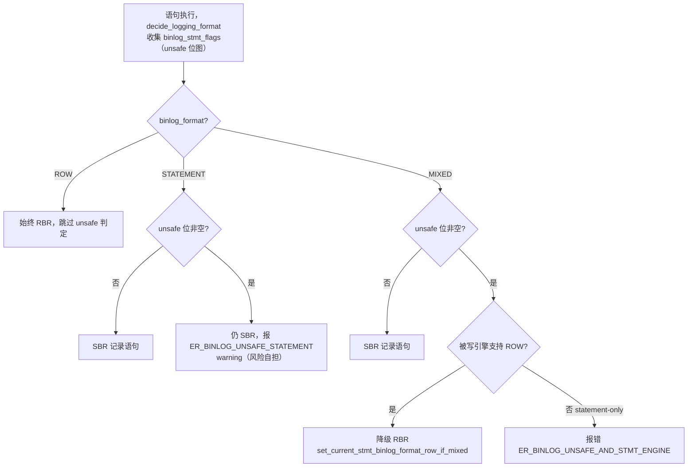

# SBR：语句级复制（binlog_format=STATEMENT/MIXED）

> 基于 MySQL 8.0.39 源码，剖析 SBR（Statement-Based Replication）这条与 RBR **并列**的 binlog 记录方式：`binlog_format` 三态、SBR 下 `Query_log_event` 的生成路径、**unsafe 判定**（`LEX::BINLOG_STMT_UNSAFE_*` 全集 + `THD::decide_logging_format`）、MIXED 降级逻辑、以及 `Intvar/Rand/User_var` 上下文事件如何保证从库结果一致。
>
> **边界**：本篇讲"语句如何被判定为 safe/unsafe、如何以语句原文进 binlog"。语句事件的字节布局见 [`binlog_event.md`](binlog_event.md)「Query_event」；RBR 的行镜像打包见 [`binlog.md`](binlog.md)「Row Image 记录过程」；从库如何 apply 这些事件见 [`replica.md`](replica.md)。

## 目录

- [概述](#概述)
- [理论基础](#理论基础)
- [核心实现](#核心实现)
- [★ 本机制里的工程实现技法](#-本机制里的工程实现技法)
- [可观测性](#可观测性)
- [Misc](#misc)
- [参考](#参考)

---

## 概述

### 是什么

binlog 是「逻辑日志」，它记录的不是物理字节变化，而是能让从库重放以达到主库一致结果的**可执行单元**。这个可执行单元有两种形态：

- **SBR**：记录 SQL 语句原文（一个 `Query_log_event`），从库按原文重新执行一遍；
- **RBR**：记录每一行变更的前后镜像（`Table_map_log_event` + `Rows_log_event`），从库按行应用。

`binlog_format` 三态：`STATEMENT`（全用 SBR）、`ROW`（全用 RBR）、`MIXED`（默认语句、不安全时降级行）。8.0 默认 `ROW`，且 STATEMENT/MIXED 已被标记为 deprecated。

### 用途与历史地位

SBR 是 MySQL 复制的**元老**（5.0 之前只有它），它的优势是 binlog 体积小、可读性强（`mysqlbinlog` 直接看到 SQL）。但在 GTID、并行复制、组复制这些依赖「确定性」的特性出现后，SBR 的非确定性缺陷被放大，RBR 上位。理解 SBR 的 unsafe 判定，是理解"为什么 MySQL 最终放弃 SBR"的关键，也是读懂大量复制 bug（主从不一致）的前提。

### 版本演进

| 阶段 | 变化 |
|------|------|
| 3.23~4.x | 只有 SBR，`Query_log_event` 是唯一 DML 载体 |
| 5.1 | 引入 RBR（`binlog_format=ROW`），行事件 V1 出现 |
| 5.1.12 | 引入 `MIXED`，默认从 STATEMENT 切到 MIXED |
| 5.7.7 | 默认 `ROW` |
| 8.0 | STATEMENT/MIXED 标记 deprecated，`binlog_format` 计划移除 |

---

## 理论基础

### 设计思想：SBR 为什么不安全

SBR 的核心假设是「**同样的 SQL 在主从库执行产生同样的结果**」。这个假设在并发、非确定函数、环境差异下会失效，导致复制漂移。源码把失效场景归纳为五类，对应 `LEX::BINLOG_STMT_UNSAFE_*` 的标志位：

1. **非确定函数**：`RAND()`、`UUID()`、`NOW()`、`SYSDATE()`、`LOAD_FILE()`、`USER()`、`FOUND_ROWS()` 等，从库重放时值不同；
2. **行序不确定**：`SELECT ... LIMIT` 无 `ORDER BY`，返回行集取决于存储引擎物理顺序，主从可能不同；
3. **系统变量差异**：`@@sql_mode`、`@@time_zone`、`@@sql_log_bin` 等主从配置不同，同一语句语义不同；
4. **子语句执行图差异**：存储过程 / 触发器 / UDF 内部的语句序列在主从可能不同（自增列分配顺序、非事务表写入顺序）；
5. **非事务表混合**：MyISAM 等无法原子回滚，重放时序不同导致漂移。

设计上的回应是**「能判定就判定，判不干净就降级」**：对每一条语句做 unsafe 扫描，STATEMENT 模式下 unsafe 只报 warning（风险自担），MIXED 模式下 unsafe 自动降级为 ROW。

### 算法与数据结构：位图标志聚合

unsafe 判定不返回单一结论，而是用一个 **32 位位图** `binlog_stmt_flags` 聚合所有命中的 unsafe 类别：

```cpp
enum_binlog_stmt_unsafe {
  BINLOG_STMT_UNSAFE_LIMIT = 0,                    // LIMIT 无 ORDER BY
  BINLOG_STMT_UNSAFE_SYSTEM_TABLE,                 // 系统表
  BINLOG_STMT_UNSAFE_AUTOINC_COLUMNS,              // 自增列
  BINLOG_STMT_UNSAFE_UDF,                          // UDF
  BINLOG_STMT_UNSAFE_SYSTEM_VARIABLE,              // 系统变量
  BINLOG_STMT_UNSAFE_SYSTEM_FUNCTION,              // 系统函数
  BINLOG_STMT_UNSAFE_NONTRANS_AFTER_TRANS,         // 事务表写后非事务表
  BINLOG_STMT_UNSAFE_MULTIPLE_ENGINES_AND_SELF_LOGGING_ENGINE,
  BINLOG_STMT_UNSAFE_MIXED_STATEMENT,              // MIXED 下的混合语句
  BINLOG_STMT_UNSAFE_INSERT_IGNORE_SELECT,
  BINLOG_STMT_UNSAFE_INSERT_SELECT_UPDATE,
  BINLOG_STMT_UNSAFE_WRITE_AUTOINC_SELECT,
  BINLOG_STMT_UNSAFE_REPLACE_SELECT,
  BINLOG_STMT_UNSAFE_CREATE_IGNORE_SELECT,
  BINLOG_STMT_UNSAFE_CREATE_REPLACE_SELECT,
  BINLOG_STMT_UNSAFE_CREATE_SELECT_AUTOINC,
  BINLOG_STMT_UNSAFE_UPDATE_IGNORE,
  BINLOG_STMT_UNSAFE_INSERT_TWO_KEYS,
  BINLOG_STMT_UNSAFE_AUTOINC_NOT_FIRST,
  BINLOG_STMT_UNSAFE_FULLTEXT_PLUGIN,
  BINLOG_STMT_UNSAFE_SKIP_LOCKED,                  // 8.0 新增
  BINLOG_STMT_UNSAFE_NOWAIT,                       // 8.0 新增
  BINLOG_STMT_UNSAFE_XA,                           // XA 语句
  BINLOG_STMT_UNSAFE_DEFAULT_EXPRESSION_IN_SUBSTATEMENT,
  BINLOG_STMT_UNSAFE_ACL_TABLE_READ_IN_DML_DDL,    // DML/DDL 读 ACL 表
  BINLOG_STMT_UNSAFE_CREATE_SELECT_WITH_GIPK,      // GIPK（8.0.30 隐藏主键）
  BINLOG_STMT_UNSAFE_COUNT
};
```

这个枚举（声明在 `sql/sql_lex.h` 的 `LEX` 类里）是 SBR unsafe 判定的**权威清单**，每个枚举值对应一个错误码（`LEX::binlog_stmt_unsafe_errcode[]` 数组，如 `ER_BINLOG_UNSAFE_LIMIT`）。`set_stmt_unsafe()` 用 `binlog_stmt_flags |= (1U << unsafe_type)` 置位。

注意它**不是** `enum enum_binlog_stmt_unsafe`（这个旧名字在 `sql/binlog.h` 里已不存在），而是 `LEX` 类的嵌套枚举——这是 8.0 把判定标志收敛到 `LEX`（语法树解析上下文）的结果。

### 他库对比

- **PostgreSQL 逻辑复制**：默认只做 RBR（wal2json / pgoutput 都是行级），没有 SBR——因为 PG 从不假设"语句可重放"。MySQL 保留 SBR 是历史包袱，也是它 deprecated 的原因。
- **Oracle GoldenGate / MySQL binlog**：SQL 捕获（statement capture）同样存在非确定性问题，OGG 的做法是「尽量转行 + 冲突检测」，与 MySQL MIXED 的「降级为行」思路同源。

---

## 核心实现

### 主链路：SBR 与 RBR 在写入路径上的分岔

一条 DML（`UPDATE/DELETE/INSERT`）执行时，底层 handler 的 `ha_write_row/ha_update_row/ha_delete_row` 总会走到 `binlog_log_row()`，但该函数内部先 `check_table_binlog_row_based()`：若是 ROW 记录则写行事件，若是 STMT 记录则**跳过行事件**，之后由 `THD::binlog_query()` 统一补写语句原文。这就是分岔的本质——**SBR 不是"另一条独立路径"，而是"跳过行事件 + 事后补一条 Query"**。

```
handler::ha_update_row / ha_delete_row / ha_write_row
  → binlog_log_row(...)
    → check_table_binlog_row_based()          // 判断当前语句该用 ROW 还是 STMT
      → 若 STMT：直接 return（不写行事件）
语句执行完成后：
  → THD::binlog_query(STMT_QUERY_TYPE, ...)   // 补写 Query_log_event
    → Query_log_event 构造
    → mysql_bin_log.write_event(&qinfo)
```

### binlog_format 三态的参数语义

`enum enum_binlog_format`（`sql/system_variables.h`）：`MIXED=0 / STMT=1 / ROW=2 / UNSPEC=3`。`binlog_format` 参数（`sql/sys_vars.cc`）：

- 作用域 `SESSION_VAR`（可 session 级动态改），默认 `ROW`；
- `DEPRECATED_VAR("")`：STATEMENT/MIXED 已废弃；
- `NOT_IN_BINLOG`：这个变量本身不写进 binlog（否则从库 apply 时会影响格式判断，产生递归依赖）；
- `ON_UPDATE(fix_binlog_format_after_update)`：切换格式时刷新 pending rows event 等状态。

### SBR 下 Query_log_event 的生成：THD::binlog_query

`THD::binlog_query`（`sql/binlog.cc`）是语句进 binlog 的**唯一入口**，签名：

```cpp
int THD::binlog_query(THD::enum_binlog_query_type qtype, const char *query_arg,
                      size_t query_len, bool is_trans, bool direct,
                      bool suppress_use, int errcode);
```

内部逻辑分三段：

**① 过滤与刷 pending rows event**

```cpp
if (get_binlog_local_stmt_filter() == BINLOG_FILTER_SET) return 0;  // 本地过滤：不写
if (this->locked_tables_mode <= LTM_LOCK_TABLES)
  if (int error = binlog_flush_pending_rows_event(true, is_trans))
    return error;    // 先把之前 pending 的行事件带 STMT_END_F 刷掉
```

`binlog_flush_pending_rows_event(true, ...)` 是 RBR/SBR 切换的关键衔接：如果当前语句前半段已经以 ROW 记录（MIXED 下事务内混合），在补写语句前必须把 pending 行事件封口（`STMT_END_F`），否则行事件和 Query 事件会交错破坏事务边界。

**② unsafe warning 的三点打印策略**

```cpp
if ((variables.option_bits & OPTION_BIN_LOG) && sp_runtime_ctx == nullptr &&
    !binlog_evt_union.do_union)
  issue_unsafe_warnings();
```

注释点明了一个精妙的设计：unsafe warning **不能**在 `decide_logging_format()`（判定阶段）打印，因为那时还不知道语句最终会不会被写进 binlog（可能被过滤）。所以 warning 延迟到「确实要写」时才打印，且分三个打印点：存储过程调用、函数调用、以及这里的顶层语句。

**③ 分派 qtype**

```cpp
switch (qtype) {
  case THD::ROW_QUERY_TYPE:
    if (is_current_stmt_binlog_format_row()) return 0;  // 已用 ROW 记录，不再写语句
    [[fallthrough]];
  case THD::STMT_QUERY_TYPE: {
    Query_log_event qinfo(this, query_arg, query_len, is_trans, direct,
                          suppress_use, errcode);
    int error = mysql_bin_log.write_event(&qinfo);
    binlog_table_maps = 0;   // Query 事件后，从库侧 table map 失效，重置计数
    return error;
  }
}
```

两个 qtype 的语义：

- `ROW_QUERY_TYPE`：语句**可能**用 ROW 也可能用 STMT。若 `is_current_stmt_binlog_format_row()` 为真（MIXED 已判定降级为 ROW，行事件已写），直接 return——**不重复写语句**；否则 fallthrough 走语句记录。
- `STMT_QUERY_TYPE`：语句**必须**用 STMT（典型是 DDL），强制写语句原文。

`binlog_table_maps = 0` 这行是 RBR 的一个关键不变量：Query 事件在从库会清空 table map（`Table_map_log_event` 的生命周期只在相邻行事件之间有效），所以写 Query 后主库也同步清零计数，避免误以为还有有效的 table map。

### unsafe 判定：THD::decide_logging_format

**决策总览**（`binlog_format` 三态 × unsafe 位图 → 后果分岔）：



**先纠正命名**：`binlog_stmt_unsafe_for_binlog` 是 MySQL 5.x 时代的旧函数名，在 8.0.39 里 `grep` 零命中——它的职责已完全被 **`THD::decide_logging_format(Table_ref *tables)`** 取代（`sql/binlog.cc`）。unsafe 枚举的判定、降级决策全部集中在这个函数及其辅助函数里。下面以 8.0.39 实际源码为准逐段剖析。

**签名与副作用**：

```cpp
int THD::decide_logging_format(Table_ref *tables);
```

- `tables`：当前语句的全局表链表（`lex->query_tables` 经 `next_global` 串起来）；
- 返回 `0` 成功 / `-1` 出错 / `1` GTID 不兼容；
- **副作用**（这才是它的真正产出）：
  1. 向 `lex->binlog_stmt_flags` 追加 unsafe 位（`lex->set_stmt_unsafe(...)`）；
  2. 调 `set_current_stmt_binlog_format_row_if_mixed()` 把 `THD::current_stmt_binlog_format` 置为 ROW —— 即**决定当前语句用 ROW 还是 STMT**；
  3. 设置 `m_binlog_filter_state`（语句是否被本地过滤）；
  4. 累积 `THD::binlog_unsafe_warning_flags`（供后续 `binlog_query` 发 warning）。

> 关键：`decide_logging_format` 只做「决策」，不写 binlog。真正的写入在 `binlog_query`（STMT）或 `binlog_log_row`（ROW）。

**前置门槛**：binlog 未开、`sql_log_bin=0`、或 STMT 模式下库被过滤时，整个决策直接跳过（只做 GTID 表的 warn_or_err 检查）。

**引擎能力位初始化**：遍历前先把两个能力位图置好——`flags_write_all_set`（**交集**，初值 `HA_BINLOG_ROW_CAPABLE | HA_BINLOG_STMT_CAPABLE`，表示"所有被写引擎共同具备的能力"）和 `flags_write_some_set`（**并集**，表示"至少一个被写引擎具备的能力"）。这个交集/并集的双位图，正是"statement-only / row-only / 双能力"引擎分岔的判据来源。

**阶段一：解析期已标好的 unsafe**（仅 `binlog_format != ROW && tables != NULL` 时执行）：

| 触发条件 | 设置的 unsafe 位 |
|---|---|
| 写表含 auto_increment 且语句含 query_block（SELECT） | `BINLOG_STMT_UNSAFE_WRITE_AUTOINC_SELECT` |
| 写表的 auto_increment 不是 PK 第一列 | `BINLOG_STMT_UNSAFE_AUTOINC_NOT_FIRST` |
| 需要 prelocking 且子语句写含 auto_increment 的表 | `BINLOG_STMT_UNSAFE_AUTOINC_COLUMNS` |
| prelocking 且子语句写含非确定默认值表达式的表 | `BINLOG_STMT_UNSAFE_DEFAULT_EXPRESSION_IN_SUBSTATEMENT` |
| DML/DDL 读取 ACL 表（SE 跳过行锁） | `BINLOG_STMT_UNSAFE_ACL_TABLE_READ_IN_DML_DDL` |

这些是**解析期**就能判定的（不依赖运行时表状态），由 `has_write_table_with_auto_increment_and_query_block` / `has_write_table_auto_increment_not_first_in_pk` / `has_acl_table_read` 等辅助函数判定。

**阶段二：逐表遍历，收集引擎能力 + 标记表访问类型**。对每个非 placeholder 表：

1. **non-replicated 表**（`no_replicate`，如 `gtid_executed`/`performance_schema`）：置 `BINLOG_STMT_UNSAFE_SYSTEM_TABLE`，写操作计入 `non_replicated_tables_count` 后 `continue`；
2. **写表**（`lock_descriptor().type >= TL_WRITE_ALLOW_WRITE`）：
   - 更新 `write_to_some_transactional_table` / `write_to_some_non_transactional_table`；
   - 跨引擎写 → `multi_write_engine = true`；
   - `set_stmt_accessed_table(...)`：临时表 vs 永久表 × trans vs non-trans 四象限，对应 `STMT_WRITES/READS_{TRANS,NON_TRANS,TEMP_TRANS,TEMP_NON_TRANS}_TABLE` 枚举；
   - `flags_write_all_set &= flags; flags_write_some_set |= flags;`（交集/并集更新）；
   - FULLTEXT 插件 → `BINLOG_STMT_UNSAFE_FULLTEXT_PLUGIN`；
   - `INSERT ... ON DUPLICATE KEY UPDATE` 且唯一键 > 1 → `BINLOG_STMT_UNSAFE_INSERT_TWO_KEYS`；
3. **读表**：`set_stmt_accessed_table(...)`，跨引擎访问 → `multi_access_engine`。

> 关键：`stmt_accessed_table_flag` 是 `LEX` 的成员位图，它是 `is_mixed_stmt_unsafe` 的输入。

**阶段三：事务上下文判定**。综合 `multi_stmt_trans`（是否多语句事务）、`trans_table`（是否更新过事务表）、`binlog_direct`（`binlog_direct_non_trans_update`）、`tx_isolation`，做出最终降级决策：

```cpp
const bool multi_stmt_trans = lex->sql_command != SQLCOM_CREATE_TABLE &&
                              in_multi_stmt_transaction_mode();
bool trans_table = trans_has_updated_trans_table(this);
bool binlog_direct = variables.binlog_direct_non_trans_update;

if (lex->is_mixed_stmt_unsafe(multi_stmt_trans, binlog_direct, trans_table, tx_isolation))
  lex->set_stmt_unsafe(LEX::BINLOG_STMT_UNSAFE_MIXED_STATEMENT);
else if (multi_stmt_trans && trans_table && !binlog_direct &&
         lex->stmt_accessed_table(LEX::STMT_WRITES_NON_TRANS_TABLE))
  lex->set_stmt_unsafe(LEX::BINLOG_STMT_UNSAFE_NONTRANS_AFTER_TRANS);
```

末尾调 `set_current_stmt_binlog_format_row_if_mixed()`：若 `binlog_format == MIXED` 且 `binlog_stmt_flags` 有 unsafe 位，就把 `current_stmt_binlog_format` 置为 ROW——这是 MIXED「静默降级」的最终落点。

**后果路径的本质区别**：

- **MIXED + 支持 ROW**：unsafe 语句**静默降级为 ROW**（`set_current_stmt_binlog_format_row_if_mixed` 生效）；
- **STATEMENT**：unsafe 语句只能报 `ER_BINLOG_UNSAFE_STATEMENT` warning，**仍以语句记录**（`binlog_unsafe_warning_flags` 累积，`issue_unsafe_warnings` 翻译成错误消息）；
- **statement-only 引擎 + MIXED + unsafe**：既不能降级（引擎不支持 ROW）、又不能安全语句记录 → **直接报错**（`ER_BINLOG_UNSAFE_AND_STMT_ENGINE`）；
- **多引擎 + 自记日志引擎**（`HA_HAS_OWN_BINLOGGING`）：`ER_BINLOG_MULTIPLE_ENGINES_AND_SELF_LOGGING_ENGINE`。

`binlog_unsafe_warning_flags` 是 warning 聚合位图，最终由 `issue_unsafe_warnings()` 统一翻译成对应的 `ER_BINLOG_UNSAFE_*` 错误消息。

### MIXED 降级：is_mixed_stmt_unsafe 与 is_current_stmt_binlog_format_row

MIXED 的"自动降级"由两个层次判定：

**语句级 unsafe → 整条用 ROW**。`LEX::is_mixed_stmt_unsafe()` 接收四个上下文（`multi_stmt_trans` / `binlog_direct` / `trans_table` / `tx_isolation`），核心是检查"语句里是否混入了非事务表 + 事务表 + 隔离级别不匹配"这类无法用语句安全重放的情况。它的输入是 `LEX::stmt_accessed_table_flag`（`decide_logging_format` 阶段二逐表遍历时置的位图），即「事务表/非事务表 × 读/写」的四象限访问记录。

**降级的最终落点**是 `THD::set_current_stmt_binlog_format_row_if_mixed()`：当 `binlog_format == MIXED` 且 `lex->binlog_stmt_flags` 有 unsafe 位时，把 `THD::current_stmt_binlog_format` 置为 `BINLOG_FORMAT_ROW`。这个成员就是「当前语句最终用什么格式」的缓存——`binlog_log_row` 里 `check_table_binlog_row_based` 看它决定写不写行事件，`binlog_query` 里 `ROW_QUERY_TYPE` 分支看它决定补不补语句，两处读的是**同一个成员**，天然保证结论一致。

**事务级 unsafe → 整个事务用 ROW**。`THD::is_current_stmt_binlog_format_row()` 返回当前语句是否应 ROW 记录，它是 `binlog_query` 里 `ROW_QUERY_TYPE` 分支判断"是否已经用行记录了"的依据。判定结果缓存在 THD 里，保证同一条语句在 `binlog_log_row`（写行事件时）和 `binlog_query`（补写语句时）两处看到**一致**的结论——否则会出现"行事件和语句事件都写"或"都不写"的 bug。

`binlog_direct_non_transactional_updates`（`binlog_direct_non_trans_update`）是 MIXED/SBR 时代处理"非事务表混合事务"的开关：开启后，非事务表的更新直接写 binlog 而非先入事务 cache，避免"事务表提交后非事务表再失败"导致的漂移。

### 上下文事件：Intvar / Rand / User_var

SBR 的致命伤是「语句依赖的 SESSION 状态在主从不一致」。三个上下文事件就是为此而生，在语句事件**之前**写入 binlog，让从库 apply 前先恢复这些状态：

| 事件 | 恢复什么 | 生成时机（binlog.cc 里 binlog_query 之前） |
|------|----------|------|
| `Intvar_log_event`（LAST_INSERT_ID） | `LAST_INSERT_ID()` 的返回值 | `first_successful_insert_id_in_prev_stmt_for_binlog` 非 0 时 |
| `Intvar_log_event`（INSERT_ID） | 自增列插入值 | `auto_inc_intervals_in_cur_stmt_for_binlog.minimum()` |
| `Rand_log_event` | `RAND()` 的 seed1/seed2 | `rand_saved_seed1/2` 已保存时 |
| `User_var_log_event` | 用户变量值 | 语句引用了 `@var` 时 |

生成逻辑（节选）：

```cpp
// 写语句前，先补上下文事件
if (thd->first_successful_insert_id_in_prev_stmt_for_binlog > 0) {
  Intvar_log_event e(thd, LAST_INSERT_ID_EVENT,
                     first_successful_insert_id_in_prev_stmt_for_binlog, ...);
  cache_data->write_event(&e);
}
if (thd->auto_inc_intervals_in_cur_stmt_for_binlog.minimum() != 0) {
  Intvar_log_event e(thd, INSERT_ID_EVENT, auto_inc_intervals...minimum(), ...);
  cache_data->write_event(&e);
}
if (thd->rand_used) {
  Rand_log_event e(thd, thd->rand_saved_seed1, thd->rand_saved_seed2, ...);
  cache_data->write_event(&e);
}
// 用户变量逐个写 User_var_log_event
```

这些事件都由 `binlog_start_trans_and_stmt`（`sql/binlog.cc`）在事务/语句开始时初始化 cache，随后在语句事件前按需写入。它们的字段格式见 [`binlog_event.md`](binlog_event.md)「语句事件」。

**从库侧 apply（逐行）**：三个事件的 `do_apply_event` 都只写 THD 上的状态字段，**不触碰存储引擎、不写任何数据**——这是"上下文事件不触发真正数据变更"的本质。

`Intvar_log_event::do_apply_event`（`sql/log_event.cc`）：

```cpp
int Intvar_log_event::do_apply_event(Relay_log_info const *rli) {
  const_cast<Relay_log_info *>(rli)->set_flag(Relay_log_info::IN_STMT);  // 进入语句上下文
  if (rli->deferred_events_collecting) return rli->deferred_events->add(this);  // MTS 延迟收集
  switch (type) {
    case LAST_INSERT_ID_EVENT:
      thd->first_successful_insert_id_in_prev_stmt = val;   // 写回 LAST_INSERT_ID
      break;
    case INSERT_ID_EVENT:
      thd->force_one_auto_inc_interval(val);                // 强制自增从 val 开始
      break;
  }
  return 0;
}
```

`Rand_log_event::do_apply_event`：

```cpp
int Rand_log_event::do_apply_event(Relay_log_info const *rli) {
  const_cast<Relay_log_info *>(rli)->set_flag(Relay_log_info::IN_STMT);
  if (rli->deferred_events_collecting) return rli->deferred_events->add(this);
  thd->rand.seed1 = (ulong)seed1;   // ★ 写回全局随机数生成器状态（不是 rand_saved_seed）
  thd->rand.seed2 = (ulong)seed2;
  return 0;
}
```

**一个容易混淆的点**：从库 apply 时 `Rand_log_event` 写回的是 **`thd->rand.seed1/seed2`**（全局随机数生成器的当前状态），而**生成侧**（主库）采集的是 `thd->rand_saved_seed1/2`（语句开始前的保存值）。二者对象不同——主库 `RAND()` 从 `rand` 生成，`binlog_query` 前把当前 `rand` 状态存进 `rand_saved_seed1/2` 写进事件；从库收到事件后，把 seed 灌回 `thd->rand`，让后续 `RAND()` 从同一状态继续，从而复现相同序列。

`User_var_log_event::do_apply_event` 更复杂：先 `get_charset(charset_number)` 还原变量字符集，再把 name/value 用 `set_var` 恢复成 `user_var_entry`；若处于 MTS 延迟收集模式（`deferred_events_collecting`），则把自身加入 `rli->deferred_events` 队列，**延迟到 `slave_execute_deferred_events` 统一执行**，同时保存/恢复 `query_id` 以重建原始时间上下文。

三个事件共同的两个设计点：

1. **`IN_STMT` 标志**：apply 时都先 `set_flag(Relay_log_info::IN_STMT)`，表示"从库处于某个语句的上下文内"，这个标志由后续的 Query_log_event 消费/清除——它告诉复制框架，上下文事件不构成完整语句边界、不触发事务结束判定。
2. **`deferred_events` 延迟队列**（MTS 协调线程）：并行复制下，上下文事件不立即 apply，而是交给协调线程收集，等对应的 Query_log_event 到达时统一按序执行，避免"上下文事件"和"语句事件"被不同 worker 错序执行。

---

## ★ 本机制里的工程实现技法

### 一、位图标志聚合 + 枚举到错误码的映射

unsafe 判定用「枚举值 = 位图下标 = 错误码数组下标」三位一体：

```cpp
binlog_stmt_flags |= (1U << unsafe_type);            // 置位
for (int unsafe_type = 0; unsafe_type < BINLOG_STMT_UNSAFE_COUNT; unsafe_type++)
  if (unsafe_flags & (1 << unsafe_type))
    my_error(ER_BINLOG_UNSAFE_AND_STMT_ENGINE, MYF(0),
             ER_THD_NONCONST(current_thd, LEX::binlog_stmt_unsafe_errcode[unsafe_type]));
```

枚举值天然就是位图下标，`binlog_stmt_unsafe_errcode[]` 用同一顺序存错误码，避免维护 switch-case 的映射表。代价：新增 unsafe 类别必须同步改枚举和错误码数组两处（且顺序必须一致），否则报错错位。

### 二、警告延迟打印（判定与执行解耦）

unsafe warning 不在判定阶段（`decide_logging_format`）打印，而延迟到「确实写 binlog」的三个点。这是「判定结论」和「是否生效」分离的设计——判定时还不知道语句会不会被过滤，提前打印会产生误报。代价：三个打印点（存储过程/函数/顶层语句）要各自判断上下文，逻辑分散。

### 三、SBR/RBR 的「事后补写」而非「二选一分派」

SBR 不是独立路径，而是"行事件路径**跳过** + 事后 `binlog_query` 补写"。这带来一个微妙约束：**同一条语句的 ROW/STMT 结论必须在两处一致**（`is_current_stmt_binlog_format_row()` 缓存）。这是最容易出 bug 的地方——一旦 `binlog_log_row` 时判定 ROW、`binlog_query` 时判定 STMT，就会双写或缺写。

| 特性 | 用在哪 | 收益 | 代价 |
|---|---|---|---|
| 位图聚合 unsafe | `binlog_stmt_flags` | O(1) 判定、天然可组合 | 枚举与错误码数组顺序强耦合 |
| 延迟打印 warning | 三点打印 | 不误报被过滤的语句 | 逻辑分散三处 |
| 事后补写 Query | `binlog_query` | 复用 RBR 主路径 | ROW/STMT 结论一致性难保证 |
| 表级能力分岔 | `HA_BINLOG_STMT_CAPABLE/ROW_CAPABLE` | 兼容 statement-only 引擎 | 分支矩阵复杂（7 种后果） |

---

## 可观测性

### 系统变量

| 变量 | 默认 | 说明 |
|------|------|------|
| `binlog_format` | `ROW` | STATEMENT/ROW/MIXED，SESSION 作用域，已 deprecated |
| `binlog_direct_non_transactional_updates` | OFF | 非事务表更新是否直接写 binlog（SBR/MIXED 时代遗留） |

### 观测手段

| 我想看 | 手段 |
|--------|------|
| 语句是否被降级为 ROW | 开启 `binlog_format=MIXED`，执行疑似 unsafe 语句，看 warning（`ER_BINLOG_UNSAFE_STATEMENT`） |
| 一条语句最终记录形态 | `mysqlbinlog -vv`，看是 `Query` 还是 `Table_map`+`Rows` |
| 上下文事件 | `mysqlbinlog -vv` 里的 `SET INSERT_ID=...` / `SET @@session...` / `/*!*/` |

---

## Misc

### 扩展点：新增一个 unsafe 类别

1. 在 `LEX::enum_binlog_stmt_unsafe` 末尾（`BINLOG_STMT_UNSAFE_COUNT` 前）加枚举值；
2. 在 `LEX::binlog_stmt_unsafe_errcode[]` 数组的**同一位置**加错误码；
3. 在 `THD::decide_logging_format` 的判定逻辑里加触发条件（`set_stmt_unsafe(新枚举)`）。

### 坑与已知缺陷

- **`enum enum_binlog_stmt_unsafe` 不存在**：8.0 把枚举收敛为 `LEX` 类的嵌套枚举，老资料（内核月报）里的 `enum_binlog_stmt_unsafe` 是 5.6/5.7 的名字，照抄会编译不过。
- **STATEMENT 模式的 unsafe 只是 warning**：`ER_BINLOG_UNSAFE_STATEMENT` 是 warning 不是 error，语句照样以 SBR 记录——很多主从不一致就是用户忽略了这些 warning。
- **statement-only 引擎 + MIXED + unsafe 直接报错**：不是降级也不是 warning，是 `ER_BINLOG_UNSAFE_AND_STMT_ENGINE`，因为引擎不支持 ROW，无路可退。
- **`binlog_table_maps = 0` 不变量**：Query 事件会清空 table map，若主库不重置计数，后续 RBR 会误认为 table map 仍有效。

---

## 参考

**官方文档**
- *MySQL 8.0 Reference Manual → Binary Logging Formats*（STATEMENT/ROW/MIXED 的优劣与 unsafe 场景清单）
- *MySQL 8.0 Reference Manual → Choosing Between Row-Based and Statement-Based Replication*

**相关文档**
- 语句事件（Query/Intvar/Rand/User_var）的字节布局见 [`binlog_event.md`](binlog_event.md)
- RBR 行镜像打包见 [`binlog.md`](binlog.md)「Row Image 记录过程」
- 从库 apply 见 [`replica.md`](replica.md)
