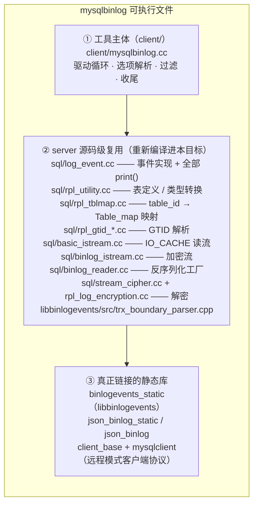
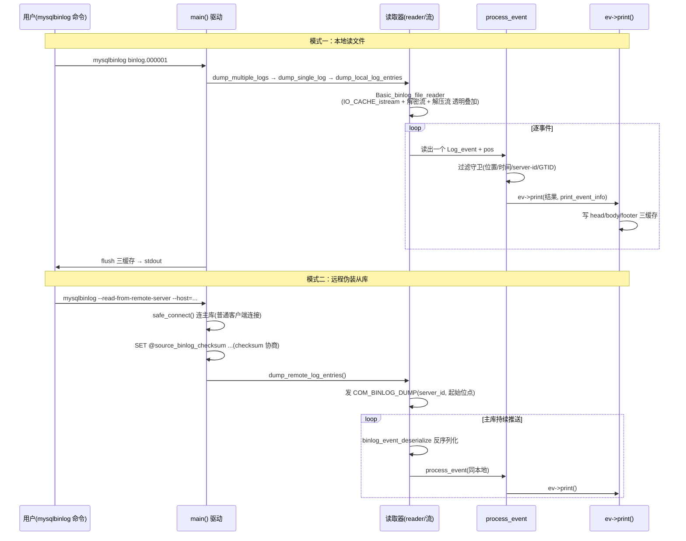
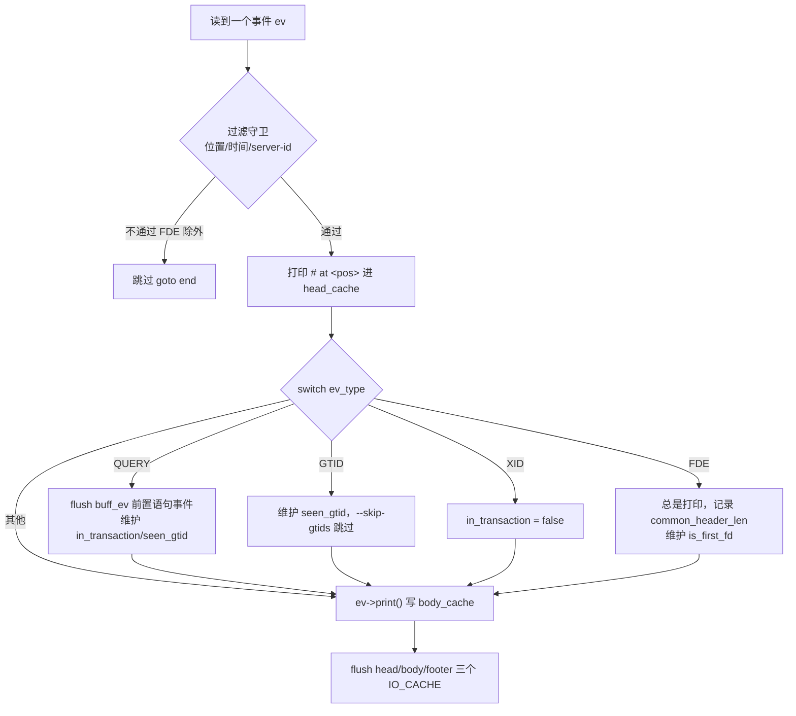

# mysqlbinlog：binlog 解析与还原工具

> 基于 MySQL 8.0.39 源码，剖析 `mysqlbinlog` 工具的架构、读取链路、事件打印机制、row 解码（base64 / DECODE-ROWS）、过滤选项与收尾逻辑。核心源码在 `client/mysqlbinlog.cc`（约 126KB，单文件主逻辑）+ `sql/log_event.cc`（各事件的 `print()` 实现）。
>
> **边界**：本篇讲"如何把 binlog 反序列化并打印成可回放的 SQL/文本"。事件的反序列化/类体系见 [`binlog_event.md`](binlog_event.md)，事件字节格式见同篇「各事件类型格式」，binlog 加密/压缩的解密入口见 [`binlog_encryption.md`](binlog_encryption.md) 和 [`binlog.md`](binlog.md)。

## 目录

- [概述](#概述)
- [理论基础](#理论基础)
- [核心实现](#核心实现)
- [★ 本机制里的工程实现技法](#-本机制里的工程实现技法)
- [可观测性](#可观测性)
- [Misc](#misc)
- [参考](#参考)

---

## 概述

### 是什么

`mysqlbinlog` 是 MySQL 自带的 binlog 解析/还原工具。它把二进制的 binlog 文件反序列化，输出成**可回放的 SQL 文本**（或原样二进制）。它是排查数据问题、做基于 binlog 的恢复、审计 DDL/DML 的首选工具。

### 两种工作模式

- **本地模式**（默认）：直接读磁盘上的 binlog 文件；
- **远程模式**（`--read-from-remote-server`）：mysqlbinlog **伪装成一个从库**，连主库发送 `COM_BINLOG_DUMP`，边收边打印，等效于"实时看主库 binlog"。

### 与 mysqld 的关系（最重要的架构事实）

mysqlbinlog **不是**只用 libbinlogevents（纯数据层）来解析事件——它直接把 mysqld 的事件实现 `sql/log_event.cc` 编译进自己（见 `client/CMakeLists.txt` 的 `MYSQLBINLOG_SOURCES`）。这决定了：

- 它复用 server 侧 `Log_event` 各子类的 **`print()` 能力**（打印 SQL/注释），而 libbinlogevents 只有事件 enum、常量、序列化，**没有** `print()`；
- 打印结果与 server 的理解**天然一致**（charset 转换、checksum、`table_map` 映射都走同一套代码）；
- 代价是要连带编译 `rpl_utility.cc`、`rpl_tblmap.cc`、`rpl_gtid_*.cc`、`binlog_istream.cc`、`binlog_reader.cc`、`stream_cipher.cc`、`rpl_log_encryption.cc` 等 server 侧依赖，并打 `DISABLE_PSI_MUTEX`（client 侧没有 mysqld 的 PFS 运行时），还要补一批"桩"全局变量。

---

## 理论基础

### 设计思想：为什么复用 server 的 print 而非自己写解析

**方案 A（看似更轻）**：mysqlbinlog 只用 libbinlogevents 反序列化，自己写一套打印逻辑。缺点：事件类型的打印规则（charset 转换、`table_map` 映射、base64 编码、版本注释）极其琐碎，自己写必然与 server 理解分叉，且要同步维护几十个事件的打印。

**方案 B（实际采用）**：直接把 `sql/log_event.cc` 编译进 client。打印逻辑只在 server 侧维护一份，mysqlbinlog 直接调用 `ev->print()`。代价是拖入大量 server 依赖，但这些依赖（`rpl_utility`、`rpl_tblmap`、`binlog_reader`）本身就是"无 mysqld 运行时也能独立工作的纯逻辑"，用 `DISABLE_PSI_MUTEX` + 桩全局变量即可剥离对 mysqld 运行时的耦合。

这是「**工具复用核心库**」的典型决策：宁可背上编译依赖，也不让解析/打印逻辑在两处重复实现、产生不一致。

### 输出为什么能被任意版本 server 正确执行：版本注释 `/*!...*/`

mysqlbinlog 输出的 SQL 要能被**不同版本的 server** 重放。它用 MySQL 特有的**可执行注释**（executable comment）`/*!xxxxx SQL */` 包裹版本相关语句——版本号 `xxxxx` 表示"仅 >= 该版本的 server 才执行注释内 SQL"。例如：

```sql
/*!50530 SET @@SESSION.PSEUDO_SLAVE_MODE=1*/;  -- 5.5.30+ 才执行
```

版本号由 `Comments_to_show`（`log_event.cc` 的 `get_version()` / `server_version` 计算）动态生成，保证输出的 SQL 在新老版本 server 上都能正确执行（老版本忽略不认识的注释，新版本执行）。

### 数据流：三个 IO_CACHE 的冲刷顺序

`PRINT_EVENT_INFO` 维护**三个 IO_CACHE**：`head_cache`（`# at`、hexdump、注释头）、`body_cache`（事件本体）、`footer_cache`（收尾）。它们不是同时冲刷，而是按「头 → 体 → 尾」顺序，确保 `# at <pos>` 一定出现在它描述的事件之前。这个三段缓存是 mysqlbinlog 输出正确性的基础。

---

## 核心实现

### 架构与编译构成

#### ★ 先回答一个关键问题：server 的文件是"静态链接"进 mysqlbinlog 的吗？

**不是静态链接，而是「源码级复用」（source-level reuse）**。二者有本质区别：

- **静态链接** = 把已经编译好的 `libmysqld.a`（或某个 server 库）在链接阶段并入 mysqlbinlog。但 MySQL 8.0 **根本不产出这样一个 server 库**（5.x 曾有过 `libmysqld` 嵌入式库，8.0 已移除），所以无库可链。
- **源码级复用** = 把 `sql/log_event.cc` 等 server 的 `.cc` **源文件直接加进 mysqlbinlog 这个可执行目标的源文件列表**（`client/CMakeLists.txt` 的 `MYSQLBINLOG_SOURCES`），由编译器**为 mysqlbinlog 重新编译一遍**，编出的目标文件直接并入 mysqlbinlog 二进制。

换句话说：`sql/log_event.cc` 这份源码被**编译了两次**——一次编进 `mysqld`，一次编进 `mysqlbinlog`，两份产物各自独立、互不链接。mysqlbinlog 里的是"为 client 重编译的 server 代码"，靠编译定义 `DISABLE_PSI_MUTEX` 剥离对 mysqld 运行时的依赖。

真正在**链接阶段**并入的，只有几个库（见下图的 ③）。

#### 架构分层图



关键编译定义：

- **`DISABLE_PSI_MUTEX`**：让 `sql/*.cc` 里引用 mysqld PFS（performance_schema）互斥/原子操作的宏展开成空操作，从而在无 mysqld 运行时的 client 里编译通过；
- 头文件路径加 `sql/`（让 client 代码能 `#include "log_event.h"`）；
- 还需补一批"桩"全局变量（`sql/*.cc` 引用了、但 client 里不存在的 mysqld 全局符号，由 `mysqlbinlog.cc` 或补丁定义空实现）。

`PRINT_EVENT_INFO` 定义在 `sql/log_event.h`（**不在** `mysqlbinlog.h`，后者只放少量 extern 与错误函数声明）。它是连接驱动循环（mysqlbinlog.cc）与打印实现（log_event.cc）的**桥梁状态对象**，核心成员：

- **去重缓存**（避免重复输出 `SET`/`USE`）：`db[]`、`sql_mode`、`charset[]`、`auto_increment_*`、`time_zone_str` 等——记录"上次打印事件"的上下文，只有变化了才重新输出 `SET` 语句；
- **打印设置**：`short_form`、`base64_output_mode`、`skip_gtids`、`verbose`、`delimiter[]`、`hexdump_from`、`common_header_len`；
- **Table_map 缓存**：`m_table_map`（正常表映射）+ `m_table_map_ignored`（被过滤的表映射）；
- **三个 IO_CACHE**：`head_cache` / `body_cache` / `footer_cache` + `have_unflushed_events`。

`PRINT_EVENT_INFO` 定义在 `sql/log_event.h`（**不在** `mysqlbinlog.h`，后者只放少量 extern 与错误函数声明）。它是连接驱动循环（mysqlbinlog.cc）与打印实现（log_event.cc）的**桥梁状态对象**，核心成员：

- **去重缓存**（避免重复输出 `SET`/`USE`）：`db[]`、`sql_mode`、`charset[]`、`auto_increment_*`、`time_zone_str` 等——记录"上次打印事件"的上下文，只有变化了才重新输出 `SET` 语句；
- **打印设置**：`short_form`、`base64_output_mode`、`skip_gtids`、`verbose`、`delimiter[]`、`hexdump_from`、`common_header_len`；
- **Table_map 缓存**：`m_table_map`（正常表映射）+ `m_table_map_ignored`（被过滤的表映射）；
- **三个 IO_CACHE**：`head_cache` / `body_cache` / `footer_cache` + `have_unflushed_events`。

### 读取链路：本地与远程

**两种模式的工作流程总览**：



**本地模式**（默认）：`main → dump_multiple_logs → dump_single_log → dump_local_log_entries`。`dump_local_log_entries` 打开文件后构造 `Basic_binlog_file_reader`（底层是 `Mysqlbinlog_ifile` → `IO_CACHE_istream`），这个 reader 内部已经叠了 `Binlog_encryption_istream`（解密）和 `Decompressing_event_object_istream`（解压）——所以 mysqlbinlog 对加密/压缩 binlog **透明支持**（前提是能访问 keyring，见 [`binlog_encryption.md`](binlog_encryption.md)）。

**远程模式**：`--read-from-remote-server`（等价 `--read-from-remote-source=BINLOG-DUMP-NON-GTIDS`）时，`safe_connect()` 用**普通客户端协议**连主库（`host/port/user/password`），随后 `dump_remote_log_entries` 发 `COM_BINLOG_DUMP`（携带 server_id、起始位点）。主库回传事件，mysqlbinlog 用 `binlog_event_deserialize` 反序列化后同样进 `process_event`。`--stop-never` 让远程 dump 持续不退出（等效实时 tail）。

### process_event 主循环

**处理流程总览**：



`process_event`（`client/mysqlbinlog.cc`）是打印驱动的核心，签名：

```cpp
static Exit_status process_event(PRINT_EVENT_INFO *print_event_info,
                                 Log_event *ev, my_off_t pos,
                                 const char *logname,
                                 bool skip_pos_check = false);
```

内部是一个按 `ev_type` 分派的大 switch（从约 1431 行到 1774 行），但真正的打印在 `ev->print()` 里。switch 之前是一段**过滤守卫**（约 1380-1429 行），switch 里才是各 case 的特殊处理。

**过滤守卫的精确逻辑**（switch 之前）：

```c
// ① 起始过滤：offset(--offset) + start_datetime(--start-datetime)
if (((rec_count >= offset) &&
     ((my_time_t)(ev->common_header->when.tv_sec) >= start_datetime)) ||
    (ev_type == binary_log::FORMAT_DESCRIPTION_EVENT)) {
  // FD 恒为 true：无论如何都必须先读 FD 才能解析后续事件
  if (ev_type != binary_log::FORMAT_DESCRIPTION_EVENT) {
    start_datetime = 0;   // 一旦越过起始时间，永久放行（即使 binlog 时间戳回退也不截断）
    offset = 0;
    if (ev_type != ROTATE_EVENT && filter_server_id &&
        filter_server_id != ev->server_id)
      goto end;           // --server-id 过滤（ROTATE/FD 是全局事件，必须保留）
  }
  // ② stop 过滤
  if (!skip_pos_check && pos >= stop_position_mot) { retval = OK_STOP; goto end; }
  if ((my_time_t)(ev->common_header->when.tv_sec) >= stop_datetime) { retval = OK_STOP; goto end; }
  // ③ 打印 "# at <pos>" 头（★ 在 process_event 里，不在 ev->print 里）
  if (!short_form)
    my_b_printf(&print_event_info->head_cache, "# at %s\n", llstr(pos, ll_buff));
  // ④ hexdump 起始位置
  print_event_info->hexdump_from = opt_hexdump ? pos : 0;
  // ⑤ GTID 过滤
  if (shall_skip_gtids(ev)) goto end;
}
```

**关键结论**：`# at <pos>` 在 `process_event` 里打印（写 `head_cache`），而 hexdump 的**字节输出**在 `Log_event::print_header()` 里（由每个事件自己的 `print()` 调），二者都进 `head_cache`，事件处理完后统一 flush。

**switch 的 case 清单**（每个 case 的特殊处理）：

- **TRANSACTION_PAYLOAD_EVENT**（压缩事件）：最简单，直接 `ev->print()`，print 内部展开压缩 payload；
- **QUERY_EVENT**（最复杂，约 1436-1495 行）：
  - 先算 `parent_query_skips = !is_trans_keyword() && shall_skip_database(db)`（非事务关键字且 db 被过滤）；
  - `ends_group`（COMMIT）/ `starts_group`（BEGIN）判断事务边界；
  - **先 flush 缓冲的前置语句事件**（`INTVAR/RAND/USER_VAR` 等 `buff_ev` 队列）——这些上下文事件必须在 Query 事件之前打印，所以 process_event 用 `buff_ev` 暂存、遇到 Query 时统一先 flush；
  - 维护 `in_transaction`（BEGIN 置 true、XID/COMMIT 置 false）；
- **FORMAT_DESCRIPTION_EVENT**：总是打印，记录 `common_header_len`，维护 `is_first_fd`（多文件串联时 FD 边界）；
- **XID_EVENT**：`in_transaction` 置 false（事务结束）；
- **GTID 事件**：维护 `seen_gtid`，`--skip-gtids` 时跳过 `SET @@SESSION.GTID_NEXT`。

### 打印机制：print 虚函数分发

`Log_event::print` 是纯虚函数（`sql/log_event.h`），约 26 个事件子类各自 override。真正的打印实现全在 `sql/log_event.cc`：

- **Query_log_event::print**：打印 SQL 语句 + 必要的 `SET @@session...`（sql_mode、charset、auto_increment 等，通过 `PRINT_EVENT_INFO` 去重）；
- **Gtid_log_event::print**：打印 `SET @@SESSION.GTID_NEXT= 'uuid:n'`（`--skip-gtids` 时跳过）；
- **Table_map_log_event::print**：打印 `#` 注释形式的表定义（列名、类型）；
- **Rows_log_event 系**：`Write/Delete/Update_rows_log_event::print` 三者都调同一个 `Rows_log_event::print_helper`，按 `base64_output_mode` 决定走 base64 还是 DECODE-ROWS（见下）；
- **Format_description_log_event::print**：打印版本注释 `/*!50530 SET @@SESSION.PSEUDO_SLAVE_MODE=1*/`。

**print_header / print_base64 / print_timestamp** 三个通用辅助：`print_header` 输出 `# at <pos>` 与 hexdump，`print_base64` 把事件字节编码成 `BINLOG 'base64'` 语句，`print_timestamp` 输出 `#YYMMDD HH:MM:SS server id X ...` 注释。

### row 解码：base64 与 DECODE-ROWS（核心难点）

**为什么 RBR 默认输出 base64 而不是 SQL**：行事件（`Rows_log_event`）里只有**行镜像**（每列的值），**没有列名**——列名和类型在 `Table_map_log_event` 里。要把行镜像还原成 `INSERT/UPDATE/DELETE` 语句，必须结合 Table_map 的列定义。mysqlbinlog 有两种输出方式：

**① base64 输出（默认 AUTO / ALWAYS）**：把 `Table_map` + `Rows` 事件的**原始字节**用 base64 编码，输出成 `BINLOG '...'` 语句：

```sql
# at 157
#260703 15:17:04 server id 1  end_log_pos 236  Table_map: `test`.`t` mapped to number 108
BINLOG '
...
'/*!*/;
```

这样 server 重放 `BINLOG '...'` 时，是把它当**二进制事件原样塞回**——避免了"文本 SQL 丢失精度/类型"的问题，是最忠实的还原。

**base64 编码的完整机制**（`include/base64.h` 的 `base64_encode`，`print_base64` 在 `sql/log_event.cc`）：

```cpp
// base64_needed_encoded_length：3 字节 → 4 字符，向上取整
//   = (length + 2) / 3 * 4
static inline int base64_encode(const void *src, size_t src_len, char *dst) {
  const unsigned char *s = (const unsigned char *)src;
  size_t i = 0, len = 0;
  for (; i < src_len; len += 4) {
    unsigned c;
    if (len == 76) { len = 0; *dst++ = '\n'; }   // ★ 每 76 字符换行（MIME 约定）
    c = s[i++]; c <<= 8;
    if (i < src_len) c += s[i]; c <<= 8; i++;      // 拼 3 字节
    if (i < src_len) c += s[i]; i++;
    *dst++ = base64_table[(c >> 18) & 0x3f];       // 第 1 字符
    *dst++ = base64_table[(c >> 12) & 0x3f];       // 第 2 字符
    if (i > (src_len + 1)) *dst++ = '=';           // padding '='
    else *dst++ = base64_table[(c >> 6) & 0x3f];
    if (i > src_len) *dst++ = '=';
    else *dst++ = base64_table[(c >> 0) & 0x3f];
  }
  *dst = '\0';
  return 0;
}
```

要点：

1. **标准 base64**：`base64_table = "ABCDEFGHIJKLMNOPQRSTUVWXYZabcdefghijklmnopqrstuvwxyz0123456789+/"`（标准 alphabet，不是 URL-safe 变体）。每 3 字节原文 → 4 个 6-bit 字符；
2. **76 字符换行**：`if (len == 76)` 每 76 个字符插一个 `\n`——这是 MIME base64 的换行约定，让输出可读、且符合"每行一个语句片段"的 mysqlbinlog 风格；
3. **padding**：原文长度不是 3 的倍数时，末尾补 `=`（`i > src_len + 1` 补 1 个，`i > src_len` 补 2 个）；
4. **编码的是"整个事件"字节**：`print_base64` 里 `size = uint4korr(ptr + EVENT_LEN_OFFSET)` 读事件总长，`base64_encode(ptr, size, tmp_str)` 把 **common-header + post-header + body + checksum** 全部编码——所以 `BINLOG '...'` 重放时是完整还原事件，包括 checksum。

`print_base64` 的输出结构（`sql/log_event.cc`）：

```cpp
void Log_event::print_base64(IO_CACHE *file, PRINT_EVENT_INFO *pie, bool more) const {
  uint32 size = uint4korr(ptr + EVENT_LEN_OFFSET);
  base64_encode(ptr, size, tmp_str);                 // 整个事件字节 → base64
  if (pie->base64_output_mode != BASE64_OUTPUT_DECODE_ROWS) {
    if (my_b_tell(file) == 0) my_b_printf(file, "\nBINLOG '\n");   // 开头
    my_b_printf(file, "%s\n", tmp_str);              // base64 正文
    if (!more) my_b_printf(file, "'%s\n", pie->delimiter);         // 结尾 + delimiter
  }
  if (pie->verbose) { /* 额外 DECODE-ROWS 打印 */ }  // -v 时叠加伪 SQL
}
```

**`-v` 与 base64 的关系**：`--base64-output=DECODE-ROWS -vv` 时，`base64_output_mode != DECODE_ROWS` 条件为假，**不再输出 `BINLOG '...'` 语句**，转而走 `print_verbose` 输出伪 SQL。所以 `DECODE-ROWS` 不是"base64 + 解码"，而是"用解码替代 base64"。而 `AUTO`（默认）只在遇到 RBR 事件时才输出 base64（SBR 语句直接打印文本）。

**② DECODE-ROWS（`--base64-output=DECODE-ROWS` + `-vv`）**：用 `Rows_log_event::print_verbose` / `print_verbose_one_row`，结合 `PRINT_EVENT_INFO::m_table_map` 里缓存的 Table_map，把行镜像还原成伪 SQL：

```sql
### UPDATE `test`.`t`
### WHERE
###   @1=1 /* INT meta=0 nullable=0 is_null=0 */
### SET
###   @1=2 /* INT meta=0 nullable=0 is_null=0 */
```

`print_verbose_one_row` 逐列调用 `log_event_print_value`，按 Table_map 里的列类型（INT/VARCHAR/...）把字节还原成可读值。`-v` 只打印伪 SQL，`-vv` 额外打印每列的类型/`is_null` 注释（`/* INT meta=0 nullable=0 is_null=0 */`）。

**`m_table_map` 的缓存机制**：`PRINT_EVENT_INFO` 用 `table_mapping m_table_map`（`rpl_tblmap.h` 的 `table_mapping`，key 是 `table_id`）缓存 `Table_map_log_event`。打印 Rows 事件时按 `m_table_id` 查回对应的 Table_map 拿到列定义。被过滤的表进 `m_table_map_ignored`。

### 选项全清单（按类别）

选项定义在 `client/mysqlbinlog.cc` 的 `my_long_options[]`（约 1795-2091 行）。按功能分四组：

**① 连接 / 远程模式**（远程模式即"伪装从库"所需的全部连接参数）：

| 选项 | 短选项 | 语义 | 关键约束/默认 |
|---|---|---|---|
| `--read-from-remote-server` | `-R` | 从 server 读（别名 `--read-from-remote-source=BINLOG-DUMP-NON-GTIDS`） | — |
| `--read-from-remote-source` | — | 指定 `BINLOG-DUMP-NON-GTIDS` 或 `BINLOG-DUMP-GTIDS` | GTIDS 模式可在主库侧过滤，省网络 |
| `--host` / `--port` / `--user` / `--password` / `--socket` | `-h`/`-P`/`-u`/`-p`/`-S` | 连接参数 | — |
| `--protocol` | — | tcp/socket/pipe/memory | — |
| `--connection-server-id` | — | 伪装从库时上报的 server_id | 不能与 `--stop-never-slave-server-id` 同用 |
| `--stop-never` | — | 持续等待不退出（隐含 `--to-last-log`） | 需 `-R` |
| `--to-last-log` | `-t` | 读到最后一个 binlog 结束 | 需 `-R`；输出回灌同一 server 会死循环 |
| `--compress` / `--compression-algorithms` | `-C` | 客户端协议压缩（zstd/zlib） | — |

**② 过滤 / 定位**：

| 选项 | 短选项 | 语义 | 关键约束/默认 |
|---|---|---|---|
| `--start-position` | `-j` | 起始位点 | 最小值 `BIN_LOG_HEADER_SIZE=4`（跳 magic），默认 4 |
| `--stop-position` | — | 结束位点 | 默认 `~(my_off_t)0` |
| `--start-datetime` / `--stop-datetime` | — | 起始/结束时间 | 本地时区 |
| `--offset` | `-o` | 跳过前 N 个事件 | — |
| `--database` | `-d` | 只看某库（仅本地模式） | — |
| `--rewrite-db='old->new'` | — | db 名替换 | — |
| `--server-id` | — | 只看某 server_id 产生的事件 | — |
| `--include-gtids` / `--exclude-gtids` | — | GTID 包含/排除 | `Gtid_set` |
| `--skip-gtids` | — | 不输出 `GTID_NEXT` 语句 | — |

**③ 输出格式**：

| 选项 | 短选项 | 语义 | 关键约束/默认 |
|---|---|---|---|
| `--base64-output` | — | `never`/`decode-rows`/`auto`（默认）/`always` | `decode-rows` 需配合 `-v` |
| `--verbose` | `-v` | 还原伪 SQL；`-vv` 加类型注释 | 可叠加 |
| `--hexdump` | `-H` | 十六进制 + ASCII dump | — |
| `--short-form` | `-s` | 只显示普通 query（测试用） | — |
| `--raw` | — | 原样输出 binlog 文件而非 SQL | 需 `-R` |
| `--result-file` | `-r` | 输出到文件（`--raw` 时是文件名前缀） | — |
| `--set-charset` | — | 输出加 `SET NAMES` | — |
| `--disable-log-bin` | `-D` | 输出加 `SET SQL_LOG_BIN=0` | 需 SUPER |
| `--idempotent` | `-i` | 通知 server 幂等模式应用行事件 | — |
| `--print-table-metadata` | — | 打印 Table_map 的 metadata | — |

**④ 健壮性 / 其他**：

| 选项 | 短选项 | 语义 | 关键约束/默认 |
|---|---|---|---|
| `--verify-binlog-checksum` | `-c` | 校验 checksum（而非忽略） | — |
| `--force-read` | `-f` | 遇到未知事件仍继续读 | — |
| `--force-if-open` | `-F` | 忽略 `IN_USE` 标志 + 容忍截断尾 | — |
| `--require-row-format` | — | 遇非 ROW 事件即失败 | — |
| `--binlog-row-event-max-size` | — | 行事件最大字节 | 须 256 的倍数 |
| `--local-load` | `-l` | LOAD DATA 的本地临时文件目录 | — |
| `--open_files_limit` | — | 预留文件描述符 | — |
| `--server-id-bits` | — | server_id 有效位数 | 7~32 |

### 过滤判定逻辑

**位置过滤**：`--start-position` 最小值 `BIN_LOG_HEADER_SIZE=4`（跳过 4 字节 magic），判断在 `process_event` 开头：`rec_count >= offset && when >= start_datetime` 才打印，FDE 总是打印（详见「process_event 主循环」的过滤守卫）。

**时间过滤**：`--start-datetime` / `--stop-datetime` 解析成 `my_time_t`，与 `ev->common_header->when.tv_sec` 比较。

**库表过滤**：`--database` / `--table` 构造 `Rpl_filter`，`Query_log_event` / `Table_map_log_event` 打印时查 `db_ok` / `tables_ok` 决定跳过；被跳过的表进 `m_table_map_ignored`。

**GTID 过滤**：`--include-gtids` / `--exclude-gtids` 解析成 `gtid_set_included` / `gtid_set_excluded`（`Gtid_set`），`Gtid_log_event` 打印时判定包含/排除；`filter_based_on_gtids` 标志统一驱动。`--skip-gtids` 则直接不输出 `SET @@SESSION.GTID_NEXT`。

### 收尾逻辑：end_binlog

`end_binlog`（`client/mysqlbinlog.cc`）在**每个文件结束 / 多文件边界**时收尾，核心是补全不完整的事务：

```cpp
void end_binlog(PRINT_EVENT_INFO *print_event_info) {
  if (in_transaction) {
    // 事务在中间结束（崩溃残留/位置截断）→ 补 ROLLBACK 让重放结果一致
    fprintf(result_file, "ROLLBACK /* added by mysqlbinlog */ %s\n", delimiter);
  } else if (seen_gtid && !opt_skip_gtids) {
    // 只看到 GTID 事件但没有事务体 → 补 BEGIN+ROLLBACK
    fprintf(result_file, "BEGIN /*added by mysqlbinlog */ %s\nROLLBACK /*...*/ %s\n", ...);
  }
  if (!opt_skip_gtids)
    fprintf(result_file, "%sAUTOMATIC' /* added by mysqlbinlog */ %s\n",
            Gtid_log_event::SET_STRING_PREFIX, delimiter);  // SET GTID_NEXT='AUTOMATIC'
  seen_gtid = false;
  in_transaction = false;
}
```

三个状态驱动收尾：

- `in_transaction`：看到 `BEGIN` 后置 true，事务结束置 false。若文件在事务中间结束，补 `ROLLBACK` 避免重放时"事务悬空"；
- `seen_gtid`：看到 GTID 事件后置 true。若只看到 GTID 就结束（无事务体），补 `BEGIN`+`ROLLBACK` 成对；
- `skipped_event_in_transaction`：`--database` 过滤导致事务内事件被跳过、且 COMMIT 也被过滤时，收尾补 `COMMIT`。

最后总是输出 `SET @@SESSION.GTID_NEXT='AUTOMATIC'`，把 GTID 状态复位，保证后续手动 SQL 不受影响。

---

## ★ 本机制里的工程实现技法

### 一、工具复用核心库（编译期耦合换取一致性）

mysqlbinlog 直接编译 `sql/log_event.cc`，是「工具与核心库共享实现」的极端案例。它用 `DISABLE_PSI_MUTEX`（编译期开关剥离 PFS）+ 桩全局变量 + 仅链接"纯逻辑"依赖（`rpl_utility`、`rpl_tblmap`、`binlog_reader`）的方式，把 mysqld 的打印逻辑"搬"进 client，**牺牲编译体积/依赖复杂度，换取打印与 server 的绝对一致**。

### 二、三个 IO_CACHE 的分段缓冲

`head_cache` / `body_cache` / `footer_cache` 三段缓冲，按「头 → 体 → 尾」顺序冲刷，保证 `# at <pos>` 一定先于事件体出现。这是「输出顺序 ≠ 生成顺序」的解耦——事件打印时先写 body，最后统一冲刷时再补 head，避免边打印边拼头导致的乱序。

### 三、版本注释 `/*!...*/` 的向前/向后兼容

`Comments_to_show` 动态生成版本号注释，让同一份输出在不同版本 server 上都能正确执行。这是 MySQL 生态里"输出文件可移植"的关键技法——本质是「用注释承载条件执行」，老版本忽略、新版本执行。

### 四、m_table_map 缓存的 Table_map 映射

`table_mapping`（`std::map<table_id, Table_map_log_event*>`）缓存 Table_map，Rows 事件按 `m_table_id` 反查列定义。这是"跨事件关联"的典型解：Table_map 和 Rows 是两个独立事件，打印 Rows 时靠 id 映射回 Table_map。

| 特性 | 用在哪 | 收益 | 代价 |
|---|---|---|---|
| 编译 sql/log_event.cc | MYSQLBINLOG_SOURCES | 打印与 server 绝对一致 | 拖入大量 server 依赖 |
| 三个 IO_CACHE | head/body/footer | 输出顺序正确 | 三段冲刷逻辑复杂 |
| 版本注释 | Comments_to_show | 输出跨版本可执行 | 注释解析开销 |
| m_table_map 缓存 | PRINT_EVENT_INFO | Rows 反查 Table_map | 内存持有 Table_map |

---

## 可观测性

### 常用选项速查

| 场景 | 命令 |
|------|------|
| 解码行事件看字段值 | `mysqlbinlog --base64-output=DECODE-ROWS -vv binlog.000001` |
| 十六进制看头部 | `mysqlbinlog --hexdump binlog.000001` |
| 只看某库某表 | `mysqlbinlog -d dbname --table=t1 binlog.000001` |
| 按位点截取 | `mysqlbinlog --start-position=157 --stop-position=236 binlog.000001` |
| 按时间截取 | `mysqlbinlog --start-datetime="2026-01-01 00:00:00" binlog.000001` |
| 远程实时看 | `mysqlbinlog --read-from-remote-server --host=... --stop-never` |
| 排除某些 GTID | `mysqlbinlog --exclude-gtids='uuid:1-100' binlog.000001` |
| 原样导出（不打印 SQL） | `mysqlbinlog --raw binlog.000001` |
| 校验 checksum | `mysqlbinlog --verify-binlog-checksum binlog.000001` |

### 输出格式速查

| 输出 | 含义 |
|------|------|
| `# at 157` | event 起始字节偏移 |
| `#260703 15:17:04 server id 1 end_log_pos 236 CRC32 0x...` | event 头注释 |
| `BINLOG '...'/*!*/;` | base64 编码的 row 事件 |
| `### UPDATE \`db\`.\`t\`` | DECODE-ROWS 解码出的伪 SQL |
| `/*!50530 SET @@SESSION.PSEUDO_SLAVE_MODE=1*/` | 版本注释 |
| `ROLLBACK /* added by mysqlbinlog */` | 收尾补的事务回滚 |

---

## Misc

### 扩展点

- **新增事件类型的打印**：在 `sql/log_event.cc` 里给新事件类实现 `print()` 即可，mysqlbinlog 自动获得打印能力（因为它编译了同一个文件）——这是"复用 server 实现"的直接红利。
- **新过滤选项**：在 `client/mysqlbinlog.cc` 的 `my_long_options` 加选项 + 在 `process_event` 或对应事件的 print 里加判断。

### 坑与已知缺陷

- **`PRINT_EVENT_INFO` 在 `sql/log_event.h` 而非 `mysqlbinlog.h`**：找打印上下文别去 mysqlbinlog.h 找，它只是 extern 声明壳。
- **`--start-position` 最小值是 4**：因为前 4 字节是 `BINLOG_MAGIC`，位置过滤从 4 起跳。
- **远程模式需要 `--read-from-remote-server` + 主库允许 dump**：它伪装成从库，受 `binlog_dump` 权限约束。
- **DECODE-ROWS 是"伪 SQL"**：它只是把行镜像还原成可读形式，**不是**原始 SQL 语句（原始 SQL 只有 SBR 或 `--binlog-rows-query-log-events` 才有），用它做精确回放仍应优先用 base64 `BINLOG '...'`。
- **加密 binlog 需要 keyring**：本地读加密 binlog 时，mysqlbinlog 要能访问 keyring（否则解密失败），见 [`binlog_encryption.md`](binlog_encryption.md)。

---

## 参考

**官方文档**
- *MySQL 8.0 Reference Manual → mysqlbinlog — Utility for Processing Binary Log Files*
- *MySQL 8.0 Reference Manual → Replication and Binary Logging Options and Variables*

**相关文档**
- 事件类体系与反序列化见 [`binlog_event.md`](binlog_event.md)
- binlog 加密/解密见 [`binlog_encryption.md`](binlog_encryption.md)
- binlog 事务压缩见 [`binlog.md`](binlog.md)「binlog 事务压缩」
