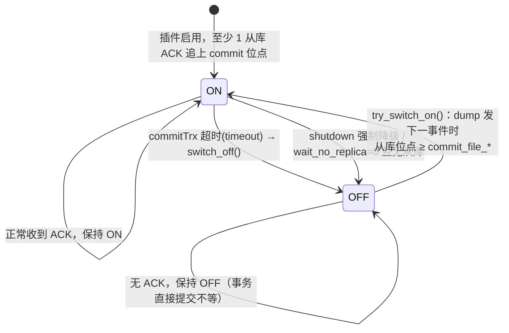
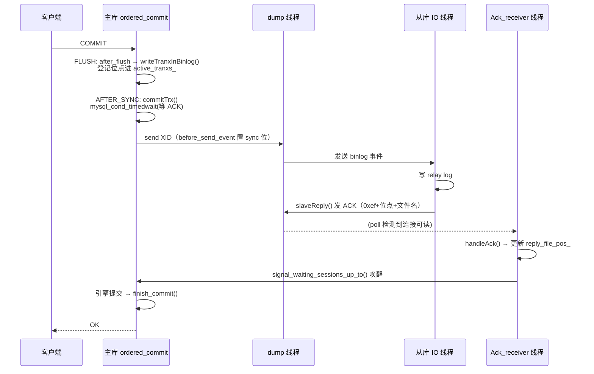

# 半同步复制（Semisync）

> 基于 MySQL 8.0.39 源码，剖析半同步复制的完整机制：插件架构与类体系、主库侧的 `active_tranxs_` 事务等待、两种 wait point 埋点、从库侧 ACK、独立 `Ack_receiver` 线程、降级/恢复状态机，以及参数/状态变量全清单。源码主体在 `plugin/semisync/`（约 130KB）。
>
> **边界**：本篇讲半同步这一层「主库等 ACK 才返回 OK」的机制。binlog 的写入流水线（BGC 三阶段、`after_flush`/`after_sync`/`after_commit` 钩子）见 [`binlog.md`](binlog.md)；从库 IO 线程的整体流程见 [`replica.md`](replica.md)；组复制（全同步）见 MGR 模块（另立项）。

## 目录

- [概述](#概述)
- [理论基础](#理论基础)
- [核心实现](#核心实现)
- [★ 本机制里的工程实现技法](#-本机制里的工程实现技法)
- [可观测性](#可观测性)
- [Misc](#misc)
- [参考](#参考)

---

## 概述

### 是什么

半同步复制是介于「异步复制」和「全同步复制（MGR）」之间的复制一致性等级：

| 等级 | 主库返回 OK 的条件 | 数据丢失窗口 |
|------|-------------------|-------------|
| 异步（默认） | binlog 本地落盘即返回 | 主库 crash 时，已提交但未发送的事务丢失 |
| **半同步** | 至少一个从库的 **IO 线程收到并写入 relay log** 才返回 | 缩小到"从库收到但主库 crash 前的极小窗口"，且**不保证 apply** |
| 全同步（MGR） | 多数派成员对事务顺序达成一致 | 靠 Paxos + 认证保证，无丢失 |

半同步的本质：主库的提交路径**卡住**，直到收到从库的 ACK 才向客户端回 OK。这是用「提交延迟」换「数据不丢」。

### 版本与命名演进

| 版本 | 变化 |
|------|------|
| 5.5 | 引入半同步（Google 贡献），插件名 `rpl_semi_sync_master`/`_slave` |
| 5.7 | 引入 `rpl_semi_sync_master_wait_point`（AFTER_SYNC/AFTER_COMMIT）、`wait_for_slave_count` |
| 8.0.14 | 术语改名 master/slave → source/replica（插件名 `rpl_semi_sync_source`/`_replica`），旧名保留为 deprecated |
| 8.0.23+ | `rpl_semi_sync_master_*` 标记弃用 |

**命名勘误（8.0.39）**：**类名仍是旧名** `ReplSemiSyncBase`/`ReplSemiSyncMaster`/`ReplSemiSyncSlave`，**不存在** `ReplSemiSyncSource` 类。改名只发生在文件名/插件名/sysvar 层面——`semisync_source.cc` 里的类还是 `ReplSemiSyncMaster`。CMake 用 `USE_OLD_SEMI_SYNC_TERMINOLOGY` 宏把同一份 `semisync_source.cc` 编译成新旧两套插件（`_old.cc` 只是 include 新文件），两套 sysvar 互斥（同时安装报冲突）。

---

## 理论基础

### 设计思想：插件 + Delegate observer 解耦

半同步不是硬编码进 binlog 提交路径，而是**独立插件**，通过四个 delegate observer 挂到 server 的钩子上：

| Delegate | 半同步回调 | 服务器侧触发点 |
|---|---|---|
| `Binlog_storage_delegate` | `repl_semi_report_binlog_update`（after_flush）/ `_binlog_sync`（after_sync） | FLUSH 后 / `call_after_sync_hook` |
| `Trans_delegate` | `repl_semi_report_commit` / `_rollback` | `process_after_commit_stage_queue` |
| `Binlog_transmit_delegate` | `repl_semi_binlog_dump_start/stop`、`reserve_header`、`before/after_send_event` | `Binlog_sender` 各处 |
| `Binlog_relay_IO_delegate` | `repl_semi_slave_io_start/io_end/request_dump/read_event/queue_event` | 从库 IO 线程 |

**收益**：半同步的开关、超时、降级完全插件自治，core server 代码零感知（只是多了几个 `RUN_HOOK` 遍历点）。**代价**：每个事件多一次 observer 遍历，故有 `replication_sender_observe_commit_only` 参数只在事务边界开 observe，中间行事件不过 observer。

### 设计取舍：ACK 读取独立成线程

主库的 dump 线程要同时「发 binlog 给从库」和「收从库的 ACK」。**如果 dump 线程自己阻塞读 ACK**，一个慢从库会卡死整个 dump 线程、连带卡住发给其他从库的数据。解法是**独立 `Ack_receiver` 后台线程**：dump 线程只负责发送，`Ack_receiver` 线程用 `poll()` 并发监听所有 semisync 连接的 ACK，收到后统一唤醒等待者。这是「收发分离」的典型设计。

### 崩溃语义的核心权衡：AFTER_SYNC vs AFTER_COMMIT

两种 wait point 的选择本质是「客户端是否看到过成功」与「数据是否可丢」的权衡（详见下文两种埋点）。

---

## 核心实现

### 插件架构与类体系

```
Trace                              （semisync.h，日志追踪）
 ├── ReplSemiSyncBase              （协议常量：kSyncHeader={0xef,0}、kPacketMagicNum=0xef、kPacketFlagSync=0x01）
 │     ├── ReplSemiSyncMaster      （semisync_source.h，主库核心）
 │     ├── ReplSemiSyncSlave       （semisync_replica.h，从库核心）
 │     └── Ack_receiver            （semisync_source_ack_receiver.h，ACK 接收线程）
ActiveTranx                        （活跃事务列表，独立）
AckContainer                       （多从库 ACK 容器，独立）
```

**`ReplSemiSyncMaster` 关键成员**（`semisync_source.h`）：

| 成员 | 含义 |
|---|---|
| `active_tranxs_` | 待确认事务列表（`ActiveTranx*`） |
| `LOCK_binlog_` | 保护状态变量与活跃事务列表（注释强调：持有此锁时**绝不能**再获取 `LOCK_log`，避免死锁） |
| `reply_file_name_[]`/`reply_file_pos_` | 从库已 ACK 到的**最大**位点 |
| `wait_file_name_[]`/`wait_file_pos_` | 正在等待 ACK 的**最小**位点 |
| `commit_file_name_[]`/`commit_file_pos_` | 已提交事务的**最大**位点（半同步 OFF 也维护，用于 dump 判断从库是否追上） |
| `master_enabled_` | 参数层面是否启用 |
| `state_` | 半同步是否实际 ON（`is_on()`） |
| `wait_timeout_` | 等待超时（ms） |
| `ack_container_` | 多从库 ACK 计数容器 |

**插件 init 流程**（`semisync_source_plugin.cc` 的 `semi_sync_master_plugin_init`）：

```cpp
// 1. init logging service；2. 检查新旧插件冲突；3. PSI key 注册
repl_semisync = new ReplSemiSyncMaster();   // 实例化主库核心
ack_receiver  = new Ack_receiver();         // 实例化 ACK 线程
repl_semisync->initObject();                // 初始化 active_tranxs_ 等
ack_receiver->init();                       // 初始化 Socket_listener
register_trans_observer(&trans_observer, p);      // 注册 Trans observer
register_binlog_storage_observer(...);            // 注册 storage observer
register_binlog_transmit_observer(...);           // 注册 transmit observer
```

### 主库侧：active_tranxs_ 事务等待

**ActiveTranx 数据结构**（`semisync_source.h`）：`active_tranxs_` 是「链表 + 哈希表」双索引的待确认事务集合。

**`TranxNode` 结构体的完整字段**（`semisync_source.h:49-56`）：

```cpp
struct TranxNode {
  char log_name_[FN_REFLEN];         // binlog 文件名（内联存储，非指针，利于 slot 复用）
  my_off_t log_pos_;                 // 事务结束位点在 binlog 文件内的偏移
  mysql_cond_t cond;                 // ★ 该事务独占的条件变量
  int n_waiters;                     // 等待该位点的会话计数
  struct TranxNode *next_;           // 有序链表指针
  struct TranxNode *hash_next_;      // 哈希冲突链指针
};
```

**为什么同时有链表指针和哈希指针**：`next_`（链表）服务**顺序遍历**——`signal_waiting_sessions_up_to` 需要「释放所有位点 ≤ 某 ACK 位点」的节点，只有有序链表才能 O(1) 顺序推进；`hash_next_`（哈希）服务 **O(1) 精确查找**——`is_tranx_end_pos` 更新同步头时需快速判断「某 (file,pos) 是否恰是事务结束位点」，线性扫描会退化 O(n)。一个节点**同时挂在两条链上**，删除时两条链都要摘除。

**`ActiveTranx` 的完整结构**（`semisync_source.h:312-388`）：

```cpp
class ActiveTranx : public Trace {
  TranxNodeAllocator allocator_;      // 节点对象池
  TranxNode *trx_front_, *trx_rear_;  // ★ 有序链表头、尾
  TranxNode **trx_htb_;               // ★ 哈希桶数组（指针的指针）
  int num_entries_;                   // 哈希桶数量 = max_connections << 1
  mysql_mutex_t *lock_;               // LOCK_binlog_
};
```

- 有序链表 `trx_front_ → trx_rear_` 按 `(log_name_, log_pos_)` 升序，因事务位点在 `LOCK_log` 下单调追加，插入总是 append 到尾部；
- 哈希桶 `trx_htb_` 容量 `num_entries_ = max_connections << 1`（两倍最大连接数，降低负载因子），每个桶是 `hash_next_` 单链；
- 哈希函数 `calc_hash`/`get_hash_value` 根据 `(log_name_, log_pos_)` 计算桶下标。

**命名勘误**：`TranxNode::reserve()/commit()/rollback()`、`m_reserved_tranx_count`/`m_allocated_tranx_count`、`m_transaction_node_list`/`m_transaction_nodes`、`active_tranx_hash` 这些符号**在 8.0.39 不存在**（5.6/5.7 或 Percona 分支的旧命名）。8.0.39 的对应概念是 `trx_front_/trx_rear_`（链表）+ `trx_htb_`（哈希桶）+ `TranxNodeAllocator`（对象池，用 Block 块组织 slot）。

**关键方法**：`insert_tranx_node`（尾部插入 + 同步哈希）、`find_active_tranx_node`（哈希查找）、`clear_active_tranx_nodes`（摘两条链）、`signal_waiting_sessions_up_to`（沿链表广播所有位点 ≤ ACK 位点的节点）、`signal_waiting_sessions_all`（降级时广播全部）。

**`writeTranxInBinlog(log_file, log_pos)`**：在 `after_flush` 钩子（`repl_semi_report_binlog_update`）里调用，把事务的 binlog 位点登记进 `active_tranxs_`（`insert_tranx_node`）。注意它登记的是 **flush 后的位点**，在 `sync_binlog` 之前。

**`commitTrx(log_file, log_pos)`**：等待的核心，逐行：

```cpp
  lock();                                    // LOCK_binlog_
  TranxNode *entry = nullptr;
  if (active_tranxs_ != nullptr && trx_wait_binlog_name) {
    entry = active_tranxs_->find_active_tranx_node(trx_wait_binlog_name, trx_wait_binlog_pos);
    if (entry) thd_cond = &entry->cond;      // ★ 事务槽位自带的 cond
  }
  THD_ENTER_COND(nullptr, thd_cond, &LOCK_binlog_,
                 &stage_waiting_for_semi_sync_ack_from_replica, &old_stage);
  if (getMasterEnabled() && trx_wait_binlog_name) {
    while (is_on()) {
      if (reply_file_name_inited_) {
        if (ActiveTranx::compare(reply_file_name_, reply_file_pos_,
                                 trx_wait_binlog_name, trx_wait_binlog_pos) >= 0)
          break;                             // 从库已追上，无需等待
      }
      if (!entry) { is_semi_sync_trans = false; goto l_end; }  // 未开 semi → 视为异步
      /* 维护 wait_file_* = 所有等待者中最小的位点 */
      if (connection_events_loop_aborted() &&
          (rpl_semi_sync_source_clients == rpl_semi_sync_source_wait_for_replica_count - 1) && is_on()) {
        LogErr(WARNING_LEVEL, ER_SEMISYNC_FORCED_SHUTDOWN);
        switch_off();                        // 强制降级，避免 shutdown 挂死
        break;
      }
      rpl_semi_sync_source_wait_sessions++;
      entry->n_waiters++;
      wait_result = mysql_cond_timedwait(&entry->cond, &LOCK_binlog_, &abstime);
      entry->n_waiters--;
      if (wait_result != 0) {                // 真超时
        rpl_semi_sync_source_wait_timeouts++;
        switch_off();                        // ★ 降级为异步
      } else { /* 统计 wait_time */ }
    }
  l_end:
    if (is_on() && is_semi_sync_trans) rpl_semi_sync_source_yes_transactions++;  // yes_tx
    else                              rpl_semi_sync_source_no_transactions++;    // no_tx
  }
  if (trx_wait_binlog_name && active_tranxs_ && entry && entry->n_waiters == 0)
    active_tranxs_->clear_active_tranx_nodes(...);   // 最后一个等待者清理槽位
```

要点：

- 等待对象是**事务自己的 `TranxNode::cond`**（不是全局 cond），避免惊群；
- `mysql_cond_timedwait` 超时 → `switch_off()` 降级，**不回滚事务**；
- 唤醒由 `signal_waiting_sessions_up_to(reply_file_pos_)` 沿链表广播所有位点 ≤ 已 ACK 位点的 node。

**降级/恢复状态机**：



状态机依赖**三组位点三元组**（`semisync_source.h`）：

| 字段 | 含义 |
|---|---|
| `reply_file_name_/reply_file_pos_` + `reply_file_name_inited_` | 已收到从库 ACK 的**最大**位点 |
| `wait_file_name_/wait_file_pos_` + `wait_file_name_inited_` | 正在等待 ACK 的**最小**（最早）事务位点 |
| `commit_file_name_/commit_file_pos_` + `commit_file_name_inited_` | 已写 binlog 的**最大** commit 位点（**无论半同步 ON/OFF 都维护**） |

**`switch_off()` 逐行**（`semisync_source.cc:865-880`）：

```cpp
int ReplSemiSyncMaster::switch_off() {
  state_ = false;                              // (a) 核心：运行态翻 OFF
  rpl_semi_sync_source_off_times++;            // (b) 降级次数统计
  wait_file_name_inited_ = false;              // (c) 清除最小等待位点
  reply_file_name_inited_ = false;             // (c) 清除已 ACK 位点
  LogErr(INFORMATION_LEVEL, ER_SEMISYNC_RPL_SWITCHED_OFF);
  active_tranxs_->signal_waiting_sessions_all();  // (e) 唤醒所有等待者
  return 0;
}
```

**关键设计**：`switch_off` **只清 `wait`/`reply` 位点，不清 `commit` 位点**——源码注释（`semisync_source.h:606-612`）明确：`commit_file_*` 永远维护，供 dump 线程在 `try_switch_on()` 里判断"从库是否已追上"。

**`signal_waiting_sessions_all()` 逐行**（`semisync_source.cc:218-225`）：

```cpp
int ActiveTranx::signal_waiting_sessions_all() {
  for (TranxNode *entry = trx_front_; entry; entry = entry->next_)
    mysql_cond_broadcast(&entry->cond);   // 沿有序链表广播每个节点的 cond
  return 0;
}
```

被唤醒的会话重新检查 `is_on()`，发现已 false 直接跳出等待循环（本次计入 `no_tx`）。`switch_off` 是「**先翻状态、再唤醒**」的顺序——先置 false 再 broadcast，保证被唤醒的线程一定看到 OFF，避免「先唤醒后翻状态」的竞态。

**状态变量的同步链路**：`switch_off` 本身**不直接写** `rpl_semi_sync_source_status`，真正的赋值在 `setExportStats()`（`semisync_source.cc:1155-1171`）：

```cpp
void ReplSemiSyncMaster::setExportStats() {
  lock();
  rpl_semi_sync_source_status = state_;       // ★ 从 state_ 同步导出
  ...
}
```

`rpl_semi_sync_source_status` 是 `SHOW STATUS` 的导出镜像，与内部 `state_` 之间隔了一层 `setExportStats`，由插件在统计刷新点调用。

- `try_switch_on()`：dump 线程发下一事件时，若从库位点已追上 `commit_file_*`，把 `state_` 翻回 true——恢复 ON 是**启发式**的，时机可能滞后一个事件。

### wait point：两种埋点

两个埋点已**合并进同一个 `commitTrx`**，由 `rpl_semi_sync_source_wait_point` 在 hook 入口分流（8.0.39 里 `waitAfterSync`/`waitAfterCommit` 这两个名字已不存在）：

```cpp
static int repl_semi_report_binlog_sync(...) {          // after_sync 钩子
  if (wait_point == WAIT_AFTER_SYNC) return repl_semisync->commitTrx(log_file, log_pos);
  return 0;
}
static int repl_semi_report_commit(Trans_param *param) {  // after_commit 钩子
  if (wait_point == WAIT_AFTER_COMMIT && is_real_trans && param->log_pos)
    return repl_semisync->commitTrx(param->log_file, param->log_pos);
  return 0;
}
```

埋点在 BGC 流水线的精确位置：

```
FLUSH  → after_flush → writeTranxInBinlog()   ← 登记位点
SYNC   → sync_binlog_file
      → change_stage(COMMIT_STAGE)
      ├─ ★ AFTER_SYNC：call_after_sync_hook → commitTrx()   【默认】
      ├─ process_commit_stage_queue → 引擎 ha_commit_low()
      → change_stage(AFTER_COMMIT_STAGE)
      └─ ★ AFTER_COMMIT：process_after_commit_stage_queue → commitTrx()
      → signal_done() → finish_commit() → 客户端收到 OK
```

**崩溃语义差别**：

- **AFTER_SYNC**（默认）：等待在引擎提交**之前**。主库等待后、引擎提交前 crash ⇒ 事务在主库被回滚，但 binlog 已落盘、从库已收到 ⇒ 需要人工处理，但**客户端从未收到成功**。
- **AFTER_COMMIT**：等待在引擎提交**之后**、回 OK **之前**。事务已在主库可见，此刻 crash 且从库未收到 ⇒ 数据丢失，而**并发会话可能已读到这份将丢的数据**（"幻读式"不一致）。

### 从库侧：ACK 的产生

**`ReplSemiSyncSlave`** 的关键是文件级全局变量 `semi_sync_need_reply`（`semisync_replica_plugin.cc`）：

- 在 `repl_semi_slave_read_event`（`after_read_event` 钩子）里，若读到的事件是**事务的最后一个事件**，置 `semi_sync_need_reply = true`；
- 在 `repl_semi_slave_queue_event`（`after_queue_event` 钩子）里检查该标志，为真则调 `slaveReply()` 发 ACK。

五个 delegate 回调与 IO 线程钩子点的精确对应：

| 回调 | 钩子（RUN_HOOK） | IO 线程调用点 |
|---|---|---|
| `repl_semi_slave_io_start` | `thread_start` | 建连前 |
| `repl_semi_slave_request_dump` | `before_request_transmit` | `request_dump` 内 |
| `repl_semi_slave_read_event` | `after_read_event` | IO 线程读到事件后 |
| `repl_semi_slave_queue_event` | `after_queue_event` | 事件已写 relay log 后 |
| `repl_semi_slave_io_end` | `thread_stop` | IO 线程退出 |

**半同步头的 2 字节 magic**：`kPacketMagicNum = 0xef`、`kPacketFlagSync = 0x01`。主库 dump 线程在 `reserve_header` 预留 2 字节 `{0xef, 0}`，`before_send_event` → `updateSyncHeader` 时，**只有该事件位点是活跃事务的结束位点**（`is_tranx_end_pos`）才把 sync 位置 1——这就是"只对事务边界要 ACK"。从库 `slaveReadSyncHeader` 剥掉这 2 字节头，看 sync 位决定是否回 ACK。

**ACK 报文的字节布局**（`semisync.h:92-105` 的 offset 常量）：

```cpp
#define REPLY_MAGIC_NUM_LEN 1
#define REPLY_BINLOG_POS_LEN 8
#define REPLY_BINLOG_NAME_LEN (FN_REFLEN + 1)          // 256+1=257
#define REPLY_MAGIC_NUM_OFFSET 0
#define REPLY_BINLOG_POS_OFFSET (REPLY_MAGIC_NUM_OFFSET + REPLY_MAGIC_NUM_LEN)   // 1
#define REPLY_BINLOG_NAME_OFFSET (REPLY_BINLOG_POS_OFFSET + REPLY_BINLOG_POS_LEN) // 9
```

```
偏移  字节数  内容
  0     1    kPacketMagicNum (0xef)
  1     8    binlog 位点（int8store 小端）
  9    n+1   binlog 文件名（含尾部 '\0'，n=strlen）
```

实际发送长度 = `9 + strlen(binlog_filename) + 1`；接收缓冲最大 `REPLY_MESSAGE_MAX_LENGTH = 1 + 8 + 257 = 266` 字节。

**`slaveReply` 的逐行代码**（`semisync_replica.cc:102-150`）：

```cpp
int ReplSemiSyncSlave::slaveReply(MYSQL *mysql, const char *binlog_filename,
                                  my_off_t binlog_filepos) {
  NET *net = &mysql->net;
  uchar reply_buffer[REPLY_MAGIC_NUM_LEN + REPLY_BINLOG_POS_LEN + REPLY_BINLOG_NAME_LEN];
  size_t name_len = strlen(binlog_filename);
  /* ① 打包 ACK 报文 */
  reply_buffer[REPLY_MAGIC_NUM_OFFSET] = kPacketMagicNum;                       // 0xef
  int8store(reply_buffer + REPLY_BINLOG_POS_OFFSET, binlog_filepos);            // 8 字节位点
  memcpy(reply_buffer + REPLY_BINLOG_NAME_OFFSET, binlog_filename, name_len + 1); // 文件名+'\0'
  /* ② 发送 */
  int reply_res = my_net_write(net, reply_buffer,
                               REPLY_BINLOG_NAME_OFFSET + name_len + 1);
  if (reply_res) return reply_res;
  return net_flush(net);                    // 立即 flush（ACK 不能等缓冲满）
}
```

要点：ACK 用 `my_net_write` + **`net_flush` 立即刷新**（不能等网络缓冲攒满，否则 ACK 延迟会拖长主库等待）；ACK 在 `after_queue_event` 发，即事件已写 relay log 之后，而非收到即回。

### ACK receiver：独立接收线程

主库侧收 ACK 的是 **`Ack_receiver` 后台线程**（不是 dump 线程）：

- `Socket_listener` 用 `poll()` 并发监听所有 semisync dump 连接的 vio；
- 收到 ACK → `reportReplyPacket` → `handleAck` → 更新 `reply_file_name_`/`reply_file_pos_` → `signal_waiting_sessions_up_to` 唤醒等待者；
- **多从库 `wait_for_replica_count > 1`**：`AckContainer` 先塞进各从库的 ACK，凑够 N 个不同从库才上报**其中最小**的位点（`add_slave`/`update_slave_ack`/`remove_slave`）。

dump 线程与 ACK 线程的分工：`transmit_start` 里 `ack_receiver->add_slave()` + `clients++`，`transmit_stop` 里 `remove_slave()`；dump 线程的 `readSlaveReply` 只负责 flush，真正的 ACK 读取全在 `Ack_receiver` 线程。

**端到端 ACK 时序**（AFTER_SYNC 默认路径）：



注意两点：① ACK 由 `Ack_receiver` 线程读（dump 线程不读），② 主库的"等待者"是**事务自己的 `TranxNode::cond`**（在 `commitTrx` 里），被 `signal_waiting_sessions_up_to` 精确唤醒。

同一时序的纯文本版本（无 mermaid 渲染环境时可读）：

```
 客户端      ordered_commit        dump 线程        副本 IO 线程     Ack_receiver
   │  COMMIT      │                   │                  │                │
   ├─────────────►│ FLUSH: after_flush → writeTranxInBinlog()             │
   │              │ SYNC              │                  │                │
   │              │ ★ AFTER_SYNC: commitTrx() cond_timedwait ┐            │
   │              │           send XID（before_send → sync 位置 1）◄┘      │
   │              │                   ├─────────────────►│ queue_event     │
   │              │                   │                  │ 写 relay log    │
   │              │                   │◄─────────────────┤ slaveReply()    │
   │              │                   │            net_flush ────────────►│
   │              │      reportReplyBinlog() → signal_waiting_sessions_up_to()
   │              │ 引擎 commit（AFTER_SYNC 语义）                         │
   │◄─── OK ──────┤                   │                  │                │
```

### 与 binlog 发送的交互

- `transmit_start`：判断对端是否 semisync（读会话变量 `rpl_semi_sync_replica`），是则 `add_slave()`，并**乐观假设**该从库已收到其请求位点之前的所有事件、立即 `handleAck(...)`；
- `reserve_header`：预留 2 字节头；`send_heartbeat_event_v2` 也走它，所以心跳包同样带半同步头（sync 位为 0）；
- `after_send_event`：被跳过的区间走 `skipSlaveReply` → 源端单方面把跳过位置算作已 ACK，防止历史 GTID 拖住 `reply_file_pos_`。

---

## ★ 本机制里的工程实现技法

### 一、插件 + Delegate observer 的钩子解耦

半同步通过四个 delegate 的 `RUN_HOOK` 挂到 server 侧，core server 完全不感知插件存在。这是 MySQL 插件体系的典型应用——复制、审计、半同步都靠 observer 模式插桩。收益是「开关/超时/降级全插件自治」，代价是每事件多一次 observer 遍历（故有 `observe_commit_only` 优化）。

### 二、收发分离的 Ack_receiver 线程

dump 线程（发送）与 `Ack_receiver` 线程（接收）分离，用 `poll()` 并发监听多连接。这是「不让一个慢消费者阻塞生产者」的经典设计——如果 dump 线程自己阻塞读 ACK，一个慢从库会卡死整个 dump。

### 三、每事务一个 cond + n_waiters 引用计数

`active_tranxs_` 里每个 `TranxNode` 带自己的 `cond`，等待者精确等在「自己的事务槽位」上，唤醒时沿链表广播「位点 ≤ 已 ACK 位点」的所有 node。相比全局 cond 的惊群，这是精确唤醒 + 按位点批量放行的结合。`n_waiters` 引用计数用于「最后一个等待者清理槽位」。

### 四、降级不回滚的可用性优先

超时只 `switch_off()` + 唤醒所有等待者，**事务照常提交**（计入 `no_tx`）。这是「可用性优先于一致性」的取舍：半同步的定位是"尽力不丢"，不是"绝不丢"，超时降级保证主库不会因为从库故障而无法写入。

| 特性 | 用在哪 | 收益 | 代价 |
|---|---|---|---|
| 插件 + observer | 四个 delegate | 解耦、自治 | 每事件多一次遍历 |
| 收发分离 | Ack_receiver 线程 | 不被慢从库阻塞 | 多线程同步 |
| 每事务 cond | TranxNode | 精确唤醒、无惊群 | n_waiters 引用计数 |
| 降级不回滚 | switch_off | 可用性优先 | 一致性降级 |

---

## 可观测性

### 参数全清单（主库侧）

| 变量 | 默认 | 范围 | 语义 |
|---|---|---|---|
| `rpl_semi_sync_source_enabled` | OFF | — | 启用主库半同步 |
| `rpl_semi_sync_source_timeout` | 10000 ms | 0~ULONG_MAX | 等待 ACK 超时 |
| `rpl_semi_sync_source_wait_for_replica_count` | 1 | 1~65535 | 需要几个从库 ACK |
| `rpl_semi_sync_source_wait_point` | AFTER_SYNC | enum | 等待时机 |
| `rpl_semi_sync_source_wait_no_replica` | ON(1) | — | 无可用从库时是否继续等满超时 |
| `rpl_semi_sync_source_trace_level` | 32 | — | 追踪级别 |

**`wait_point` 默认值的细节**：`semisync_source_plugin.cc` 里有一个 `static ulong ...wait_point = WAIT_AFTER_COMMIT`（初始内存值），但 `MYSQL_SYSVAR_ENUM` 声明里的默认值是 `WAIT_AFTER_SYNC`，后者覆盖前者——**实际默认 AFTER_SYNC**。读代码时别被那个静态初值误导。

### 参数（从库侧）

| 变量 | 默认 | 语义 |
|---|---|---|
| `rpl_semi_sync_replica_enabled` | OFF | 启用从库半同步 |
| `rpl_semi_sync_replica_trace_level` | 32 | 追踪级别 |

### 状态变量全清单

| 状态变量 | 语义 | 维护点 |
|---|---|---|
| `Rpl_semi_sync_source_status` | ON/OFF（反映 `state_`） | `switch_off`/`try_switch_on` |
| `Rpl_semi_sync_source_clients` | 已连接的半同步从库数 | `add_slave`/`remove_slave` |
| `Rpl_semi_sync_source_yes_transactions` | 半同步成功提交的事务数 | `commitTrx` 的 yes 分支 |
| `Rpl_semi_sync_source_no_transactions` | 降级/超时提交的事务数 | `commitTrx` 的 no 分支 |
| `Rpl_semi_sync_source_yes_tx` / `no_tx` | **只是 SHOW_VAR 显示名**，与 yes/no_transactions 同源 | — |
| `Rpl_semi_sync_source_wait_timeouts` | 超时次数（**源码维护但未在 SHOW_VAR 暴露**） | `commitTrx` 超时分支 |
| `Rpl_semi_sync_source_wait_sessions` | 当前等待的会话数 | `commitTrx` 入/出等待 |

### 观测手段

| 我想看 | 手段 |
|--------|------|
| 半同步是否实际生效 | `SHOW STATUS LIKE 'Rpl_semi_sync_source_status'` |
| 有多少从库 ACK | `SHOW STATUS LIKE 'Rpl_semi_sync_source_clients'` |
| 降级/超时次数 | `Rpl_semi_sync_source_no_transactions`、`wait_timeouts` |

---

## Misc

### 边界与局限

- **只保证 IO 线程收到，不保证 apply**：从库 ACK 在 `after_queue_event`（写 relay log 后），applier 是否已执行到该事务完全不保证；
- **`sync_binlog=1` 是"不丢"的前提**：`writeTranxInBinlog` 在 `after_flush` 就登记位点，若 `sync_binlog != 1`，binlog 可能只在 OS cache，从库已 ACK 而主库掉电仍会丢；
- **`rpl_semi_sync_source_wait_no_replica` 默认 1**：从库不足时仍等满 timeout 才降级；置 0 则立即 `switch_off()`；
- **不解决"主库 crash 后从库数据比主库新"**：这是 MGR 的领域，半同步只是把窗口缩小。

### 坑

- **类名 vs 文件名不一致**：`semisync_source.cc` 里的类叫 `ReplSemiSyncMaster`，别按文件名去找 `ReplSemiSyncSource`（不存在）；
- **`wait_point` 静态初值陷阱**：源文件里 `static ... = WAIT_AFTER_COMMIT` 是假象，sysvar 默认是 `WAIT_AFTER_SYNC`；
- **`yes_tx`/`no_tx` 不是独立变量**：只是 `yes_transactions`/`no_transactions` 的显示别名；
- **`wait_timeouts` 不暴露**：源码里维护了，但 `SHOW_VAR` 列表没有它（`no_times` 映射的是 `off_times`）。

---

## 参考

**官方文档**
- *MySQL 8.0 Reference Manual → Semisynchronous Replication*
- *MySQL 8.0 Reference Manual → Replication and Binary Logging Options and Variables*（`rpl_semi_sync_*`）

**相关文档**
- 半同步等待在 BGC 流水线的精确埋点见 [`binlog.md`](binlog.md)「半同步复制与 binlog 的衔接」
- 从库 IO 线程流程见 [`replica.md`](replica.md)
- dump 线程（Binlog_sender）见 [`binlog.md`](binlog.md)「binlog 读侧：dump 线程」
